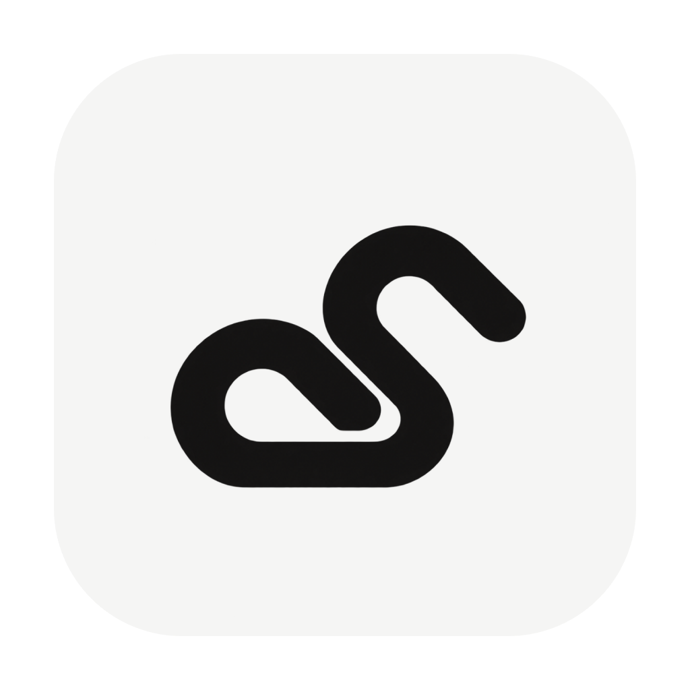
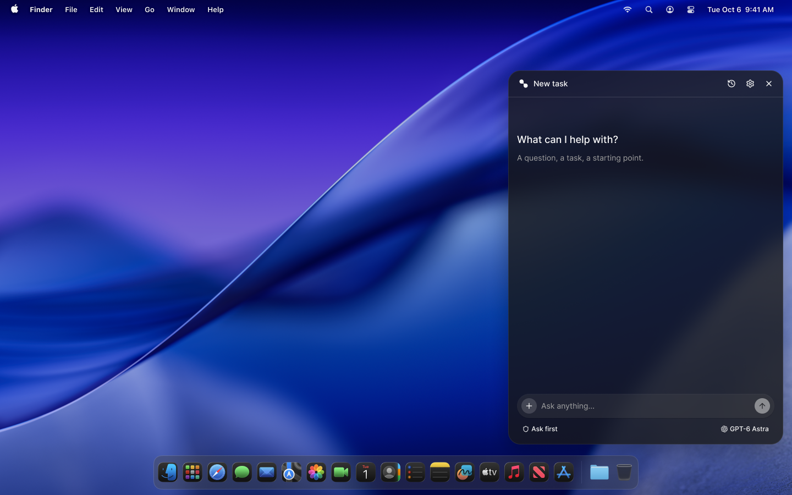
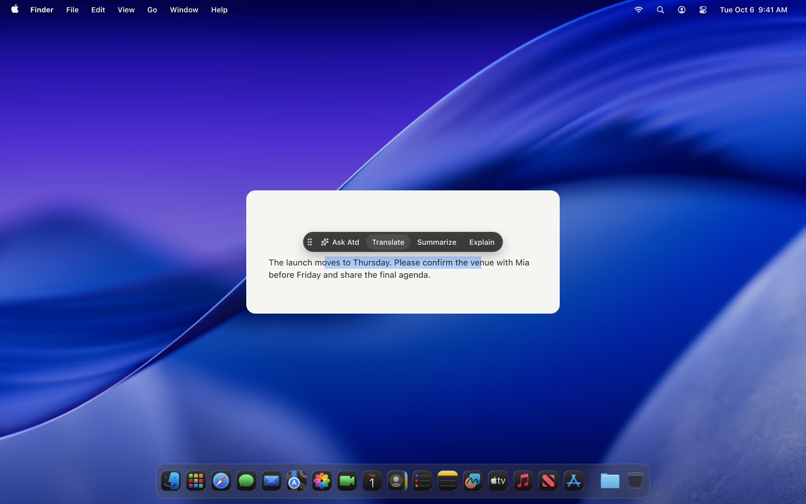
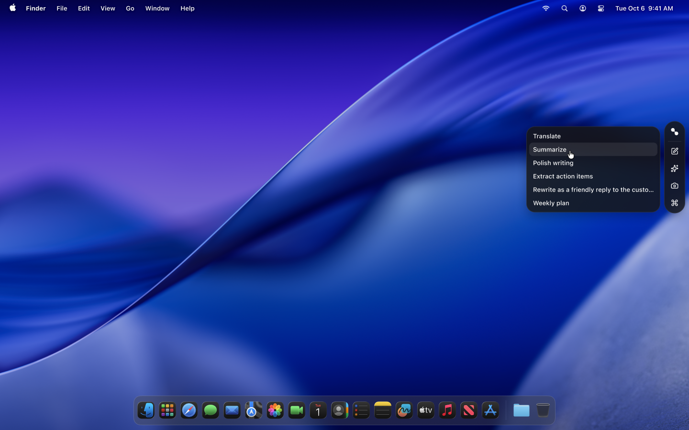
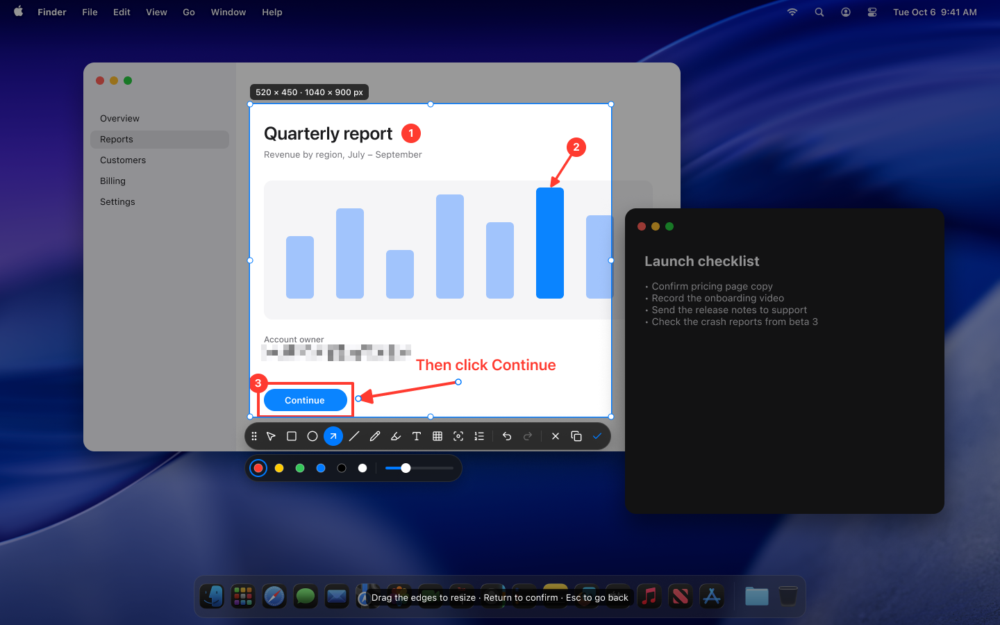
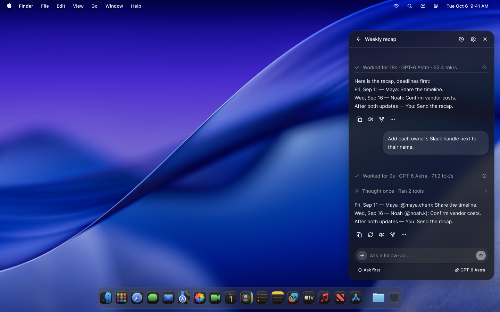
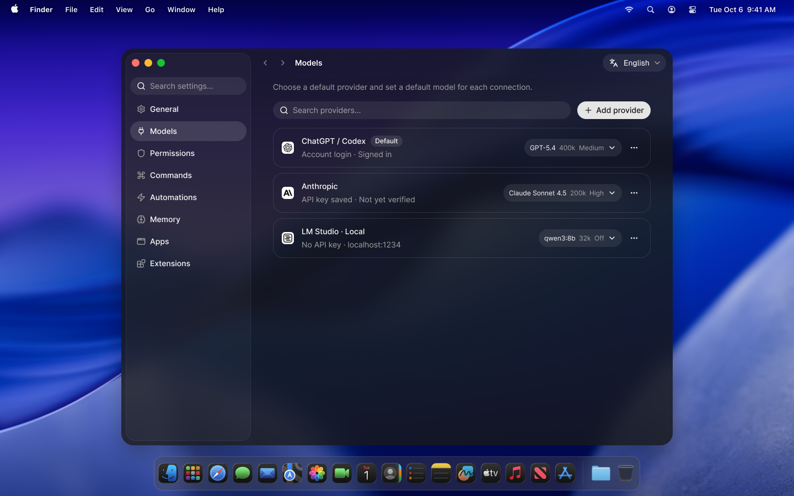
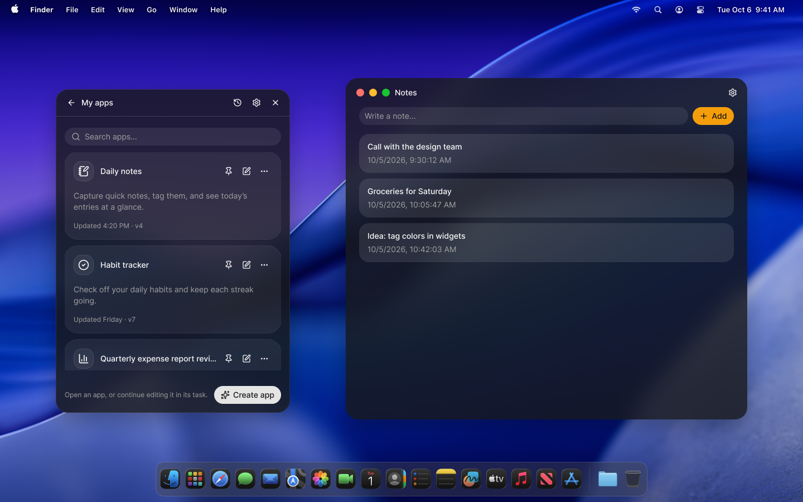
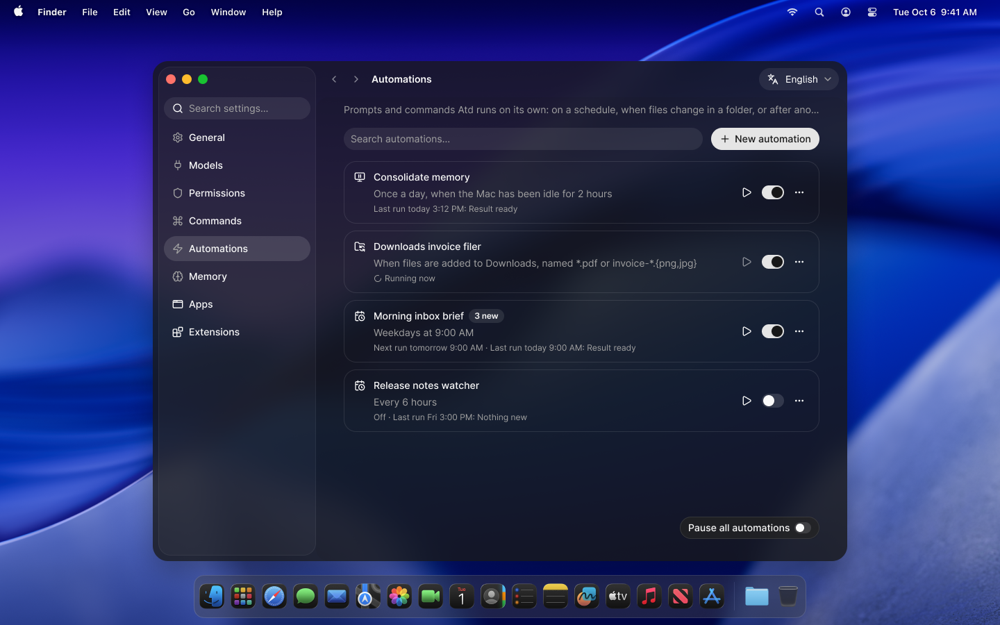

# Atd

> [!WARNING]
> **Atd does not yet have an Apple Developer ID certificate.** Current releases are signed with the project’s own self-signed certificate and are **not notarized by Apple**, so macOS may block the first launch because it cannot verify the developer or Apple notarization.
>
> Download only from the official link below. If you trust that download, try opening **Atd** once, then go to **System Settings → Privacy & Security → Open Anyway** and confirm **Open** in the next prompt. See [Apple’s full first-launch instructions](https://support.apple.com/en-sa/102445).

**A quiet agent for your Mac.**

Select text, capture your screen, or press **⌘ ⇧ Space** to start a conversation. Atd brings your models, tools, and local context into a small desktop panel—for everyday work, coding tasks, and apps of your own.

**macOS 26+ · Apple silicon**

[Website](https://atd.best) · [GitHub download mirror](https://github.com/JUNERDD/Atd/releases/latest/download/Atd-arm64.dmg) · [Release notes](https://github.com/JUNERDD/Atd/releases/latest) · [Interface previews](#interface-previews) · [Report an issue](https://github.com/JUNERDD/Atd/issues)

_Interface preview of the main panel._

## Get started

1. [Download the latest Apple silicon DMG](https://downloads.atd.best/latest/Atd-arm64.dmg) (saved as `Atd-<version>-arm64.dmg`), open it, and drag **Atd** to **Applications**.
2. Open **Atd**. If macOS blocks it, follow the first-launch instructions in the warning above.
3. Open **Settings → Models**, add a provider connection, and choose your default provider and model. Connect with a supported account sign-in, API key, or local endpoint.
4. Press **⌘ ⇧ Space** to open the panel. Ask a question, attach a file, or start from selected text or a screenshot.

The selection toolbar asks for Accessibility access; screen capture asks for Screen Recording access. Grant these in macOS when you use those features.

Atd includes its local agent service and Node.js runtime. Tools invoked by a task still need to be available on your Mac.

### Shortcuts

| Action                 | Default shortcut |
| ---------------------- | ---------------- |
| Show or hide the panel | ⌘ ⇧ Space        |
| Take a screenshot      | ⌘ ⇧ 2            |
| New conversation       | ⌘ N              |
| Open settings          | ⌘ ,              |
| Send a message         | Enter            |
| Insert a new line      | Shift + Enter    |

Change these in **Settings → General**. The menu bar icon is another way to open the panel.

## What you can do

- **Bring the right context.** Use selected text, annotated screenshots, attachments, `@` file mentions, or drag files onto the Mini Panel.
- **Follow the work.** Streamed conversations show tool activity, file diffs, terminal output, web results, todo lists, and subagent activity. Continue a task with a follow-up, or stop an active run.
- **Use your models.** Connect cloud, local, and custom providers. Each connection has its own credentials and default model; existing tasks retain their model selection.
- **Make work reusable.** Save commands with parameters and shortcuts. Add skills, subagents, and MCP servers individually or through [supported plugin bundles](packages/plugin-kit/README.md).
- **Build personal apps.** Describe a small tool, create it in a conversation, and open it from **My apps**. Apps can have an independent window, their own backend, and desktop widgets; return to the task to refine them.
- **Run work automatically.** Schedule prompts or saved commands, react to folder changes, run when your Mac is idle, or chain work after another automation. Inspect status and run history, and pause automations from settings.
- **Keep control.** Set permissions per task, manage the shell allowlist, review stored memories, and pause memory learning.

Automations run while Atd is running. Unattended tasks decline actions that require approval instead of waiting for a response. Missed schedules can run once on return or be skipped. New installations include an editable **Consolidate memory** automation that runs at most once a day after two hours of Mac inactivity.

## Interface previews

These images are **1440 × 900** interface previews exported from the UI designs, rather than captures of the running app. Together with the main panel above, they show eight interfaces. Click an image to open the full-size preview.

### Selection and quick actions

| Selection toolbar                                                                                                                                                                                           | Mini Panel                                                                                                                                                                |
| ----------------------------------------------------------------------------------------------------------------------------------------------------------------------------------------------------------- | ------------------------------------------------------------------------------------------------------------------------------------------------------------------------- |
|  |  |
| Ask, translate, summarize, or explain from a text selection.                                                                                                                                                | Open a task, capture the screen, or run a saved command.                                                                                                                  |

### Capture and conversation

| Screenshot tool                                                                                                                                                                | Conversation                                                                                                                                                            |
| ------------------------------------------------------------------------------------------------------------------------------------------------------------------------------ | ----------------------------------------------------------------------------------------------------------------------------------------------------------------------- |
|  |  |
| Capture an area and mark the details that matter.                                                                                                                              | Read the result and keep working in the same task.                                                                                                                      |

### Your setup and your apps

| Models and settings                                                                                                                                                                    | My apps                                                                                                                                      |
| -------------------------------------------------------------------------------------------------------------------------------------------------------------------------------------- | -------------------------------------------------------------------------------------------------------------------------------------------- |
|  |  |
| Configure providers, models, permissions, and preferences.                                                                                                                             | Turn an idea into an app you can open again.                                                                                                 |

### Automations

Scheduled tasks, folder workflows, and idle-time memory consolidation, with run status and a shared pause control.

## Data and permissions

- **Local storage.** Task history, settings, and memories live in the service data directory on your Mac.
- **Model and tool access.** Requests go to the model providers you configure. Tools and MCP servers can access the files or external services allowed by their configuration and the task's permissions.
- **Credentials.** Provider and MCP secrets live in the OS keychain and do not reach the renderer or task snapshots.
- **Approval controls.** Each task can use Manual approval, Auto approval, or Always allow. Settings also owns the shell allowlist and memory-learning controls.
- **Native isolation.** The page communicates through a typed native bridge and an authenticated relay. The service listens on loopback; the renderer never holds its bearer token.
- **Lifecycle and logs.** Release starts its bundled service and stops it on quit. Service logs are in `~/Library/Logs/AI/`; **Show Service Logs** in the menu reveals them.

## Contributing

Read the [contributor guidelines](AGENTS.md) before making changes, and submit a pull request targeting `main`. Include reproduction steps and the expected result when [reporting an issue](https://github.com/JUNERDD/Atd/issues).

## License

Atd is released under the [MIT License](LICENSE). Code adapted from other projects keeps its own license: the [AI Elements](packages/ui/src/components/ai-elements/LICENSE) components (Apache-2.0) and the memory engine's files from [pi-hermes-memory](docs/third-party/pi-hermes-memory-LICENSE) (MIT).

The license covers the code, not the Atd name and logo, nor the logos of other companies and services in `packages/ui/src/assets/brands`, which remain their owners' trademarks.
