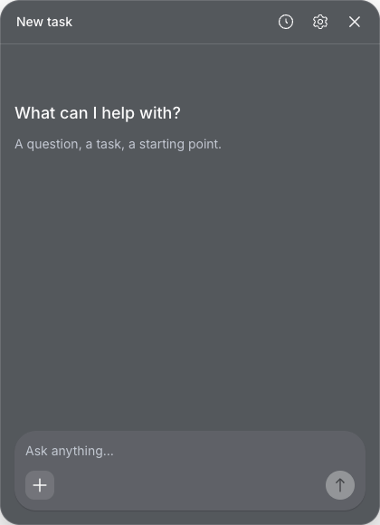

# AI

A quiet desktop agent panel. It sits in the bottom-right corner of the screen, opens with a global shortcut, and runs coding and general-purpose agent tasks on your machine.

The app has two parts. A native macOS app provides the floating panel and a settings window. A local agent service built on the [pi](https://github.com/earendil-works/pi) SDK runs the tasks, stores data, and handles credentials.

The app in `apps/macos` is a Swift/AppKit shell with Liquid Glass windows. It hosts the React UI from `apps/desktop` in a WKWebView and relays the page's service requests, so the page never holds the service token. It needs macOS 26 on Apple silicon and starts at version 0.3.0. It replaces the Electron client of the 0.2.x releases, which has been removed from this repository.



_The screenshot shows the React UI without the native window material, which changes with the desktop behind it._

## Features

- **Task panel**: a 420 × 580 panel placed 16px from the right and bottom edges of the display work area. It works on secondary displays, negative coordinates, and small work areas. It can stay on top, and hiding it keeps the current draft.
- **Conversations**: streamed replies, task history, follow-up messages, stop and resume, and recovery after an interrupted run. A task keeps the model it started with, even if you change the default later.
- **Composer**: `@` mentions for files and `/` for commands and skills, shown as inline chips. It also accepts attachments, selected text, and clipboard context. Enter sends, Shift + Enter adds a new line, and confirming an IME candidate does not send the message.
- **Tool activity**: file diffs, terminal output, web tools, a todo list, and subagent transcripts appear inline in the conversation.
- **Permissions**: three approval tiers (Manual, Auto, Always allow) plus a shell allowlist. You set a default for new tasks, and each task can change its own tier from the composer.
- **Providers**: named connections, each with its own credentials and default model. The catalog comes from the pi registry, with entry points for local and custom connections.
- **Commands**: reusable instructions with Mustache variables, typed parameters, shortcuts, and tool settings. AI-suggested instructions are previewed first; applying one changes only the unsaved draft and can be undone.
- **Extensions**: skills, subagents (including Markdown agents from `~/.atd/agents`), and MCP servers, each of which can be turned on or off for the next run.
- **Memory**: long-term memory powered by [pi-hermes-memory](https://github.com/chandra447/pi-hermes-memory), with search, editing, deletion, and a pause for learning.
- **Settings**: Permissions, Extensions, Providers, Commands, Memory, and Shortcuts. The settings navigation is a sidebar at 760px and wider, compact top navigation from 480px, and a drawer below that.
- **Languages**: English and Simplified Chinese. The first run follows the OS locale.

Default shortcuts:

| Action             | Shortcut              |
| ------------------ | --------------------- |
| Show or hide panel | ⌘ ⇧ Space             |
| New conversation   | ⌘ N                   |
| Open settings      | ⌘ ,                   |
| Send / new line    | Enter / Shift + Enter |

You can change all of them in Settings → Shortcuts. If macOS refuses the global shortcut, the panel is still available from the menu bar icon.

## Requirements

- Node.js **24.21.0** (see `.node-version`). The service requires `^24.15.0 || >=26.0.0`.
- pnpm **12.8.1** (see `packageManager` in `package.json`).
- For the native app and the full check: macOS 26 on Apple silicon, Xcode 26, [XcodeGen](https://github.com/yonaskolb/XcodeGen), and [SwiftLint](https://github.com/realm/SwiftLint) (`brew install xcodegen swiftlint`), plus [rustup](https://rustup.rs) for the Rust file index; `rust-toolchain.toml` pins the toolchain.
- At runtime, `pnpm dev` runs the agent service with the Node.js on your `PATH`. A Release app ships its own Node.js and needs nothing installed.
- Commands the agent runs use your own tools. A Release app's service asks your login shell (`$SHELL -il`) for its `PATH` once per launch, waiting at most 5 seconds, so tools from nvm, pyenv, cargo, Homebrew and your rc files resolve as they do in a terminal. The bundled Node.js comes last on the `PATH` the app starts the service with, as a fallback when you have none. Only `PATH` is taken from the shell; a service started from a terminal keeps that terminal's `PATH`.

## Getting Started

```sh
corepack enable
```

```sh
pnpm install
```

```sh
pnpm dev
```

`pnpm dev` is the one command for development. It builds the workspace packages the service imports, then starts the agent service from source and the Vite renderer dev server. On macOS it also builds the native Debug app and opens it once the service and the renderer answer; the page hot-reloads from Vite. The service restarts within a few seconds when a file under `apps/agent-service/src` changes, which interrupts runs in progress; changes to other workspace packages or to the Swift shell need a restart of `pnpm dev`. Press **Ctrl + C** to stop everything, including the app it opened. A Swift build failure is reported without stopping the service and the renderer.

`pnpm dev:headless` starts only the service and the renderer, without the app.

The development service keeps its data in its own directory, separate from the installed app (see [Development data](#development-data)). The page runs only inside the app: a browser pointed at the dev server shows just a notice. `pnpm dev`, `pnpm dev:headless`, and `pnpm dev:renderer` (the renderer dev server alone) use the same port, 5173, so run only one of them at a time, or move a second one with `AI_RENDERER_PORT` and point its Debug app at it with `AI_RENDERER_DEV_ORIGIN`.

To run a real model, open Settings → Providers, add a working connection, choose a default model, and make that connection the default provider.

### Development data

`pnpm dev` runs the service in `~/Library/Application Support/AgentService Dev`. `AI_AGENT_DATA_DIR` still takes precedence, for example `AI_AGENT_DATA_DIR=$(mktemp -d) pnpm dev` for a throwaway service; the Debug app it opens gets the same directory. The default directory, `~/Library/Application Support/AgentService`, belongs to the installed app; no development command uses it.

The development directory starts empty. To start from your real tasks and settings instead, quit the installed app (its service stops with it), copy the default directory, and remove the copy's service identity, token, and runtime files:

```sh
dev="$HOME/Library/Application Support/AgentService Dev"
cp -R "$HOME/Library/Application Support/AgentService" "$dev"
rm -f "$dev/service.json" "$dev/auth/token" "$dev/endpoint.json" "$dev/service.lock"
```

Run the copy only while `$dev` does not exist yet; otherwise `cp` nests the copy inside it. The next `pnpm dev` creates a new service ID. Secrets are stored in the macOS Keychain under that ID (`ai-agent-service:<serviceId>`) and are not part of the copy, so enter them again in development: provider API keys and browser sign-ins, MCP server secrets, and sensitive plugin settings. Without the removal, the development service would share the installed app's Keychain entries, and deleting a key in development would delete it for the installed app too.

### Native app

```sh
pnpm --filter @ai/macos build
```

`pnpm dev` runs this build and opens the app for you; run it by hand only to rebuild while `pnpm dev` keeps running. The command generates the Xcode project from `apps/macos/project.yml` and builds the Debug app into `apps/macos/DerivedData/Build/Products/Debug/AI.app`. The Debug app has the bundle ID `com.junerdd.ai.dev`, so it keeps its own Accessibility permission and never collides with the installed app. It never starts the service: each time it connects, it reads `endpoint.json` and the token from the development data directory and connects to the service `pnpm dev` runs. Without one, it asks you to run `pnpm dev`. If the Debug app is already running, `pnpm dev` leaves it open instead of starting a second one. To pair it with a throwaway service, give both the same directory: `open --env AI_AGENT_DATA_DIR=<dir> apps/macos/DerivedData/Build/Products/Debug/AI.app`.

The Debug web view is inspectable: in Safari, turn on Settings → Advanced → **Show features for web developers**, then open Develop → your Mac → AI.

Release builds (`com.junerdd.ai`) start their own bundled service (see [Release build](#release-build)). They share the bundle ID with the installed app, which stays the Electron 0.2.1 release until the switch to the native app, so test one only with the installed app quit and a separate data directory: `open --env AI_AGENT_DATA_DIR=<dir> AI.app`. Feature-parity acceptance and that switch are still open (P7 of the [native frontend plan](docs/plans/2026-09-29-macos-native-frontend.md)).

### Agent service CLI

The service runs on its own as well. After `pnpm build`, run it from `apps/agent-service`:

```sh
node dist/cli.js --help
```

| Command                  | Purpose                                                                                                               |
| ------------------------ | --------------------------------------------------------------------------------------------------------------------- |
| `serve`                  | Start the service in the foreground (loopback only; `--port 0` picks one).                                            |
| `status`                 | Print the status of the running service.                                                                              |
| `stop`                   | Ask the running service to shut down.                                                                                 |
| `approve mcp <serverId>` | Show what an MCP server would launch and approve it after a `y` on the terminal; without a terminal it needs `--yes`. |

The service serves only the authenticated `/v1` API; it hosts no web page.

## Workspace

```text
apps/
  macos/                 Native macOS shell: Swift package, XcodeGen app target, Swift tests
  desktop/               React renderer that the native app hosts
    src/                 React UI, features, i18n, client core, native bridge contract
    tests/               Vitest setup
  agent-service/         Local agent service (Fastify HTTP + WebSocket, pi SDK)
    src/                 Tasks, providers, credentials, MCP, skills, subagents, memory
    product-skills/      Built-in skills shipped with the service
crates/                  Rust file index and its Node binding (Cargo workspace)
packages/
  agent-contracts/       Shared TypeBox schemas for the service protocol
  agent-client/          HTTP and WebSocket client for the agent service
  ui/                    Shared shadcn components, theme tokens, brand assets
  typescript-config/     Shared TypeScript configuration
patches/                 pnpm patches for pinned pi extensions
scripts/                 Dev-script guard and repository checks
docs/                    Design sources, plans, and screenshots
```

## Tech Stack

| Area            | Choice                                                                                                               |
| --------------- | -------------------------------------------------------------------------------------------------------------------- |
| Native shell    | Swift 6, AppKit, WKWebView, XcodeGen, Swift Testing, `swift format`, SwiftLint                                       |
| Renderer build  | Vite 8 (Rolldown, Oxc)                                                                                               |
| UI              | React 19, Tailwind CSS 4, shadcn (Radix / Rhea preset `b27GcrRo`), Lucide, Inter                                     |
| Editor & render | CodeMirror 6, Streamdown, `@pierre/diffs`, `@pierre/trees`                                                           |
| Agent runtime   | `@earendil-works/pi-coding-agent` and `pi-ai` 0.87.1, pi extensions for memory, MCP, subagents, web tools, and todos |
| Service         | Fastify 5, `@fastify/websocket`, TypeBox, `@napi-rs/keyring`                                                         |
| File index      | Rust (pinned by `rust-toolchain.toml`), napi-rs                                                                      |
| Tooling         | pnpm workspaces, Turborepo, TypeScript 7, Oxlint, Oxfmt, Vitest                                                      |

All direct dependencies use exact versions, and installs use `pnpm-lock.yaml`. See each `package.json` for exact versions.

## Checks and Packaging

```sh
pnpm check
```

Runs the format check, Oxlint, TypeScript, the tests, and the production build for every package except the native app. On macOS it then runs `pnpm check:macos`; on other systems it skips that step. You can also run each step on its own:

| Command             | Runs                                                                                                  |
| ------------------- | ----------------------------------------------------------------------------------------------------- |
| `pnpm format:check` | Oxfmt over the repository                                                                             |
| `pnpm lint`         | Oxlint in every package, and SwiftLint in `apps/macos`                                                |
| `pnpm typecheck`    | TypeScript                                                                                            |
| `pnpm test`         | Vitest, the service tests, and Swift Testing                                                          |
| `pnpm build`        | Every package, including the Debug native app                                                         |
| `pnpm check:swift`  | `swift format` lint, SwiftLint, Swift Testing, and the Debug build of `apps/macos`                    |
| `pnpm check:rust`   | The 350-line limit for `.rs` files, `cargo fmt --check`, `cargo clippy -D warnings`, and `cargo test` |
| `pnpm check:macos`  | `check:swift`, then `check:rust`                                                                      |

GitHub Actions runs `pnpm check` on Linux, where it skips the Swift and Rust checks. A macOS 26 runner with Xcode 26.3 runs `pnpm check:swift` and `pnpm check:rust`; it installs XcodeGen and SwiftLint with Homebrew when the image lacks them, and the Rust toolchain from `rust-toolchain.toml`.

### Release build

```sh
pnpm --filter @ai/macos build:release
```

Builds the Release app into `apps/macos/DerivedData/Build/Products/Release/AI.app`. Its `bundle` step first builds the service and the renderer, then `apps/macos/scripts/prepare-service-pack.mjs` stages the service with its production dependencies, together with the official Node.js release pinned by `.node-version` for the build machine's architecture. The first pack downloads that release into `tmp/node-dist/` and checks it against the release's `SHASUMS256.txt`. Each pack also writes a new build ID; the app only reuses a running service with the same build ID and replaces any other. The app is about 907 MB, mostly the service's `node_modules`. Run the full `build:release` rather than `xcodebuild` alone, which would embed a stale service pack.

The Release app is ad-hoc signed and not notarized; Developer ID signing and notarization are not set up yet.

### Releases

Releases are paused. There is no release workflow; the native app's releases, starting at 0.3.0, are not set up yet.

## Data and Security

- **Page isolation**: the page loads from `ai-app://renderer` inside the app bundle; no HTTP origin serves it. It reaches native features only through a typed bridge, and the shell accepts bridge messages only from that origin's main frame and validates each one. Subframe navigation and navigation away from that origin are blocked. Service requests go through the shell's relay, which forwards only the routes the service marks for the page and adds the token itself.
- **Local service**: the agent service listens only on loopback and requires a bearer token stored in its data directory. It hosts no web page and has no browser sign-in.
- **Credentials**: provider and MCP secrets are stored in the OS keychain (macOS Keychain, Windows Credential Manager, or Secret Service on Linux). They never reach the renderer or task snapshots. If no persistent keyring is available, the service says so and runs only with temporary credentials from `AI_AGENT_TEMP_*` environment variables, which it never stores.
- **Service lifecycle**: the Release app starts its bundled service as its child and stops it on quit. When tasks are running, quitting first asks whether to stop them; queued tasks stay queued and start the next time the app opens. OS shutdown, logout, and termination signals quit without asking. If the service exits unexpectedly, the app restarts it with an increasing delay. After 3 unexpected exits within 5 minutes it stops trying, and **Restart Agent Service** in the menu starts it again. The Debug app never starts or stops a service.
- **Open at login**: an opt-in switch in Settings › Shortcuts (Release builds). The state lives in the macOS login items, not in the app's settings; an app started at login stays in the menu bar without showing the panel.
- **Logs**: the Release app writes the service's output to `~/Library/Logs/AI/service.log`, with the previous four launches kept as `service.1.log` to `service.4.log` (**Show Service Logs** in the menu reveals it). The shell logs to the unified log under the subsystem `com.junerdd.ai`.
- **Data location**: tasks, settings, and memory live in the service data directory:
  - macOS: `~/Library/Application Support/AgentService`
  - Windows: `%LOCALAPPDATA%\AgentService`
  - Linux: `$XDG_DATA_HOME/agent-service` (default `~/.local/share/agent-service`)

  `AI_AGENT_DATA_DIR` overrides this location. `pnpm dev` and the native Debug app use `~/Library/Application Support/AgentService Dev` instead (see [Development data](#development-data)).

- **Window material**: the app uses Liquid Glass (`NSGlassEffectView`) behind a transparent web view. The system draws the corners, edge highlight, and shadow; the renderer keeps its root transparent and paints a single token-based content surface. Menus, popovers, and dialogs inside the page share one glass material, WebKit's system glass; if WebKit stops offering it, they fall back to a CSS blur of the page behind them.
- **CSP**: the shell sends the page's Content Security Policy as a response header. Release pages allow no inline or evaluated script; Debug pages additionally allow, by hash, the inline script React Fast Refresh needs, and the Vite hot-reload socket.

## Design

Screens and project components live in the [project Figma file](https://www.figma.com/design/PROJECT_FILE_KEY/ai). Shared controls and Lucide icons come from the approved [shadcn UI kit](https://www.figma.com/design/UI_KIT_FILE_KEY/shadcn-ui-kit-community-edition--Community-). Brand SVGs are kept in `packages/ui/src/assets/brands/`.

To add a shadcn component:

```sh
pnpm dlx shadcn@4.21.0 add dialog -c apps/desktop --yes
```

Components are generated into `packages/ui/src/components`. After running the CLI, check the import paths and any dependency changes.

For the design-to-code mapping, see [docs/design-source.md](docs/design-source.md). Implementation plans are in [docs/plans/](docs/plans/). Contributor and agent guidelines are in [AGENTS.md](AGENTS.md).
