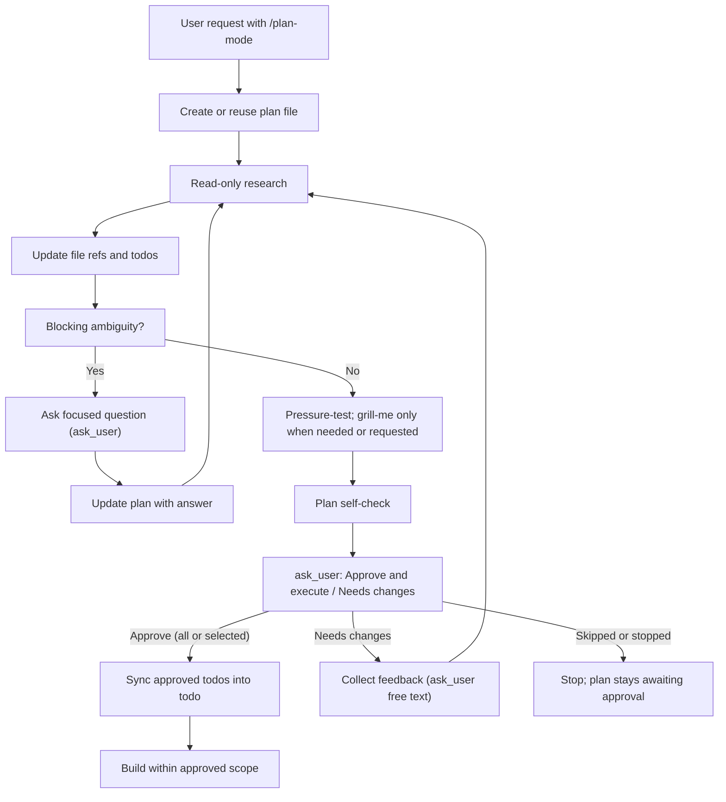

# Plan Mode Architecture

## Table Of Contents

- [Purpose](#purpose)
- [Lifecycle](#lifecycle)
- [Mode Boundary](#mode-boundary)
- [Entry Conditions](#entry-conditions)
- [Research Strategy](#research-strategy)
- [Clarification Gate](#clarification-gate)
- [Plan Creation](#plan-creation)
- [Mermaid Guidance](#mermaid-guidance)
- [Execution Handoff](#execution-handoff)
- [Common Failure Modes](#common-failure-modes)
- [Minimal Templates](#minimal-templates)

## Purpose

Plan mode produces an editable Markdown implementation plan in the task folder before any other change is made. The agent researches the task, resolves material questions, and keeps file references and todos current. Execution starts only after the user approves the plan through the `ask_user` approval gate, and stays within the approved todos.

## Lifecycle



## Mode Boundary

This boundary holds from the moment the skill is loaded until the user approves the plan through the approval gate.

Allowed before approval:

- Read files and directories with `read`, `ls`, `find`, and `grep` (all confined to the task folder), and read this skill's own files.
- Search code, symbols, docs, and diagnostics in the task folder.
- Run side-effect-free shell commands through `bash`, such as `git status`, `git diff`, `git log`, or `date +%F`. Each goes through the shell allowlist or a user confirmation.
- Look up documentation with `web_search` and `fetch_content`.
- Delegate bounded read-only discovery through the `subagent` tool when it is available, to a task agent you define with only read-only tools (see Research Strategy).
- Ask structured questions with `ask_user`.
- Use the grill-me skill (loaded alongside this one) for a requested interview or material user decisions that benefit from one.
- Create or update the required Markdown plan file with `write` or `edit`.
- Create or update grill-me's transcript and planning-ready outcome files when grill-me runs.

Not allowed before approval:

- Edit, create, delete, move, format, or generate files in the task folder, except the planning artifacts: the plan file and grill-me's transcript and outcome files.
- Run package managers, migrations, generators, formatters, autofixers, install commands, or scripts that write output.
- Start services, browser automation, deployments, or long-running workflows.
- Stage, commit, amend, push, reset, checkout, or otherwise change git state.
- Change settings, environment files, credentials, or project configuration, or call tools that do (`configure_mcp`, or `command` with its save action).
- Use the `todo` tool. Until approval, the plan's `Plan Todos` section is the checklist.
- Treat the user's approval of research, or of an answer to a clarifying question, as approval to implement.

If a command can be used either read-only or mutating, use only the read-only form before approval. If its side effects are unclear, do not run it; ask or read its documentation first.

## Entry Conditions

The user loads this skill with the `/plan-mode` chip when they want a plan before anything changes. Loading it always means planning first with the approval gate, even when the same message also asks for implementation: the implementation happens after approval.

Broad scope, uncertainty, multiple files, migrations, or sensitive surfaces justify deeper research and validation. They do not by themselves require an interview. Clarify only decisions that the task folder and conversation cannot resolve and that would materially change the outcome.

## Research Strategy

Research should make the plan accurate, not exhaustive for its own sake.

1. Start with the user's stated target paths, attached material, or named systems.
2. Read instruction and convention files in the task folder (for example a README or a contributing guide) when they can change the plan.
3. Map the ownership boundary: route, component, server API, data shape, config, tests, and validation path.
4. Search by behavior and naming variants before proposing a new abstraction.
5. Stop when the next decision is clear enough to plan; ask the user when the code cannot answer it.

Use children when the folder is large and the investigations are independent. Define one read-only task agent for them with `subagent { action: "define" }`:

- Tools: `read`, `grep`, `find` and `ls`. Add `web_search` and `fetch_content` only when the investigation needs documentation from the web. Never give it `write`, `edit`, `bash` or `command`: the children run before approval, under the same mode boundary as you.
- Instructions: investigate only the objective in its task, change nothing, and return findings with their paths, symbols or source URLs.

Launch it as `task.<name>` in a later message, one child per independent investigation in one `tasks` call. Give each child:

- Objective.
- Read-only scope.
- Key constraints.
- Expected evidence: paths, snippets, findings, unknowns, and confidence.

You keep ownership of the final plan. Child conclusions are inputs, not decisions.

## Clarification Gate

Ask when missing information cannot be resolved from available context and would materially change the implementation. First complete the research that makes the decision concrete.

Good clarification topics:

- Which product behavior is intended.
- Which target directory, package, route, account, or environment to use.
- Which tradeoff the user prefers when multiple designs are valid.
- Whether the user wants compatibility, migration, deletion, or a clean replacement.
- Whether a potentially expensive or disruptive verification step is allowed.

Avoid asking when:

- The answer is visible in the task folder.
- A conventional default is obvious and low risk.
- The question only affects minor naming or formatting.

Ask through `ask_user`. Offer `options` (at most 8, each under 500 characters) when there are a few discrete answers, put the recommended default first, and continue after the user answers. The user can always type a different answer.

## Plan Creation

The Markdown plan file is the approval artifact and the build input. It should be concise enough to review, editable enough for the user to change directly, and specific enough that an execution pass can build from selected todos.

Create or update the plan file for every plan-mode run unless the user explicitly forbids file output or the file cannot be written. A chat message may summarize the plan after the file exists; it never replaces the file.

Create and check the artifact with the file tools:

1. Choose the path: the user's path if given, otherwise `plans/<YYYY-MM-DD>-<slug>.md` in the task folder.
2. `write` the skeleton from SKILL.md, with the title and date filled in.
3. Fill the file with file and code references, clarifying questions, editable todos, build notes, validation, and risks, using `edit` for targeted updates.
4. Run the plan self-check from SKILL.md before requesting approval: `read` the file back, confirm the nine headings, and `grep` it for leftover placeholders.
5. Fix missing headings or placeholders and check again. If the check cannot pass, say why before requesting approval.

Pressure-test the plan's assumptions and failure modes against the evidence. Use grill-me for an explicitly requested interview or unresolved user decisions that benefit from questioning. Skip the interview when the decisions are settled or reasonable in-scope assumptions suffice.

When grill-me runs:

- Let it ask one logged question at a time through `ask_user`, following its own logging and finalization rules.
- Treat its transcript and planning-ready outcome as allowed planning artifacts.
- Do not duplicate its role with informal pressure-test questions that are not logged.
- Add the transcript and outcome paths to the plan with a terse status or one-line summary; do not inline the full outcome.

For plan file placement and state:

- Keep planning artifacts as the only writes before approval.
- Keep plan status and approval separate. The skeleton starts in `Draft - awaiting approval`; only the approval gate changes that.
- Update the same file when the plan changes after feedback.
- Cite the path in chat and summarize only the highest-signal points.

Include:

- Plan status and path.
- Summary of the user goal and scope.
- Clarifying questions and answers, or explicit blockers.
- File paths, symbols, routes, schemas, docs, diagnostics, and other code references gathered during research.
- An editable todo checklist with dependencies.
- grill-me transcript and outcome paths when a pressure test ran.
- Build-from-plan notes that say how execution starts after approval.
- Validation steps.
- Risks, tradeoffs, or assumptions that matter to approval.

Avoid:

- Hidden blocking questions or unsupported claims that a blocked plan is ready to build.
- Generic task lists that do not mention concrete code areas.
- Hidden implementation choices.
- Overly detailed line-by-line instructions unless the task requires precision.
- Promises to run validations that are not available or appropriate.

## Mermaid Guidance

Use diagrams when they reduce complexity for architecture, data flow, routing, state transitions, or multi-system sequencing.

Follow these constraints:

- Use simple node IDs without spaces.
- Quote labels that contain punctuation.
- Avoid reserved IDs such as `end`, `graph`, or `subgraph`.
- Do not use explicit colors or custom styles.
- Do not use click events.

## Execution Handoff

Execution is authorized only by an approval through the `ask_user` gate: `Approve and execute`, or a typed answer that clearly approves all or selected todos. Neither permits unrelated scope expansion.

Before executing:

1. Reread the newest user message and any plan edits.
2. Reread the plan file from disk.
3. Determine whether the approval covers all todos or only selected ones; ask only if that distinction remains material and unclear.
4. Confirm that the requested scope still matches the current state of the task folder.
5. Preserve unrelated user changes.
6. Sync the approved todos into the `todo` tool (`list`, then `create` per approved todo with `blockedBy` for dependencies), then start with the first one.

During execution:

- Mark exactly one `todo` item `in_progress` (with `activeForm`) before working on it, and mark it `completed` as soon as it is done; tick the matching checkbox in the plan file.
- Keep edits scoped to the plan.
- Update the plan when new evidence changes implementation details within scope. Pause only dependent work when it needs a new product decision, scope, or authority.
- Do not silently expand scope.
- Validate affected behavior according to the plan. After those checks pass, expand or repeat them only for a new change, failure, or unresolved concern.

After execution:

- Update the plan status.
- Summarize what changed.
- Report validation results and any skipped checks.
- Mention unresolved risks or follow-ups that genuinely matter.

## Common Failure Modes

- Changing files before approval. Stop the action, report it, and preserve the user's changes while resolving the scope.
- Presenting the plan only in chat. Fix by writing or updating the Markdown plan file, running the self-check, and citing the path.
- Treating the plan file as a one-time export instead of a live editable document. Fix by updating the same file after research, answers, user edits, and plan revisions.
- Building without rereading user edits to the plan file. Fix by rereading the plan from disk before execution.
- Treating a skipped approval question (`The user cancelled the request.`) as approval. It never is.
- Starting an interview for settled decisions or routine implementation details. Reuse the evidence and existing decisions, and keep questions for material unresolved choices.
- Asking too many questions before reading obvious context. Fix by doing a small read-only pass first.
- Marking a plan ready despite unresolved blocking decisions. Deliver the completed research and name the exact decision still needed.
- Delegating the entire decision to a child agent. You stay responsible for synthesis and approval.
- Treating approval of a plan as approval for unrelated cleanup. Keep the execution scope narrow.
- Creating `todo` items before approval, or for todos the user did not approve.
- Running validation that writes files before approval. Defer it to execution.

## Minimal Templates

The SKILL.md skeleton is the required shape: it carries all nine headings the self-check looks for. For a simple plan, keep each section short, for example:

```markdown
# Export tasks as CSV

Status: Draft - awaiting approval
Created: 2026-01-15
Approval: Awaiting user approval

## Summary

[One paragraph]

## Clarifying Questions

- [x] [Question] -> [Answer]

## File And Code References

- `[path]` - [symbol, route, schema, or contract]

## Plan Todos

- [ ] Inspect `[path]` to confirm `[contract]`.
- [ ] Update `[file]` to `[behavior]`.
- [ ] Verify with `[command or manual check]`.

## Grill-Me Outcome

- Transcript: Not run
- Outcome: Not run
- Summary: Not needed; decisions were settled by the request.

## Build From Plan

- Ready to build: No
- Selected todos: All after approval
- Execution notes: [handoff constraints]

## Validation

- [command or manual check]

## Risks

- [Only material risks, or "None beyond the listed validation."]

## Approval

- Status: Draft - awaiting approval
```

Bracketed text marks what to write; replace all of it before the self-check.
