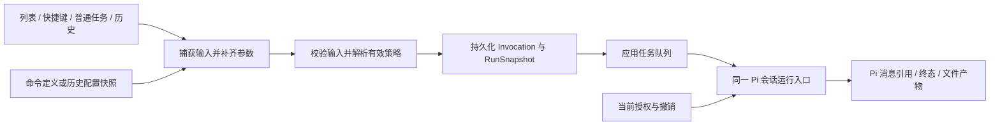
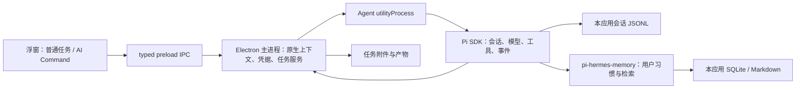

# 通用 Agent 正式需求与实施规划

Status: 首版范围已确认；Command 前期架构与 D4 设计已补齐，集成可行性尚需 E0 验证
Created: 2026-09-10
Approval: 用户已确认首版并授权进入 Figma 设计阶段；尚未授权应用实现或运行验证

## Summary

做一款基于现有 Electron 草稿的通用个人 Agent：随时唤起，直接交代任务，能够使用工具完成工作，并在使用中逐渐了解用户习惯。底层采用 pi coding agent，记忆采用 pi-hermes-memory，提供类似 Raycast AI Commands 的可复用快捷任务。

已确认的产品约束：

- 产品中没有项目实体、项目选择器、项目归属或按项目分割的用户记忆。
- 普通对话与 AI Command 使用同一个 Agent 内核；命令允许调用指定工具，文本处理命令保持轻量。
- 自动学习稳定偏好与明确纠正；用户可以查看、修改、删除记忆并暂停学习。
- 首版需求与主要设计已完成；本轮依据架构评审补充 Command 的前期规划，应用实现尚未开始。
- 2026-09-10 用户明确要求：项目尚未开始，应在计划之初把影响通用性、扩展性与维护性的架构问题想清楚。架构规划覆盖完整生命周期和演进边界，功能按依赖分阶段交付；不能用“首版先做最小契约”替代前期设计。

产品核心是「任务 + 命令 + 用户记忆」。任务承载一次可持续的工作，命令保存常用任务的启动方式，记忆积累跨任务仍然有用的用户偏好。命令不持有独立人格或独立记忆库。

建议的信息架构：主浮窗承载新任务、任务对话和命令入口；历史承载可继续的任务；设置承载模型、命令管理、记忆与快捷键。

## Clarifying Questions

- [x] 首版 AI Command 是否能调用工具？用户确认：支持，每个命令指定可用工具，文本命令保持轻量。
- [x] 记忆学习方式：用户确认自动学习稳定偏好与明确纠正，支持查看、修改、删除和暂停学习。
- 建议默认值：沿用现有桌面形态，以 macOS 为首要体验；个人本地数据与自带模型凭据；先沿用 OpenAI / OpenAI-compatible 设置。以上是根据现有草稿提出的范围，不是用户另行确认的限制。
- 建议首版同一时刻执行一个前台任务；其他任务可保存、切换和排队。隐藏浮窗继续执行，退出应用终止执行；重启后不自动重放有副作用的工具。
- Command 的前期规划规则见下文 C1–C10，包括内置示例所有权、参数、历史复跑、队列、授权和资源生命周期。本轮按已有范围选定具体设计，不将子代理的每项建议等同于用户逐项确认；后续反馈直接修订这些规则。
- 暂无必须追加询问的产品问题。技术未知项明确列入 E0，D4 已提供对应的设计状态；若用户调整目标平台、原位替换或外部连接器范围，应更新本文件的范围与依赖。

## 已确认的正式需求与首版范围

| 编号          | 首版行为                                               | 完成标准                                                                           |
| ------------- | ------------------------------------------------------ | ---------------------------------------------------------------------------------- |
| R1 普通任务   | 输入问题或目标，可携带上下文，多轮推进                 | 实际流式回答、工具执行、等待输入、停止、失败信息和恢复入口；重开历史可继续同一任务 |
| R2 AI Command | 内置少量命令，支持创建、编辑、复制、删除、搜索和快捷键 | 一次触发收集约定输入，按保存的模型与工具配置运行；不需要重复填写提示词             |
| R3 用户记忆   | 自动学习偏好、习惯与纠正，跨任务使用                   | 记忆页可查看、修改、删除、暂停学习；一次性的内容处理要求不会直接成为长期偏好       |
| R4 上下文     | 手动输入、选中文字、按需读取剪贴板、用户选择的文件     | 来源可见；缺少必需输入时先补充；文件内容实际进入执行流程，不只显示文件名           |
| R5 工具能力   | 复用 Pi 的文件读取、查找、编辑、写入和命令执行能力     | 每个命令只启用所需工具，普通任务遵守当前工具范围；有真实执行步骤与产物             |
| R6 结果与历史 | 结果显示、复制、继续对话，保留任务和产物引用           | 任务与命令历史统一；命令删除或修改后，既有执行记录仍可解释                         |

首版先让三类日常任务完整可用：文字翻译/润色、把选中文本整理成摘要或行动清单、读取用户选择的文本文件并生成整理结果。文件初始范围建议为文本、Markdown、CSV、JSON；图片按模型能力展示支持情况，PDF/Office 解析不冒充已接入。

以下作为后续范围，不纳入本版默认承诺：跨应用原位替换、任意电脑操作、完整浏览器操控、网页搜索服务、邮箱/日历等连接器、MCP 管理界面、命令市场和分享、定时自主任务、多 Agent 并行、云端同步、团队账户。通用性通过可扩展工具与任务模型体现，界面只展示真实可用能力。

### 三个核心流程

1. **普通任务**：唤起浮窗 → 输入目标与附件 → 显示回答和实际执行步骤 → 必要时补充输入或处理工具确认 → 获得结果 → 继续追问。新任务只创建会话，不要求选文件夹。
2. **快捷命令**：在原应用选中文字 → 快捷键触发命令，或唤起后搜索命令 → 补齐必填参数 → 执行 → 复制结果或继续对话。输入必须在浮窗抢走焦点前捕获；读取失败明确展示，不拿旧剪贴板静默替代。
3. **记住习惯**：用户正常工作或纠正回答 → Hermes 提炼长期偏好 → 低打扰地提示发生了记忆更新 → 用户可进入记忆页修正 → 后续任务按需使用。当前明确要求优先于历史偏好。

普通任务示例：「把这几份会议记录整理成行动清单，按负责人分组。」命令示例：「整理行动清单」保存上述步骤，输入来自选区或附件，允许读取文件，输出在任务中。用户无需理解 Pi、cwd、SDK 或记忆索引。

### AI Command 的产品契约

| 字段             | 建议行为                                                                     |
| ---------------- | ---------------------------------------------------------------------------- |
| 名称、说明、图标 | 用于检索和辨认；复用 Lucide，名称与可选别名可搜索                            |
| 指令             | 用户可编辑的提示词；通过输入插入器引用变量，无需手写复杂语法                 |
| 输入与参数       | 显式声明选区、剪贴板、输入文本、文件及命名参数；明确必填和默认值             |
| 模型             | 默认跟随应用设置，也可固定模型；固定模型不可用时显示错误，不静默换模型       |
| 工具             | 业务工具允许列表；文本命令默认不提供文件或 shell 工具，记忆能力单独管理      |
| 记忆             | 默认继承全局设置，可对某条命令关闭记忆读取与学习；命令模板不被学习为用户偏好 |
| 结果             | 首版在浮窗展示，提供复制与继续对话；原位替换留给后续原生回填能力             |
| 快捷键与启用状态 | 可选独立全局快捷键；冲突时不保存无效绑定；禁用后不触发                       |

变量使用 `{{input}}`、`{{selection}}`、`{{clipboard}}`、`{{argument.language}}` 等受限命名引用，按 C2 统一解析。已声明的参数进入具名运行上下文；模板引用控制其在指令中的位置。模板只展开一次，不执行表达式、shell 或从输入数据二次展开模板。

从命令入口运行会创建新任务并保存执行快照；历史继续在原任务中创建新的执行轮次。列表运行使用当前版本，历史“再次运行”使用明确展示的历史配置快照创建新任务，具体规则见 C4/C5。继续对话保留该任务的执行范围，需要扩大工具能力时显式变更，不因退出命令界面自动获得所有工具。

## Command 前期架构规划

本节是进入实现前采用的架构基线。它覆盖命令定义、输入、触发、执行、结果、维护和后续扩展；交付阶段决定什么时候实现相应功能。Pi/Hermes 的实际适配是否成立仍由 E0 核验，不能把未接入的能力标为已完成。

规划依据包括 [GPT-6 Astra（max）架构评审](/Users/zen/Documents/ZProject/ai/tmp/command-system-review-2026-09-10.md)。评审记录的是修订前的缺口；本节给出当前选择的规则，以本计划为后续设计与实现依据。

### C1 · 产品抽象与数据所有权

Command 是可保存、可编辑、可重复使用的任务启动配置。普通任务、内置示例、自定义命令和历史再次运行都进入同一执行入口；命令不拥有独立 Agent 循环、项目、会话日志或记忆库。内置示例使用与用户命令完全相同的数据模型，不能按名称选择专用表单或执行分支。

| 对象                      | 字段与语义                                                                                                                        | 拥有者                                                                                                 |
| ------------------------- | --------------------------------------------------------------------------------------------------------------------------------- | ------------------------------------------------------------------------------------------------------ |
| CommandDefinition         | `schemaVersion`、`commandId`、`revision`、名称/说明/图标/检索别名、可选模板来源、输入定义、指令模板、执行策略、启用状态、更新时间 | command service；`commandId` 在改名和编辑后不变，`revision` 表示内容修订，`schemaVersion` 表示存储格式 |
| InputSpec / ParameterSpec | 主文本的来源约定、附件约束、有序命名参数及其值类型/必填/默认值/选项/说明                                                          | 命令定义持有；同一 schema 驱动编辑器、运行表单、校验与输入解析                                         |
| InvocationDraft           | 触发来源、捕获的上下文、待补字段和可编辑运行设置；尚未被接受执行                                                                  | 准备流程；缺少输入时不伪造 running 任务                                                                |
| CommandInvocation         | `invocationId`、来源、接受时间、定义版本或历史快照来源、已校验输入、请求策略                                                      | 应用执行入口；一个逻辑提交的重发必须沿用同一 ID                                                        |
| Task / RunSnapshot        | `taskId` 对应 Pi `sessionId`；每个 `runId` 记录本次 invocation、指令、输入、命令与有效策略快照                                    | task service 保存元数据；一个 task 可有多个 run，Pi 拥有会话正文                                       |
| ResolvedPolicy / Grant    | 实际模型连接与模型 ID、工具 ID、资源与动作授权、记忆读写策略、解析依据及撤销状态                                                  | policy 与 context 边界；不包含凭据，旧快照不能代替当前授权                                             |
| RunOutcome / ArtifactRef  | 终态、原因、用量、Pi 消息/工具调用引用、生成文件及其可用状态                                                                      | run service 记录结果；context service 拥有文件位置，结果不回写不可变输入快照                           |
| ShortcutBinding           | `commandId`、accelerator、注册可用性及失败原因                                                                                    | 快捷键管理；复用已有录制、匹配与原生注册能力                                                           |

这里定义的是概念和责任，不要求为每个对象增加一套类、数据库或通用服务框架。应用和进程间协议使用同一份可运行时校验的 schema，renderer 不维护第二份字段规则。错误采用稳定 code、字段路径、可重试性和恢复动作，显示文案由 UI 负责。

### C2 · 输入、参数与模板

主文本、附件和命名参数可以并存。手动输入、选区、剪贴板是文本的捕获来源，不是互斥的命令种类；值类型与来源分别建模。命令可不要求主文本，例如使用固定指令和参数启动任务，但指令本身必须有效。

- 参数从一开始采用统一的 `text`、`number`、`boolean`、`enum` 模型。文本支持单行/多行，枚举保存稳定 option value 与显示名称；数量、长度、范围等约束属于字段定义。复杂嵌套对象、动态选项和条件表单有独立演进边界，不通过命令名称特判。
- 每个参数有唯一且稳定的 key、显示名称、说明、必填、默认值及对应类型约束。默认值在定义保存时校验；运行表单区分缺失、空文本、`false` 和 `0`。改 key 时同步改模板引用，无法自动对应时保留编辑草稿并指明问题；不静默删除字段。
- 提示词中的变量以带颜色的 `{{…}}` 引用显示，保存内容仍是模板文本。编辑器常驻可用变量入口，输入 `{{` 时提供建议；选择器按内置来源与当前命令参数分组，说明含义、默认值与启用条件。已启用的变量用加号 icon button 插入到光标位置，需要配置的来源用设置图标进入配置；默认透明无可见边框，hover 显示背景，hover / 键盘焦点显示 tooltip。未定义引用在输入框内标红，错误与修正入口紧邻提示词；不使用其他命令的参数充当默认变量。
- `{{input}}` 指向本次显式选定的主文本。仅在定义声明并实际捕获该来源时，才允许引用 `selection` 或 `clipboard`；这些引用不会自行读取系统状态。切换主文本来源需要在运行预览中可见，不能自动用剪贴板顶替失败的选区。
- 所有已声明、已校验的具名参数都进入统一的运行上下文，参数 key/value 与模板展开后的指令分别保存。`{{argument.key}}` 用于在指令中安排参数位置；未引用的有效参数仍会进入上下文。内置语言下拉、Extract 的 `group_by` 和 Weekly 的 `focus` 均走同一路径。
- 保存定义时用 Mustache 的解析结果检查变量是否已声明、语法是否受支持；保留平面变量及命名属性引用，拒绝函数、递归 partial、表达式与模板结构扩展。运行前完成必填和类型校验，不依赖模板把缺失值变成空字符串。
- 模板按纯文本规则渲染，保留代码、Markdown、`<`、`>`、`&` 以及用户数据中的双大括号；用户输入只作为值，不再次解析。转义策略通过本次渲染配置控制，不修改进程级全局行为。Mustache 的默认 HTML 转义和缺失值行为已有[官方说明](https://github.com/janl/mustache.js/blob/v4.2.0/README.md#variables)，本应用需显式适配。
- 文件是资源引用，不能通过将路径拼入提示词获得访问能力。`files` 的插入内容来自已校验附件的名称、类型与受限引用；正文解析、按需读取和上下文预算由输入解析器及工具能力共同处理。超限时指出具体文件或字段并让用户调整，不静默截断关键输入。
- 保存命令只做确定性校验，不运行 Agent。编辑器提供“运行预览”，展示捕获来源、已解析参数、实际模型和所需能力；真正试运行创建带来源标识的普通任务，遵守相同权限和记录规则。

运行上下文在进入 Pi 前保留来源标记，区分命令指令、用户本次输入、文件材料和具名参数。Hermes 学习入口不得把重复出现的命令模板当成用户稳定偏好；来源信息如何贯穿压缩和后台学习属于 E0 必须落实的集成要求。

### C3 · 统一触发与调用准备

- 全局快捷键在浮窗获取焦点前捕获原应用选区；捕获结果带来源和时间。在参数准备、排队、重连期间使用这次捕获值，不重新读取当前选区或剪贴板。后台数据不会因为窗口焦点改变而替换。
- 普通任务的输入由同一解析流程生成 invocation，来源标为普通任务，不需要生成或保存虚假的 CommandDefinition。历史继续引用原 task；列表和全局命令触发创建新 task。
- 接受前读取最新 definition revision。若准备期间命令已编辑，保留用户输入并提示按新版重新核对；已禁用或删除则不再接受该命令的新提交。
- 接受是主进程拥有的串行操作：完成校验，生成 task/run 关联，持久化启动 ID 和完整快照，成功后才交给队列。传输重试复用 `invocationId` 并返回原记录；用户新的有意运行使用新 ID，不按命令名称去重。
- 原生注册失败、参数缺失、模型不可用、权限未完成、队列等待等返回不同状态与恢复动作。某个输入来源暂不可用不删除命令定义，也不假装已经执行。

### C4 · 定义维护、版本与历史

- 首次载入内置示例时生成普通用户定义并记录模板来源与已导入状态。应用启动或升级不覆盖用户副本；删除过的示例不自动重建。未来提供模板更新时展示差异并由用户选择应用，更新策略独立于命令执行。
- 修改定义采用 revision 校验，冲突时保留编辑内容供比较，不以最后写入无声覆盖。名称可重复但 ID 不重复，列表用说明和来源辅助区分；搜索、排序与图标不影响执行身份。
- 复制产生新 ID，保留配置但清空全局快捷键；快捷键与应用固定动作统一检查冲突。注册与持久化发生失败时恢复上一份可用配置，启动时按已保存配置重建注册并显示不可用项，不显示虚假成功。
- 禁用和删除阻止该定义的新触发并取消快捷键注册。已经被接受的排队或运行任务使用自己的快照继续存在；定义操作不隐式取消任务。删除确认明确说明这一点；取消排队和 Stop 在任务侧完成。资源或工具授权被撤销则约束所有后续执行。
- 列表“运行”使用最新有效版本。历史“继续对话”使用原 Pi 会话和任务保留的策略，在当前授权范围内创建新 run；不读取最新命令模板覆盖原对话。
- 历史“再次运行”先展示历史配置与输入可用性，用户提交后以该快照创建新 task；如选择“使用最新命令”，显式重新解析当前定义。删除原命令不损坏历史快照，用户也可从历史保存为一个新命令。
- 任何重新准备和运行设置修正都产生新的接受记录，不修改已接受 RunSnapshot。快照记录能解释当时用了什么配置；模型、记忆和外部资源变化时不承诺确定性重放。

### C5 · 队列、停止与恢复

首版采用一个活动执行槽，同一 task 不并发运行两个 run；不同 task 的待运行请求进入应用队列。并发策略由调度边界拥有，不写入每条命令，也不把 Pi 的会话内 followUp 当成跨任务队列。

| 阶段     | 状态与规则                                                                                                                         |
| -------- | ---------------------------------------------------------------------------------------------------------------------------------- |
| 准备     | 缺失必需输入停留在 draft；用户取消不创建正在运行的任务                                                                             |
| 已接受   | `queued` 已拥有输入与配置快照；取消排队进入 `cancelled`，不调用 Agent                                                              |
| 执行     | `running`；显式输入请求或权限请求分别进入 `awaiting_input` / `awaiting_confirmation`，请求有独立 ID，回答只作用于匹配的 run 和请求 |
| 停止     | 运行与等待中的 Stop 先进入 `stopping`，使待确认请求失效，等待 Pi 和受控工具退出后才进入 `stopped`；保留已产生的内容与文件          |
| 正常终止 | `completed` 或 `failed`，保存原因和可用结果；一轮普通问答结束后，用户下一条消息创建新的 run                                        |
| 意外中断 | 进程退出或崩溃留下的未终结记录在恢复时标为 `interrupted`；不自动重放旧队列或写入命令，用户查看后继续                               |

队列开始时再次检查当前模型连接、工具可用性和资源授权；不能通过旧快照绕过撤销，也不偷偷换模型。无法满足时记录具体失败原因并保留输入，修正配置后创建新的提交。执行中的显式输入回复恢复匹配的 run，普通追加消息与历史继续则遵守会话顺序。

Stop 不提交或清空 Composer 草稿，不代表回滚已完成的文件写入；只有执行真正结束才能释放执行槽。重试关联旧 run 并基于已有工具结果与当前资源重新准备，不能直接重放此前的全部工具调用。工具调用记录区分已确认提交、未执行和结果未知；重启后结果未知的有副作用操作先核对现状，再由用户决定继续。

renderer 根据 `taskId`、`runId`、事件顺序更新展示；重连先读持久状态，再应用后续事件。主进程拥有接受、调度和终态，Pi 事件映射属于 Agent 集成边界；UI 不按文本内容推测完成、失败或工具权限。

### C6 · 模型、工具与记忆策略

- 在同一个策略解析入口合并应用设置、命令配置与本次明确调整，生成请求策略和有效策略。所有触发方式共用它；设置页、快捷键回调和任务页不各写一套默认值逻辑。
- 固定模型引用包含 provider connection identity 与 modelId；提供方类型或模型名称不能单独标识连接。连接端点变更使旧引用需要重新选择；仅同一连接的凭据轮换不改变身份。继承默认值在接受时解析并记录，之后修改应用默认模型只影响新的提交。
- 工具以稳定 toolId 保存明确允许列表。“Read files / Edit files / Terminal” 是展示分组，新增分组成员不自动授予旧命令新能力；缺失工具标记不可用并保留定义，不能静默移除。
- 有效工具范围同时受应用支持能力、命令允许列表、任务已确认范围和当前撤销约束。本次运行及继续对话可以明确收窄；扩大范围需要展示新增能力与资源并确认，不能把打开普通对话当作扩大权限。
- 记忆在内部区分 read 与 learn。首版 UI 可继续使用“继承全局 / 关闭”；命令关闭延续到该任务的后续 run。全局暂停学习作为即时写入限制，阻止尚未提交的后台学习结果；恢复学习仅影响后续允许的工作，不自动提交暂停期间被丢弃的写入。
- 每项自动学习工作携带 task/run 来源和策略版本，提交前检查当前允许状态。手动管理记忆仍走 Hermes 同一存储拥有者。命令策略不能绕过全局暂停或把材料、示例模板当成用户偏好。
- 快照和错误信息仅保存非敏感连接身份、工具 ID、策略来源与修订；凭据留在现有 safeStorage 边界，Pi 运行时按需获得所需凭据。

### C7 · 工具接入与资源授权

Pi 的注册、参数 schema、允许工具集合及工具事件继续承担工具机制；应用增加产品描述、可用性与授权绑定。每项集成明确稳定 ID、版本/能力要求、所属提供方、展示分组、动作及资源需求。已有注册信息直接复用，避免维护一份与真实执行器分离的工具清单。

文件选入、可用工具与执行某个动作的授权是三件不同的事。context service 在主进程维护不透明资源引用、来源、可读/可写动作和有效期；模型给出的路径不会自动变成已授权引用。权限判定同时检查工具、资源、操作和实际参数，规范化路径与链接目标的规则归该边界，不分散到每条命令。

授权请求绑定 `runId`、`toolCallId`、资源、操作和参数指纹；参数变化、停止、拒绝或请求过期后原确认不可复用。界面默认确认本次动作，不将一次创建文件自动提升为整个任务任意写入。工具不可用、拒绝、执行失败、取消和结果未知分别反馈给运行服务。

Terminal 在首版按具体命令和 cwd 展示执行确认，明确其可能影响工作目录以外的资源；cwd 是执行位置，不是沙箱。若将来承诺受目录限制的 shell，需要先引入真实隔离能力及相应产品说明。受控文件操作继续沿主进程能力边界完成，Pi 的工具操作如何接入该边界须在 E0 证明，不把提示词限制当作隔离机制。

### C8 · 文件、产物与数据生命周期

- 用户选入的附件由 context service 分配稳定 ID。默认将支持的文件保存为任务拥有的只读附件副本，记录原始来源、捕获时间、类型、大小和内容版本；队列和历史读取同一副本。原始文件位置不暴露为 renderer 的任意文件访问能力。
- 无法读取、复制失败、类型不支持或超出预算时在准备阶段指出具体项，不静默退回仅有文件名的“附件”。实际解析器决定正文如何进入上下文；大文件按声明的文件能力读取，缺少所需能力时要求调整配置，不能假装已读。
- 对原始文件的修改需要独立授权。执行前校验目标现状，原件已变化时明确展示变化并重新确认；附件副本不提供修改原件的隐式权限。目录输入未来归同一个资源体系，仍不生成项目实体。
- 输出文件记录 artifactId、taskId/runId、创建或修改操作、文件类型、显示名称、位置引用及可用状态；结果页可打开、显示位置、复制路径或继续使用。部分成功的文件在 stopped/failed 状态下仍保留，助手文本不是文件存在的唯一证据。
- 文件被外部删除、移动或替换后标为不可用或已变化，允许用户重新关联；保持历史中的原始记录，不把新文件冒充旧产物。使用历史输入重新运行时先核对资源可用性。
- 删除任务按明确的数据操作删除其托管附件、任务元数据与会话关联；外部原件和外部产物不随任务删除。Hermes 记忆独立管理，删除任务不被解释为已经删除相关长期记忆。托管文件容量、保留策略和清理入口由应用数据管理统一负责。

### C9 · 存储、兼容性与模块依赖

应用元数据采用主进程单写入者和已有原子提交思路。定义保存与接受执行按顺序处理；启动记录同时保存幂等 ID、任务关联和不可变快照，持久成功才启动 Pi。快捷键、Pi 日志和文件系统无法共享一次原子事务，因此记录可恢复的操作状态，重启时核对实际结果；不能用重复执行补救不确定的副作用。

命令定义、调用快照、运行结果和资源索引均有明确格式版本。迁移先验证并保留可恢复原件，成功后替换；遇到不支持的未来版本保留原数据并显示不能运行，不静默丢字段或重置为空。索引可从所属记录重建，Pi 消息正文与 Hermes 记忆不复制为应用的第二份权威存储。

模块依赖按单向边界组织：renderer 使用共享 schema 与窄 IPC；command service 拥有定义、校验及 revision；invocation 服务组合 definition、context 和 policy；run service 拥有队列、状态与 Pi 宿主；context service 拥有文件和资源授权；memory 适配只依赖 task/run 来源及策略，不反向读取命令编辑状态。服务名称表示职责，可在同一特性内组合，不为形式增加转发层。

### C10 · 扩展路径与前期设计交付

| 变化                   | 现在确定的扩展边界                                       | 交付原则                                                                       |
| ---------------------- | -------------------------------------------------------- | ------------------------------------------------------------------------------ |
| 新增使用已有能力的命令 | 同一 CommandDefinition、输入表单、策略解析和执行入口     | 增加配置即可；内置示例没有专用运行器                                           |
| 新增参数或输入类型     | 类型 schema、对应字段呈现、捕获/解析与预算约束           | 修改类型拥有的边界，不逐条改命令；旧版本无法识别时明确不可用                   |
| 新增工具或连接器       | Pi 接入、稳定 ID、能力描述、认证与资源授权适配           | 工具列表由实际可用描述生成，不扩散为多个布尔开关                               |
| 新增触发方式           | 转换为同一 InvocationDraft/CommandInvocation             | 继续共用准备、幂等、队列与策略；定时触发的产品能力后续交付                     |
| 新增结果呈现           | Pi 消息引用与 ArtifactRef，按受支持类型呈现              | 不增加命令专属回复存储；结构化结果和预览器有独立能力声明                       |
| 导入、分享或市场       | 版本化定义与能力依赖，不含凭据、机器路径、授权或任务内容 | 导入时重新校验和绑定本机能力，默认不自动启用或继承全局快捷键；功能仍在后续范围 |
| 多任务并发             | 调度策略和会话隔离                                       | 不改变 definition；启用并发前证明资源、会话与记忆隔离                          |

未来能力可以后交付，其身份、所有权、兼容性与授权接入位置在此提前明确。现在不引入未有执行语义的任意扩展字段、命令继承或万能工作流节点；需要新能力时按所属边界演进版本，保留可解释的兼容行为。

D4 已补全共享参数定义与运行表单、来源预览、定义变更冲突、接受前配置变化、历史再次运行、排队取消、正在停止、过期确认及文件产物状态，并纳入变量颜色、可发现性与 icon button 的用户反馈。现有列表、编辑/复制/删除、缺失输入和模型失效画面继续复用；设计原型使用固定样例，实际行为仍属于 E0–E6。

## 记忆与界面规划

### 记忆行为与数据边界

- 用户记忆保存稳定的语言、表达方式、工作习惯和明确纠正；任务材料、临时事实和工具结果首先属于当前会话。技能是可复用步骤，命令是用户触发配置，三者独立。
- 首版沿用 Hermes 的 `policy-only` 按需检索方式；用户明确偏好优先于推测，新指令优先于旧记忆。未检索或未写入时不显示“已记住”。
- 记忆页展示真实内容和能从存储获得的时间/类别。不能提供来源任务时明确缺失，不编造来源或模型置信分数。
- 修改、删除必须同步 SQLite 与 Markdown 镜像，并处理仍在运行的学习任务，避免旧快照立即写回。删除记忆与删除原始任务是不同操作，应分别解释范围。
- 「暂停学习」停止所有自动写入来源，并阻止 Agent 的自动记忆写入；仍可读取已存记忆，也允许用户在设置中主动编辑。它不等同于只关闭定期复习开关。
- 背景学习使用已配置的模型，可能产生额外模型调用；在记忆设置中说明。发生学习错误时任务仍可完成，但记忆状态必须真实。
- 默认数据保存在本应用目录，不自动导入其他 Pi 安装或其他应用的历史。首版不建立云端用户画像服务。

### 界面沿用与新增状态

- 2026-09-10 发送/停止反馈：运行时将 Composer 右侧发送操作切换为停止图标，正文不再放置独立 Stop 按钮；结束或停止后恢复发送。两种操作分别显示 “Send message” / “Stop task” tooltip，覆盖悬停与键盘焦点；停止不提交或清空已输入的草稿。无有效输入时发送禁用，停止操作不依赖草稿内容。
- 2026-09-10 列表反馈：用户明确要求使用列表。Commands 管理采用 Rhea `Item` 的 Small / Outline 组合，统一圆角、边框、名称/说明和右侧运行/更多操作；快捷键使用 `Kbd`，停用状态在说明中标明，启用/停用放入菜单。初始、自定义保存、复制后和停用列表同步更新；不采用表头、固定数据列或表格组件。
- 2026-09-10 设计反馈：用户指出命令编辑布局不合理、自定义能力不明确。命令编辑改为单页，默认突出名称、提示词与输入变量；输入选项和运行设置在同页展开，操作控件紧邻标签；补通新建、自定义、保存、运行的原型路径，示例命令同样可编辑、复制、删除。原 Instructions / Inputs / Behavior 分页方案不再作为设计基线。
- 保留现有 420px 主浮窗、原生材质、Panel header 与 Composer；空态补充少量命令入口，命令浏览使用独立搜索状态，避免主输入框同时猜测“搜索命令还是发送消息”。
- 2026-09-11 命令标题反馈：命令名称只显示在顶部 Panel header，正文直接从用户消息或实际结果开始，移除 `COMMAND · …` / `CUSTOM COMMAND · …` 重复标题及占位。接受前显示当前命令名称，接受后使用本次命令快照中的名称；运行、停止、续聊和记忆工具状态保留同一任务上下文，不因命令后续改名或原型状态切换而替换历史内容。普通任务继续使用自己的任务标题。
- 任务页从“Task saved”升级为用户消息、助手消息、执行步骤和结果。准备阶段与已接受执行分开呈现，执行状态按 C5 覆盖排队、运行、等待输入/确认、正在停止、取消、停止、中断、失败和完成；不展示模型隐藏推理。
- 任务历史保留一份列表，显示标题、时间和状态；命令任务增加命令来源即可，不创建独立命令会话体系。
- 2026-09-11 列表间距反馈：[任务历史](https://www.figma.com/design/D9YK1tEeBTEBgstcepesW5/ai?node-id=336-1154)、[首页快捷命令](https://www.figma.com/design/D9YK1tEeBTEBgstcepesW5/ai?node-id=336-1149) 和 [全部命令](https://www.figma.com/design/D9YK1tEeBTEBgstcepesW5/ai?node-id=336-1150) 的行间距统一为 8px，绑定已有 `gap/layout`。任务行单独放入 Fill 宽度、Hug 高度的 Auto Layout 分组，搜索框、日期标题和页面区域保留各自间距；保留行本身的内容、尺寸和原型操作。已有应用任务列表在 `apps/desktop/src/styles.css` 同步使用两单位共享 spacing（默认 8px）；命令入口和 Agent 运行功能仍待后续实现。
- 设置沿用现有侧栏布局，增加 Commands 与 Memory。命令编辑和记忆编辑在设置内完成；不把完整配置表单塞进窄浮窗。
- 缺失模型、缺失选区、权限未授予、快捷键冲突、附件不可读和记忆服务不可用都应有具体动作入口；服务恢复不能自动重复文件写入或 shell 命令。

### Figma 设计交付与实现映射

- [首版设计页](https://www.figma.com/design/D9YK1tEeBTEBgstcepesW5/ai?node-id=336-1148)：主浮窗、命令输入/执行/结果、历史、恢复状态，以及 Commands / Memory 设置。
- [已交付 Commands 列表](https://www.figma.com/design/D9YK1tEeBTEBgstcepesW5/ai?node-id=362-1860) 与 [自定义命令编辑](https://www.figma.com/design/D9YK1tEeBTEBgstcepesW5/ai?node-id=348-799)。空白新建入口、示例提示词、输入选项、模型/记忆/工具设置及保存后状态均已提供；通用参数定义和运行表单已按 C2 在 D4 补齐。
- [命令列表组件与四种状态](https://www.figma.com/design/D9YK1tEeBTEBgstcepesW5/ai?node-id=373-1416) 及 [长名称/宽度评审](https://www.figma.com/design/D9YK1tEeBTEBgstcepesW5/ai?node-id=384-1373)。保留共享 Item、Lucide、Kbd 与项目 Icon button 的实例连接；共享库自身未修改。
- 列表映射到现有 [item.tsx](/Users/zen/Documents/ZProject/ai/packages/ui/src/components/item.tsx)、[kbd.tsx](/Users/zen/Documents/ZProject/ai/packages/ui/src/components/kbd.tsx) 和 [styles.css](/Users/zen/Documents/ZProject/ai/packages/ui/src/styles.css)：Small / Outline，水平 14px / 垂直 12px 内边距，14px 媒体间距，18px 圆角，1px 边框，10px 列表间距；标题 14px / 19.25px，说明 14px / 20px。行高 70px 是产品组合尺寸；命令名称可截断，操作区不被挤压。
- 项目新增 `Rhea / Item title` 文字样式及 `item/focus-ring` 变量，对应 Item 的 `leading-snug` 和 `ring-ring/50`；保留现有按钮、输入框、窗口材质、侧栏与设置内容 inset 的既定值。
- [发送/停止组件](https://www.figma.com/design/D9YK1tEeBTEBgstcepesW5/ai?node-id=392-1441) 复用 `App / Icon button`、`App / Tooltip` 及共享 Lucide arrow-up / square。按钮保持 28 × 28px、图标 16px；tooltip 沿用 Rhea 的 12px / 16px 字体、水平 12px / 垂直 6px 内边距、14px 圆角和现有颜色变量。默认、悬停、焦点、禁用和禁用悬停状态均已提供；未增加新 token 或修改共享库。
- Tooltip 后续修订：修复箭头与气泡右下圆角衔接处的缺口。气泡右边缘超出按钮右边缘 8px，仍收在输入框边界内；箭头保持对准按钮中心，避开圆角区域，箭尖与按钮保留 4px 间距。此定位属于 Composer 调用方，后续实现设置 `sideOffset={4}`，不修改共享 Tooltip 的默认值或箭头造型。
- [运行页](https://www.figma.com/design/D9YK1tEeBTEBgstcepesW5/ai?node-id=336-1152) 与 Weekly planning brief 的运行页已使用 Composer Running 变体，停止点击连接各自的已停止状态；[停止提示](https://www.figma.com/design/D9YK1tEeBTEBgstcepesW5/ai?node-id=395-3811) 和 [发送提示](https://www.figma.com/design/D9YK1tEeBTEBgstcepesW5/ai?node-id=395-3917) 可独立评审。后续代码在现有 Composer 中复用 [tooltip.tsx](/Users/zen/Documents/ZProject/ai/packages/ui/src/components/tooltip.tsx) 和 Button，运行状态控制同一操作位；真实停止与草稿保留属于 E1/E2。
- 原型入口为 Use the agent、Create your own command、Manage memory。已连接自定义命令的新建、示例填写、保存、运行、继续对话、编辑、复制、删除、启用/停用，以及记忆编辑/删除/暂停主路径；部分其他表单控件仍用于视觉状态评审。
- Figma 原型使用固定样例表达交互状态，不承担真实输入持久化、复制到系统剪贴板、模型调用、工具执行或记忆写入。真实功能属于 E0–E6；本轮更新 Figma 与本计划，未修改应用代码。

### D4 · Command 设计补充

- [变量选择器](https://www.figma.com/design/D9YK1tEeBTEBgstcepesW5/ai?node-id=421-3644) 与 [icon button / tooltip](https://www.figma.com/design/D9YK1tEeBTEBgstcepesW5/ai?node-id=437-7613)：彩色花括号、内置来源、参数默认值、插入与启用入口；另有输入建议、未知引用、来源启用、空白命令和 Action items 的独立范围示例。变量选择器使用 [共享项目组件](https://www.figma.com/design/D9YK1tEeBTEBgstcepesW5/ai?node-id=439-2067)，右侧操作复用 App / Icon button、App / Tooltip 和共享 Lucide plus / settings-2。
- 2026-09-11 弹层宽度修正：[共享变量菜单内容](https://www.figma.com/design/D9YK1tEeBTEBgstcepesW5/ai?node-id=507-4022) 按 [Rhea Command](https://ui.shadcn.com/r/styles/radix-rhea/command.json) 的容器与分组结构组织横向间距，外层 4px 加搜索/分组各 4px，使搜索框与选项高亮均距外边缘 8px。三种完整选择器和输入建议共用此规则，组与行使用 Fill 宽度、Hug 高度；保留现有纵向节奏、18px 弹层材质和行内 8px/6px 留白。普通 Dropdown Menu、SelectGroup 保留各自的 4px 留白，Tooltip 按自己的内容规则布局。同步主组件、实际实例及宽度/状态评审，避免在实例中覆盖宽度或 padding。
- 同步排查其他弹层：[Provider 菜单](https://www.figma.com/design/D9YK1tEeBTEBgstcepesW5/ai?node-id=306-1817) 的 SelectGroup 改为 Hug 高度，保留与触发器等宽及单层 4px 留白；[插件通知](https://www.figma.com/design/D9YK1tEeBTEBgstcepesW5/ai?node-id=783-4274) 的 Visible 变体改为 Hug，兑现已有的长文案与顶部绝对定位规则，Hidden 语义保持不变；[窄宽度评审容器](https://www.figma.com/design/D9YK1tEeBTEBgstcepesW5/ai?node-id=444-1961) 关闭误裁切，保留 Tooltip 的正确锚点。现有应用 Select/Tooltip 已按各自 primitive 布局，本轮无需代码修改；变量菜单和插件通知仍属于待实现设计。
- [输入与参数列表](https://www.figma.com/design/D9YK1tEeBTEBgstcepesW5/ai?node-id=362-1861) 提供新增及四类参数编辑：[文本](https://www.figma.com/design/D9YK1tEeBTEBgstcepesW5/ai?node-id=422-3901)、[数字](https://www.figma.com/design/D9YK1tEeBTEBgstcepesW5/ai?node-id=425-4065)、[选项](https://www.figma.com/design/D9YK1tEeBTEBgstcepesW5/ai?node-id=425-4398)、[开关](https://www.figma.com/design/D9YK1tEeBTEBgstcepesW5/ai?node-id=425-4743)。重复 key、无效默认值、可选值及新增后状态均有评审画面，参数保持列表形式。
- [统一运行表单](https://www.figma.com/design/D9YK1tEeBTEBgstcepesW5/ai?node-id=362-1862)、[运行预览](https://www.figma.com/design/D9YK1tEeBTEBgstcepesW5/ai?node-id=430-5530) 和指令展开预览使用同一组参数示例。补充接受前配置变化、保存冲突以及 [历史再次运行](https://www.figma.com/design/D9YK1tEeBTEBgstcepesW5/ai?node-id=430-6067)；使用新版进入更新后的设置预览，删除命令后仍可查看历史快照。
- [排队与取消](https://www.figma.com/design/D9YK1tEeBTEBgstcepesW5/ai?node-id=431-7040)、[正在停止](https://www.figma.com/design/D9YK1tEeBTEBgstcepesW5/ai?node-id=431-7341)、[中断恢复](https://www.figma.com/design/D9YK1tEeBTEBgstcepesW5/ai?node-id=431-7431)、[过期确认](https://www.figma.com/design/D9YK1tEeBTEBgstcepesW5/ai?node-id=431-7534) 区分准备、已接受、排队、停止和恢复。普通任务与命令均保留 Composer 草稿，正在停止时同一按钮位禁用；已接受任务不因命令停用而自动取消。
- [文件产物](https://www.figma.com/design/D9YK1tEeBTEBgstcepesW5/ai?node-id=433-7453) 提供可用、缺失、外部修改和部分输出状态，以及重新定位文件的确认画面。复用 [App / File artifact · Rhea](https://www.figma.com/design/D9YK1tEeBTEBgstcepesW5/ai?node-id=433-2044)、共享 Item 与 Lucide file-text；打开、Finder 和复制路径在原型中只表达入口，不执行系统操作。
- 新增 [Command field 组件](https://www.figma.com/design/D9YK1tEeBTEBgstcepesW5/ai?node-id=410-1982) 覆盖 Text / Number / Choice / Boolean 与默认、hover、focus、disabled、invalid 状态。输入与选择框为 32px 高、18px 圆角、Inter 14/20；标签与说明沿用项目 Rhea 样式。变量操作为 32 × 32px、16px 图标，tooltip 箭头对准图标按钮中心并保留 4px 间距。未改变 Composer 的 28px 操作位、窗口材质、侧栏与设置 inset。
- `syntax/variable` 是项目变量，引用共享 `tw-raw/blue/400`；`destructive` 对照代码中的暗色主题值建立项目映射。共享库保持连接，原有 Nova 命名的输入、按钮、Item 实例通过项目适配匹配实际 Rhea 几何，不把组件名称作为样式一致性的证据。[宽度与状态评审](https://www.figma.com/design/D9YK1tEeBTEBgstcepesW5/ai?node-id=444-1961) 覆盖长标签、较窄字段、参数行与图标替换。
- 本批状态位于 `03 · Agent v1` 的 44–82 号画面；新增组件与使用说明位于 `02 · App components`。组件可以在 Figma 中编辑属性，原型连接代表性评审路径；键入过滤、任意表单组合与来源捕获仍需在实现中完成。
- 根据后续间距与按钮反馈，已在 [AGENTS.md](/Users/zen/Documents/ZProject/ai/AGENTS.md:108) 增加 Figma Layout First 规则。选项编辑使用定义、选项和补充信息三个 Auto Layout 分组，组间距 16px、组内行间距 12px、标签与控件间距 8px；这些值用于此表单组合，不覆盖其他控件默认值。[选项行组件](https://www.figma.com/design/D9YK1tEeBTEBgstcepesW5/ai?node-id=447-2288) 使用 Fill 字段与固定尺寸删除图标，按控件底部对齐，错误信息位于独立行。400px / 700px 宽度、标签换行及错误状态中，两个输入框与删除按钮的垂直中心差均为 0；增加选项后内容可滚动，页脚位置不变。[布局评审](https://www.figma.com/design/D9YK1tEeBTEBgstcepesW5/ai?node-id=448-2188) 已提供截图与状态示例。

- 后续输入与快捷键对齐排查：原来的 15 组独立列使用 16px / 14px 高的标题区并按顶部对齐，导致控件相差 2px。已统一为 [共享输入与快捷键组件](https://www.figma.com/design/D9YK1tEeBTEBgstcepesW5/ai?node-id=457-2372)：标题共用一行并按文字基线对齐，32px 控件共用下一行，两个行轨道共用列宽变量。复用 Command field 的状态，增加默认开启的 `Show label` 属性，供外部标题组合关闭内部标签；原字段默认外观保持不变。
- 输入选项入口使用 [Rhea 紧凑 Ghost 按钮](https://www.figma.com/design/D9YK1tEeBTEBgstcepesW5/ai?node-id=457-2369)，快捷键使用 [项目状态适配](https://www.figma.com/design/D9YK1tEeBTEBgstcepesW5/ai?node-id=464-2598)，保留共享库连接。修正继承尺寸回弹及焦点状态白底白字的问题，清除组件替换后继承的重复 padding、填充与旧状态跳转。[对齐评审](https://www.figma.com/design/D9YK1tEeBTEBgstcepesW5/ai?node-id=459-2349) 包含 520px / 700px、左右标签分别换行、未设置快捷键、hover / focus / disabled 与独立错误说明。15 个画面和 8 个评审实例的实际控件顶部、底部差值均为 0；另检查的 27 组并排表单没有发现同类偏移，组件引用和原型目标有效。已复核完整编辑页及状态截图，并补充 AGENTS.md 的共享行轨道与实际控件边界检查要求。

## 技术方案与复用决策

### 运行内核

建议用 **Electron utilityProcess + Pi SDK**：主进程拥有原生上下文、凭据与 IPC 边界，独立 Agent 进程拥有会话、扩展与模型执行，React 只处理展示和交互。utilityProcess 提供 Node 运行环境和消息端口，进程隔离可避免扩展或原生模块崩溃直接带走界面，但不是文件权限沙箱。[Electron 官方说明](https://www.electronjs.org/docs/latest/api/utility-process)

SDK 接入复用 `createAgentSession`、`subscribe`、`prompt`、`abort`、`steer`/`followUp` 和 `SessionManager`，不自建 Agent 循环或会话日志格式。使用 `bindExtensions` 绑定应用支持的交互，处理 session_start、关闭/重载、工具确认和错误；不能把 TUI 的 `ui.custom` 当成 Electron 可直接呈现的 UI。[Pi SDK v0.85.1](https://github.com/earendil-works/pi/blob/v0.85.1/packages/coding-agent/docs/sdk.md)

截至本次调查，发布候选为 `@earendil-works/pi-coding-agent@0.85.1` 和 `pi-hermes-memory@0.9.8`。Hermes 0.9.8 的 peer dependencies 已要求 `@earendil-works/pi-ai` 与 `@earendil-works/pi-coding-agent >=0.80.6`；旧命名空间 `@mariozechner/pi-coding-agent` 的最新包为 0.73.1，不能机械照搬旧示例。本轮只核对发布元数据和源码，未验证运行兼容性。[Pi 包元数据](https://registry.npmjs.org/@earendil-works%2Fpi-coding-agent/0.85.1)、[Hermes 包元数据](https://registry.npmjs.org/pi-hermes-memory/0.9.8)

Hermes 发布包的 gitHead 为 `34c6fe49f832e6a0957ce517586158a8bdde71a4`，本次已在内存中检查该发布包的 paths、project、config 与入口文件；没有安装依赖。

### 真正落实“没有项目”

1. 所有任务平级，产品 schema 不设 `projectId`。附件和产物归属于 `taskId`，用户选择目录表示此次任务的工作位置，不创建项目。
2. 固定 Pi 会话和 Hermes 的上下文 cwd 为用户主目录；Hermes 0.9.8 在这个路径明确返回空项目。工具通过 Pi 导出的 `createReadTool`、`createBashTool` 等工厂绑定独立的任务执行目录，不依赖会话 cwd 组织工作。[Hermes 项目识别](https://github.com/chandra447/pi-hermes-memory/blob/34c6fe49f832e6a0957ce517586158a8bdde71a4/src/project.ts#L99)、[Pi 工具工厂导出](https://github.com/earendil-works/pi/blob/v0.85.1/packages/coding-agent/src/index.ts#L219)
3. `SessionManager.create(homeDir, appSessionsDir)` 显式指定本应用会话目录；打开历史时同样固定 cwd，避免恢复旧 header 意外切换项目上下文。[SessionManager](https://github.com/earendil-works/pi/blob/v0.85.1/packages/coding-agent/src/core/session-manager.ts#L1551)
4. 在 Agent 子进程启动环境中设置 `PI_CODING_AGENT_DIR` 指向本应用 `userData/agent`，并在加载扩展前生效；同时显式传递 Pi 的 agentDir。不是修改机器环境或用户原有 `.pi`。[Hermes 路径解析](https://github.com/chandra447/pi-hermes-memory/blob/34c6fe49f832e6a0957ce517586158a8bdde71a4/src/paths.ts#L7)
5. ResourceLoader 使用显式资源列表，关闭默认上下文文件、项目扩展、技能与提示词发现；只加载应用管理的扩展/技能。单独设置 agentDir 不足以阻止读取 `~/.agents/skills` 等默认来源。[ResourceLoader 配置](https://github.com/earendil-works/pi/blob/v0.85.1/packages/coding-agent/src/core/resource-loader.ts#L159)

这是基于上游当前行为选择的组合方案。E0 必须确认工具工作目录与扩展上下文可以保持独立；不能只在 UI 隐藏项目，也不能虚构 `enableProjectMemory: false` 配置。若组合方式不成立，先形成仅覆盖项目上下文的包补丁并评估维护成本，再继续依赖它的集成。

### 数据归属与执行边界

| 数据                     | 唯一拥有者             | 建议存储与约束                                                                              |
| ------------------------ | ---------------------- | ------------------------------------------------------------------------------------------- |
| 多轮消息与工具调用       | Pi SessionManager      | 本应用 agent/sessions 下的 JSONL；UI 消息由它投影，不重复维护第二份会话正文                 |
| 任务标题、状态、命令来源 | 应用 task service      | 本地版本化元数据，沿用 settings-store 的原子提交思路；taskId 对应 sessionId                 |
| 命令定义                 | 应用 command service   | 本地版本化定义；执行时记录配置快照                                                          |
| 用户习惯与记忆检索       | Hermes                 | 本应用独立 SQLite / Markdown；应用不另建向量库或第二套学习器                                |
| 附件与产物               | 主进程 context service | 不透明 ID 与已解析路径/内容的映射；renderer 只拿显示信息，不拿任意文件系统 API              |
| 模型凭据                 | 现有 settings-provider | safeStorage 持久化，运行时只传给可信 Agent 进程；使用 Pi 内存凭据能力，不另存明文 auth.json |

任务事件携带 taskId、runId 和顺序信息，重连先取快照再接收后续事件；重复发送同一启动请求不能创建两个执行。停止调用 Pi abort 并等待退出状态；隐藏窗口不代表取消。重启后的未完成任务显示“已中断”，由用户继续。

工具可用性从注册表实际能力生成。命令允许列表在 Agent 侧生效，工具执行前的阻断/确认通过 Pi 的工具事件与应用权限服务完成；提示词和 Composer 的“Ask first”文案不能代替执行控制。shell 不以字符串黑名单伪装成文件沙箱；按具体动作及当前授权范围处理。

### 仍需验证的 Hermes 适配范围

- 上游提供 `memory_add`、`memory_replace`、`memory_remove`、`memory_search` 等注册工具及内部同步逻辑，但本轮没有找到完整稳定的 GUI 管理 SDK。E0 要证明界面能通过同一存储拥有者完成列出、修改、删除，不能用 LLM 对话代替确定性的设置操作，也不能直接改 Markdown 导致 SQLite 失配。[记忆工具源码](https://github.com/chandra447/pi-hermes-memory/blob/34c6fe49f832e6a0957ce517586158a8bdde71a4/src/tools/memory-tool.ts)
- 暂停学习需覆盖 review、correction detection、compact/shutdown flush，以及模型可调用的写入工具；`reviewEnabled=false` 本身不满足要求。[配置源码](https://github.com/chandra447/pi-hermes-memory/blob/34c6fe49f832e6a0957ce517586158a8bdde71a4/src/config.ts#L43)
- 默认 direct transport 仍存在启动 `pi -p` 的回退路径。桌面发行包不能隐式依赖用户 PATH 中安装的 Pi。E0 要确定使用同一内置运行时的处理方式，或通过最小适配关闭该回退并显示学习失败；不得偷偷回到用户全局 Pi。[背景学习源码](https://github.com/chandra447/pi-hermes-memory/blob/34c6fe49f832e6a0957ce517586158a8bdde71a4/src/handlers/background-review.ts)
- 如上游接口不足，只为管理入口、暂停/生命周期和运行时寻址添加窄适配或有版本约束的包补丁；保留原有扫描、记忆变更、锁与镜像同步。该工作是有证据的集成缺口，不是自建记忆服务的理由。

### 其他能力的复用选择

| 能力                 | 建议复用                                                                  | 依据、成本与剩余边界                                                                                                                                                                                                                                                                                                                                                                                                                                                                      |
| -------------------- | ------------------------------------------------------------------------- | ----------------------------------------------------------------------------------------------------------------------------------------------------------------------------------------------------------------------------------------------------------------------------------------------------------------------------------------------------------------------------------------------------------------------------------------------------------------------------------------- |
| 快捷键               | 已安装 react-hotkeys-hook + Electron globalShortcut + 现有 shortcuts 模块 | 沿用录制、键匹配与 native accelerator；只补命令注册、冲突和持久化                                                                                                                                                                                                                                                                                                                                                                                                                         |
| 运行时 schema 与类型 | TypeBox 1.3.7，与 Pi 所用版本对齐                                         | Pi 0.85.1 已使用 `typebox@1.3.7`；该版 ESM、MIT、无声明的运行时依赖，当前项目 TypeScript 7 / ESM 符合上游基线。定义、输入、IPC 与持久数据共用 schema 及推导类型；应用只补字段引用、revision 和授权等业务规则，不自建通用校验器。E0 验证实际导出和 Electron/renderer 兼容性。[Pi 依赖](https://github.com/earendil-works/pi/blob/v0.85.1/packages/coding-agent/package.json)、[TypeBox](https://github.com/sinclairzx81/typebox)、[1.3.7 元数据](https://registry.npmjs.org/typebox/1.3.7) |
| 命令搜索控件         | 项目 Rhea 的 shadcn Command / cmdk                                        | 官方 Command 基于 cmdk；1.1.1 声明 React 18/19 兼容、MIT；存在 Radix 依赖。新增到 packages/ui，不重新初始化 shadcn。[官方组件](https://ui.shadcn.com/docs/components/radix/command)、[cmdk](https://github.com/dip/cmdk)                                                                                                                                                                                                                                                                  |
| 模板变量             | Mustache 4.2.0                                                            | 成熟、MIT、无运行时依赖；发布节奏慢，限制为平面变量和纯文本展开，复用 parse/render，不自写模板语言。[上游](https://github.com/janl/mustache.js)                                                                                                                                                                                                                                                                                                                                           |
| 消息 Markdown        | react-markdown 10.1.0 + remark-gfm                                        | MIT，React >=18，支持项目 React 19；有 unified 依赖成本，但覆盖现有设计中的表格、列表、代码。默认不执行 raw HTML。[上游](https://github.com/remarkjs/react-markdown)、[GFM](https://github.com/remarkjs/remark-gfm)                                                                                                                                                                                                                                                                       |
| 读取选区             | selection-hook 候选                                                       | 2.1.1、MIT、Node >=18，公开按需读取和禁用剪贴板回退能力；需 native addon 打包与 macOS 授权验证。只在触发时取上下文，不建立选区历史。其文档未证明任意原位替换，故不据此承诺回填。[上游](https://github.com/0xfullex/selection-hook)                                                                                                                                                                                                                                                        |
| 剪贴板与文件选择     | Electron clipboard / dialog                                               | 原生 API 足以提供明确触发的输入、结果复制和文件选择；自定义代码限于来源快照、有效期和 taskId 关联                                                                                                                                                                                                                                                                                                                                                                                         |

以上库除已有依赖外均未安装。版本为调研快照，正式接入时锁定并验证实际组合，不批量升级现有依赖。表单沿用共享 Input、Textarea、Select、Switch、Button 与现有状态组织；不增加通用工作流引擎。

## File And Code References

- [App.tsx:14](/Users/zen/Documents/ZProject/ai/apps/desktop/src/App.tsx:14)：现有 new/history/task 切换；submit 从 89 行开始仅写入本地记录。
- [task-store.ts:8](/Users/zen/Documents/ZProject/ai/apps/desktop/src/lib/task-store.ts:8)：localStorage 的单条提示词与附件元信息，无 Agent 会话或消息流；当前最多 50 条记录、6 个附件、4000 字符提示词。
- `apps/desktop/src/components/composer.tsx`、`composer-configuration.tsx`：输入、附件、模型与权限入口。
- `apps/desktop/electron/contract.ts`、`preload.ts`、`main.ts`：扩展受限的 IPC 合约与主进程服务注册。
- `apps/desktop/electron/settings-provider.ts`、`settings-store.ts`：已有凭据加密、模型连接和设置持久化，应复用。
- `apps/desktop/electron/context-files.ts`：原生文件选择只返回名称、大小、类型，正式 Agent 需增加主进程拥有的可读取引用。
- `apps/desktop/vite.config.ts`、`electron-builder.yml`：后续增加 Agent 运行入口、打包扩展及原生依赖的落点。
- `apps/desktop/components.json`、`packages/ui/components.json`：均为 radix-rhea；复用现有共享组件和 Neutral 主题。
- [项目任务面板 1:400](https://www.figma.com/design/D9YK1tEeBTEBgstcepesW5/ai?node-id=1-400)：云端已确认 420 × 580、Header 与 Composer 实例。
- [App components 69:80](https://www.figma.com/design/D9YK1tEeBTEBgstcepesW5/ai?node-id=69-80)：云端已确认 Icon button 70:129、Panel header 71:112、Composer 72:150、Activity step 192:428、Agent activity 204:1096、User message 227:1129、Assistant message 236:1755、Settings sidebar 256:1024。优先复用这些设计组件，新增命令与记忆状态。
- 云端未指定 nodeId 时只返回一个页面，但直接查询上述节点成功；这不构成资产丢失证据，也不需要回退本地连接。需求调研时未完成图像读取；后续设计修订已读取截图并完成下述视觉核对。
- [Raycast AI Commands](https://manual.raycast.com/ai/ai-commands)：参考命令输入、快捷触发、工具能力、结果回填与继续对话。
- Figma 与代码同步沿用预设 b27GcrRo：Rhea / Neutral / Inter / Lucide；代码按钮默认高 32px、sm/icon-sm 为 28px，不能把通用 shadcn 示例样式直接当作本项目规范。保留原生窗口材质、设置内嵌内容和侧栏透明度等已批准例外。

后续模块落点如下。路径相对 `apps/desktop/`，共享 UI 行除外；新增路径是职责归属建议，文件按实际复杂度拆分，每个维护的 TS/TSX 文件仍须不超过 350 行。共享契约不导入 Electron、Node 或界面组件；不为表中每个概念机械创建服务。

| 区域                                            | 模块及责任                                                                                                                                                                      |
| ----------------------------------------------- | ------------------------------------------------------------------------------------------------------------------------------------------------------------------------------- |
| shared/commands/、shared/runs/、shared/context/ | 定义、参数、调用、策略、状态、产物与错误的运行时 schema 及推导类型；electron/contract.ts 组合它们形成 IPC，避免各进程重复定义                                                   |
| electron/agent/                                 | runtime.ts 创建/销毁 worker；worker.ts 宿主入口；session-service.ts 适配 Pi 会话与事件；resource-loader.ts 管理白名单资源；工具适配复用 Pi 注册并调用主进程权限边界             |
| electron/commands/                              | command-service.ts、command-store.ts 拥有定义 CRUD、示例导入、revision、格式迁移和依赖可用性；template.ts 复用 Mustache 检查与渲染，命令模块不拥有执行循环                      |
| electron/tasks/                                 | invocation-service.ts 组合来源、输入与策略并幂等接受；run-service.ts 拥有队列、状态转换、停止和恢复；task-store.ts 原子持久元数据、快照、结果引用及迁移记录，不复制 Pi 会话正文 |
| electron/policy/                                | policy-resolver.ts 统一应用/命令/任务的模型、工具及记忆策略；tool-authorization.ts 绑定实际调用、资源与确认，执行前重检撤销；复用 settings-provider 凭据边界                    |
| electron/context/                               | native-context.ts 捕获选区/剪贴板；input-resolver.ts 校验主文本、附件与参数；file-context.ts 拥有附件副本、资源授权、产物索引及可用性，与现有 context-files.ts 统一归属         |
| electron/memory/                                | memory-service.ts 提供窄管理接口；hermes-adapter.ts 对接上游生命周期、来源信息与学习提交策略，复用其存储和同步                                                                  |
| src/features/tasks/                             | task-view.tsx、message-content.tsx、activity-group.tsx、task-history.tsx、artifact-list.tsx 与 use-task-session.ts；按共享运行状态和事件展示，不自行调度                        |
| src/features/commands/                          | command-browser.tsx、command-editor.tsx、parameter-editor.tsx、command-inputs.tsx 与状态 hook；根据同一 InputSpec 呈现参数定义和运行表单，不按命令名称定制                      |
| src/features/memory/                            | memory-settings.tsx、memory-editor.tsx 与管理状态 hook                                                                                                                          |
| packages/ui/                                    | 按实际需求补齐 Rhea Command / Dialog 等共享控件，保留已存在原语                                                                                                                 |

调研开始时工作区已有用户修改：AGENTS.md、App、Composer、Electron 合约/主进程/preload、样式、tooltip、现有测试，以及新增的 context-files.ts。规划基于当时文件，本轮未编辑、暂存或提交这些内容；后续实现应重新查看工作树，不把这份初始清单当成实时状态。

## Plan Todos

- [x] P0 确认产品方向和命令可用工具范围。
- [x] P1 核对 Pi/Hermes 发布版本、源码与无项目运行条件，记录复用方案和真实缺口。
- [x] P2 完成任务、命令、记忆与上下文的数据归属、关键状态和失败行为。
- [x] P3 确认现有代码/设计可复用部分，完成本轮问答与方案产物。
- [x] P4 根据架构评审与用户反馈完成 C1–C10：确定统一模型、输入与参数、接受执行、版本历史、生命周期、策略、授权、资源、兼容与扩展规则，并调整实施依赖。
- [x] D0 在项目 Figma 中完成首版主要界面和状态，复用现有窗口、组件及共享图标。
- [x] D1 按用户反馈补充自定义命令单页编辑，并统一 Commands 为 Rhea 列表。
- [x] D2 连接主要评审路径，核对列表组件状态、长名称、520px / 700px 宽度与代表性页面截图。
- [x] D3 将停止操作并入 Composer 发送位置，补齐两种操作的 tooltip 及组件状态；核对运行/停止页面、文案属性、共享图标连接、提示不被裁切和停止跳转目标。
- [x] D4 按 C1–C10 补全架构对应的 Figma：通用参数定义及四类字段、统一运行表单与来源预览、配置变更和保存冲突、历史再次运行/使用新版、排队取消/正在停止/中断、过期确认和文件产物状态；复用当前列表、编辑器及组件，核对普通任务与命令共用的流程。同步彩色变量、当前命令变量目录、图标操作与 tooltip；交付范围为设计状态和代表性原型路径。
- [ ] E0 集成可行性验证：在实现及相应运行工作获授权后，核验锁定版本的 Pi/Hermes、utilityProcess、流式事件/停止、隔离目录与无项目上下文、记忆管理/暂停/direct transport 和 SQLite 打包；同时证明共享 TypeBox schema、受控文件工具与资源引用、输入来源贯穿压缩/学习、任务记忆策略和提交前撤销成立。逐项记录实际 API、必要适配及未通过项，只暂停依赖未通过项的实现。E0 可独立于 D4 的画面补充进行。
- [ ] E1 共享数据与执行基础：依赖 E0；在普通任务和命令 UI 之前落地 C1–C9 共用的 schema/typed IPC、输入与有效策略解析、invocation 幂等接受、不可变 run 快照、队列/状态/事件、Pi 会话与凭据桥接、资源授权/附件副本/产物引用和格式迁移。不得等到 E4 再为命令另建执行数据模型。
- [ ] E2 普通任务闭环：依赖 E1 及 D4 对应状态；将保存记录的任务页接入共享执行入口，实现输入、实际工具步骤、确认、排队取消、停止、部分结果、中断恢复和历史继续。同步本阶段 Figma 主组件及示例，不以 UI 状态代替执行结果。
- [ ] E3 记忆闭环：依赖 E0/E1；接入自动学习及可靠状态，完成记忆查看/编辑/删除/暂停，落实 read/learn 策略与异步提交前检查，保证命令模板、参数和任务材料不会仅因重复而成为用户习惯。同步 Memory 设置设计与代码。
- [ ] E4 命令闭环：依赖 E1/E2/E3 及 D4；落地同构的内置/自定义定义 CRUD、示例导入、revision 冲突、四类参数与默认值、模板校验、配置驱动的运行表单/预览、模型/工具/记忆设置、搜索、快捷键绑定数据及历史快照复跑；翻译、行动清单和文件整理均仅增加定义配置。同步编辑、运行与结果设计，文件产物沿用 E2 的呈现。
- [ ] E5 原生快捷上下文：依赖 E4；验证 selection-hook 后接入焦点切换前选区捕获和全局命令快捷键，复用 clipboard、dialog、现有快捷键模块；所有入口走同一 invocation 准备与接受流程，落实缺失输入/权限/冲突、复制清空快捷键、禁用/删除及注册失败恢复。原位替换不在本项内。
- [ ] E6 迁移与交付：依赖 E2–E5；旧 localStorage 记录导入为“尚未执行”的历史草稿，保留旧数据到导入完成，不伪造助手回复或自动执行；旧附件元信息需要重新关联文件。完成相关静态检查、现有测试、打包检查和获授权的运行验证。

## Grill-Me Outcome

- Transcript: [本轮需求问答](/Users/zen/Documents/ZProject/ai/tmp/grill-me/session-01a08a6e-0967-7fc3-8031-367ae43d9c9a-20260910-163245.md)
- Outcome: [已确认的需求结论](/Users/zen/Documents/ZProject/ai/tmp/grill-me/outcome-01a08a6e-0967-7fc3-8031-367ae43d9c9a-20260910-163245.md)
- Summary: 已确认工具型 AI Command，与普通任务共用 Agent；记忆自动学习且可由用户管理。

## Build From Plan

- Ready to build: 前期架构基线为 C1–C10，相关画面已在 D4 补齐，技术适配仍需 E0；设计完成不等于 Pi/Hermes 集成已验证。E0 已具体化，可在获得实现与相应运行授权后执行；依赖它的实现按结果推进。
- Selected todos: 已完成 P0–P4、D0–D4；本轮完成 D4 并同步用户的变量与 icon button 反馈。E0–E6 尚未开始，应用实现与运行验证不在本轮授权范围内。
- Execution notes: 先重读本文件、用户最新反馈、当前 git diff 和适用 AGENTS.md。若用户选择部分事项，只执行对应事项及明确授权的依赖。
- E0 的退出条件是必需能力及必要适配在实际桌面运行时成立，并记录维护边界；仅提出补丁、仅能在系统 Node 运行、只能在 TUI 管理记忆、仍扫描用户全局 Pi 目录，或无法落实工具/记忆策略，都不算通过。具体依赖失败时更新本计划中的受影响项。
- E2–E5 实现时逐阶段对照 D4 并同步 Figma 与代码。保留共享组件/图标连接，复用项目适配和状态；不修改共享 shadcn 库。若连接不可用，报告具体未同步部分。
- 不引入第二种 Agent 运行方案并长期同时维护。优先 SDK + utilityProcess；只有 E0 证明存在具体不可解决的兼容问题时才重新评估 Pi RPC/独立运行时，并更新计划。

## Validation

- 列表间距复核（2026-09-11）：上述三个列表在 420px 和 360px 窗口下的可见行间距均为 8px。临时长标题使命令行从 64px 增至 104px，下一行仍间隔 8px，底部 Composer 坐标不变；原示例内容和宽度已恢复。代码仅修改任务列表 gap，定向格式化、`pnpm lint`、`pnpm typecheck`、`pnpm build` 与 `git diff --check` 通过；未启动应用或进行运行时视觉检查。
- 弹层复核（2026-09-11）：读回 15 个变量内容源/实例，79 个选项与 11 个搜索框的左右边界均为 8px，相关原型目标有效；目视检查 320px、460px、560px 宽度、长变量名及六种行状态。另覆盖全文件菜单、Select、31 个可见 Tooltip、通知与实际 OVERLAY 入口。Provider 菜单由两项 72px 自然收缩为单项 40px；长通知从 44px 增至 76px，换行和隐藏均未改变消息区或 Composer 的位置与高度。临时验证状态均已恢复，以上为 Figma 布局验证，未运行应用。
- Figma：已对照用户截图检查新版列表，核对初始/保存/复制/停用状态、共享组件连接、Rhea 关键尺寸与文字样式，检查窄宽度及长名称不遮挡操作区；读取原型 reactions 核验主路径目标。截图为 Figma 渲染，没有运行或验证真实 OS 合成的 Electron 窗口。
- 发送/停止：原图与修订图放在同次比较中检查；已核对两个运行页的停止位置、停止后恢复发送、tooltip 默认隐藏及悬停/焦点显示状态、输入文案属性绑定与图标主组件连接。已修正并检查箭头避开圆角、对准按钮及 4px 间距；最新截图保存在 `tmp/figma-v1/send-tooltip-corrected.png` 与 `tmp/figma-v1/stop-tooltip-corrected.png`。原型跳转已通过 reactions 读取核对，未验证真实 Agent 停止或运行时草稿持久化。
- 前序需求问答已 finalized 并生成结论文件；前序 Figma 核对记录保留在上文。D4 已检查新增和受影响画面的组件连接、字体与原型目标，未发现丢失主组件、零宽度可见字段或失效目标；修正参数列表宽度、产物高度、开关标签换行、选项对齐、提示定位和局部旧字体。已查看变量、参数、运行预览、停止及产物等代表性截图，保存在 `tmp/figma-d4/`。
- 本轮仅修改 Figma、Markdown 计划与用户要求的 AGENTS.md 布局规则，不运行 lint/typecheck/build/test 或启动应用；真实 OS 合成、工具停止、系统文件操作及表单持久化未验证。计划交付检查使用 `plan_artifact.py check`、本地引用检查和 `git diff --check`。
- 后续实现前：`pnpm --version` 应与根 `packageManager` 一致，当前为 12.3.4。
- 后续代码检查：`pnpm exec oxfmt <本轮拥有的文件>` 后审查 diff，运行 `pnpm lint`、`pnpm typecheck`、`pnpm build`；不格式化其他任务文件，不绕过 350 行约束。
- 后续现有检查：运行 `pnpm test`；现有 App.test.tsx、task-store.test.ts、window-position.test.ts 是回归依据。行为改变时只调整受影响的既有断言，不规划新增测试文件或用例。
- 运行核验：仅在用户授权启动、预览或验证后运行 `pnpm test:electron` 及本任务的实际流程。开发源按 vite.config.ts 使用 127.0.0.1:5173，不启动替代服务或占用他人进程。
- 发包检查：使用现有 `pnpm package` 流程检查 worker、Hermes TS 扩展资源及 better-sqlite3 原生模块是否随包提供；使用 Electron 对应 ABI/架构，检查 asar 解包与加载路径，不依赖首次启动时联网 rebuild。[Electron 原生模块](https://www.electronjs.org/docs/latest/tutorial/using-native-node-modules)
- 设计核验：对受影响的默认/hover/focus/disabled/selected 状态、长文本、窄宽度及图标替换核对 code-backed Rhea 数值。若涉及 native surface，必须查看真实 OS 合成窗口四角、边缘与材质；renderer 截图不足以验证这一点。
- 产品验收依据为 R1–R6、C1–C10 和 E0 退出条件：内置/自定义命令共用参数模型与执行入口，重发同一提交不重复启动，历史快照不随定义编辑改变，撤销仍约束旧快照，停止保留草稿和已产生结果，文件产物状态真实；同一偏好跨普通任务/命令生效，暂停后无自动学习写入，多个文件目录不生成项目身份。这些是行为标准，不增加测试文件或用例规划。

## Risks

| 风险                                         | 应对与阶段边界                                                                                         |
| -------------------------------------------- | ------------------------------------------------------------------------------------------------------ |
| Hermes 的默认项目识别与产品矛盾              | 采用固定无项目上下文、独立工具目录与显式 sessionDir；E0 必须证明条件成立                               |
| 无 GUI 管理 API、暂停覆盖不完整              | E0 明确稳定调用路径和必要窄适配，保留上游存储同步；不承诺只改几个配置就能完成                          |
| SQLite / 扩展资源 / 子进程回退在发行包中失效 | 先做桌面运行时与包内寻址验证，不能只靠开发环境成功                                                     |
| 自动学习误记内容或增加模型费用               | 区分任务资料与偏好、允许纠正/删除/暂停，显示真实状态；扫描器降低风险但不宣称绝对防泄露                 |
| 选区读取和跨应用回填并非同一能力             | 首版只保证经验证的读取、预览、复制；原位替换单独规划                                                   |
| 历史迁移造成丢失或误执行                     | 导入为未执行草稿、记录原 ID 防重、保持旧数据直到完成；旧附件需重选                                     |
| 编辑器、运行表单和模板形成三套参数规则       | C2 使用同一 InputSpec 与运行时 schema；E1 先落地，E4 复用，示例命令不设专用代码分支                    |
| 不可变历史被误作永久授权                     | C4 保留历史配置，C6/C7 在排队开始、工具执行和学习提交时重检实时约束；删除命令与取消任务分别操作        |
| 元数据、Pi 日志和外部文件无法原子提交        | C3/C5/C9 规定接受幂等、终态归属与未知副作用恢复；不通过盲目重放工具来补偿                              |
| 文件副本增加存储成本，原件/产物可能变化      | C8 明确托管副本、外部资源归属和清理范围；保留内容版本及可用性，历史复跑先核对                          |
| 设计状态可能被误认为运行功能已完成           | D4 已表达字段、预览、版本、队列/中断和产物行为；E0–E6 仍需实际接入与验证，不以固定原型样例替代执行结果 |
| 草稿与多个并行工作区修改冲突                 | 实现前检查当前工作树，只改任务拥有的文件；不从其他任务历史恢复假定状态                                 |

前序 Figma 修订与核对结果保留；本轮完成 D4 并更新本计划，未改应用代码或依赖，未启动或连接本地应用。设计状态与实际运行集成分开记录，运行集成归 E0–E6。

## Approval

- Status: Command 前期架构与 D4 已按最新反馈同步；应用实现尚未开始。
- Scope: 用户已授权更新 Figma，后续变量颜色、可发现性、icon button 与布局反馈属于同一设计任务，并明确要求更新 AGENTS.md。本轮更新 Figma、布局规则与同一计划文件，未扩大为应用实现或运行验证。
- 本文区分用户已确认的目标和本轮选定的架构规则；后续反馈持续修订同一文件，不把设计默认值描述为用户逐项确认。
