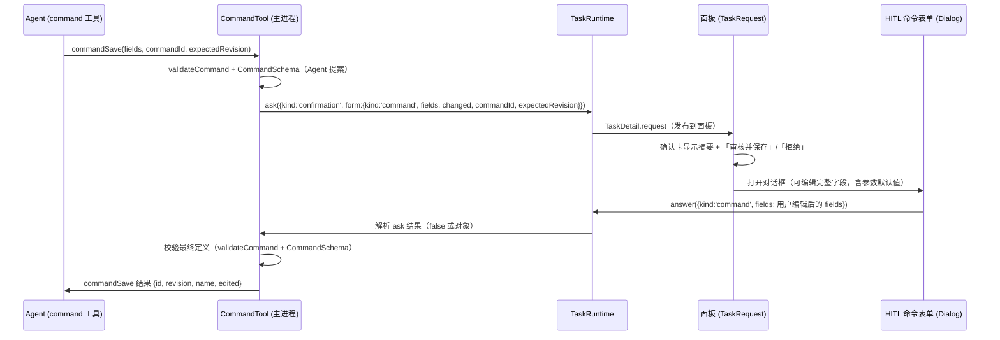

# Agent 创建/更新命令的 HITL 表单（含参数默认值）

Status: Draft - 等待实施授权（本轮为规划）
Created: 2026-09-17
Approval: 未授权实施；本轮仅调查、澄清与出计划

## Summary

用户反馈「ai command 的自定义参数功能无法配置默认值」，澄清后确认：

- 设置里的参数编辑表单本身可配默认值（现状正常）。
- 问题在 **Agent 创建/更新命令的确认界面**：当前只有纯文本确认卡（`title` + `detail` + Allow once / Decline），没有表单，也没有任何默认值控件。
- 期望：Agent 通过 `command` 工具保存命令时弹出 **HITL 表单**，覆盖完整命令字段（名称、说明、指令、输入选项、参数、工具、记忆），用户可在保存前修改参数定义与默认值；创建与更新都要弹表单。

### 现状证据（只读调查，基线 `b9df6e0`，工作树干净）

- Agent 确认由 `CommandTool.save` 发起：`apps/desktop/electron/agent/command-tool.ts:135-143`，`kind: 'confirmation'`，`detail` 为创建全字段文本（`:52-67`）或更新变更摘要（`:84-99`），`options: []`。
- 请求只经主进程事件发给渲染层（`task-runtime.ts:167-192` 写入 `TaskDetail.request`，`bridge.ts:35-40`），渲染层在 `apps/desktop/src/features/agent/task-request.tsx:39-44` 用 `<pre>` 展示 `detail`，回答只有 `false`/`true`（`:72-85`）。
- 权限请求 schema 只有 `id/taskId/runId/kind/title/detail/options`，`additionalProperties: false`：`apps/desktop/electron/agent/task-schema.ts:104-116`。
- 回答 IPC 仅接受字符串或布尔：`apps/desktop/electron/agent/bridge.ts:103-109`、`:167-172`；运行时也据此校验：`task-runtime.ts:194-201`。
- 命令字段与参数默认值本身在 schema 中已完整（`command-schema.ts:18-70`、`:124-136`），设置编辑器与运行表单可配置/预填默认值（`parameter-editor.tsx:272-294`、`command-service.ts:96-100`）。
- 文档中「写入沿用现有权限弹窗逐次确认，确认卡列出创建的全部字段，更新只列出变化的字段」的既有设计（`docs/design-source.md:317`、`docs/plans/2026-09-10-general-agent-requirements.md:168`）需要随本改动更新。

## Clarifying Questions

- [x] Q1（问题位置）：设置参数表单可配，Agent 创建命令的确认界面缺表单与默认值控件。→ 需要给 Agent 命令保存加 HITL 表单。
- [x] Q2（表单范围）：完整命令字段表单（Agent 可写的 7 个字段：name/description/instructions/input/parameters/tools/memory）。
- [x] Q3（更新流程）：创建与更新都弹同一表单（更新使用 Agent 已读到的 revision 作为 expectedRevision）。
- [ ] Q4（实施阶段再确认）：运行时/视觉验收与 Figma 同步是否授权、以何方式进行（本会话无 Figma MCP；按 AGENTS.md 启动应用需单独授权）。

## 目标流程

## File And Code References

主进程契约与管道：

- `apps/desktop/electron/agent/task-schema.ts:104-116` — `PermissionSchema` 增加可选 `form`（命令审阅 payload）。
- `apps/desktop/electron/agent/command-schema.ts:124-136` — `CommandFieldsSchema`（表单编辑对象）；`:157-173` — 结果 schema（`CommandSaveResultSchema` 增加 `edited`）；新增 `CommandReviewSchema`（请求 payload）与 `CommandReviewAnswerSchema`（回答 payload）。
- `apps/desktop/electron/agent/command-tool.ts:40-42`（`parameterLine`）、`:84-99`（`updateDetail`）、`:122-147`（`save`）— 构造表单 payload、处理回答、对最终定义复校、返回 `edited`。
- `apps/desktop/electron/agent/bridge.ts:103-109`、`:167-172` — 回答联合类型加入对象变体并导出 `PermissionAnswer`。
- `apps/desktop/electron/agent/task-runtime.ts:33-36`（pending 类型）、`:167-192`（ask）、`:194-223`（answer 校验）、`:124-140`（worker question 转发守卫）、`:225-231`（dismiss 以 `false` 解析）。
- `apps/desktop/electron/agent/service.ts:132-148`（IPC parse）、`:183-189`（answer 透传）。
- `apps/desktop/electron/agent/native-tools.ts:22-27`、`:84-93` — 仅回调类型对齐（行为不变）。
- `apps/desktop/electron/agent/worker-session.ts:241-250` — 命令回复按 `CommandSaveResultSchema` 解析（新增可选/必填 `edited` 需同步）。

渲染层复用拆分（保持设置页行为不变）：

- `apps/desktop/src/features/commands/parameter-editor.tsx:41-95`（draft/changeType/save 校验）、`:98-316`（字段正文）— 抽出纯字段组件与校验 helper。
- `apps/desktop/src/features/commands/command-editor.tsx:177-252`（参数列表行与动作）— 抽出参数列表。
- `apps/desktop/src/features/commands/input-options.tsx:18-46`、`:72-111` — 抽出不含 shortcut 的输入选项字段。
- `apps/desktop/src/features/commands/run-settings.tsx:90-136` — 抽出工具 + 记忆（`RunBehaviorFields`）；模型策略不进入表单（Agent 不可写）。
- `apps/desktop/src/features/commands/instruction-editor.tsx:14-22`、`:81-98` — 收窄 props 为 `Pick<CommandDefinition,'instructions'|'input'|'parameters'>` + `onChange(instructions)`。
- `apps/desktop/electron/agent/command-validation.ts:78-117` — `validateCommand` 参数收窄为 `Pick<CommandDefinition,'name'|'instructions'|'input'|'parameters'>`，供渲染层复用。
- `apps/desktop/src/features/commands/parameter-field.tsx` — 继续作为参数值控件（命名空间 `commands`，两窗口均已打包）。

渲染层 HITL 表单与接线：

- `apps/desktop/src/features/agent/task-request.tsx:11-93` — 按 `request.form` 分支渲染审阅卡与入口。
- 新文件 `apps/desktop/src/features/commands/command-fields-form.tsx` — 受控的完整命令字段表单（组合上述拆分组件 + 参数编辑对话框）。
- 新文件 `apps/desktop/src/features/agent/command-review-dialog.tsx` — 面板对话框外壳（`Dialog` + `panel-dialog`）、保存/取消、错误展示、answer 提交。
- 对话框先例与样式：`apps/desktop/src/features/agent/task-review-dialog.tsx:36-45`、`agent.css:122-152`；对话框 primitive `packages/ui/src/components/dialog.tsx:42-59`。
- CSS 归属：`.settings-field` 为全局（`apps/desktop/src/styles.css:212-217`）；`commands.css:11-33,90-105` 的表单布局规则被 `@container settings`（`:195-226`）限定，面板不可用，表单布局需由面板样式（`agent.css` 或表单自有样式）拥有。
- i18n：`apps/desktop/src/i18n/locales/{en,zh-CN}/tasks.json`（审阅卡/对话框新文案）、`commands.json`（字段标签、参数错误、「已修改」标记）；两语言键集一致。

测试与现有覆盖：

- `apps/desktop/src/App.test.tsx:108` 仅有 `answer` mock，`detail.request` 固定为 `null`；无 TaskRequest/权限流程测试。本任务不新增测试（用户未要求）。

## Plan Todos

阶段 1 — 主进程契约与权限管道（单写者；先冻结契约再动渲染层）：

- [ ] `command-schema.ts`：新增 `CommandReviewSchema`（`kind:'command'`、`commandId`、`expectedRevision`、`fields: CommandFieldsSchema`、`changed: CommandFieldName[]`）、`CommandReviewAnswerSchema`（`kind:'command'`、`fields`）与 `CommandFieldName` 联合；`CommandSaveResultSchema` 增加 `edited`。
- [ ] `command-tool.ts`：抽出按字段比较的变更列表（复用 `updateDetail` 的现有 7 组比较），构造 `form` payload；回答处理：`false` 拒绝、对象取用户 fields、布尔 `true` 保留为「按提案保存」；对最终定义复跑 `validateCommand` + `parse(CommandSchema)`；返回 `edited`。
- [ ] `task-schema.ts`：`PermissionSchema` 增加可选 `form`（复用 `CommandReviewSchema`，保持 `additionalProperties:false` 的显式成员）。
- [ ] `bridge.ts`：回答联合加入 `CommandReviewAnswerSchema`，导出 `PermissionAnswer`，更新 `AgentBridge.answer` 签名。
- [ ] `task-runtime.ts`：pending/ask 类型改为 `PermissionAnswer`；`answer` 仅允许携带 `form` 的 confirmation 接受对象，`input` 仍限字符串，其余 confirmation 仍限布尔；worker question 转发前守卫对象（按契约不可达）。
- [ ] `native-tools.ts`、`service.ts`：类型对齐（无行为变化）；确认 `worker-session.ts:248` 的 `CommandSaveResultSchema` 解析与新增字段一致。

阶段 2 — 渲染层复用拆分（保持设置页行为与文案不变）：

- [ ] 抽出 `parameter-fields.tsx`（参数定义纯字段 + 本地化校验 helper），`parameter-editor.tsx` 改为页面外壳并继续使用同一 helper。
- [ ] 抽出 `parameter-list.tsx`（列表行、上下移/编辑/删除动作），`command-editor.tsx` 复用之。
- [ ] `input-options.tsx` 拆分：输入来源 + 选项开关可复用，shortcut 仅留在设置页组合中。
- [ ] `run-settings.tsx` 抽出 `RunBehaviorFields`（工具 + 记忆）；模型策略留在设置页。
- [ ] `instruction-editor.tsx` 收窄 props 与 `onChange`；`command-editor.tsx` 相应接线。
- [ ] `command-validation.ts` 收窄 `validateCommand` 入参类型（纯类型改动）。

阶段 3 — HITL 表单与接线（单写者）：

- [ ] 新增 `command-fields-form.tsx`：受控表单覆盖 7 个可写字段；参数列表 + 参数编辑对话框（复用 `parameter-fields`）；`changed` 显示「已修改」标记；保存前跑 `validateCommand` + `CommandFieldsSchema` 校验并就近显示错误。
- [ ] 新增 `command-review-dialog.tsx`：面板对话框（`panel-dialog` 既有形态）、保存/取消、提交 `answer({kind:'command', fields})`、失败内联展示；取消只关闭对话框，请求保持待处理。
- [ ] `task-request.tsx`：`request.form?.kind === 'command'` 时渲染摘要（沿用 `detail`）+「审核并保存」+「拒绝」；拒绝发送 `false`；对话框关闭/成功后随请求消失自动收起。
- [ ] i18n：`tasks.json` 与 `commands.json` 新增文案（en/zh-CN 同步、真实产品翻译、保留插值）。
- [ ] 面板样式：为对话框内表单提供不受 `@container settings` 约束的布局；窄窗（320/420）与短高窗口下可滚动、页脚固定、控件保持 Rhea 尺寸。

阶段 4 — 设计同步与验证：

- [ ] Figma 项目文件同步 HITL 表单与审阅卡（本会话无 Figma MCP，无法执行；需在有工具的会话完成或明确报告未同步范围）。
- [ ] 更新设计记录：`docs/design-source.md:317`、`docs/plans/2026-09-10-general-agent-requirements.md:168` 附近的确认卡描述改为 HITL 表单（随设计同步一起）。
- [ ] 静态检查：`pnpm exec oxfmt` / `pnpm exec oxlint`（改动文件）、`pnpm typecheck`。
- [ ] 现有测试：`pnpm --filter @ai/desktop test`；不新增测试。
- [ ] 运行时/视觉验收（需用户授权）：真实 Agent 会话触发创建与更新两条路径，检查表单编辑默认值、校验错误、拒绝不落库、revision 冲突提示。
- [ ] 复核 diff 与验收标准，报告未执行项与剩余差距。

## Grill-Me Outcome

- Transcript: Not run
- Outcome: Not run
- Summary: 未使用；范围、表单覆盖与创建/更新行为已通过 Q1–Q3 澄清收敛，无剩余需用户裁决的设计问题。

## Build From Plan

- Ready to build: No（等待实施授权；本轮为 plan-only）
- Selected todos: 待定（授权后默认按阶段 1→4 顺序全部执行）
- Execution notes: 阶段 1 的 schema/契约必须先冻结，渲染层与主进程并行会有契约漂移风险；阶段 2/3 共用组件较多，建议按「阶段 2 拆分 → 阶段 3 表单」串行，或按文件所有权分派子代理（每个共享文件单一写者），集成前复核设置页行为不变。运行时验证与 Figma 同步需用户授权/工具后再执行。

## Validation

- `pnpm exec oxfmt <changed-files>` 后逐个检查；`pnpm exec oxlint <changed-files>`（含 350 行上限；`parameter-editor.tsx` 现 329 行，拆分后应下降）。
- `pnpm typecheck`（schema、IPC、组件契约均有类型改动）。
- `pnpm --filter @ai/desktop test`（现有 4 个文件、20 个用例；覆盖 SettingsWindow 深链命令编辑器，用于确认拆分未回归）。
- 主线行为验收（可在具备运行时授权后执行）：Agent 创建命令 → 卡片出现 → 表单改默认值 → 保存 → 运行该命令时默认值预填；Agent 更新命令 → 表单显示「已修改」→ 保存后 revision 递增；拒绝后 store 不变；revision 过期时返回明确错误。
- 未执行（需授权/工具）：Electron 运行时与视觉验收（AGENTS.md 运行时限）、Figma 同步（本会话无 Figma MCP）。

## Risks

- 权限请求 payload 扩大（更新时最多两份 20k 指令 + 字段文本）会随 `TaskDetail` 事件在窗口间传输；需要在实现时确认可接受并避免重复序列化。
- 对象回答只能到达主进程的确认（command 工具）；必须守卫绝不能转发给 worker（`ask_user` 契约保持 `string|boolean`）。
- 用户在表单中编辑期间命令可能被其他窗口改版，保存会命中 revision 冲突；沿用现有错误反馈，Agent 需重新 `commandGet` 再改。
- 共享校验器（`validateCommand`/`parameterError`）仍返回英文；与设置编辑器现状一致，本次不迁移主进程校验文案，报告为已知差距。
- 420×580 面板内承载完整命令表单的密度与滚动体验需要设计核对；设置页的 `@container settings` 规则不适用，必须在面板样式内自行拥有布局。
- 拆分 `command-editor.tsx` / `parameter-editor.tsx` 涉及设置页回归面（参数增删改、指令编辑器、运行设置）；阶段 2 以行为不变为目标并跑现有测试兜底。
- 本会话无法同步 Figma；按 AGENTS.md 需报告未同步范围，并在具备工具时补做。

## Approval

- Status: Draft - 等待用户批准实施（含阶段 1–4 的范围与顺序）
