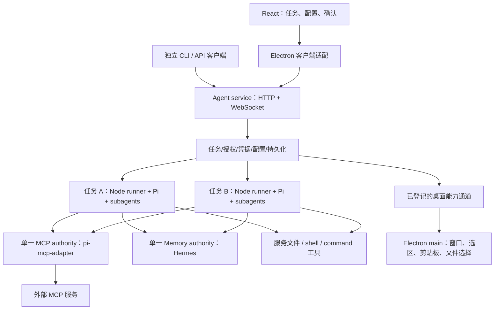

# Pi 生态 Subagent、Skill 与 MCP 集成调研及计划

Status: Research complete — ready for the compatibility and service foundation phase
Created: 2026-09-20
Decision version: 4 — 独立 Agent 服务 + Electron 客户端；允许升级 Pi 相关依赖
Approval: 已授权调研、规划及采用最新 Pi 相关依赖；本轮仍止于先调研，未实施

## Summary

推荐组合是 **Pi SDK 0.86.0 + pi-subagents + Pi 原生 Skills/PackageManager + pi-mcp-adapter**，运行于可独立启动的 Node Agent 服务。Electron 是客户端；服务拥有模型凭据、授权、会话、任务调度、工具执行、Skill、MCP 与持久化。

用户已明确允许 Pi 相关依赖更新到最新版，并决定 Agent 服务不能依赖 Electron 才能运行。旧实现中的 utilityProcess、Electron safeStorage/nativeCall 和单 worker 多父会话只是迁移起点，不再作为选择社区组件的硬约束。此版本覆盖本计划先前的宿主方案。

| 能力           | 推荐复用                                                              | 应用保留的责任                                                   |
| -------------- | --------------------------------------------------------------------- | ---------------------------------------------------------------- |
| Agent 服务内核 | @earendil-works/pi-coding-agent / pi-ai 0.86.0 的公开 SDK             | 独立启动、任务配置、授权、客户端协议与原有业务数据迁移           |
| Subagent       | nicobailon/pi-subagents 0.70.0 的后续兼容稳定版，或该版加明确上游修复 | 服务身份、受控角色/工具、活动限额、任务 UI；不自建委派循环       |
| Skill          | Pi DefaultResourceLoader、loadSkills、DefaultPackageManager           | 托管 profile、版本快照、选择入口、资源权限；不修改 Pi 加载器     |
| MCP            | pi-mcp-adapter 2.34.0 的后续兼容稳定版，或有界宿主补丁                | 单一 MCP authority、认证事务、桌面认证交互、结构化控制与审批归属 |
| 用户记忆       | pi-hermes-memory 0.9.9                                                | 单一服务内存储所有者，保留现有无项目与读写策略                   |
| 服务传输       | Fastify 5.12.5 + @fastify/websocket 11.3.1 / ws 8.21.3                | 业务 DTO、鉴权、请求幂等与重连恢复；不实现 HTTP/WS 协议          |

**当前不能称为开箱可用。** Pi 0.86.0 已发布，但两个首选扩展的 npm 最新版本尚未包含全部 0.86 适配。实施第一步必须通过下文 G1–G4 兼容门，再扩大集成。优先升级到包含已核实修复的稳定版本；没有新版时承接小范围上游修复，不以此为理由重写子代理或 MCP 引擎。

调研依据包括现有代码、只读上游 checkout、npm 发布元数据/包内容以及官方源码。以下版本为 2026-09-20 快照，实施时重新解析 latest 并固定精确版本，不能在运行时动态安装 latest。

## 业务适配与范围

依据[通用 Agent 需求](/Users/zen/Documents/ZProject/ai/docs/plans/2026-09-10-general-agent-requirements.md:27)与当前代码，产品继续以任务、AI Command、用户记忆为核心，不引入项目实体。旧文档的全局单活动任务描述已过时：[RunDispatcher](/Users/zen/Documents/ZProject/ai/apps/desktop/electron/agent/run-dispatcher.ts:13)已经并行启动不同任务。

| 业务场景                 | 接入方式                                       | 用户可见结果                                                |
| ------------------------ | ---------------------------------------------- | ----------------------------------------------------------- |
| 翻译、润色、固定格式输出 | 显式选择 Skill，或在 Command 上保存 Skill 引用 | 使用的技能可见；文本命令无需自动获得文件或 shell 权限       |
| 多份会议材料、分角度分析 | 主会话委派有界的单个/并行/串行子任务           | 原任务内查看子任务进度、结果、失败与停止                    |
| 外部知识和业务工具       | 配置 MCP，认证后选择工具、资源或提示词         | 显示真实服务/操作，资源附带来源，提示词提交前可预览         |
| Electron 关闭后继续任务  | Agent 服务持续运行，客户端重新连接             | 恢复运行状态、输出和待确认事项，无重复执行                  |
| 无桌面环境运行           | CLI/API 直接使用相同 Agent 服务                | 普通 Agent、Skill、MCP 可以工作；桌面专属能力明确显示不可用 |

首轮子代理开放 native foreground single，以及服务注册的 parallel/chain 命名 workflow；这里 foreground 指父会话等待子结果，服务仍可在 Electron 关闭后继续运行。detached 子 runner、递归子委派及通用可执行扩展市场不属于首轮入口。它们的身份和数据边界沿用同一模型，开启前补齐相应准入与恢复验证。服务独立不等于本轮建设多租户 SaaS 或公网部署。

## 版本与升级门

| 依赖                                    | 当前项目         | 调研时最新稳定版            | 处理                                                        |
| --------------------------------------- | ---------------- | --------------------------- | ----------------------------------------------------------- |
| @earendil-works/pi-ai / pi-coding-agent | 0.85.1           | 0.86.0；2026-09-19 UTC 发布 | 允许升级；直接使用的 pi-agent-core 也固定同版本             |
| pi-hermes-memory                        | 0.9.8 + 项目补丁 | 0.9.9；2026-09-13           | 迁移现有业务适配，重新判断 Electron 专属补丁                |
| jiti                                    | 2.7.0            | 2.7.0                       | 已是最新版，用于上游 TS 扩展入口                            |
| pi-subagents                            | 未安装           | 0.70.0；2026-09-20          | G1 核实后使用；npm 包不等于 main 的 0.86 支持               |
| pi-mcp-adapter                          | 未安装           | 2.34.0；2026-09-14          | G2 核实后使用；当前 peer 不包含 0.86                        |
| MCP client/core                         | 没有直接集成     | 2.0.0                       | adapter 已使用该稳定线；应用直接引用其 API 时再声明直接依赖 |
| skills CLI（可选）                      | 未安装           | 1.7.0；2026-09-17           | 仅用于普通 Skill 仓库获取，不代替运行加载器                 |

- **G1 / Subagent：** npm 0.70.0 对应 b72714d，发布时 CI 使用 Pi 0.85.1。之后 main 的 #2349 更新真实 Pi 0.86 CI，#2352 修复子会话 SDK bare import 的解析问题。选择包含这些修复的稳定版；若尚未发布，将相应运行修复固定为 pnpm patch 并验证安装包运行，不使用浮动 Git main。[已核对的差异](https://github.com/nicobailon/pi-subagents/compare/v0.70.0...7c98a69694e14cb9e1c81dd4c7a11a017d756aea)、[上游 0.86 CI](https://github.com/nicobailon/pi-subagents/actions/runs/35494008343)
- **G1 的资源宿主补充：** 0.70 child factory 直接 SettingsManager.create(launch.cwd, agentDir)，没有传父会话 projectTrusted:false；Pi 默认仍可向上发现 .agents。仅隔离 HOME 或改变 cwd 不能证明 child 资源受控。为该扩展增加窄的 managed-settings 选项，在创建 child SettingsManager 前传 projectTrusted:false，并强制 noContextFiles 与明确的 system/append prompt；默认值保留上游行为，服务模式显式启用。这是 subagent 宿主适配，不修改 Pi loader。[child 创建位置](https://github.com/nicobailon/pi-subagents/blob/v0.70.0/src/runs/shared/child-session.ts#L263)、[Pi ancestor discovery](https://github.com/earendil-works/pi/blob/v0.86.0/packages/coding-agent/src/core/package-manager.ts#L2397)
- **G2 / MCP：** 2.34.0 的 peer 为 ^0.84.1 或 ^0.85.0；HEAD 199b4daaf708bd49e0bab9141255c3cb10f50a58 已增加 ^0.86.0，但尚非新的 npm 稳定版。peer 放宽只是安装声明，服务宿主适配仍需下面的运行验收。[发布包](https://www.npmjs.com/package/pi-mcp-adapter/v/2.34.0)、[已核对 HEAD](https://github.com/nicobailon/pi-mcp-adapter/tree/199b4daaf708bd49e0bab9141255c3cb10f50a58)
- **G3 / Pi：** 0.86 的 TranscriptContext、JSON-compatible ToolCall arguments/details、system message role、usage SessionEntry 会影响现有转录投影及穷尽分支。应用当前替换的是 provider auth resolver，没有自己实现 streamFn，不能把上游所有 provider 迁移都算成本项目改动。显式设置 cacheWarming: off 保持当前调用节奏；新版默认 streaming，之后若启用再单独呈现行为。[0.86 发布](https://github.com/earendil-works/pi/releases/tag/v0.86.0)、[设置源码](https://github.com/earendil-works/pi/blob/v0.86.0/packages/coding-agent/src/core/settings-manager.ts)
- **G4 / Hermes：** 0.9.9 仍没有本项目 createDesktopMemory 入口。现有补丁的修改上下文在新发布包中均能文本匹配，但这不是 patch apply、数据库迁移或运行成功的证明。保留无项目、读写策略和单一记忆所有者；将宿主接口迁往 service 后重新裁剪 Electron ABI/CLI 限制。[0.9.9 源码](https://github.com/chandra447/pi-hermes-memory/tree/v0.9.9)、[当前补丁](/Users/zen/Documents/ZProject/ai/patches/pi-hermes-memory@0.9.8.patch)

Pi 0.86 要求 Node ≥22.19，当前项目 Node 范围为 ^24.15.0 或 ≥26.0.0，满足要求。服务独立提供明确的 Node 运行入口；Electron 的可执行文件不能被当成 Node。TypeBox 从当前 1.3.7 升级时先对齐 Pi 使用的 1.3.27 或经检查的更新版本，不对无关依赖做整仓升级。[根配置](/Users/zen/Documents/ZProject/ai/package.json)、[Pi npm 元数据](https://registry.npmjs.org/@earendil-works/pi-coding-agent/0.86.0)

## 生态取舍

### 服务底座

| 候选                                | 已核实能力与限制                                                                                                                                | 选择                                                                                                 |
| ----------------------------------- | ----------------------------------------------------------------------------------------------------------------------------------------------- | ---------------------------------------------------------------------------------------------------- |
| Pi 稳定 SDK 0.86                    | 公开 SessionManager、AgentSession、模型/工具/扩展装配；现有应用已采用                                                                           | **作为内核**，移出 Electron                                                                          |
| Pi 官方 experimental remote harness | server/client 仅源码开发模式提供；相关子路径仅 source condition，未随 npm/独立二进制发布                                                        | 不作为本轮可发布的服务依赖                                                                           |
| @jmfederico/pi-web 1.202609.0       | MIT，9 月 5 日；独立 sessiond + Web API、重连、用户服务；公开 server plugin 主要是 workspace provider；假设受信任代码目录，没有任务工具权限系统 | 最接近的成品参考；采用它仍需替换核心会话/授权契约并引入 project/workspace、Lit、终端及代码编辑器依赖 |
| pi-forge 1.4.6                      | MIT，6 月 24 日；Fastify/REST/SSE/SDK；npm 固定 Pi 0.79.10，无独立服务核心 exports                                                              | 源码与架构参考，不作为待升级的另一整套应用底座                                                       |
| @marcfargas/pi-server 0.2.0         | MIT，2 月 13 日；可导入的 WS/RPC relay；alpha，认证列在未来项，围绕单个 PiProcess                                                               | 不能省下本项目任务模型、认证和多会话管理                                                             |
| @earendil-works/pi-durable 0.86     | 发布 API 目前是 record contracts 与 MemoryStorage                                                                                               | 不能因为名字就当作已有持久任务引擎；保持 Pi JSONL 与本项目任务存储                                   |
| @earendil-works/chord 0.86          | 服务组合、facets、复制状态与 remote bindings 已公开；外层 transport/framing/routing 仍由应用提供                                                | 本轮无需再叠一套插件/状态协议；不把它误报为完整远程服务器                                            |

证据：[官方发布边界](https://pi.dev/docs/latest/development)、[Pi Web 发布源码与产品模型](https://github.com/jmfederico/pi-web/tree/be910b30556808a711b212d03afeacb6cd2feab6)、[Pi Web server API](https://github.com/jmfederico/pi-web/blob/be910b30556808a711b212d03afeacb6cd2feab6/src/server-plugin-api.ts)、[Pi Forge 架构](https://devin-marks.github.io/pi-forge/docs/architecture.html)、[pi-server](https://github.com/marcfargas/pi-server/tree/7c508c881ab37b79cfceef63d2d42f059defeee4)、[durable 发布 API](https://github.com/earendil-works/pi/blob/v0.86.0/packages/durable/src/index.ts)、[Chord 责任范围](https://github.com/earendil-works/pi/blob/v0.86.0/packages/chord/README.md)。

这是选用 SDK 加必要业务服务层的依据。HTTP 路由、生命周期与 WebSocket 复用 [Fastify](https://fastify.dev/docs/latest/Reference/Server/) 和[官方 WebSocket 插件](https://github.com/fastify/fastify-websocket)，不复制第三方整套应用，也不自写网络协议实现。

### Subagent

| 候选                             | 优点                                                                                                  | 本项目判断                                                                            |
| -------------------------------- | ----------------------------------------------------------------------------------------------------- | ------------------------------------------------------------------------------------- |
| pi-subagents 0.70.0 / 后续兼容版 | single、命名 workflow 的并行/串行、前后台、状态、取消、结果、能力 ceiling 与 required-child-extension | **首选**；每父任务独立进程适配其生命周期，公开能力最充分                              |
| @gotgenes/pi-subagents 21.7.3    | 9 月 18 日，MIT；进程内 typed service                                                                 | 可用的轻量备选；进程级单例在新架构不再是直接否决理由，但共享工厂/宿主接口较少         |
| @tintinweb/pi-subagents 0.19.0   | 8 月 27 日，MIT；进程内、恢复、嵌套                                                                   | 子代理默认不继承父权限，嵌套不计入同一并发池，需要更多能力治理                        |
| @narumitw/pi-subagents 3.0.2     | 9 月 20 日，MIT；零运行依赖、RPC 子进程                                                               | 新架构已可使用其服务端凭据；但 v3 不继承父扩展 provider，所需受控工具组合不如首选直接 |
| Pi 官方示例 / SDK 自建           | 自由装配会话                                                                                          | 保留底层能力与应急参照，不再作为首选自建委派器                                        |
| pi-agent-core/experimental/pico3 | 0.86 的公开实验 API 可创建父工具拥有的子 conversation，并传播 abort                                   | 有真实子会话能力；与 coding-agent 扩展/Hermes 装配不同，不在本轮同时更换运行内核      |

nicobailon 的 required-child-extension 通过真实模块路径追加受控 provider/工具，前后台、嵌套和恢复会保留。使用不可变的托管配置，agent extensions 为空以排除 ambient 扩展，再追加必须加载的服务桥；不设置与 required extension 冲突的 denyExtensions: true。ceiling 对工具/agent 名取交集，不能替代路径、凭据、目录信任或 OS 沙箱。[公开契约](https://github.com/nicobailon/pi-subagents/blob/v0.70.0/docs/extension-api.md)、[required extensions](https://github.com/nicobailon/pi-subagents/blob/v0.70.0/src/shared/required-child-extensions.ts)

其模块级子会话清理在旧“一个进程多个父会话”中有互相影响风险；每个父任务一个 Node runner 后，清理只影响该任务树。结果通知文件会被消费/删除，部分输出保留有 TTL，业务历史必须及时接收其结构化事件和 session 引用，不能把临时文件当永久数据库。[child factory](https://github.com/nicobailon/pi-subagents/blob/v0.70.0/src/runs/shared/child-session.ts)、[shutdown](https://github.com/nicobailon/pi-subagents/blob/v0.70.0/src/extension/index.ts)

公开 lifecycle 是通知，control 是启动后的控制，preflight 不是所有路径都必经的可等待准入钩子。因此首轮限制为受控 foreground 委派；未来若开放任意后台/嵌套，须增加共享 child launch 与 detached spawn 的准入接口。不能用 before_agent_start 等事件中抛异常来保证阻止模型调用，Pi 会捕获部分 handler 错误；工具阻断使用明确的 tool_call block 结果。[Pi runner](https://github.com/earendil-works/pi/blob/v0.86.0/packages/coding-agent/src/core/extensions/runner.ts)

其他证据：[gotgenes](https://github.com/gotgenes/pi-packages/tree/pi-subagents-v21.7.3/packages/pi-subagents)、[tintin](https://github.com/tintinweb/pi-subagents/tree/v0.19.0)、[narumitw v3](https://github.com/narumiruna/pi-extensions/tree/76f42aeaec16aabc98af2b50ae5261e62e1c7935/packages/pi-subagents)。

### Skill

采用 Pi 内置发现、description 注入、按需读取、显式 /skill:name、诊断与包管理。运行解析没有独立第三方依赖；0.85.1 与 0.86 的 skills/resource-loader/package-manager 核心来源已对照，相关能力仍可复用。[Skills](https://github.com/earendil-works/pi/blob/v0.86.0/packages/coding-agent/src/core/skills.ts)、[PackageManager](https://github.com/earendil-works/pi/blob/v0.86.0/packages/coding-agent/src/core/package-manager.ts)

**无需 explicit-only Pi 补丁。父会话直接使用公开 SDK 选项；第三方 child factory 的选项传递由 G1 的有界扩展补丁补齐。** 专用服务/runner 启动环境使默认发现落在受控 profile；SDK 从首次读取开始使用 projectTrusted: false，继续关闭 context files。具体边界见 D5。普通 Skill 获取可选 [skills 1.7.0 CLI](https://github.com/vercel-labs/skills/releases/tag/v1.7.0)，它没有公开 JS SDK，不能把 CLI JSON 输出当完整 catalog API。OpenSkills 的 AGENTS.md 同步与 shell 读取重复 Pi 能力，本轮不引入。[OpenSkills](https://github.com/numman-ali/openskills)

Skill 的 allowed-tools 元数据不是授权；Pi 不负责执行这条权限策略。服务决定实际工具清单、只读资源和脚本执行权限。Skill 的许可证由其来源决定，安装器的 MIT 许可不代表所有技能内容也是 MIT。

### MCP

| 候选                               | 当前能力                                                                               | 新架构结论                                                                                                    |
| ---------------------------------- | -------------------------------------------------------------------------------------- | ------------------------------------------------------------------------------------------------------------- |
| pi-mcp-adapter 2.34.0 / 后续兼容版 | stdio/HTTP/SSE、懒连接、搜索/缓存、直接工具、资源、prompts、OAuth、审批事件、配置快照  | **首选**，集中运行于服务 MCP authority，保留其协议与连接实现                                                  |
| mcporter 0.13.13                   | MIT，9 月 14 日，Node ≥24；公开 createRuntime、连接池、跨进程 refresh transaction lock | 如果最终必须让多个 runner 直接持有同一 MCP 凭据，则更有优势；当前单一 authority 不需要其额外 CLI/codegen 面积 |
| 官方 client/core 2.0.0             | 完整 typed MCP、异步认证、原始资源/提示词、取消与进度                                  | 用于首选组件的有界宿主适配与必要直接类型；成品适配失败后才评估直接集成                                        |

新架构下，adapter 自行持有 OAuth 或原生 keyring 是合理职责，不再构成否决原因。使用 createMcpAdapter({config}) 的完整配置快照，避免 configPath 合并用户环境。它的公共 mcp gateway 以及 AgentSession.extensionRunner.getToolDefinition/createContext 可供服务控制，不需要向模型发送管理指令。[配置与选项](https://github.com/nicobailon/pi-mcp-adapter/blob/v2.34.0/types.ts)、[SDK session](https://github.com/earendil-works/pi/blob/v0.86.0/packages/coding-agent/src/core/agent-session.ts)、[extension runner](https://github.com/earendil-works/pi/blob/v0.86.0/packages/coding-agent/src/core/extensions/runner.ts)

仍需明确的有界适配，不能宣称只传配置就全部完成：

- OAuth：HTTPS redirect 的手工 auth-start/auth-complete 已有，但仍尝试服务端 openBrowser。增加主机回调，将认证 URL 交给客户端；服务拥有 state、回调验证与令牌。无 Electron 时可由 CLI 展示 URL 并提交完整 redirect。
- 并发：单一 authority 消除跨进程 token cache 过期，但不自动解决同进程多个 401。序列化 credential transaction，覆盖 transport 未授权、auth-start/complete、显式刷新及退出；用户等待不占事务锁。不要只包 tool call，因为初始化、keep-alive、通知与 HTTP 重连也会发起认证。
- 控制：公开 gateway 可处理状态、搜索、连接与认证。原始 resource/template/prompt 内容增加 typed facade，直接复用 adapter 已有 Client；不建另一套连接池。保留文本、blob、MIME、messages 与来源，不只返回面向 TUI 的文本。
- 审批与进度：外层执行上下文携带 task/run/execution/operation，claim 审批事件并逐次返回 allow_once/deny；不能使用共享 control session 的 allow_for_session。直调 ToolDefinition 绕过 Pi 的工具 schema/event 包装，因此宿主执行器承担参数验证和审计；onUpdate/progress 的传递也需明确补齐。

证据：[认证实现](https://github.com/nicobailon/pi-mcp-adapter/blob/v2.34.0/mcp-auth.ts)、[初始化](https://github.com/nicobailon/pi-mcp-adapter/blob/v2.34.0/init.ts)、[direct tools](https://github.com/nicobailon/pi-mcp-adapter/blob/v2.34.0/direct-tools.ts)、[prompts](https://github.com/nicobailon/pi-mcp-adapter/blob/v2.34.0/prompts.ts)、[MCPorter runtime](https://github.com/openclaw/mcporter/blob/v0.13.13/src/runtime.ts)、[MCPorter refresh](https://github.com/openclaw/mcporter/blob/v0.13.13/src/oauth-token-refresh.ts)。

SDK 2.0 提供最小 AuthProvider 的 token/onUnauthorized 和 auth 协议函数，适配认证事务时继续由 SDK 做 discovery、PKCE、换码和刷新。若使用该最小 provider 路径，403 scope step-up 转为明确的重新认证状态，不默默重放工具；保留 challenge 给认证控制入口。若要保留 SDK 自动 step-up，需额外的 auth 执行钩子，不能假定单个 adapter callback 已覆盖。[官方认证契约](https://github.com/modelcontextprotocol/typescript-sdk/blob/cc4b41617ce3601b1290d67216ea0b194a3cd9ac/docs/clients/oauth.md)

adapter 为 MIT；client/core 2.0 的 npm 元数据仍标 MIT，但实际 LICENSE 区分既有 MIT 与新增 Apache-2.0 贡献，发布时保留实际许可文本。[SDK LICENSE](https://github.com/modelcontextprotocol/typescript-sdk/blob/cc4b41617ce3601b1290d67216ea0b194a3cd9ac/LICENSE)

## 集成架构与共同契约

以下 D1–D8 是根协调者综合研究后的实施建议，用户可直接编辑。独立服务、Electron 客户端及升级许可是已明确决定；具体限额和协议细节是本计划选择。

### D1 · 服务边界与启动/退出

- 新增独立 workspace 应用 apps/agent-service，公开 serve/status/stop CLI 与可导入入口。其运行依赖不得导入 electron，不调用 app.getPath，不使用 utilityProcess。Electron 安装包可附带服务与 Node，服务本身也能以独立发布包运行。
- service 的 dataDir/config/listen/logging 由 CLI/配置决定，显式 AI_AGENT_DATA_DIR 优先；默认使用独立的用户服务目录。路径在启动器解析后传入，不能从被隔离的 HOME 再推导真实用户目录。每 dataDir 只有一个 owner，保存 serviceId、协议版本和 endpoint 元数据。
- 默认仅绑定 loopback，端口由配置或系统分配后写回 endpoint；不是复用 renderer 的 5173。连接先校验服务身份和版本。启动/配对用本地受限权限的凭据文件或既有认证通道，renderer 不拿长期 service token。
- 可从终端/用户服务管理器启动；Electron 可提供“启动本机服务”动作，调用同一 launcher。Electron 退出只断开客户端，不能默认停止服务或任务。显式停止服务才进入 draining：停止接受新 run，取消所拥有的任务树与 pending operations，flush 状态/记忆，关闭连接与子进程。
- 断客户端不取消普通执行；需要用户确认/桌面能力的操作进入 waiting 状态并持久化。服务崩溃后重新启动，从 ledger 与 Pi JSONL 恢复状态，失去结果的执行标记 interrupted/unknown，不自动重放写操作。正常恢复旧会话不等于恢复崩溃中那次工具调用。
- 第一阶段提供前台 CLI 可验证独立启动；系统登录启动/安装器按平台部署步骤实现，不以“只能被 Electron 拉起”作为最终交付。

### D2 · 接口、流与重连

- 新增 packages/agent-contracts，拥有 TypeBox 运行时 schema 与 DTO；packages/agent-client 负责服务客户端。Electron preload 继续窄 typed bridge，main 只做连接/桌面 API 适配，React 使用统一任务状态。
- HTTP 承载 task/command/provider/skill/profile/MCP 管理、run 接受/取消、确认答复、资源上传；WebSocket 承载任务事件、连接状态、待确认及 desktop capability request/result。Fastify/WS 负责传输实现；二进制文件不塞进无界 JSON 消息。
- 接受操作包含 operationId，服务先持久记录再启动，重复提交返回同一 run。响应带 serviceId、protocolVersion；事件带 serviceEpoch、seq、taskId、runId、executionId、type。executionId 表示根或子执行，不用显示名关联记录。
- 客户端订阅提交已知 epoch/seq；同一 epoch 重放有界事件缓存，缺口或服务重启返回 snapshot，再接新事件。snapshot 包括任务/子任务状态、Pi 正文投影、资源引用与仍有效的待确认。慢客户端超出缓冲后重新取 snapshot，不无限占内存。
- 服务是状态权威，客户端不从断线推断任务完成/失败。答复必须匹配仍有效的 requestId、revision、client capability 与 task/run；已取消/过期请求拒绝迟到答复。
- 鉴权同时覆盖管理、任务正文、流与能力回调；限制 Origin/Host 与消息大小。远程连接使用显式配置的受信任 TLS 地址，不因提供 WebSocket 就自动开放公网。

### D3 · 数据、凭据与迁移

- 服务拥有 task ledger、命令、权限规则、provider/MCP 配置、资源包、Pi sessions 与 memory。Electron 只保存客户端 UI/窗口/连接偏好。Pi JSONL 仍是会话正文来源；ledger 保存运行/父子关系/最终状态和引用，不复制另一套消息库。
- 根/子会话使用不同 sessionId、sessionFile、输出目录；保存 rootTaskId、parentExecutionId、profile revision、capability snapshot 和结果引用。父任务 UI 聚合活动，父模型只收到明确的子结果，不拼接无界完整历史。
- 模型 CredentialStore 移到服务，延续现有按 connection/config revision 管理及 modify 事务；runner 经服务内部凭据/授权通道使用模型，不再调用 Electron 解密。子进程的公开扩展模块可以使用同一服务契约。
- Node 凭据后端优先复用 @napi-rs/keyring 2.1.0 的 AsyncEntry，命名空间含 serviceId/connectionId；Linux 持久凭据明确选 secret-service，不能把 keyutils 内存回退误报为跨重启存储。无持久后端时服务仍可运行，并接受显式注入的临时凭据；依赖持久 OAuth 的连接显示配置未完成。MCP 默认复用 adapter 存储，按服务身份构造稳定唯一的 server key。[原生库 API](https://github.com/Brooooooklyn/keyring-node)
- 旧 safeStorage 密文只由原 Electron 环境解密一次，通过已认证的服务通道写入服务凭据库；不落明文临时文件。迁移标记包含来源版本/连接身份，校验可读取且模型连接成功后完成。保留旧密文供回退；无法解密时提示重新连接，不要求服务日后仍依赖 Electron。
- 任务/命令/资源/JSONL/记忆迁移先暂停旧执行并 flush，由明确的 migration 操作导入到独立 dataDir；版本化清单和内容校验保证重试幂等。Memory SQLite 与 Markdown 必须一致地复制/备份，不能在 WAL 仍写入时只复制主数据库文件。
- 迁移成功后新任务只写 service dataDir；失败保留旧数据并返回具体步骤，不清空配置。回退到旧应用前先停止新服务的写入，不允许两个宿主同时写同一套数据。

### D4 · Subagent 与权限

- 每个活动父任务一个 Node runner，其中装配 Pi 主会话及 nicobailon 扩展；一个 runner 不持有其他父任务。服务调度活动根任务，空闲 runner 可释放，重开从同一会话恢复。
- 首轮最多 2 个活动父任务、每父最多 3 个 foreground children，每父同时只允许一个 foreground workflow。上界是 2 个父会话 + 6 个子会话，不是全服务模型请求配额；Hermes 后台请求、重试等另受服务 provider 边界治理。
- 0.70 的公开 schema 已不含旧 tasks/chain/parallel 参数。通过 registerWorkflowResource 注册 parallel/chain 命名模板，复用 runs.all 与顺序 await runs.run；验证后的任务文本作为 JSON 数据传入，每个 child 固定 async:false。命名资源 args 有 16 KiB 上限，大材料使用受控资源引用。禁止任意 workflowScript/workflowScriptPath、resume、external runner 和 capacity overrides。[公开 workflow API](https://github.com/nicobailon/pi-subagents/blob/v0.70.0/docs/workflows.md#L146)
- managed config 固定 asyncByDefault:false、forceTopLevelAsync:false、globalConcurrencyLimit:3、maxSubagentDepth:1、scheduledRuns.enabled:false、intercomBridge.mode:off、proactiveSkillSubagents:false、missions.enabled:false，并且不配置 detach shortcut；库的调度、mission 和配置管理操作不在活动工具清单内。外层和所有 child 都显式 async:false；workflow 不会继承外层 async，不能省略子参数。保留库的 foreground dispatch guard，服务也串行提交父 workflow。[async 继承](https://github.com/nicobailon/pi-subagents/blob/v0.70.0/src/runs/foreground/subagent-executor.ts#L6003)、[dispatch guard](https://github.com/nicobailon/pi-subagents/blob/v0.70.0/src/runs/foreground/subagent-executor.ts#L7456)
- 普通输入始终 expandPromptTemplates:false，避免模型/用户文本触发 extension slash 管理或 detach 命令；显式 Skill 入口按 D5 解析。前台源码中的 detach 来自 intercom 或显式 detach，这两条均关闭；G1 仍需验证安装后的实际行为。
- 受控 agentScope 为服务 user profile，禁执行目录角色覆盖与用户提供的 extensions/cwd/model/tools 等越权 overrides。会话加载 cwd 使用服务管理的 profile，业务文件操作使用独立输出基目录；不因模型写入某个 .pi 目录而使它变成受信任配置。
- required extension 注册 root/task/session 身份并接入服务 provider、policy、MCP、memory 与工具代理；缺少身份或受控模块加载失败则启动失败。服务将库的 run/sessionFile/事件关联为 executionId，不假定 required extension API 自带完整父子身份。
- 子能力 = 父 run 快照 ∩ 角色允许能力 ∩ 服务当前撤销状态。ceiling 控制名称，服务实际执行边界验证路径、连接、操作及资源归属。Skill、MCP annotations 和 profile 文案不能授予能力。
- 首轮 child 不获得再次委派/修改角色与配置的工具。工具调用通过明确 block 结果与服务执行检查阻断；provider hooks 中 throw 不能作为安全边界。
- 子执行独立输出并返回结果；不并行修改相同用户文件。父停止先标记 stopping、禁止新启动，再调用 parent abort / foreground interrupt 并清理其审批和操作，等待终态后写 ledger；不调用仅适用于 async run 的 action:stop。取消不能保证已经完成的远程副作用被撤回。
- 子代理默认可搜索同一用户记忆，不自动学习；主会话按当前策略决定是否写入。角色配置不创建另一个记忆库。

### D5 · Skill 与包资源

- launcher 仅给专用子进程设置 HOME、PI_CODING_AGENT_DIR，Windows 同时设置 USERPROFILE；这些值都落在服务目录，不改系统/用户 shell 环境。父 SDK 使用 SettingsManager.create 或 inMemory 的 projectTrusted: false，子会话由 G1 的扩展选项传递同一设置；从第一次读取起排除任务 cwd 的项目设置/默认资源。[SettingsManager](https://github.com/earendil-works/pi/blob/v0.86.0/packages/coding-agent/src/core/settings-manager.ts#L353)
- noContextFiles: true 仍必需，context 文件扫描并不受 projectTrusted 控制；提供明确 systemPrompt 与 appendSystemPrompt: []。正常 DefaultResourceLoader 保留工厂、诊断与冲突处理。[加载器](https://github.com/earendil-works/pi/blob/v0.86.0/packages/coding-agent/src/core/resource-loader.ts#L515)
- 包管理复用 DefaultPackageManager 的服务 user scope，在暂存 generation 内安装/更新，成功后发布不可变 revision；运行只接收已存在的托管绝对入口。npm prefix/userconfig/globalconfig 也限定到服务 profile，避免 missing package 时回退 npm root -g。[全局回退](https://github.com/earendil-works/pi/blob/v0.86.0/packages/coding-agent/src/core/package-manager.ts#L2085)
- 本地导入、Pi npm/Git package 管理使用同一目录。每包保存来源、revision、hash、许可与解析诊断；验证 symlink realpath 属于允许包范围。通用 Skill 仓库可选固定 skills CLI 的 add --json --yes --agent pi --copy，在暂存 cwd 运行；Git 来源明确依赖 Git。
- run 冻结 SkillRef；更新在下一 run 生效，旧版本在引用释放后回收。禁在活动会话上用 reload 假装只是刷新技能列表，因为它会关闭和重建扩展。
- 显式选择使用内置 /skill 展开，先校验引用与快照，再针对该入口启用展开；普通输入保留现有模板规则。自动发现只呈现本 run 可用说明；disable-model-invocation 保留上游语义。
- 引入实际工具目录后，文本 Skill 不自动开启 read/bash；需要脚本的 Skill 显示所需能力并按服务授权执行。正文、references、assets 有只读资源映射，安装声明或正文不能授权写用户文件。

### D6 · MCP authority 与认证

- 一个服务 profile 只有一个 MCP authority，承载单个仅做工具控制的 Pi session，加载 adapter 并 bindExtensions 初始化。父/子 runner 只注册工具代理，通过服务调用其公开 mcp ToolDefinition；不在每个父 runner 中再次实例化同凭据 adapter。
- control session 禁模型执行权限、sampling:false、autoAuth:false、cacheWarming:off。adapter 的 OAuth watcher/MCP Apps 可能 sendMessage({triggerTurn:true})，因此 host patch 必须把 message/intent 转服务事件；仅“不调用 prompt”不足以证明零模型请求。MCP_UI_VIEWER=none 只抑制窗口，不等于禁 Apps 服务；首轮不开放 MCP Apps 入口，相关回调也不得触发 control session 模型循环。[triggerTurn 来源](https://github.com/nicobailon/pi-mcp-adapter/blob/v2.34.0/ui-session.ts#L341)
- 所有 adapter Client、token cache、状态与连接在 authority，connectionId/configRevision 区分配置；复用连接的 key 还包含 credential principal 与执行 cwd/env scope。不同任务若需要服务器内存或 stdio 环境隔离，建立不同连接身份。工具/资源目录变更形成新 revision；现有 run 不因此获得新能力。停用或撤销立即拒绝新调用并取消可取消请求。
- authority 的 execute 外层绑定 operation/task/run/execution 上下文，校验输入、生成审计与工具事件，并传递 AbortSignal；审批事件始终由服务 claim，不能退回共享 session 缓存授权。
- credential transaction 锁按身份，覆盖 transport onUnauthorized 与所有显式 auth 控制路径；初始化/HTTP reconnect/keep-alive 也必须走同一 seam。锁仅包令牌读取/刷新/交换/提交，认证页面等待和一般工具执行不占锁。排队可取消，已开始的事务真正 settle 后释放；提交检查 revision，退出后禁止迟到写回。SDK onUnauthorized 回调不自带请求 signal，必须明确区分 invocation signal 与 authority 生命周期 signal，不能复用过期任务上下文。
- 连接状态为 disabled/disconnected/connecting/auth_required/ready/error/closing。认证 URL 由服务事件发给桌面或 CLI；OAuth state/PKCE/令牌处理在服务。HTTPS 手工 redirect 可独立使用，loopback flow 是否可用取决于浏览器和 service 的实际位置。
- tools/resources/resourceTemplates/prompts 使用一个 typed control facade；复用 adapter Client 的列表、读取与 getPrompt，保留原始类型。prompt 在用户预览后转为输入，不提升为系统指令；不支持显示的媒体保存为有类型附件并说明限制。
- 工具结果进入 Pi transcript，图片/文件接入资源服务；adapter 临时输出路径转为 service artifactId，不向远程客户端返回不可访问的本地路径。资源链接不隐式下载或执行。MCP gateway 的复合调用仍按具体 connection/tool/URI 授权，不能因为外层名字只有 mcp 就授予全服务器能力。
- 配置显式 stdio executable/args/env 与 HTTP URL。内置服务携带运行时；外部 Node/Python 缺失返回诊断，不暗中依赖全局 pi/npx。新 HTTP 连接优先 Streamable HTTP，遗留 SSE 明确选择。
- authority 关闭时调用 adapter 生命周期释放客户端/子服务。连接恢复只重新发现状态，不自动重放结果未知的写调用；不声明尚未实现的 sampling/elicitation/roots 等可选能力。

### D7 · Memory authority 与桌面能力

- Hermes Store/DatabaseManager 只在 service Memory authority 实例化。runner 的 memory tools 是代理；根会话的学习/flush 通知传给 authority，authority 用该根会话 JSONL 和当前 policy revision 调用现有 Hermes 功能。调整现有 host patch 暴露这些操作，不为每个 runner 新建会竞争写入的 store。
- 保留 canRead/canLearn、写入前 policy 检查、失败与用户记忆范围；子执行不能触发独立自动学习。命令材料不误学为个人偏好。服务负责 flush/close 与迁移，Electron 记忆页只是管理客户端。
- Electron main 仅提供 window/shortcut/selection/clipboard/file-picker 等显式桌面 API，以及服务连接适配。文件编辑、bash、命令执行和权限判定迁至服务；不能因为当前函数叫 native-tools 就全部留在 Electron。
- desktop capability 注册带 clientId、能力列表和连接租期。服务请求包含 operationId、能力、输入、任务归属与过期时间；main 只执行允许的能力类型，不开放任意 Node/IPC/文件系统代理。
- 文件选择返回的本地路径不能直接当远程服务路径。客户端上传所选资源并获得 service resourceId；写回本地文件通过明确的下载/保存能力。选区/剪贴板只在相应用户操作或已授权能力下读取。
- 无客户端/能力时等待或返回 desktop_unavailable；重连后只恢复仍有效请求。剪贴板写入等结果未知的能力不自动重试。React 展示并回答服务的待确认，服务拥有最终授权判断。

### D8 · 产品入口与状态

设置增加服务连接/状态、Skill、MCP 与子代理角色管理。普通任务和 Command 共用能力选择；保存引用，run 接受时冻结版本。动态能力身份用 builtin 或 MCP connectionId + 原始 toolName，显示名仅用于呈现。

父任务活动区展示子执行；确认对话标明所属任务/子任务/具体操作。提供依赖缺失、认证过期、服务断线、等待桌面、停止中、结果未知等真实状态和可执行动作。配置页修改生成下一版本，不热替换活动工具集。

实施 UI 时同步项目 Figma 与代码，沿用 Rhea preset、共享控件及 en/zh-CN。当前仅调研规划，未修改 Figma，不把已有 subagent 文案当作已实现功能。

## Clarifying Questions

- [x] 当前阶段是先调研与规划；没有扩大为本轮代码实施。
- [x] 允许升级 Pi 相关依赖至最新稳定版，并固定落地版本。
- [x] Agent 是可独立运行的服务；Electron 是客户端。
- [x] 服务拥有凭据、授权、执行、调度与持久化；不受旧 Electron 桥约束。
- [x] 保留任务/Command/用户记忆，无项目实体。
- 没有阻塞调研交付的用户问题。D1–D8 的协议、首轮子代理范围与限额为明确建议；G1–G4 是实施中的技术验收门，不是额外用户审批问题。

## File And Code References

| 现有文件                                                                                                                                                                                                                                                                                                                                        | 迁移/修改责任                                                                            |
| ----------------------------------------------------------------------------------------------------------------------------------------------------------------------------------------------------------------------------------------------------------------------------------------------------------------------------------------------- | ---------------------------------------------------------------------------------------- |
| [package.json](/Users/zen/Documents/ZProject/ai/package.json)、[desktop package.json](/Users/zen/Documents/ZProject/ai/apps/desktop/package.json)、[workspace](/Users/zen/Documents/ZProject/ai/pnpm-workspace.yaml)                                                                                                                            | 增加独立 service/contracts/client workspace，移动 Pi/native 运行依赖，升级与补丁统一写入 |
| [worker-session.ts](/Users/zen/Documents/ZProject/ai/apps/desktop/electron/agent/worker-session.ts:51)、[worker.ts](/Users/zen/Documents/ZProject/ai/apps/desktop/electron/agent/worker.ts:20)                                                                                                                                                  | 迁到 Node runner，保留 Pi 装配、events、SessionManager，补 0.86 投影                     |
| [worker-host.ts](/Users/zen/Documents/ZProject/ai/apps/desktop/electron/agent/worker-host.ts:32)                                                                                                                                                                                                                                                | 替换 utilityProcess 宿主；Electron 只保留 service client，runner 由 service 启动         |
| [run-service.ts](/Users/zen/Documents/ZProject/ai/apps/desktop/electron/agent/run-service.ts:31)、[run-dispatcher.ts](/Users/zen/Documents/ZProject/ai/apps/desktop/electron/agent/run-dispatcher.ts)、[store.ts](/Users/zen/Documents/ZProject/ai/apps/desktop/electron/agent/store.ts)                                                        | 服务接受、快照、调度、幂等、状态和迁移                                                   |
| [worker-tools.ts](/Users/zen/Documents/ZProject/ai/apps/desktop/electron/agent/worker-tools.ts:26)、[native-tools.ts](/Users/zen/Documents/ZProject/ai/apps/desktop/electron/agent/native-tools.ts:48)                                                                                                                                          | 文件/shell/command 权限与执行移至 service；只把真正桌面 API 留在 main                    |
| [command-schema.ts](/Users/zen/Documents/ZProject/ai/apps/desktop/electron/agent/command-schema.ts:10)、[permission-schema.ts](/Users/zen/Documents/ZProject/ai/apps/desktop/electron/agent/permission-schema.ts)、[task-schema.ts](/Users/zen/Documents/ZProject/ai/apps/desktop/electron/agent/task-schema.ts)                                | 动态能力、子身份与运行快照，旧数据显式迁移                                               |
| [worker-contract.ts](/Users/zen/Documents/ZProject/ai/apps/desktop/electron/agent/worker-contract.ts)、[bridge.ts](/Users/zen/Documents/ZProject/ai/apps/desktop/electron/agent/bridge.ts)                                                                                                                                                      | 抽出与 Electron 无关的 DTO；保留窄 preload bridge                                        |
| [credentials.ts](/Users/zen/Documents/ZProject/ai/apps/desktop/electron/providers/credentials.ts:25)、[runtime.ts](/Users/zen/Documents/ZProject/ai/apps/desktop/electron/providers/runtime.ts)、[settings-store.ts](/Users/zen/Documents/ZProject/ai/apps/desktop/electron/settings-store.ts)                                                  | 凭据及 provider 生命周期迁往 service，旧密文一次性迁移                                   |
| [hermes-host.ts](/Users/zen/Documents/ZProject/ai/apps/desktop/electron/agent/hermes-host.ts)、[Hermes patch](/Users/zen/Documents/ZProject/ai/patches/pi-hermes-memory@0.9.8.patch)                                                                                                                                                            | 0.9.9 的 service Memory authority，保留业务策略与单一存储                                |
| [transcript.ts](/Users/zen/Documents/ZProject/ai/apps/desktop/electron/agent/transcript.ts)、[transcript-project.ts](/Users/zen/Documents/ZProject/ai/apps/desktop/electron/agent/transcript-project.ts)、[transcript-schema.ts](/Users/zen/Documents/ZProject/ai/apps/desktop/electron/agent/transcript-schema.ts)                             | Pi 0.86 system/usage/JSON 值与子会话投影，实时/冷启动一致                                |
| [settings-window.tsx](/Users/zen/Documents/ZProject/ai/apps/desktop/src/features/settings/settings-window.tsx)、[run-settings.tsx](/Users/zen/Documents/ZProject/ai/apps/desktop/src/features/commands/run-settings.tsx)、[composer-configuration.tsx](/Users/zen/Documents/ZProject/ai/apps/desktop/src/components/composer-configuration.tsx) | 连接、管理、能力选择与状态                                                               |
| [vite.config.ts](/Users/zen/Documents/ZProject/ai/apps/desktop/vite.config.ts)、[electron-builder.yml](/Users/zen/Documents/ZProject/ai/apps/desktop/electron-builder.yml)                                                                                                                                                                      | service 独立构建/运行与 Node/native 资源打包，移除 Electron worker 入口                  |
| [本地 Pi 参考](</Users/zen/Documents/Project Source/pi>)、[本地 Hermes 参考](</Users/zen/Documents/Project Source/pi-hermes-memory>)                                                                                                                                                                                                            | 保持只读，分别是旧 v0.85.1 / v0.9.8；新版证据来自发布包和固定上游源码                    |

拟创建但尚不存在的目录：/Users/zen/Documents/ZProject/ai/apps/agent-service、/Users/zen/Documents/ZProject/ai/packages/agent-contracts、/Users/zen/Documents/ZProject/ai/packages/agent-client。service 内按 tasks、runners、capabilities、credentials、skills、mcp、memory 的责任拆分，不创建无业务责任的转发层；所有维护的 TS/TSX 格式化后不超过 350 行。

## Plan Todos

- [x] R1 核实产品场景、当前实现、权限/凭据/资源与记忆责任。
- [x] R2 通过三个只读 agent 并行比较 Subagent / Skill / MCP，根 agent 核对发布与关键证据。
- [x] R3 纳入最新版本许可与独立服务决定，撤销旧 Electron 宿主限制。
- [x] R4 比较服务底座，形成选型、共同模型、生命周期与迁移契约。
- [ ] T0 兼容基线：落实 G1–G4，固定实际 Pi/Hermes/扩展版本、必要上游补丁与许可；处理 0.86 类型与 cacheWarming。依赖和 lockfile 只有一个写入者。
- [ ] T1 服务骨架与契约：依赖 T0；创建独立 CLI/HTTP/WS、dataDir/config/auth、agent-contracts/client、任务 ledger 与独立 Node runner；先证明没有 Electron 也能启动/执行/恢复。
- [ ] T2 业务与凭据迁移：依赖 T1；迁移任务/Command/资源/provider/policy，完成凭据交接与 Hermes 单一 authority；保持旧数据回退路径。
- [ ] T3 Skill 与角色：依赖 T1/T2；受控 profile、原生 loader/package manager、版本和诊断，显式技能调用及 role/能力快照。
- [ ] T4 MCP authority：依赖 T1/T2；集成 adapter、认证事务与 host callbacks、控制 facade、审批、取消、资源/提示词/结果映射。
- [ ] T5 Subagent：依赖 T3/T4；集成成品委派器、required service extension、能力交集、首轮 foreground 限额、取消与结果落地；不开未验证的后台/递归路径。
- [ ] T6 Electron 客户端与产品入口：契约依赖 T1，逐步接 T2–T5；移除 main 的 Agent 执行所有权，完成桌面能力通道、重连与确认、UI/Figma/i18n。
- [ ] T7 独立发布与验收：依赖 T2–T6；完成 service 独立发行、Electron 随附连接、现有检查与适用运行验收，记录真实外部服务未覆盖项。
- [ ] O1 可选 skills CLI 获取：基于 T3；若选择普通技能仓库在线获取，接固定 CLI、暂存目录与所需 Git，复用原生运行加载器。
- [ ] O2 后续后台/递归子委派：基于 T5；先补完整准入/配额/恢复契约与上游 seam，再开放入口，不靠名称 ceiling 假装解决全服务进程准入。

## Grill-Me Outcome

- Transcript: 未调用。
- Outcome: 未调用。
- Summary: 已明确架构决定；剩余问题是可在实施验证的技术门，未额外发起访谈。

## Build From Plan

- Ready to build: 可以进入 T0/T1 的兼容与服务基础阶段；完整运行兼容性尚待实现验证。
- Selected todos: 本轮仅完成 R1–R4。建议基础实施为 T0–T7，O1/O2 独立选择。
- 执行前重读最新计划、用户指令及工作区差异。先冻结 contracts、存储和 authority 责任，再并行 Skill/MCP；跨域 schema、依赖、迁移和共享 runner 由一个集成人员拥有。
- 优先采用包含修复的稳定包。补丁必须固定版本、标明上游来源与自有 seam；不要下载 Git main 动态构建，也不要给所有比较候选都加依赖。
- 启动先基于不含真实用户数据的 service profile；服务独立完成后再接 Electron。不能以换名的 utilityProcess 或仍由 main 解密的长期桥宣称服务化完成。
- 内部调整可以删除已无必要的 Electron 适配；不可顺带重写 Pi loop、Skill parser、MCP transport/OAuth 协议或 Hermes 存储引擎。
- 若兼容门失败，记录具体 API/运行缺口，先评估首选组件的有界修复。只有证据证明维护成本明显不合适，才按比较表选择替代，不退回旧架构理由。
- 本计划交付不等于代码实施；开始实施以用户后续指令为准，最新依赖许可持续有效。

## Validation

本轮只检查源码/发布事实和 Markdown 计划，不安装依赖，不请求模型，不操作用户 MCP 连接，不启动应用。pnpm 12.3.4 已与根 packageManager 核对一致；计划已通过 plan_artifact helper 与 oxfmt 检查；35 处本地引用（33 个唯一目标）和固定上游源码链接已核验，当前工作区仅新增本计划。应用 lint/typecheck/build/tests 不适用于本轮 Markdown-only 改动，未运行。

实施验收复用现有检查与手动运行场景，不新增测试文件或平行框架：

- 修改文件格式化、diff 检查、pnpm lint / pnpm typecheck；运行与受影响行为相关的现有 pnpm test。跨 Electron/main/打包边界后使用现有 test:electron、build 和 package。
- 在没有 Electron 进程的环境启动独立服务，完成任务、Skill 与 MCP；再连接/关闭/重连 Electron，任务不被误停止。进程退出与崩溃后均核对恢复状态和未知操作，没有自动重复副作用。
- 验证 G1 的实际发布包/patch：native single 与受控 parallel/chain workflows、两个父任务隔离、取消、required extension、关闭 detached/递归与自动转换、受控角色来源、输出归属。上游 CI 成功不代替本项目 service/native 打包。
- 验证 Skill 无真实用户目录扫描、缺包不回退全局 npm、同名/无效/更新诊断、快照与显式展开；加载 Skill 不自动增权。
- 验证 MCP 的 stdio/HTTP、control session 零模型调用（包括 watcher/Apps intents）、启动/重连时 401、同凭据并发刷新、登出迟到写回、认证取消/403 reauth、task 级审批、资源与 prompt 原始类型、取消/进度。
- 验证独立凭据后端及旧密文迁移；只读/暂停学习、根/子记忆策略、SQLite 一致性与停止 flush；验证无安全持久后端时反馈真实。
- 验证文件选择上传/远程 resourceId、桌面断线/租期/迟到响应；UI 冷快照与实时状态一致，检查 Rhea、en/zh-CN 与 Figma 同步。
- 所有 runtime 检查使用独立 dataDir/AI_TEST_USER_DATA 与确认空闲的配置端口，只停止本任务启动的实例。真正外部 OAuth 服务未能覆盖时记录限制，不以静态阅读冒充验证。
- 检查独立包与 Electron 随附包的 Node/ESM/Jiti/native modules 路径；不要求用户全局安装 Pi。better-sqlite3 与 keyring 的实际平台产物必须随 service runtime 验证。

## Risks

- 子会话的 projectTrusted 设置不能从父会话自动推断；必须在 child SettingsManager 创建前落实 G1 宿主选项，required extension 启动后再修正已太晚。
- 两个首选扩展仍存在发布时差；G1/G2 是明确技术门，不能用 peer 范围或 main CI 代替 npm 包验证。
- adapter 的认证事务、原始 resource/prompt facade 与客户端认证 URL 需要有界宿主适配；没有公开无缝接口的部分应以实际 patch 交付和验收。
- per-parent Node process 解决模块生命周期隔离；专用 HOME 解决配置发现范围。它们都不是文件/网络 OS 沙箱，受信任扩展和 shell 权限仍由服务治理。
- 首轮限额建立在禁止 detached/递归/自动异步转换上。未来开放这些路径必须重新验证完整准入，不能沿用不成立的并发上界。
- MCP 单 authority 会跨任务共享服务器连接状态，但不会共享任务授权。依赖任务隔离会话语义的特定 MCP server 应按 connection identity 创建独立连接，不能静默混用。
- 独立服务引入凭据迁移、Node/native 模块发行与数据目录切换；迁移未完成或后端不可用时不假装连接成功。
- Pi JSONL / Hermes / service ledger 各有唯一责任；半途崩溃可能只确认到 interrupted/unknown，不能保证外部写操作自动恢复。
- 研究只做静态和发布包核验；本轮没有完成端到端运行、真实 OAuth 或打包兼容性验证。

## Approval

- 已授权：本轮调研、只读并行分析、计划文件；允许采用最新 Pi 相关依赖。
- 已明确：Agent 独立服务、Electron 客户端；服务拥有会话/凭据/授权/调度/存储。
- 已完成：候选比较、版本/源码证据、推荐组合、生命周期、接口、迁移与实施依赖。
- 尚未执行：T0–T7、O1/O2、依赖升级/安装、代码/Figma 修改和真实运行验收。
- 本轮交付止于“先调研”。不需要再次询问依赖升级许可；实施阶段由后续用户指令开启。
