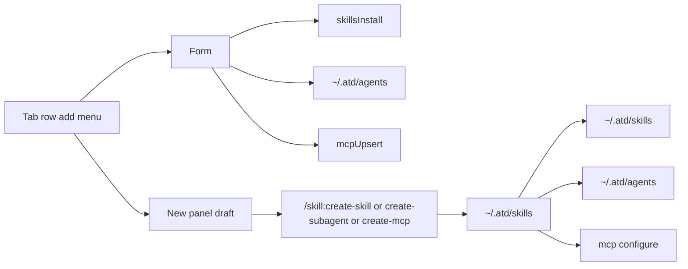

# Extensions tab add actions

Status: Superseded by [2026-09-28 plugin-grouped extensions settings](2026-09-28-plugin-grouped-extensions-settings.md) (the per-kind tabs and add button were replaced by plugin rows)
Created: 2026-09-22
Approval: Implementation requested. All plan todos are in scope.

## Summary

Each Extensions tab keeps one add control on the trailing side of the tab row. The control offers two methods: a form, and a panel session that runs an app skill. The skill form installs a package. The subagent form writes a markdown agent. The MCP form keeps the current server fields.

The session method loads one of three product skills: `create-skill`, `create-subagent`, and `create-mcp`. They live in the product entity `atd`, at `~/.atd/skills/`, which the catalog reads in addition to `~/.agents/skills`. The session seeds `/skill:<name>` and stages that skill on the new task, which is the path `decideExpansion` already uses for an explicit skill entry.

`create-skill` authors a skill under `~/.atd/skills/<name>/SKILL.md`. `create-subagent` authors `~/.atd/agents/<name>.md`: YAML frontmatter (`name`, `description`, optional `tools` and `model`) and a system-prompt body. `create-mcp` authors a server record through the existing MCP configure path. Seeding copies a missing product skill into `~/.atd/skills/` and leaves an existing directory in place.

Pi’s coding agent has no built-in subagent type. The definition this product follows is the one in Pi’s shipped example and in `pi-subagents` 0.70, which the service already runs: a subagent is that markdown specialist, discovered as a child session. The Extensions “子代理” tab currently edits a role allow-list (`id`, `title`, `allows.tools`, `allows.skills`) and stores it with `putRole`. That record stays the run capability ceiling. It is no longer the subagent the tab creates.

## Clarifying Questions

- [x] Should the session only seed a prompt, or persist a catalog entry? Persist by running a shipped skill. The user asked for an app skill directory besides `~/.agents/skills`, then the three skills `create-skill`, `create-subagent`, and `create-mcp`, modeled on Cursor’s `/create-skill` and `/create-subagent` workflows.
- [x] Should a subagent be the current role allow-list? No. Pi’s example and `pi-subagents` 0.70 define it as a markdown specialist. The role record remains the run tool ceiling.
- [x] Which entity owns the new skill and subagent files? The product entity `atd`. Pi’s product home is `~/.pi/agent` (`getAgentDir()`). This product’s home is `~/.atd`, resolved with `os.homedir()`. `~/.agents/skills` stays a second skill catalog. Electron `productName` is still `AI` and `appId` is still `com.junerdd.ai`; this plan does not rename the packaged app.

Assumptions:

- One trailing control. Its label follows the active tab. The menu items are 填写表单 and 用 AI 创建. The subagent label is 添加子代理.
- The subagent form and `create-subagent` write one markdown file. They do not call `putRole`. The composer capability control can still select a role ceiling; this plan does not rename that control.
- The skill form installs `local`, `npm`, or `git`. Authoring a new skill body is the `create-skill` session.
- User-authored skills from this flow land in `~/.atd/skills`. `~/.agents/skills` stays visible and is not the write target.
- A same-name collision resolves as installed revision, then `~/.atd/skills`, then `~/.agents/skills`.
- Subagent files land in `~/.atd/agents/*.md`. The catalog does not read `~/.pi/agent/agents` or a project `.pi` directory.
- Role edit, skill update, skill enable, and MCP connect, auth, disable, and remove stay on the row.

## File And Code References

- `apps/desktop/src/features/service/service-settings.tsx` — uncontrolled tabs; no trailing action.
- `apps/desktop/src/features/service/extension-group.tsx` — `emptyAction` and `footer` host the add button. While `loading && !hasRows`, that action is omitted. The tab-row control stays visible during loading.
- `apps/desktop/src/features/service/extension-mcp.tsx` — `添加服务器` in both empty and footer slots.
- `apps/desktop/src/features/service/extension-roles.tsx` — `添加角色` in both slots. Edit stays on the row.
- `apps/desktop/src/features/service/extension-skills.tsx` — update and enable only. `sourceKind` is an exhaustive switch.
- `packages/ui/src/components/tabs.tsx` — `TabsList` is `inline-flex w-fit` and is a tab list. The action is a sibling in a flex row, outside `TabsList`.
- `apps/desktop/src/features/settings/settings.css` — the only form width rule is `.settings-extension-empty .settings-extension-form`. A form above a non-empty list needs its own layout rule. `.settings-extension-group-action` has no rule. No desktop test asserts this page.
- `apps/desktop/src/features/commands/command-editor.tsx` and `apps/desktop/src/features/agent/use-task-panel.ts` — settings hands a new panel draft to the composer. This plan adds a skill ref on that draft.
- `apps/desktop/electron/agent/service-tasks.ts` — submit stages `policy.skills` before the run freezes.
- `apps/agent-service/src/skills/expansion.ts` — `/skill:name` expands only when that name is in the frozen snapshot.
- `apps/agent-service/src/skills/user-agents.ts` — live catalog of `~/.agents/skills` via `os.homedir()`. Comment: Pi’s other default roots stay closed.
- `apps/agent-service/src/skills/routes.ts` `listSkills` — merges installed revisions with discovered user skills. Installed names hide the discovered copy.
- `apps/agent-service/src/skills/loader.ts` — a run loads only frozen `additionalSkillPaths`.
- `packages/agent-contracts/src/skills.ts` — `SkillSourceKindSchema` is `local | npm | git | agents`.
- `apps/agent-service/src/service-fs.ts` — `confined()` blocks paths outside the service data directory. `~/.atd` is outside it, so create-skill and create-subagent cannot write there until that product home is an allowed root.
- Pi `packages/coding-agent/README.md` — “No sub-agents.” Core leaves this to an extension. Local checkout: `${referenceRoot}/pi`, tag `v0.85.1`.
- Pi `packages/coding-agent/src/config.ts` — `getAgentDir()` returns `~/.pi/agent` because `.pi` is a shared config root and `agent` is only the coding-agent slice inside it. atd’s product home is `~/.atd` itself, with `skills/` and `agents/` directly underneath.
- Pi `packages/coding-agent/examples/extensions/subagent/README.md` and `agents.ts` — an agent file has `name`, `description`, optional `tools` and `model`, and the markdown body is the system prompt. Pi stores those files in `~/.pi/agent/agents/*.md`. atd stores them in `~/.atd/agents/*.md`.
- `apps/desktop/electron-builder.yml` — packaged `productName` is `AI` and `appId` is `com.junerdd.ai`. The service data directory stays the existing per-OS dataDir. The product entity for skills and subagents is `~/.atd`, not that dataDir and not `~/Library/Application Support/AI`.
- `pi-subagents@0.70.0` `docs/agents.md` — “An agent is a markdown file: YAML frontmatter on top, a system prompt below.” The service already depends on this package. `RuntimeAgentDefinition` in `src/agents/runtime-agent-registry.d.ts` is the runtime shape (`description`, `systemPrompt`, optional `tools`, `model`, and other child-session fields).
- `apps/agent-service/src/subagents/agents.ts` — three code-registered agents, `service.worker`, `service.reviewer`, and `service.scout`, each with `description` and `systemPrompt`. The settings tab does not edit these.
- `apps/agent-service/src/skills/roles.ts` — `putRole` upserts one role in `roles.json`. `apps/agent-service/src/subagents/intersection.ts` uses that allow-list as a tool ceiling (`parent ∩ role`). That ceiling remains. The subagent catalog stops writing it.
- `apps/desktop/src/i18n/locales/zh-CN/settings.json` — the tab is 子代理, while the button, empty line, and note still say 角色.
- `apps/agent-service/src/mcp/servers.ts` — servers persist at `<dataDir>/mcp/servers.json` through the configure schema. Secrets stay in the keyring.
- `apps/agent-service/package.json` — `"files": ["dist"]`. A shipped skill directory must be added there or `pnpm deploy` omits it.
- `apps/desktop/electron/service/ipc.ts` — no `skillsInstall` action. `rolesPut` and `mcpUpsert` already exist for the settings window.
- `apps/agent-service/src/tool-proxies.ts` — run tools are read, write, edit, bash, a stub `command` tool, and `desktop`. Nothing calls `putRole` or MCP configure. Writing a file under the service data directory does not install a skill or save a role.
- `docs/plans/2026-09-20-pi-subagent-skills-mcp.md` D8 — settings owns the catalog, and a run freezes the selection it accepted. This plan keeps the form on that page. The session path authors through the three skills in `~/.atd/skills`.
- Cursor references for the skill procedures, not for paths or file formats: `~/.cursor/skills-cursor/create-skill/SKILL.md` and `~/.cursor/skills-cursor/create-subagent/SKILL.md`. There is no Cursor `create-mcp` skill.

## Plan Todos

- [ ] Add the product home `~/.atd`, resolved with `os.homedir()` the same way `~/.agents/skills` is. Seed missing `create-skill`, `create-subagent`, and `create-mcp` into `~/.atd/skills/` from package templates, and include those templates in the service `files` list. Discover that directory with `sourceKind: 'atd'`, beside `discoverUserAgentSkills`. Merge order: installed revisions, then atd skills whose names are not installed, then `~/.agents/skills` names that are still free. Extend `SkillSourceKindSchema`, the desktop row type, and the skills-tab source label `atd`.
- [ ] Write the three skill templates. Follow the Cursor skills’ procedure: interview for purpose, name, and when it applies; keep `disable-model-invocation: true`. `create-skill` writes `~/.atd/skills/<name>/SKILL.md` and leaves `create-skill`, `create-subagent`, and `create-mcp` unchanged. `create-subagent` writes `~/.atd/agents/<name>.md` with `name`, `description`, optional `tools` and `model`, and a system-prompt body. `create-mcp` collects server id, transport, command or URL, and auth, and saves it with the existing MCP configure schema. Bearer tokens stay in the keyring as an env var name.
- [ ] Let those sessions write and edit only under `~/.atd/skills` and `~/.atd/agents`. Keep every other path outside the data directory blocked. The subagent catalog reads `~/.atd/agents`. Register one run tool the MCP skill calls: it wraps MCP configure and validates the same payload as the form. The model does not rewrite `roles.json` or `servers.json`. A skill file dropped under the data directory is not a skill install.
- [ ] Add list/save for `~/.atd/agents/*.md`. Replace the 子代理 tab’s role form with fields for name, description, tools, optional model, and system prompt. Rows show name and description. The three `service.*` agents stay code-registered and are not saved into this directory. `putRole` remains for the run ceiling only.
- [ ] Put one add menu on the trailing side of the tab row in `service-settings.tsx`, as a sibling of `TabsList`. Control the active tab. Remove the MCP and subagent buttons from `emptyAction` and `footer`. Open the form at the top of the tab content, with a layout rule that applies when the list has rows. Close it when the tab changes or the save succeeds. Keep the menu visible while the list is loading. Disable both items while the service is disconnected or a write is busy. On a narrow window the row wraps. Subagent copy says 子代理: the add label, empty state, and note.
- [ ] Add the skill install form and desktop `skillsInstall` IPC for `local`, `npm`, and `git`, including the optional name. Refresh the list after success.
- [ ] Add `settings:start-extension-session` with kind `skill`, `subagent`, or `mcp`. The panel opens a new task, sets the composer to `/skill:create-skill`, `/skill:create-subagent`, or `/skill:create-mcp`, and sets that task’s skill policy to the matching atd skill so submit can freeze it. Show the panel the same way the command session does. If that skill is harness-disabled, tell the user to enable it and do not start a run that will fail expansion.
- [ ] Add `en` and `zh-CN` copy for the menu, the skill form, the `atd` source label, and the session toast. Keep English strings that existing tests assert.
- [ ] On implementation, update the Extensions frame in Figma file `project` to the trailing add menu and both methods. Locate the current frame in the file before editing.
- [ ] Keep each edited `.ts` and `.tsx` file at or under 350 lines. New modules own the menu, the skill install form, app-skill discovery, and the three skill directories.

## Grill-Me Outcome

- Transcript: Not run
- Outcome: Not run
- Summary: The user answered in this conversation. The session runs the three app skills. An interview was not required.

## Build From Plan

- Ready to build: Yes
- Selected todos: All items in Plan Todos, after implementation is requested.
- Execution notes: Create `~/.atd` and seed the three skills before the session button depends on them. Preserve unrelated working-tree changes. Catalog writes still apply on the next turn. MCP disable and remove still reject new calls immediately. Do not copy Cursor skill text or Cursor paths into the product skills.

## Validation

- `pnpm exec oxlint` and `pnpm exec oxfmt` on the touched files.
- `pnpm typecheck`. The source-kind union, IPC, and session payload change.
- Catalog: with the service connected, the skills tab lists the three skills from `~/.atd/skills` and any `~/.agents/skills` entries. An installed skill of the same name hides the atd and user copies. An atd skill hides a same-named `~/.agents/skills` entry. The install form does not write into `~/.atd/skills`.
- Extensions page at widths 320, 480, 760, 1000, and 1280, plus a short window. The add control sits on the trailing side of the tab row for all three tabs, including while that tab is still loading. Empty states have no second add button. The subagent form saves a markdown agent when the list is empty and when it has rows. The MCP form still saves. The skill form calls install. Disconnect disables both menu items. The 子代理 tab no longer shows 添加角色, 角色 ID, or the role allow-list form.
- Session: choosing 用 AI 创建 focuses the panel on a new draft whose text is the matching `/skill:` entry and whose skill policy contains that skill. A connected run expands the skill. `create-skill` can write a skill directory under `~/.atd/skills`, and a path outside `~/.atd` and the data directory stays blocked. `create-subagent` adds `~/.atd/agents/<name>.md` and a row whose description is the frontmatter description. `create-mcp` adds a server row. A disabled product skill shows the enable message and does not submit.

## Risks

- `pnpm deploy` packs only `files`. The seed templates have to be in that list, or a packaged app cannot create the first `~/.atd/skills` entries.
- `~/.atd` is a write root outside the service data directory. Limiting write and edit to `skills` and `agents` under that home keeps the data-directory block for everything else. The confined service HOME must not hide `os.homedir()`.
- A markdown file under `~/.atd/agents/` becomes a subagent only after the new catalog reads it. Writing `roles.json` still only changes the capability ceiling. The packaged app name remains `AI` until a separate rename.
- Skill text alone cannot save an MCP server. The `command` tool is still a stub. The MCP run tool is that save path.
- npm and git install records a managed package. The form must show the service error when the package is not already available.
- `extension-roles.tsx` and `extension-mcp.tsx` are near the line limit. Moving the button out should shrink them.
- Figma and code drift if only one side is updated.

## Approval

- Status: Draft - awaiting approval
- Authorization: this plan file only
- Implementation: not requested
