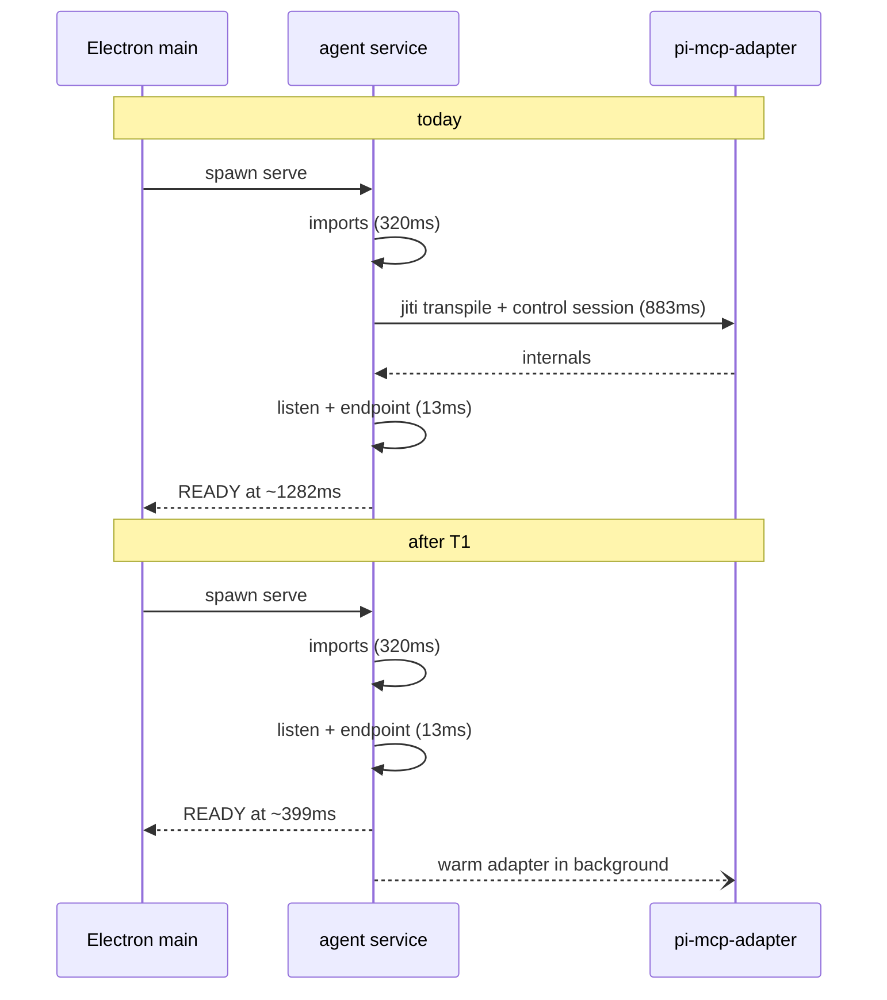

# Service startup time

Status: T1, T2, T5, T8, T3a, T4 and T4a implemented and verified — service boot 1282 ms → 369 ms, and dev
launches now take the `dist` fast path instead of jiti
Created: 2026-09-22
Updated: 2026-09-22 (fifth pass: fixed the watcher/`dist` race T4 introduced, found from a real `pnpm dev`
run)
Approval: Both slices authorized and delivered. T3b / T6 / T7 remain open.

## Results (first slice: service boot)

|        | median cold start to `AGENT_SERVICE_READY` |
| ------ | ------------------------------------------ |
| before | 1282 ms                                    |
| after  | **369 ms** (363, 370, 370, 369, 369)       |

A 913 ms reduction, 3.5x faster, verified with `node tmp/bench-service-start.mjs 5` against the rebuilt
`dist`. Behaviour deltas, all verified by direct HTTP probes against throwaway profiles:

- Adapter missing: every mounted MCP route still answers `503 {"error":{"code":"internal","message":"MCP is unavailable: pi-mcp-adapter 2.34.0 could not be loaded."}}`
  — the exact previous shape and message, now produced per request instead of at boot. `/v1/status` stays 200.
- Adapter present, zero servers: `/v1/mcp/status`, `/v1/mcp/servers`, `/v1/mcp/snapshot` return 200; an
  unknown `serverId` still maps to `404 not_found`, proving `McpError` translation survived the move.
- `POST /v1/mcp/stage` still returns 200 while the adapter is missing (the "staging works while degraded"
  contract), because it is mounted from `manage.ts` and never touches the authority.
- **One intentional delta:** with the adapter missing, an _unmounted_ `/v1/mcp/...` subpath now returns 404
  instead of 503, because the boot-time `app.all('/v1/mcp/*')` catch-all is gone. Every path the desktop
  client actually calls is a mounted route, so no caller is affected.

## Summary

Every launch shows `正在连接服务…` because the desktop autostarts a local agent service and waits for it
to publish its endpoint. The banner is the symptom; the service boot is the cost.

**Headline measurement (interleaved A/B, 5 runs each, fresh temp dataDir, Node v24.19.0, macOS arm64):**

| Boot                              | Runs (ms)                    | Median      |
| --------------------------------- | ---------------------------- | ----------- |
| today                             | 1353, 1282, 1296, 1281, 1236 | **1282 ms** |
| with the MCP adapter never loaded | 405, 399, 399, 399, 402      | **399 ms**  |

The 883 ms difference is one awaited call. `buildServer` awaits `McpAuthority.authorityFor(...)`, which

1. transpiles the `pi-mcp-adapter` TypeScript source through jiti with `fsCache: false`, so it is
   re-transpiled from scratch on every start (894 ms measured standalone; 328/330 ms with the cache on), and
2. creates a Pi **control session** and waits for its connection layer (`control-session.ts:75`,
   `waitForManager(30000)`).

Both happen before `app.listen`, and **neither is needed to publish an endpoint**. The live profile has no
`mcp/servers.json` at all — zero MCP servers configured — and still pays the full 883 ms on every launch.

Phase breakdown of today's 1282 ms:

| Phase                                                                                          | Cost                                                             |
| ---------------------------------------------------------------------------------------------- | ---------------------------------------------------------------- |
| `import ./dist/config.js`                                                                      | 76 ms                                                            |
| `import ./dist/index.js` (service module graph)                                                | 244 ms — of which `runner-manager` → `pi-coding-agent` is 208 ms |
| `prepareServe` (paths, lock, token)                                                            | 22 ms                                                            |
| `createService`                                                                                | 858 ms — adapter + control session                               |
| `app.listen` + `writeEndpoint`                                                                 | 13 ms                                                            |
| Electron pre-spawn checks (`isDistFresh` over 115 `.ts` files, `isReadable`, `node --version`) | ~20 ms total                                                     |
| graceful shutdown (`POST /v1/admin/shutdown` → exit)                                           | 28 ms                                                            |

Dev pays more: any edit under `apps/agent-service/src` makes `dist` stale, so the launcher falls back to
running `src/cli.ts` through jiti — **4926 ms cold, 2333 ms warm** instead of 1282 ms.

Non-goals for this pass: the banner's visual treatment, composer queueing while connecting, and keeping
the packaged service alive across app quit.

## Clarifying Questions

- [x] Optimize startup time before touching the banner UX? Yes — user directed this pass at startup time.
- [x] Does anything at boot need the MCP adapter? No. Publishing the endpoint, recovery, skills and
      providers are all adapter-independent; the only boot-time consumer is the `buildServer` await itself.
- [x] Is "reuse a running service" useful given the quit path? **Less than assumed, now measured.** A quit
      stops the service (`main.ts:329`), and so does a vite dev restart — Electron runs `before-quit` on
      SIGTERM. Reuse therefore covers crashes/force-quits and hand-started services only. See the signal
      table under File And Code References.
- [ ] After T1 (~399 ms), do we also want T6/T7 to reach ~200 ms? Not recommended yet; higher blast radius.
- [ ] T3b (dev: stop killing the service on quit) is a behavior change. Include it, or keep dev reuse
      limited to hot-restart and crash survivors? Default assumed in this plan: **keep it out**.

## File And Code References

- `apps/agent-service/src/server.ts:218` — `await McpAuthority.authorityFor({...})` inside `buildServer`.
  This single await is the 883 ms. `McpAdapterMissing` catch at `:230` installs explicit 503 routes.
- `apps/agent-service/src/mcp/authority.ts:96` — `assemble`: `loadAdapterInternals()` at `:100`,
  `loadServerRecords` at `:107`, `scopeAdapterEnv` + `ControlSession.create` + `waitForManager(30000)` at `:174`.
- `apps/agent-service/src/mcp/authority.ts:71` — `authorityFor` caches one promise per dataDir, so a
  background warm-up and a later run-time call share a single load (no double work).
- `apps/agent-service/src/mcp/loader.ts:36` — `createJiti(import.meta.url, { moduleCache: true, fsCache: false })`.
  jiti's `fsCache` defaults to `true` (`boolean | string`; `node_modules/.cache/jiti` or `{TMP_DIR}/jiti`),
  and jiti invalidates by content hash — this code explicitly turned off a default-on cache.
- `apps/agent-service/src/mcp/routes.ts:36` — `McpRouteDeps { authority: McpAuthority }`; handlers at
  `:59`, `:63`, `:67` are sync and would become async under a lazy accessor.
- `apps/agent-service/src/mcp/routes.ts:74` — `handleMcpStage` deliberately takes `dataDir`, not the
  authority ("no authority load, works while MCP is degraded"). Keep that property.
- `apps/agent-service/src/index.ts:96` — `start()`: listen → `writeEndpoint` → `manager.dispatch()`.
  The right place to kick the background warm-up.
- `apps/agent-service/src/task-runner.ts:273` — `freezeMcpForRun` calls `authorityFor` then only
  `snapshot()`; freeze semantics (revision captured once at accept) must not change.
- `apps/agent-service/src/pi-session-mcp.ts:28` — per-session MCP prep; genuinely needs the adapter,
  because it also exposes the `configureMcp` hook that lets a run add MCP servers mid-run.
- `apps/agent-service/src/task-runner.ts:29` — static `import { SessionManager } from '@earendil-works/pi-coding-agent'`,
  the 208 ms that dominates what remains after T1.
- `apps/desktop/electron/main.ts:329` — `before-quit` → `serviceManager.shutdown()` → `stopLocalService`:
  a normal quit always leaves no service to reuse.
- `vite-plugin-electron/dist/base-sK7COpY_.mjs:97` — `startup.exit()` → `child.kill()` (SIGTERM) on dev
  restart. **Corrected in the third pass:** reading that call led me to claim the service is orphaned by a
  dev restart. Measured, it is not. Sending Electron SIGTERM _does_ run `before-quit`, so the service is
  stopped gracefully and its endpoint file is cleared; only SIGKILL leaves an orphan:

  | signal to Electron                      | Electron | service                   | `endpoint.json` |
  | --------------------------------------- | -------- | ------------------------- | --------------- |
  | SIGTERM (vite dev restart, normal quit) | exits    | **stopped gracefully**    | cleared         |
  | SIGKILL (crash, force quit, `kill -9`)  | exits    | **survives as an orphan** | left behind     |

  So T3a's reuse fires on a crash/force-quit, or when a developer runs a service by hand — not on the
  ordinary dev restart. The per-restart dev win the plan attributed to T3a in fact comes from T4, and the
  remainder would need T3b.

- `apps/desktop/electron/service/autostart.ts:19` — unpackaged: unconditional `stopLocalService` + respawn.
- `apps/desktop/electron/service/launcher.ts:172` — `isDistFresh`, the source-vs-build freshness
  comparison to generalize for T3a.
- `apps/desktop/electron/service/launcher.ts:236` / `:106` — `waitForEndpoint` polls at 100 ms,
  `waitForExit` at 250 ms (actual shutdown is 28 ms).
- `apps/agent-service/package.json:20` — `build: tsc -p tsconfig.json`, no watch script.
- `apps/desktop/tests/electron.spec.ts:32` — e2e asserting autostart clears the disconnected banner and
  the service lands in the isolated profile. The main integration guard for all of this.

## Plan Todos

- [x] **T1 — Take the MCP adapter off the boot critical path.** _(delivered: 1282 → 369 ms)_
  - Implemented: `registerMcpRoutes(app, authority: McpAuthorityResolver)` resolves the authority inside
    the per-request `wrap`, which also translates `McpAdapterMissing` → 503 and `McpError` → its status.
    The ~18 handler bodies still receive a resolved `McpRouteDeps` and were not touched. `routes.ts`
    shrank 332 → 302 lines, so no `mcp/mount.ts` was needed.
  - `mcpAuthorityDeps(deps: ServerDeps)` in `server.ts` is the single source for the authority identity,
    consumed by both the route resolver and the `index.ts` warm-up (`authorityFor` caches on `dataDir`
    alone, so two literals could have silently diverged).
  - Original wording retained below for reference:
  - `server.ts`: register MCP routes immediately with a lazy accessor (`authority: () => Promise<McpAuthority>`)
    instead of an awaited instance; drop the boot-time try/catch.
  - `mcp/routes.ts`: `McpRouteDeps.authority` becomes the accessor; `handleMcpStatus` / `handleMcpRecords` /
    `handleMcpSnapshot` become async; map `McpAdapterMissing` to the existing **503 with the adapter message**
    inside the route error translation, so degradation stays explicit and never silently succeeds.
  - `handleMcpStage` keeps taking `dataDir` and must not touch the authority.
  - `index.ts` `start()`: after `writeEndpoint`, kick `void McpAuthority.authorityFor(...)` as a background
    warm-up; log failures at warn; never block `listen` and never crash the process.
- [x] **T2 — Let the adapter loader keep its transpile cache.** _(delivered; measured 766 ms rebuild vs
      288 ms cached on the first MCP use)_ `fsCache: true` in `mcp/loader.ts`. Verified that jiti resolves
      to `{TMP_DIR}/jiti` here (the packaged-app case), that a corrupt cache entry falls back to a normal
      transpile and self-heals, and that an unwritable cache directory disables the cache instead of
      throwing. One edge does throw — an individually unreadable cache _file_ inside a writable dir — and
      it surfaces as the ordinary `McpAdapterMissing` 503 + warn, never a boot crash. Original wording:
  - `mcp/loader.ts:36`: `fsCache: false` → `true` (jiti's default location is writable in packaged builds —
    it falls back to `{TMP_DIR}/jiti`; content-hash invalidation is jiti's own, so no manual version key).
  - Verify a corrupt/unreadable cache still degrades to a normal transpile rather than throwing.
  - With T1 this shortens the background warm-up; it also makes the first MCP operation cheaper.
- [x] **T5 — Tighten the two startup polls.** `waitForEndpoint` 100 ms → 20 ms; `waitForExit` 250 ms → 50 ms.
      Worth 50–150 ms on the restart path and trivially safe. Done in
      `apps/desktop/electron/service/launcher.ts`.
- [x] **T3a — Reuse a healthy orphan service on dev launches.** _(delivered; narrower payoff than the plan
      assumed — see the corrected signal table above)_ `autostart.ts` probes `discoverService` first and
      adopts the process only when `isRunningServiceCurrent(startedAt)` holds; every unknown answer falls
      back to stop-and-spawn. The freshness signal walks `apps/agent-service/src`, `apps/agent-service/dist`
      and the `src` of each `workspace:` dependency read from the service manifest (so a future workspace
      dep is covered without editing the launcher). Both mtime walks were unified into `newestMtimeMs`,
      which `isDistFresh` now uses. `ServiceEndpoint` gained `startedAt`. Escape hatch:
      `AI_AGENT_FORCE_RESTART=1`. Cost on the launch path: 8 ms over 598 files.
      Verified end-to-end with real unpackaged launches against an isolated profile — cold spawn pid 47284;
      relaunch with no edits reused **the same pid**; after `touch src/cli.ts` it restarted (47306);
      with `AI_AGENT_FORCE_RESTART=1` it restarted again (47352). Original wording: In `autostart.ts`, probe `discoverService`
      first and reuse when no `.ts` under `apps/agent-service/src` (plus the workspace packages it builds
      from) is newer than the endpoint's `startedAt`; otherwise stop and respawn as today. Generalize
      `isDistFresh` into a shared freshness helper and add a forced-restart escape hatch
      (`AI_AGENT_FORCE_RESTART=1`). Recovers the dev hot-restart and crash cases; a normal quit still stops
      the service, so quit→relaunch is unaffected.
- [x] **T4 — Keep dev `dist` fresh so launches skip jiti.** _(delivered — this is where the dev-loop win
      actually comes from)_ `@ai/agent-service` gained `dev: tsc -p tsconfig.json --watch --preserveWatchOutput`
      (verified a supported flag in the pinned TypeScript 7.0.2 — unknown flags fail with TS5023), the root
      `dev` script now filters in both packages, and `turbo.json`'s `dev` also depends on
      `@ai/agent-service#build` so the first full build completes before Electron can spawn a service
      against a half-emitted `dist`. Verified: the watcher compiles on start, emits a newly added source,
      and re-emits after an edit; a real unpackaged launch spawns the service **from `dist/cli.js`**
      (~620–670 ms to a live endpoint) instead of the jiti path's 2.3–4.9 s. Original wording: Add `tsc -p tsconfig.json --watch --preserveWatchOutput`
      as a dev script for `@ai/agent-service` and wire it into the dev pipeline, so the launcher's existing
      fast path applies after a source edit (2333 ms → 1282 ms today, → ~399 ms after T1). Coordinate with
      T3a's freshness signal so a rebuild does not look like a stale process.
- [x] **T4a — Stop the dev watcher from rewriting `dist` under the launcher.** _(delivered; fixes a defect
      T4 introduced)_ `apps/agent-service/tsconfig.json` gained `incremental: true` +
      `tsBuildInfoFile: dist/.tsbuildinfo`, `isDistFresh` now compares the newest source against the newest
      file anywhere in `dist` (not `cli.js` alone), and `electron-builder.yml` filters the build-info file
      out of the packaged resources. See "The Dev Watcher Rewrote dist Under The Launcher" below.
- [ ] **T3b (optional, needs a decision) — In unpackaged mode, skip `stopLocalService` on quit.** Now that
      the signal table above is measured, this is the _only_ remaining route to a faster dev restart: today
      every SIGTERM stops the service, so each restart pays a fresh ~370 ms spawn (inside a ~650 ms
      launch-to-endpoint). T3a is exactly the safety net that makes T3b safe — a reused process is adopted
      only while it is not older than the code. Tradeoff unchanged: a service outlives the app in dev and
      needs a visible way to stop it. **Recommendation: skip it** — T4 already removed the 2.3–4.9 s jiti
      penalty, so the remaining prize is a few hundred milliseconds against a lingering background process.
- [ ] **T6 (optional) — Lazy-import the Pi SDK in the runner.** Make `task-runner.ts`'s `SessionManager` a
      dynamic import at first run accept: ~208 ms of the remaining ~399 ms. Larger blast radius; only if we
      want sub-200 ms ready time.
- [ ] **T7 (optional, follow-up) — Precompile `pi-mcp-adapter` to JS at build/package time** and import the
      compiled output, removing runtime jiti from that path entirely. Needs a build step alongside the
      existing `patches/` pipeline.
- [x] **T8 — Reproducible startup benchmark.** Written as `tmp/bench-service-start.mjs`
      (`node tmp/bench-service-start.mjs 5 [--ab]`): spawns `dist/cli.js serve` against a fresh temp
      dataDir, times the `AGENT_SERVICE_READY` line, reports the median, and can interleave an
      adapter-less control run. **Deviation from the original plan item:** not committed under
      `apps/agent-service/scripts/`. AGENTS.md ("Runtime Debugging") says to keep throwaway harness
      scripts in gitignored `tmp/` rather than adding a parallel committed harness, and `/tmp/` is
      gitignored at the repo root.

### Considered and set aside

- **Short-circuit the authority when zero MCP servers are configured.** Tempting (the live profile has none),
  but `prepareSessionMcp` exposes the `configureMcp` hook that lets a run add servers mid-run, so an
  adapter-free authority would need lazy promotion inside `configure()`. T1's background warm-up already
  removes the user-visible cost, so this stays out until there is a reason.
- **Optimizing the Electron pre-spawn checks.** Measured at ~20 ms total; not worth touching
  (`isReadable` reading whole files instead of `stat` is untidy but costs 1 ms).

## Grill-Me Outcome

- Transcript: Not run
- Outcome: Not run
- Summary: Not requested; the decisions here are settled by measurement rather than by user preference.

## Build From Plan

- Selected and delivered: **T1, T2, T5, T8, T3a, T4**, plus the `globalPassThroughEnv` fix above.
- Remaining: **T3b** (measured as the only remaining dev-restart win, recommended against), **T6**, **T7**.
- Validation run for the delivered slice: `pnpm --filter @ai/agent-service build`, `pnpm typecheck`
  (5/5), `pnpm exec oxlint` on all six changed files (exit 0), `pnpm exec oxfmt`,
  `pnpm --filter @ai/desktop test` (10 files / 54 tests, same as the pre-change baseline),
  `pnpm test:electron` (1 passed — the autostart + banner-clearing guard), `node tmp/bench-service-start.mjs 5`,
  plus the direct HTTP probes listed under Results.
- Follow-up noticed while implementing: `apps/agent-service/src/memory/authority.ts:34` has the same
  `fsCache: false` on its own jiti instance. It is **not** on the boot path (the 369 ms measurement proves
  it), but the same one-line win likely applies to the first memory operation. Out of scope for this slice.

## Validation

- Benchmark: spawn `node dist/cli.js serve --dataDir <fresh temp> --port 0`, time to the
  `AGENT_SERVICE_READY` stdout line, 5 runs interleaved with a control. Baseline: median 1282 ms;
  target after T1: ~400 ms (already demonstrated by forcing `AI_AGENT_MCP_ADAPTER_PATH` to a bad path).
- `pnpm typecheck` and `pnpm lint`.
- `pnpm --filter @ai/desktop test` (vitest).
- `pnpm test:electron` (Playwright) — covers autostart, the banner clearing, and the isolated-profile dir.
- Manual MCP checks after T1/T2: Settings → Extensions lists MCP servers; connect and OAuth start/complete
  still work; a run can still configure MCP mid-run; with a deliberately bad `AI_AGENT_MCP_ADAPTER_PATH`,
  MCP routes answer 503 with the adapter message while the rest of the service boots and runs normally.
- Manual T3a check: edit a renderer file (service should be reused), then edit a service source file
  (service must restart), and confirm the forced-restart escape hatch works.

## Risks

- **T1 moves adapter-missing detection from boot to first MCP use.** The explicit 503 and the warn log must
  survive the move — no silent degradation, matching the intent documented at `server.ts:214`.
- **A run started during the warm-up window** awaits the same cached promise (`authorityFor` dedupes per
  dataDir), so it is never slower than today; recovery `dispatch()` at boot behaves the same way.
- **Env scoping timing.** `scopeAdapterEnv` (`PI_CODING_AGENT_DIR`, `MCP_OAUTH_DIR`) now runs slightly later.
  Checked: the service passes `agentDir`/`sessionsDir` explicitly everywhere
  (`task-runner.ts:81`, `control-session.ts:75`), so these vars only bound the adapter's own footprint.
  Re-verify after T1 that the adapter still writes inside the dataDir.
- **T2 adds writable cache state.** A stale or corrupt cache must fall back to transpiling; confirm the
  packaged app resolves a writable cache dir (`{TMP_DIR}/jiti`) when `node_modules/.cache` is absent.
- **T3a can run stale service code** if the freshness signal misses an input (for example
  `packages/agent-contracts`). Include workspace package sources and prefer restarting when the comparison
  cannot be made.
- **T4 adds a persistent watch process** to the dev pipeline; rebuilds change `dist` mtimes, which T3a's
  comparison must account for so the two do not fight.

## Turbo Strips The Isolation Env Vars (found while verifying T4)

`turbo.json` ran with `envMode: strict` and no passthrough list, so `pnpm dev` did **not** forward
`AI_TEST_USER_DATA` or `AI_AGENT_DATA_DIR` to its tasks. That silently defeats the isolated-profile
workflow AGENTS.md documents (`AI_TEST_USER_DATA=$(mktemp -d) pnpm dev`): the launched app falls back to
the real profile. This bit this session — see Notes below.

Fixed by adding `globalPassThroughEnv` to `turbo.json` with the ten `AI_*` / `AI_TEST_*` variables the
desktop and service actually read. They select a profile, data dir or credentials at runtime and never
change build output, so passthrough (not `env`) is the right bucket and task hashes are unaffected.
Verified that turbo registers the list in its global cache inputs and that `turbo.json` still parses under
strict `JSON.parse` (no JSONC comment — no other JSON file in this repo uses one). The end-to-end
`pnpm dev` isolation was deliberately **not** re-run at the time, to avoid a second launch that could touch
the real profile if the fix were wrong. It has since been **confirmed**: `tmp/dev-probe.mjs` runs
`pnpm dev` with `AI_TEST_USER_DATA` pointed at a fresh temp directory and finds the service's
`endpoint.json` inside that directory, so the passthrough list works end to end.

## The Dev Watcher Rewrote `dist` Under The Launcher (found from the user's `pnpm dev` run)

T4 put `tsc --watch` into `pnpm dev`, and `apps/agent-service/tsconfig.json` had no `incremental`, so
**every watch start re-emitted the whole `dist`** — about 2 s of continuous writes. Electron starts in
that same window (vite builds `main.js` in ~100 ms), and the launcher spawns the service from
`dist/cli.js`. Measured on two consecutive runs: `dist/cli.js` mtime 23:39:05 against a service
`startedAt` of 23:39:05.694. The service won the race both times, but nothing ordered them — a spawn
landing mid-emit imports a partly written module graph and dies with `ERR_MODULE_NOT_FOUND` or a
`SyntaxError`, which surfaces as a failed connection and a banner that never clears.

`dependsOn: ["@ai/agent-service#build"]` does not prevent this: it orders the _first_ build before `dev`
starts, and then the watcher immediately re-emits everything anyway.

Fix and evidence:

- **`incremental: true` + `tsBuildInfoFile: dist/.tsbuildinfo`.** A watch start after a normal build, and
  after a turbo cache restore, now emits **nothing** (`dist/cli.js` and `dist/server.js` mtimes unchanged
  across the watcher's whole startup); a real source edit still re-emits, and only the edited module
  (`audit.ts` edited at 23:41:59 → `audit.js` at 23:41:59, `cli.js` untouched). Start-up compile also
  dropped from ~2 s to ~1 s. The build-info file sits inside `dist` deliberately, because `turbo.json`
  caches `dist/**`; put anywhere else, a cache-hit restore would leave no build info and the full re-emit
  would come back.
- **`isDistFresh` now compares against the newest file anywhere in `dist`,** not `dist/cli.js` alone.
  Incremental emit only rewrites the modules that changed, so after editing `audit.ts` the old check saw
  `cli.js` older than the newest source and fell back to jiti forever. tsc writes the build-info file after
  the emit, so "dist newer than every source" also means the compile finished.
- **`electron-builder.yml` filters `.tsbuildinfo`** out of the copied service `dist` (677 KB of dev-only
  state that would otherwise ship).
- Verified that `pnpm typecheck` (`tsc --noEmit`) does **not** write the build-info file, so it cannot
  poison a later build: from an empty `dist`, `--noEmit` leaves no `dist`, and the following build emits
  all 29 top-level modules.

Result, three isolated `pnpm dev` runs after the fix: endpoint published at **1.48 s / 1.48 s / 1.64 s**
from `pnpm dev` (was 2.10 s), `via=dist` every time, `dist` JS untouched by the watcher, and **zero**
`service:request` errors (was four).

### Two things this did not change

- **The four `Error occurred in handler for 'service:request'` lines are a renderer/connect race, not a
  startup failure.** They fire at ~2.15 s, _after_ the endpoint exists at 2.10 s, from
  `connection.ts:156` by way of `manager.ts`: the window loads while `autostartService` is still
  connecting and the renderer's first requests are rejected. Shortening the launch made them stop
  appearing in three runs, but the race is still there on a slower machine. Removing it for good is the
  banner/queueing work this plan's non-goals parked.
- **`pnpm dev` no longer exits when you quit the app.** The desktop task ends with Electron, but turbo
  keeps the persistent `@ai/agent-service#dev` watcher alive, so the run must be ended with Ctrl-C. This
  session found a turbo + tsc pair still running 2m49s after the window closed. It is the cost of having a
  second persistent task; turbo has no "stop when a sibling exits" primitive short of a supervisor script.

## Notes On This Investigation

- Benchmarks ran against throwaway temp dataDirs; the running desktop service was untouched.
- `AI_AGENT_MCP_ADAPTER_PATH=/nonexistent-adapter-path` was used to measure the post-T1 shape without
  editing code — it forces the existing `McpAdapterMissing` degradation path.
- One early benchmark passed its dataDir wrong and the service created `apps/agent-service/undefined/`.
  That stray untracked directory was removed; the working tree is otherwise unchanged apart from this file.
- **A `pnpm dev` verification run reached the real profile** (`~/Library/Application Support/AgentService`)
  at 22:21, because turbo stripped the isolation env vars as described above. The launch started a service
  there (epoch 17 → 18) and, when the run was killed, left a stale `endpoint.json` and `service.lock`.
  Both are pid-checked and self-heal — `discoverService` rejects a stale endpoint and `acquireLock` only
  refuses a lock whose pid is alive — so the next launch is unaffected; `ledger.json` was untouched.
  Every later verification launched Electron directly rather than through turbo, which does forward the
  env, and asserted its data dir was a temp directory.
- A leftover `pnpm dev` from the user's own run (turbo + tsc, its Electron window already closed) was
  stopped before re-running dev here, so two watchers would not write `dist` at once. Re-running
  `pnpm dev` restores it.
- `tmp/dev-probe.mjs` (gitignored) is the harness for the watcher race: it runs `pnpm dev` against a fresh
  temp profile, times the endpoint file, reports whether the service was spawned `via=dist` or `via=jiti`,
  and counts `service:request` errors.

## Approval

- Status: T1, T2, T5, T8, T3a, T4 and T4a delivered and verified (service boot 1282 ms → 369 ms; dev
  launches take the `dist` fast path instead of jiti, and the dev watcher no longer rewrites that `dist`
  while the launcher reads it). T3b, T6 and T7 remain open; T3b is recommended against.
