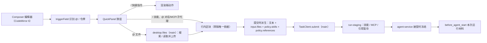

# 输入框 @ 提及与 / 指令快捷面板

Status: Draft — 研究完成，产品决策均已确认，待批准实施
Created: 2026-09-23
Approval: 仅规划。用户通过 `/plan-mode` 请求计划，尚未授权实施。

## Summary

目标：面板主输入框（`Composer`）输入 `@` 或 `/` 时，在输入框上方弹出快捷面板，全程键盘可达。

- `@` 可引用：文件、对话（会话）、MCP 服务器、子代理。
- `/` 可调出：技能列表，以及 `/new`、`/model` 等快捷指令。

推荐方案分三层，各层各有唯一的归属方：

- **渲染端：输入框从原生 textarea 换成 CodeMirror 6 编辑器，新增 `features/composer-editor/` 与 `features/quick-panel/` 两个模块。**
  - 编辑器负责文本、行内区块、触发识别和按键优先级；面板负责候选来源、当前项和弹层渲染。`composer.tsx` 只做接线（现有 303 行，上限 350 行）。
  - 从面板插入的文件、对话、MCP、子代理、技能，在输入框内渲染为原子区块（chip）：整体删除，光标整体跨过。
  - 区块是草稿的唯一依据，提交时才派生附件、技能与引用。删除区块，就等于取消对应项。
  - 弹层用 `@ai/ui` 的 `Popover`，通过 `PopoverAnchor` 锚定 `.composer-surface`，显示在输入框上方，与 HITL/队列弹层共用同一锚点。
  - 焦点始终留在编辑器，按 combobox 的 `aria-activedescendant` 模式实现。
- **`/` 分两类，都不新增服务契约：**
  - 快捷指令：`/new`、`/model`、`/effort`、`/history`、`/settings`，由渲染端执行，绝不作为文本发送。
  - 技能：选中后在开头插入技能区块。发送时它序列化为 `/skill:<name> ` 前缀，并暂存到 `policy.skills`，沿用现有的扩展会话先例。
- **`@` 分两类：**
  - `@文件` 参考 Raycast 的文件搜索。空查询时列出最近使用和最近附加的文件；输入后按文件名搜索主目录中可附加的文本文件。
    - 检索和读取都在主进程完成。渲染端只拿到不透明的结果 id 和展示信息。
    - 选中后由主进程读取并上传，文件在输入框内显示为区块，提交时进入现有的 `input.files`。
    - macOS 查询系统的 Spotlight 索引；Windows 与 Linux 遍历主目录并缓存（第 1F 阶段）。
  - `@对话`、`@MCP`、`@子代理` 显示为区块，提交时派生为结构化的「运行引用」（`RunReference`）。它们按技能/MCP 的暂存模式进入服务端，并在运行被接受时冻结。服务端再把它们解析为本次运行的材料和能力：
    - 对话：注入有界的对话摘录。
    - MCP：提示优先使用该服务器的工具，不收窄工具集。
    - 子代理：为本次运行注册并放行该子代理，同时给出委派提示。

调研还发现两处服务端既有缺陷，它们直接决定 `@MCP`、`@子代理` 和后续运行里的 `@`/`/` 能否生效。因此列为第 0 阶段：先用运行时核验，确认后在归属模块修复。

非目标：

- 命令输入页的 textarea（`features/agent/command-input.tsx`）与设置中的指令编辑器（CodeMirror），两者都不替换。
- 富文本格式：输入框仍是纯文本加区块，不支持粗体、列表、图片等。
- 对话记录中用户气泡的区块渲染：发送后仍显示纯文本。
- 文件搜索的扩展能力：内容搜索、文件夹浏览与钻取、Quick Look 与文件动作面板、自定义搜索范围、开关设置。
- 其他索引后端：Windows Search、plocate、tracker、Baloo。
- 放宽附件限制：类型与大小上限保持现状。
- 用户指定的强制委派。
- 改写 `/skill:` 运行的气泡与标题显示。

| 类别         | 候选来源                                                                         | 选中后的效果                                                                            | 阶段   |
| ------------ | -------------------------------------------------------------------------------- | --------------------------------------------------------------------------------------- | ------ |
| `/` 快捷指令 | 渲染端注册表                                                                     | 执行现有动作（`newTask`、改 `policy`、切视图、开设置）；清除指令文本                    | 1      |
| `/` 技能     | `service.skills()`（仅已启用）                                                   | 开头插入技能区块 → 发送时为 `/skill:<name> ` 前缀 + `policy.skills` 暂存                | 1      |
| `@` 文件     | 空查询：最近附加 + 系统最近使用；输入后：系统级文件名搜索；末尾固定「浏览文件…」 | 主进程按结果 id 读取并上传 → 插入文件区块 → 提交时进入 `input.files`                    | 1F → 1 |
| `@` 对话     | `AgentSnapshot.tasks`                                                            | 插入对话区块 → 提交时 `policy.references += {kind:'task'}` → 服务端注入有界对话摘录     | 2      |
| `@` MCP      | `service.mcpStatus()`                                                            | 插入 MCP 区块 → 提交时 `policy.references += {kind:'mcpServer'}` → 优先使用提示，不收窄 | 0 → 2  |
| `@` 子代理   | `service.agents()`（`~/.atd/agents`）                                            | 插入子代理区块 → 提交时 `policy.references += {kind:'agent'}` → 注册、放行、委派提示    | 0 → 2  |

## Clarifying Questions

- [x] `/` 在哪里触发？只在草稿开头触发，也就是光标前的文本整体匹配 `^\s*[/／、]\S*$`。原因有二：`/skill:` 只在消息首部展开（`apps/agent-service/src/skills/expansion.ts:24-35`），快捷指令也作用于整条草稿。全角 `／` 和中文输入法下 `/` 键产出的 `、` 只在首位视为别名，选中后规范化为 `/`。
- [x] `@` 在哪里触发？沿用 pi-tui 的令牌起始规则：位于开头，或前一个字符是空白、引号、`=`、中文标点（`pi-tui/dist/autocomplete.js:7,39-81`）；从 `@` 到光标之间不能有空白。`＠` 视为别名。因此邮箱、URL 不会触发。
- [x] 输入框内的 `/` 与既有决定“命令浏览使用独立搜索状态”（`docs/plans/2026-09-10-general-agent-requirements.md:248`）冲突吗？本次用户的明确要求覆盖该条在输入框上的适用范围。`/` 只在首位触发，本身就是显式的模式切换，输入框不需要猜测用户是在“搜索命令”还是“发送消息”。落地时在该文档记一条覆盖说明。
- [x] `/model` 如何呈现？在同一弹层内钻取，列出模型。这遵循单窗口“不叠浮层、单 Popover 内钻取”的约定（`docs/plans/2026-09-19-plan.md:9`）。选中后设置 `policy.model` 和 `useDefaultModel:false`，只影响本草稿，不改应用默认（`docs/plans/2026-09-12-provider-defaults-design.md:14,84`）。`/effort` 同理。
- [x] 运行进行中如何处理？`@` 不触发，按普通文本处理；`/` 只列快捷指令，不列技能。依据：
  - 运行中只能排队文本，附件被拒（`apps/desktop/src/components/composer.tsx:113-128`）。
  - 暂存只在下一次接受时生效。
  - 渲染端拿不到当前运行的技能快照（`RunSnapshot` 无 skills 字段），无法预校验排队的 `/skill:`。
  - 运行中常有待处理的 HITL 请求。一个只显示禁用项的面板会遮住紧急的批准或回答弹层。`/` 在首位是显式意图，所以仍然打开。
- [x] `@MCP` 是否收窄工具集？不收窄。MCP 暂存是严格白名单（`apps/agent-service/src/mcp/staging.ts:5-12`），“提到一个服务器”就去掉其他所有服务器的工具，这有违直觉。改用运行引用，生成优先使用该服务器工具的提示。
- [x] `@子代理` 是否强制委派？不强制。现有产品没有用户指定委派的契约。pi-subagents 的 `/run` 会绕过服务端的 `tool_call` 守卫，且普通输入禁用 slash 展开（`docs/plans/2026-09-20-pi-subagent-skills-mcp.md:186`）。改为本次运行注册并放行该子代理，同时给出委派提示，仍由模型通过 `subagent({agent, task})` 调用。子代理定义里的 `model` 字段不生效，因为守卫禁止按调用覆盖模型（`apps/agent-service/src/subagents/guard.ts:57-64`）。
- [x] `@对话` 引用什么？引用有界的对话摘录，不引用无界全文。这遵循“不拼接无界完整历史”（`docs/plans/2026-09-20-pi-subagent-skills-mcp.md:173`）。服务端在接受运行时读取被引用任务的会话，用 pi 导出的 `convertToLlm` + `serializeConversation` 序列化并截断。
- [x] 中文术语：分组名用「对话」（术语表 `docs/design-source.md:307`）、「技能」、「子代理」、「文件」、「MCP」、「快捷指令」。`/effort` 的中文沿用现有「推理强度」（`apps/desktop/src/i18n/locales/zh-CN/panel.json:52`）。`/new` 沿用「新建对话」。
- [x] **Q1 `@文件` 的候选来源。** 用户选择：参考 Raycast 的文件搜索（2026-09-23）。据此做系统级文件名搜索，不引入“工作目录”实体（产品本来就没有，见 `docs/plans/2026-09-10-general-agent-requirements.md:31,372`）。范围、后端与限制依据 Raycast 的公开行为和本机实测确定，属于可逆的实现默认值：
  - 与 Raycast 对齐的行为：空查询显示最近使用的文件；输入即搜，只匹配文件名；范围是主目录，排除隐藏目录、`node_modules`、缓存与构建目录、`~/Library`（[文件搜索手册](https://manual.raycast.com/file-search)、[1.18 更新](https://www.raycast.com/changelog/1-18-0)）。
  - 保留：即时搜索、最近文件、按“精确、浅层、最近”优先的排序、纯键盘操作、紧凑行（图标、高亮文件名、相对主目录的上级路径、相对时间）。
  - 舍弃：详情面板、内容搜索、动作面板与 Quick Look、文件夹钻取、自定义范围。
  - 只列可附加的类型，即现有的 14 种文本扩展名（`apps/desktop/electron/agent/service-tasks.ts:16-31`）；超过 1 MB 的文件（`:248`）置灰并注明原因。
  - 后端：
    - macOS 用系统 Spotlight（`/usr/bin/mdfind`）。它不遍历目录，所以输入时不会触发隐私弹窗。
    - Windows 与 Linux 用受限且带缓存的主目录遍历（`fdir`）。
    - Windows Search、plocate、tracker、Baloo 暂不接入。
  - 空查询另列「最近附加」：来自快照中各运行的 `input.files`，按资源 id 复用，不读文件。列表末尾固定保留「浏览文件…」。
- [x] **Q2 `/` 是否同时列出已保存的命令？** 用户选择：不列出（2026-09-23）。`/` 只列技能和内置快捷指令，已保存的命令仍从空态的命令启动器进入。
- [x] **Q3 插入的内容是否在输入框内渲染为区块？** 用户决定（2026-09-23）：允许用现代富文本编辑器库替换原生输入框，把插入的内容在输入框内渲染为行内区块（chip）。这推翻了原先“行内富文本 chip”这条非目标。落地决定如下：
  - 选用 CodeMirror 6。它已在仓库中（设置里的指令编辑器），不新增编辑器依赖。它以纯文本为模型，区块用原子装饰渲染；VS Code Copilot Chat 的输入框也是同一思路。依据见 File And Code References 的“编辑器选型依据”。
  - 备选 Tiptap v3（无头用法）：1.0 验证关口不通过时改用。与编辑器无关的草稿模型、序列化和触发解析原样沿用。
  - 区块是草稿的唯一依据：提交时才派生附件、技能与引用，删除区块即取消。
  - 序列化：技能区块钉在开头，写成 `/skill:<name> `；其他区块写成 `@<名称>`。
  - 运行中草稿含区块时，拒绝发送，与现在运行中不能附文件一致。排队消息、回答待输入仍是纯文本。

## File And Code References

**渲染端（`apps/desktop/src`）**

- `components/composer.tsx`（303 行）
  - `:25-28` `ComposerDraft{text, files}`。
  - `:104-111` 热键选项：`ignoreEventWhen` 会跳过已 `preventDefault` 或正在 IME 组合的事件。
  - `:150-177` 发送/换行热键直接绑在 textarea 上，目标阶段触发，早于 React 冒泡阶段。
  - `:181-192` `choose()`：系统文件选择器。
  - `:200-207` 外层 `<form onSubmit>`。
  - `:208-290` `HitlQueuePopover` 包裹输入框面板。
  - `:225-237` 受控 `Textarea`（`aria-label="Task prompt"`）。
  - `:239-267` 附件 chips。
- `features/agent/use-task-panel.ts`（294 行）
  - `:39-41` `draftKey`/`policyKey`。
  - `:61-69` 面板级 Esc：跳过已 `preventDefault` 的事件。
  - `:110-134` 扩展会话写入 `/skill:<name> ` 并暂存技能的先例。
  - `:159-170` `newTask()`。
  - `:174-181` `chooseCommand()`。
  - `:186-235` `submit()`。
  - `:245-262` 默认策略与 `changePolicy`。
- `App.tsx:171-172`：`Composer` 以 `composer-${draftKey}-${draftRevision}` 为 key，所以 `/new` 后面板状态自然重置。
- `components/hitl-queue-popover.tsx:56-60`（`open` 由内容和 `dismissedFor` 推导）与 `:113-141`（`Popover` + `PopoverAnchor`，`side="top"`，`sideOffset=8`，`collisionPadding=8`，关闭自动聚焦）。
- `components/hitl-queue-popover.css:4-18`：宽度取 `--radix-popover-trigger-width`，`max-height:min(22rem, calc(100dvh - 14rem))`，`backdrop-filter`。快捷面板照此复用。
- `components/composer-configuration.tsx:37-56`：模型、推理强度、技能/角色选择。它们是 `/model`、`/effort` 的数据与写入方式。
- `features/providers/model-picker.tsx:88-133`（按连接分组的 `CommandGroup`/`CommandItem` 行结构）、`model-order.ts:8` `sortModels`、`use-thinking-levels.ts:39` `useThinkingLevels`。
- `features/providers/model-config-popover.tsx:66-67`：`open`/`view` 是内部状态，无法从外部打开。所以 `/model` 在快捷面板内钻取。
- `features/commands/instruction-completion.tsx:50-61`、`instruction-completion-list.tsx:21-50`：现有“焦点留在输入、`aria-activedescendant`、选项 mousedown 阻止失焦”的 listbox 先例，但与 CodeMirror 绑定。
- `features/service/use-service.ts:171-295`：`useServiceSkills`/`useServiceAgents`/`useServiceMcp`，出错即弹 toast。行解析 `asSkillRow`/`asAgentRow`/`asMcpRow` 在同文件。
- `features/commands/capability-picker.tsx:28-47`：仅在服务 `connected` 时加载，重连时重新拉取。
- `i18n/locales/{en,zh-CN}/panel.json:23-47`：`composer.*` 文案位置。
- 现有测试：`App.test.tsx:18-42`（Enter 发送、Shift+Enter 换行、IME 不发送）、`:83-100`（Esc）、`:124-163`（运行中排队、回答待输入）。其中 9 处用无名 `getByRole('textbox')`，3 处用具名 “Task prompt”，所以页面上必须恰好只有一个 textbox，且名称不变。
- Electron 冒烟测试：`apps/desktop/tests/electron.spec.ts:77-78`、`:134-148`（328×448 下输入框不溢出）。

**共享 UI（`packages/ui/src`）**

- `components/command.tsx:16-173`：`Command`、`CommandList`（默认 `max-h-72`，内含 ScrollArea）、`CommandGroup`、`CommandItem`（`data-selected` 高亮，`data-checked` 勾选）、`CommandEmpty`。`cmdk` 只是 `@ai/ui` 的依赖，desktop 需要的额外导出（如 `useCommandState`）要由 `@ai/ui` 转出。
- `components/popover.tsx:13-39`：导出 `PopoverAnchor`。`PopoverContent` 缺少 `[-webkit-app-region:no-drag]`，`dropdown-menu.tsx:42`、`select.tsx:67` 都有。
- `lib/command-filter.ts`：已在 `task-history.tsx:42` 等处单独用于过滤。

**Electron（`apps/desktop/electron`）**

- `agent/run-policy.ts:5-35`：`RunPolicySchema` 是闭合对象，已有 `skills`、`roleId`、`mcpTools`。`mcpTools` 的注释写着“仅展示”，与服务端严格白名单不符。
- `agent/service-tasks.ts`（332 行）
  - `:266-331` `submit`：先 `taskId ??= randomUUID()`，再 `stageSkills`、`mcpStage`，最后 `http.submit`。
  - `:236-264` `chooseFiles`：仅文本、≤10 个、≤1 MB，选中即上传。
- `agent/bridge.ts:77-81`：`AgentSnapshot{commands, tasks: AgentTask[]}`。`:97-192` 是 `AgentRequestSchema`。
- `agent/task-schema.ts:24-40`：`InputSchema` 闭合，files ≤10。`RunSnapshot.input.files` 就是「最近附加」的来源。
- `service/ipc.ts:63-152`：`ServiceRequestSchema`。`:164` 技能列表以 `unknown[]` 返回。
- `window-position.ts:13-15`：窗口固定尺寸，默认 420×580、最小 320×400，不随内容增高。

**输入框替换（Q3）的耦合点**

- `components/composer.tsx`：
  - `Textarea` 在 `:225-237`，`useRef<HTMLTextAreaElement>` 在 `:81`，合并 ref 在 `:170-177`。
  - 换行热键在 `:156-169`。自定义绑定时，它用 `selectionStart` 和 `setSelectionRange` 拼接 `\n`。
  - `maxLength` 对应 IPC 上限：回答 ≤10000（`electron/agent/permission-schema.ts:157`），正文与排队消息 ≤100000（`task-schema.ts:26`、`bridge.ts:150`）。
- 快捷键：
  - `electron/settings-contract.ts:18-24` 默认 `sendMessage: 'Enter'`、`newLine: 'Shift+Enter'`，两者都可改绑到任意键（`electron/settings-shortcuts.ts:28-50`）。
  - react-hotkeys-hook 5.3.3 把 role 为 `textbox` 的元素也当作表单元素；未开启 `enableOnContentEditable` 时，会跳过 contenteditable 目标（`react-hotkeys-hook/dist/index.js:107-126,239-247`）。
- 聚焦：`features/agent/use-panel-window.ts:9-17` 的 `focusPanelInput` 对 `[data-panel-autofocus]` 直接调用 `.focus()`。
- **HITL 聚焦守卫（安全相关）：** `features/agent/transcript/approval-controls.tsx:44-48` 与 `question-block.tsx:107-110`，只在 `document.activeElement` 不是 `HTMLTextAreaElement` 时，才把焦点移到“允许一次”按钮或第一个选项（规则见 `docs/plans/2026-09-19-6.md:178`）。换成编辑器后，这个判断会失效：用户输入时焦点被抢走，下一次按 Enter 就会直接批准工具调用。
- 预填与清空：
  - `use-task-panel.ts:93-134`：命令会话、扩展会话的预填。
  - `:186-235`：提交后清空。
  - `composer.tsx:124`：排队或回答后清空。
  - `:135-145` 与 `:213`：停止运行或编辑排队消息时，把文本拼回草稿。
  - 排队消息和回答都是纯字符串（`bridge.ts:150,157`），区块信息无法经它们往返。
- 样式：
  - `composer.css:56-87` 依赖 `field-sizing: content`、占位文字伪元素和 `:disabled`；另见 `@ai/ui` 的 `Textarea`（`packages/ui/src/components/textarea.tsx:9`）。
  - 现成的区块样式可参考 `.attachment-chip`（`styles.css:338-354`）和 `.variable-token`（`features/commands/commands.css:101-108`，颜色取 `--ata-syntax-variable`）。`@ai/ui` 没有 Badge 组件。
- 弹层材质：`src/native-overlay-blur.ts` 只识别 Radix 弹层内容（包括 `[data-slot="popover-content"]`）和 `.cm-tooltip`。快捷面板继续用 Radix Popover，就能保留原生模糊。
- 测试：
  - `App.test.tsx` 有 4 处 `toHaveValue`（`:25,39,57,134`），它只对 textarea 和 input 有效。
  - `tests/electron.spec.ts:77-78` 先 `fill` 再 `toHaveValue`，而 Playwright 的 `toHaveValue` 遇到非输入元素会直接报错。
  - jsdom 30 没有 `isContentEditable`、Range 几何、`scrollIntoView`、`elementFromPoint`、`execCommand` 和 `innerText`。user-event 14.6.7 只编辑 `contenteditable="true"` 的元素。编辑器能否在 jsdom 中正常输入，要先实测。
  - `tests/setup.ts` 目前只为 `ResizeObserver` 和 `matchMedia` 提供了桩。
- 仓库里现有的 CodeMirror 6（设置中的指令编辑器）：
  - 直接依赖：`@codemirror/autocomplete` 6.20.3、`@codemirror/state` 6.7.4、`@codemirror/view` 6.43.11、`@uiw/react-codemirror` 4.25.11。`@codemirror/commands` 6.11.0 只在锁文件中。
  - 触发与列表：
    - `features/commands/instruction-extensions.ts:39-51,68-73` 用 `autocompletion` 的 `override` 源触发补全。
    - `instruction-completion.tsx` 隐藏内置提示框，改用 React 渲染列表，并以 `Prec.highest` 把 `aria-controls` 和 `aria-activedescendant` 指向该列表。
    - `instruction-completion-list.tsx:21-51` 实现 listbox：选项 `mousedown` 时阻止失焦，选中项滚动到可见区域。
  - 装饰：`instruction-extensions.ts:20-38` 用 `MatchDecorator` 生成 `Decoration.mark`。仓库里还没有用过 `WidgetType`、`Decoration.replace` 和 `atomicRanges`，但已安装的 `@codemirror/view` 都支持。
  - 主题：`instruction-theme.ts` 用 CSS 变量定义主题，`commands.css:117-150` 覆盖字体、内边距和轮廓。
  - `@uiw/react-codemirror` 的受控 `value` 一旦在外部变更，就整篇替换文档；用户输入期间还会延迟最多 200 ms（`useCodeMirror.js:9,155-180`）。整篇替换会丢掉区块信息。
- Tiptap、Lexical、ProseMirror、Slate 都不在锁文件中。
- `AGENTS.md:97`：复用所选库支持的 API，不要在新的包装层里重复实现库的事件处理、解析或状态管理；产品控件继续复用 `packages/ui` 的 shadcn 组件。

**编辑器选型依据（Q3）**

- CodeMirror 6（已在仓库中，本地核对 `@codemirror/view@6.43.11`、`@codemirror/commands@6.11.0`）：
  - 输入法：视图在自己的组合计数大于 0 时忽略按键事件（`view/dist/index.js:4644-4649`）。
  - 无障碍：`.cm-content` 默认带 `role="textbox"` 和 `aria-multiline`（`:8276-8281`）。
  - 原子区块：`EditorView.atomicRanges`（`view/dist/index.d.ts:1352`）配合 `Decoration.replace`，见官方[装饰示例](https://codemirror.net/examples/decoration/)。删除命令用 `skipAtomic` 整体删除区块（`commands/dist/index.js:1185-1211`）。
  - 剪贴板与视图查找：`EditorView.clipboardInputFilter`、`clipboardOutputFilter`（`index.d.ts:1229,1233`），`EditorView.findFromDOM`（`:1459`）。
  - 键位表：`standardKeymap`（`commands/dist/index.js:1743-1770`）不含 Esc；`defaultKeymap` 把 Esc 绑到 `simplifySelection`（`:1805`）。
  - 包体积：设置窗口是懒加载的（`src/main.tsx:9-13`），所以 CodeMirror 目前只在设置的代码块里。输入框改用它后，面板入口预计增加 80–92 KB（gzip，探查者按 Bundlephobia 估算）。
  - 已知的输入法问题：
    - [#1134](https://github.com/codemirror/dev/issues/1134)：组合中新增小部件时结果出错。6.39.9、6.39.10、6.39.16 修复了小部件旁的组合问题。
    - [#1711](https://code.haverbeke.berlin/codemirror/dev/issues/1711)：Windows 上 Chromium 149 及以上会丢掉首个输入，属 Chromium 缺陷。
  - 上游的 GitHub 仓库已于 2026-04 归档（`gh api repos/codemirror/dev` 返回 `archived: true`），问题追踪迁到了 code.haverbeke.berlin。
- Tiptap v3.31.3（备选）：
  - 支持多触发符 `suggestions[]` 和自定义 `findSuggestionMatch`；`editorProps.handleKeyDown` 先于所有插件执行。
  - 需要自建行内原子节点。不用 StarterKit，因为其输入规则会在行内原子节点上崩溃（[#7933](https://github.com/ueberdosis/tiptap/issues/7933)）。不用 `CharacterCount.limit`，因为它有输入法缺陷（[#5878](https://github.com/ueberdosis/tiptap/issues/5878)）。
  - 仍未关闭的输入法问题：[#4725](https://github.com/ueberdosis/tiptap/issues/4725)（全选含提及的内容后输入中文失败）、[#4084](https://github.com/ueberdosis/tiptap/issues/4084)（行内节点旁拼音输入被中断）。
  - 代价：新增十余个包，面板入口约增加 105–115 KB（gzip）。
- 已排除：
  - Lexical 0.51：尚未到 1.0，2026 年多次破坏性变更。Chrome 下无法把光标放在行内装饰节点之前（[#6916](https://github.com/facebook/lexical/issues/6916)，未关闭）。
  - ProseKit 0.22：尚未到 1.0，基本只有一位维护者。
  - Slate/Plate：输入法问题仍未关闭（[slate#5066](https://github.com/ianstormtaylor/slate/issues/5066)、[#5653](https://github.com/ianstormtaylor/slate/issues/5653)），体量也大。
  - `@handlewithcare/react-prosemirror`：锁定 `prosemirror-view` 1.42.3。Remirror：不支持 React 19。
  - shadcn 生态里没有可直接复用的组件：minimal-tiptap 是带工具栏的富文本编辑器；shadcn-editor 没有许可证文件；Tiptap 的 `suggestion-menu` 锚定在光标处；AI Elements 的 `PromptInput` 是纯 textarea。
- 知名聊天输入框的做法（第三方证据）：ChatGPT 和 Claude.ai 用 ProseMirror；Cursor 用 Lexical；VS Code Copilot Chat 用 Monaco 加范围装饰（[chatInputReferenceDecorations.ts](https://github.com/microsoft/vscode/blob/df5b181d81bbe4fad3a519e62cbc01f1fd16fb4a/src/vs/workbench/contrib/chat/browser/widget/input/editor/chatInputReferenceDecorations.ts#L18)）。

**系统文件搜索（`@文件`，第 1F 阶段）**

- 现有附件规则：
  - `electron/agent/service-tasks.ts:16-31`（14 种文本扩展名）、`:244`（≤10 个）、`:248`（≤1 MB）、`:253-261`（读取后立即上传，不带任务 id）。
  - 服务端单个资源上限 8 MiB（`apps/agent-service/src/resources.ts:8,27`）。提交时只要求文件 id 在账本中（`runner-manager.ts:78-81`），不绑定任务，所以历史资源 id 可在新任务中复用。附件按 UTF-8 文本读作材料（`:256-260`）。
- IPC 边界：
  - `agent:request` 的发送方校验同时放行面板和设置窗口（`electron/agent/service.ts:121-128`、`electron/settings-service.ts:97-104`），不适合只给面板用的搜索。
  - 仅限面板的先例：`electron/main.ts:60-64` 的 `assertPanelSender`，以及 `:82-83` 的 `IPC.chooseFiles`；判定函数是 `electron/window-content.ts:15` 的 `isWindowSender`。
  - `electron/preload.ts`（50 行）组装 `window.desktop`。`electron/contract.ts:5-10` 定义 `IPC` 常量，`:35` 定义 `DesktopBridge.chooseFiles`。
  - `electron/context-files.ts` 只把元数据交给渲染端，是“绝对路径不出主进程”的先例。
  - 不透明 id 的先例：`electron/providers/login-client.ts:20,45` 只打开 main 自己记录的链接；`electron/agent/service.ts:254-256` 要求回答命中 main 的 `revisions` 表。
- 行数：`main.ts` 341 行，`service-tasks.ts` 332 行，都接近 350 行上限。
- 打包与 CI：
  - `apps/desktop/vite.config.ts:30-33` 把 `dependencies` 中的包作为主进程外部依赖。
  - `electron-builder.yml` 的 `mac` 段没有 `extendInfo`（类型见 `app-builder-lib/out/options/macOptions.d.ts` 的 `extendInfo`）。
  - CI 在 macOS 上跑 Electron 冒烟和打包，在 Ubuntu 上跑 `pnpm check`，没有 Windows（`.github/workflows/ci.yml`）。
- `fdir@6.5.0` 已在锁文件中（`pnpm-lock.yaml:4413`，经 `tinyglobby@0.2.17` 引入）。它是 MIT 许可、无依赖，支持最大深度、最大文件数、`AbortSignal` 和排除规则。
- Spotlight 在本机 macOS 26.4.1 上的只读实测：
  - `mdutil -s /` 输出 `Indexing enabled.`。
  - 词首匹配 `kMDItemFSName == "panel*"cdw` 能命中连字符之后的 `use-task-panel.ts`。限定在本仓库时耗时 0.04 s。
  - `-0 -attr kMDItemFSSize -attr kMDItemFSContentChangeDate -attr kMDItemLastUsedDate` 一次返回渲染一行所需的元数据。格式是路径后接若干 `属性 = 值`，值可能是 `(null)`。
- 探查者在整个主目录上的测量：
  - `index*` 命中 96,619 条，收集 100 条有效结果要 17 s。限定为主目录下可见的顶层目录（跳过 `Library`）后，降到 41,670 条、0.74 s。
  - 关闭管道后，0.36–0.72 s 内可拿到前 20 条。
  - 查询条件无法按路径排除（`kMDItemPath == "*node_modules*"` 返回 0），所以要在结果回来后再过滤。
  - `.ts` 的内容类型被识别为 MPEG-2 传输流，所以要按扩展名过滤，不能按 `public.text` 过滤。
  - 查询里的 `*` 无法转义（[Apple 查询语法](https://developer.apple.com/library/archive/documentation/Carbon/Conceptual/SpotlightQuery/Concepts/QueryFormat.html)）。
- 隐私弹窗（TCC）：
  - 首次读取“桌面”“文稿”“下载”中的文件会弹窗。经打开面板选中的文件视为已获同意（[Apple 文档](https://developer.apple.com/documentation/bundleresources/information-property-list/nsdocumentsfolderusagedescription)）。
  - 未获同意时，Spotlight 是否隐藏这些目录的结果没有文档说明，需要在打包应用中实测。
- 已排除的现成方案：
  - pi-tui 的 `@` 补全依赖 `fd`，只搜会话的工作目录（`@earendil-works/pi-tui/dist/autocomplete.js:104-183`）。pi 的 `ensureTool` 在运行时下载 GitHub 最新发布，不做校验（`pi-coding-agent@0.86.1/dist/utils/tools-manager.js:100,300`），违反“不下载不可信文件”的规则。
  - npm 上的 Spotlight 封装都不合适：`mdfind-node` 1.5.0 几乎没人用，还带 zod 依赖；`node-spotlight` 从 GitHub 地址拉依赖，不支持上限和取消；`mdfind` 1.0.0 停在 2015 年；`mac-metadata-query` 是原生插件。直接调用系统的 `/usr/bin/mdfind` 只需少量胶水代码。
  - Windows Search 没有维护中的 npm 封装（`node-adodb` 最后发布于 2020 年），要常驻 PowerShell 调 ADODB。它默认只索引文档、图片、音乐和桌面，受限的 PowerShell 环境还会拦截调用。
  - Linux 的 plocate、tracker、Baloo 在各发行版的默认安装情况不同，且只覆盖部分目录。
  - `@ff-labs/fff-node` 0.11 尚未到 1.0，依赖原生 FFI，面向项目目录。

**契约与客户端**

- `packages/agent-contracts/src/http.ts:14-24`：`SubmitTaskRequestSchema` 视为冻结，每次运行的选择一律走暂存。
- `packages/agent-client/src/skills-client.ts`（`stageSkills`）、`mcp-client.ts`（`mcpStage`）：新引用暂存客户端照此实现。

**服务端（`apps/agent-service/src`）**

- `skills/expansion.ts:24-87`：`decideExpansion`，只放行首部、且在冻结快照内的 `/skill:`。
- `task-runner.ts`
  - `:124-140`：带 `expandPromptTemplates` 调用 `prompt`。
  - `:172-189`：排队文本校验。
  - `:240-259`：`freezeSkillsForRun`。
  - `:273-314`：`freezeMcpForRun`。
  - `:316-335`：`ensureSession`，同连接复用在线会话。
- `pi-session.ts`
  - `:121-136`：`before_agent_start` 闭包捕获首个运行的 `run`/`attachments`。
  - `:190`：`tools: [...run.snapshot.tools, 'ask_user', 'desktop', 'configure_mcp']`。
  - `:254-275`：`applyRunToSession` 不重载技能和 MCP。
- `runner-manager.ts:78-81`（文件 id 必须在账本中）、`:91-94`（标题取正文前 120 字）、`:274-295`（冻结工具，12 万字符预算）。
- `mcp/tool-proxies.ts:56-60,119`（代理名 `mcp__<server>__<tool>`）、`mcp/routes.ts:283-301`（服务器、工具列表）。
- `subagents/agents.ts:21-74`（只注册了 `service.worker/.reviewer/.scout`）、`delegator.ts:166-170,195-201`（`allowedAgents`、`registerAgent` 模式）、`guard.ts:133-134`（其他代理一律拦截）、`atd-agents/catalog.ts:36-75,115-138`（`~/.atd/agents` 目录）。
- pi 0.86.1（`apps/agent-service/node_modules/@earendil-works/pi-coding-agent/dist`）
  - `core/agent-session.js:1091-1115`：技能展开。
  - `:2207-2220`：`_refreshToolRegistry` 用白名单过滤所有工具，包括扩展工具。
  - `core/sdk.d.ts`：写明 “When provided, only the listed tool names are enabled”。
  - 对外导出 `SessionManager`、`convertToLlm`、`serializeConversation`。

**文档与设计**

- 决策依据：
  - `docs/plans/2026-09-19-6.md:22,178`：HITL 弹层锚定与焦点规则。
  - `docs/plans/2026-09-20-pi-subagent-skills-mcp.md:173,186,189,206-213`。
  - `docs/plans/2026-09-22-extensions-settings-configuration.md:28,76,100`：按运行选择、接受时冻结、MCP 走暂存。
  - `docs/plans/2026-09-22-extensions-tab-add-actions.md:15,26`：子代理与角色的区别。
  - `docs/design-source.md:139,240,243`：弹层材质、完成列表宽度 320–460 px。
- Figma 项目文件 `D9YK1tEeBTEBgstcepesW5`：
  - `72:150` `App / Composer`。
  - `476:2600` `App / Popover surface · Rhea`。
  - `481:2698` `App / Variable row · Rhea`（14 px 圆角，8/6 px 内边距）。
  - `484:2844` `App / Command variable suggestions`：内联完成列表，4 px 内缩，无搜索框。
  - `507:4022` `App / Variable menu content · Rhea`：分组标题，以及页脚 “↑ ↓ to choose · Enter to insert · Esc to close”。
  - `488:2945`：用法说明，写着 “Variable and command menus are design-only until their app feature is implemented”。
  - `1420:51557`：面板宽度 320/420/640。

## Plan Todos

### 第 0 阶段：服务端前置核验（既有缺陷，先核验再修）

- [ ] **P0.1 核验父会话的工具白名单。**
  - 在隔离实例中完成一次运行：`AI_TEST_USER_DATA=$(mktemp -d) pnpm dev`，已配置一个 MCP 服务器。记录父会话的 `getActiveToolNames()`，确认 `subagent` 和 `mcp__*` 是否在列。
  - 若缺失，在 `pi-session.ts` 的 `createLiveState` 与 `applyRunToSession` 中，用本次运行冻结的绑定组合白名单：运行工具、服务工具、已绑定的 MCP 代理名、`subagent`（受角色上限约束）。
  - `@MCP` 与 `@子代理` 依赖此项。
- [ ] **P0.2 核验同一任务的后续运行是否重新绑定本次运行的附件、技能和 MCP 暂存。**
  - 场景：运行 1 附文件 A；运行 2 同模型，附文件 B，并在首部写 `/skill:x`。
  - 若确认有误，修复分两步：
    1. `before_agent_start` 改为通过 `deps` 读取当前运行的材料，不再使用闭包里的首个运行。
    2. `task-runner.ts` 的 `ensureSession` 只在冻结的技能集和 MCP 绑定都不变时复用在线会话；否则沿用换连接时的现有路径，从同一会话文件重建会话。
  - 后续运行中的 `@文件`、`/技能` 和第 2 阶段依赖此项。

### 第 1 阶段：编辑器替换与快捷面板（渲染端，无服务契约变更）

- [ ] **1.0 验证关口（先做，约 1–2 天）。** 先用 CodeMirror 6 搭一个最小原型：纯文本加一种区块，接上发送和换行。确认下面两项后，再展开其余待办：
  1. 现有测试能在 jsdom 中跑通。`tests/setup.ts` 补上 `Range.prototype.getBoundingClientRect` 和 `getClientRects` 的桩后，`App.test.tsx` 的 `user.type` 能正常输入，发送、换行、排队、回答待输入这几条流程都能通过（断言按 1.13 适配）。
  2. 输入法稳定：
     - 在区块前后、首位的 `、` 与 `／`、选区包含区块时开始组合，都不重复字符、不丢字；组合中按 Enter 既不发送也不选中。
     - 自动化部分在隔离实例中用 CDP `Input.imeSetComposition` 模拟（一次性脚本，不提交）。
     - 真实输入法由用户确认：macOS 拼音、日文；有设备时加测 Windows 微软拼音。
  - 任一项不过，改用备选 Tiptap v3（见 Build From Plan）。1.1 的草稿模型和 1.3 的触发解析与编辑器无关，原样沿用。
- [ ] **1.1 区块与草稿模型：`features/composer-editor/draft.ts`（纯函数，不依赖 DOM）。**
  - `Chip` 有五种：`file`（带 `FileRef`）、`task`（`taskId` 与标题）、`mcpServer`（`serverId`）、`agent`（`name`）、`skill`（`name`）。
  - `ComposerDraft` 扩为 `{text, files, chips}`：
    - `chips` 的每一项是 `{from, to, chip}`，偏移量指向序列化后的 `text`。
    - `use-task-panel.ts:19` 的 `EMPTY_DRAFT` 补上 `chips: []`。
    - `App.tsx:161`（对话记录里的附加动作，经 `task-files.tsx:23-27`）更新草稿时要保留 `chips`。
  - 序列化：文件、对话、MCP、子代理区块写成 `@<名称>`，名称含空白时写成 `@"…"`；技能区块写成 `/skill:<name> `，并且总在文本最前。
  - 函数：`serialize`、`deserialize`、`normalizeDraft`、`seedFromText`。
    - `normalizeDraft` 丢弃文本片段已与令牌不一致的区块。这样，纯文本的外部改动无需特殊处理，例如停止运行或编辑排队消息时的 `joinDraft`，以及清空。
    - `seedFromText('/skill:create-skill ')` 生成一个技能区块，供扩展会话预填使用（`use-task-panel.ts:110-134`）。
  - 区块是草稿的唯一依据。提交时（`use-task-panel.ts` 的 `submit()`）才派生：
    - `input.files`：附件行的文件与文件区块合并去重，总数不超过 10。
    - `policy.skills`：并入技能区块。
    - `policy.references`：来自对话、MCP、子代理区块（第 2 阶段）。
    - 删除区块即取消对应的附件、技能或引用。提交的重试键也要包含区块。
- [ ] **1.2 编辑器：`features/composer-editor/`（CodeMirror 6，直接使用 `EditorView`）。**
  - 不用 `@uiw/react-codemirror`：它的受控 `value` 在外部变更时会整篇替换文档，丢掉区块（`useCodeMirror.js:155-180`）。
  - 区块的存储与渲染：
    - 文档里每个区块存成不透明令牌 `\uE000<id>\uE001`（私用区字符）。`chipTable`（StateField）保存 id 到区块数据的映射，由 `addChip` effect 写入。
    - `chipDecorations` 从文本中扫描令牌，替换成 `Decoration.replace({widget})`，并把同一集合注册为 `EditorView.atomicRanges`。删除命令会经 `skipAtomic` 把区块整体删除。
    - 区块由文本派生，所以撤销、重做、拖放和复制天然一致。
  - 区块 DOM：
    - 根元素用 `inline-block`，不用 `inline-flex`。这是为了规避 Chrome 中文输入法在原子节点后重复首字的问题（[PM #1585](https://code.haverbeke.berlin/prosemirror/prosemirror/issues/1585)）。
    - `eq` 按 id 比较以复用 DOM；组合输入期间不改动装饰。
    - 内容为 Lucide 图标加名称，样式参考 `.attachment-chip` 与 `--ata-syntax-variable`，用独立的 React 根渲染，做法同 `instruction-completion.tsx`。
  - `chipIntegrity`（transactionFilter）：
    - 触及令牌的改动会扩展到整个令牌。
    - 技能区块钉在开头：在位置 0 输入的文字，移到区块和空格之后。
  - 按键：`Prec.highest(EditorView.domEventHandlers({keydown}))`，依次判断：
    1. `event.isComposing`、keyCode 229 或 `view.composing` 时不处理。视图本身在组合期间也会忽略按键（`@codemirror/view` `dist/index.js:4644-4649`）。
    2. 面板打开时，↑/↓ 移动当前项，Enter/Tab 选中。Esc 见 1.4。
    3. 匹配 `shortcuts.sendMessage` 时发送。
    4. 匹配 `shortcuts.newLine` 时执行 `insertNewline`。
  - 快捷键匹配：`src/lib/shortcuts.ts` 新增 `matchesAccelerator(event, accelerator, platform)`，与现在的 `useKey: false` 一样按物理键匹配。它取代 `composer.tsx` 里的两条 `useHotkeys`。
  - 其余键位：
    - 组成：`history()`、`historyKeymap`、去掉 Enter 的 `standardKeymap`，再加 `{key: 'Enter', run: insertNewline}`。这样，发送和换行都不是纯 Enter 时，行为与 textarea 一致。
    - 不引入 `defaultKeymap`：它把 Esc 绑到 `simplifySelection`（`@codemirror/commands` `dist/index.js:1805`），会吞掉面板级的 Esc；它还带 Mod-f 搜索和 Tab 缩进。
  - 剪贴板：`clipboardOutputFilter` 把令牌转成 `@名称`；`clipboardInputFilter` 去掉私用区字符、统一换行并截断到上限。
  - 长度：按序列化后的文本计算，正文上限 100000，回答待输入时上限 10000，与现有的 `maxLength` 一致。组合输入中不拦截；超限时禁用发送。
  - `Compartment`：`EditorView.lineWrapping` 对应现在的 `wrap` 切换，`EditorView.editable` 对应 `locked`。
  - 占位文字：文档为空时，经 `editorAttributes` 加一个类名，用 CSS `::before` 显示。不用 `@codemirror/view` 内置的占位扩展：它是位置 0 的小部件，恰好在输入 `、`、`／` 的位置。
  - `contentAttributes`：`aria-label`（`composer.promptLabel`）、`aria-controls`、`aria-activedescendant`、`aria-autocomplete="list"`、`data-panel-autofocus="true"`。`role="textbox"` 与 `aria-multiline` 已是默认值（`dist/index.js:8276-8281`）。
  - React 接线：`use-composer-editor.ts` 在 `useLayoutEffect` 中创建视图，清理时销毁，兼容 StrictMode。`updateListener` 在文档变化时发出序列化后的草稿，在触发状态变化时通知面板。
  - 外部改动：
    - 记下最后一次发出的草稿。草稿属性与它不同时，用 `view.setState` 按 `normalizeDraft(draft)` 重建。这类情况包括发送后清空、停止后拼回、预填。
    - 撤销历史随之清空，与 textarea 一致。正在组合时，推迟到组合结束再重建。
  - 依赖：`@codemirror/commands` 提升为 `apps/desktop` 的直接依赖，版本用锁文件中已有的 6.11.0。
- [ ] **1.3 触发解析：`features/quick-panel/trigger.ts` 的纯函数，加编辑器里的 `triggerField`。**
  - `triggerField`（StateField）配合 `dismissTrigger` effect 使用。`tr.isUserEvent('input.type.compose')` 期间保持上一状态，面板既不打开也不关闭。
  - `/`：文档开头没有区块，且光标前的文本匹配 `^\s*[/／、](\S*)$`。能识别 `/model <query>` 这类钻取段。
  - `@`：在当前行光标前匹配 `(?:^|[\s"'“”‘’=\u3000-\u303F\uFF01-\uFF0F\uFF1A-\uFF1F\uE001])([@＠])([^\s@＠\uE000\uE001]*)$`。其中 `\uE001` 表示紧跟在区块之后，也算令牌起点。
  - 选中后，用一次事务替换触发文本：要么插入区块令牌并派发 `addChip`，要么执行快捷指令并删除指令文本。别名在这一步规范化；选中 `/` 类条目时，顺带去掉前导空白。
- [ ] **1.4 面板：`features/quick-panel/quick-panel.tsx`、`use-quick-panel.ts`、`quick-panel.css`。**
  - 状态：
    - `open` 由触发状态推导，运行中的 `@` 除外。
    - 当前项用受控的 cmdk `value`；候选或分组变化时，重置为第一个可选项。
    - 钻取视图。
  - 按键：
    - 编辑器把 ↑/↓/Enter/Tab 交给面板句柄。↑/↓ 在可选项之间移动，跳过置灰项；Enter 和 Tab 执行与 `onSelect` 相同的选中函数。
    - 没有可选项时，Enter 照常发送。
    - 当前项变化时，调用 `scrollIntoView({block: 'nearest'})`。
  - Esc 只由 Radix DismissableLayer 处理。`onEscapeKeyDown` 派发 `dismissTrigger` 并阻止默认行为，面板级的 Esc 随之跳过。`isComposing` 时只 `preventDefault`，不关闭面板。
  - 弹层：
    - `Popover` 加 `PopoverAnchor asChild`，包住 `.composer-surface`。设为 `side="top"`、`align="start"`，宽度等于锚点宽度，高度上限与 HITL 一致，内部滚动。
    - 快捷面板的 Popover 根放在 `HitlQueuePopover` 的 children 内，否则 Radix 会把锚点和内容绑到最近的 HITL 上下文。
    - `onOpenAutoFocus` 与 `onCloseAutoFocus` 都 `preventDefault`；选项在 mousedown 时 `preventDefault`；内部不放 `<form>`。
  - 列表：
    - 结构：`@ai/ui` 的 `Command`（`shouldFilter={false}`、受控 `value`）→ `CommandList` → `CommandGroup` → `CommandItem`。它只负责渲染和 aria 角色，键盘不经过 cmdk。
    - 在 `packages/ui/src/components/command.tsx` 转出 `useCommandState`，用它取当前项的 id 作为 `aria-activedescendant`。desktop 不直接依赖 `cmdk`。
  - 行结构：
    - Lucide 图标、标题、次要说明、右侧状态；4 px 内缩与 Figma `484:2844` 一致。
    - 另有分组标题、页脚键位提示（`Kbd`），以及空、加载中、不可用、运行中置灰这几种状态。
- [ ] **1.5 `composer.tsx` 接线。**
  - 用编辑器替换 `Textarea`，删去 `useRef<HTMLTextAreaElement>`、合并 ref、两条 `useHotkeys` 和换行拼接（`:81,150-177`）。
  - `send()`：运行中如果草稿里有区块，就像现在运行中附文件一样拒绝发送，并提示运行结束后再发；否则把序列化后的文本排队，或作为回答提交。
  - 把附件行（`:239-267`）拆到新的 `composer-attachments.tsx`，让 `composer.tsx` 保持在 350 行以内。
  - `HitlQueuePopover` 增加 `suppressed` 属性：快捷面板打开时让位，关闭后原样恢复，不算作 dismiss。
  - `composer.css`：去掉 `field-sizing`、占位文字伪元素、`:disabled` 这些 textarea 专用规则，在 `.cm-editor`、`.cm-content`、`.cm-scroller` 上写等效规则：继承字体，最小高度 20 px，展开后上限 100 px，内部滚动。
- [ ] **1.6 焦点与 HITL 守卫（安全相关，必须与 1.5 在同一次合入）。**
  - 新建 `src/lib/text-entry.ts`，导出 `isTextEntryFocused()`：焦点在 textarea、input 或 `[contenteditable="true"]` 内时返回真。按属性判断，因为 jsdom 没有 `isContentEditable`。
  - `approval-controls.tsx:44-48` 和 `question-block.tsx:107-110` 改用它。否则用户在编辑器里输入时焦点会被抢走，下一次按 Enter 就会直接批准。
  - `focusPanelInput`（`use-panel-window.ts:9-17`）优先调用 `EditorView.findFromDOM(el)?.focus()`，以恢复编辑器自己的选区。Composer 挂载时聚焦，并把光标放在预填文本的末尾。
- [ ] **1.7 快捷指令注册表：`features/quick-panel/quick-commands.ts`。**
  - 每条指令包含 `id`、标题与描述的 i18n key、关键词、可用性判断、执行函数。
  - 各指令：
    - `/new` → `newTask()`。
    - `/model` → 钻取，数据来自 `connections` + `sortModels`，写入 `onPolicyChange`。
    - `/effort` → 钻取 `useThinkingLevels`。
    - `/history` → `setView('history')`。
    - `/settings` → `onOpenSettings()`。
  - `App.tsx` 通过一个 `quickActions` 属性把 `newTask`、`openHistory` 传给 `Composer`。执行后删除指令文本。
- [ ] **1.8 `/` 技能来源。**
  - 列出已启用的技能，包括带 `disableModelInvocation` 的产品技能。
  - 选中后，用技能区块替换开头的 `/查询` 文本。每条消息只有一个技能区块，再选一次就替换它。
  - 运行中不列出。
- [ ] **1.9 `@文件` 来源（依赖 F.2 契约）。**
  - 新建 `features/quick-panel/use-file-search.ts`：
    - 输入停顿 120 ms 后查询；IME 组合期间不查询。
    - 每次查询编号，丢弃过期回复；加载中保留上一批结果，避免列表跳动。
    - `window.desktop?.files` 缺失时显示不可用。
  - 空查询：
    - 「最近附加」：来自 `AgentSnapshot.tasks[].runs[].snapshot.input.files`，按 id 去重、按时间倒序，最多 3 条。选中时直接复用该 `FileRef`，不读文件。
    - 「最近使用」：`files.search({query: ''})`，最多 8 条。
  - 有查询时列出「文件」分组，最多 20 条。「浏览文件…」固定在末尾，复用 `choose()`；选中的每个文件各插入一个区块。
  - 行内容：
    - 按 `kind` 选 Lucide 图标，文件名高亮匹配段。
    - 相对主目录的上级路径单行截断；相对时间用 `Intl.RelativeTimeFormat`。
    - 文件超过 1 MB，或附件行与文件区块合计已满 10 个时置灰，并注明原因。
  - 选中：调用 `files.attach([resultId])`，用返回的 `FileRef` 插入文件区块。失败时的错误提示与 `choose()` 一致。
- [ ] **1.10 静默加载的候选数据。**
  - 首次打开对应分组时才拉取，并且只在服务 `connected` 时拉取；失败只在分组内显示不可用原因，不弹 toast。
  - 复用 `use-service.ts` 的行解析：把 `asSkillRow` 等改为导出，或加 `quiet` 选项，二选一，不复制解析逻辑。
  - `window.desktop` 缺失时（网页预览、测试），各服务分组显示不可用。
- [ ] **1.11 文案。** `panel.json` 新增 `quickPanel.*` 和区块的无障碍名称，en 与 zh-CN 的键集保持一致：
  - 分组、指令标题与描述、页脚提示。
  - 空、加载中、不可用、运行中这几种状态的原因。
  - 文件搜索：「最近附加」「最近使用」「浏览文件…」；结果不完整；不可用的原因（Spotlight 未开启、平台不支持）；超过 1 MB；已达 10 个附件。
  - 区块：各类区块的无障碍名称，如「文件：{{name}}」；运行中草稿含区块时拒绝发送的提示。
- [ ] **1.12 共享组件修正。** `packages/ui/src/components/popover.tsx` 的 `PopoverContent` 补上 `[-webkit-app-region:no-drag]`，与 `DropdownMenu`、`Select` 一致，避免弹层伸进 49 px 的拖拽标题栏后点不到。
- [ ] **1.13 适配现有测试（不新增测试）。**
  - `tests/setup.ts` 补上 `Range.prototype.getBoundingClientRect` 和 `getClientRects` 的桩。
  - `App.test.tsx` 保留 `user.type(getByRole('textbox', …))`。`:25,39,57,134` 的 `toHaveValue` 改为一个辅助函数：经 `EditorView.findFromDOM` 取得视图，读出文档，比较序列化后的文本。
  - `tests/electron.spec.ts:78` 的 `toHaveValue` 改为 `toHaveText`。

### 第 1F 阶段：系统级文件搜索（主进程与 preload，无服务契约变更，可与第 1 阶段并行）

- [ ] **F.1 抽出可附加文件的规则。**
  - 新建 `electron/agent/attachable-files.ts`，承接 `service-tasks.ts:16-31,236-264` 中的扩展名、个数与大小上限、MIME 映射、读取与上传。
  - `chooseFiles` 改为调用它，行为不变，`service-tasks.ts` 的行数随之下降。
  - 新增 `readAttachable(path)`：先 `realpath`，再按真实路径校验普通文件、扩展名和大小。
- [ ] **F.2 契约、IPC 与 preload。**
  - 新建 `electron/file-search/contract.ts`（typebox）：
    - 请求：`search({query ≤200 字符, limit 1–30})`、`attach({resultIds 1–10})`。
    - `search` 回复 `{state: 'ok'|'partial'|'unavailable'|'superseded', reason?, results}`。
    - 每条结果是 `{resultId, name, location, kind: 'text'|'code'|'data', size|null, modifiedAt|null, usedAt|null, source: 'recent'|'search', attachable, reason?: 'tooLarge'}`。
    - `location` 是相对主目录的上级路径。绝对路径不离开主进程。
    - `attach` 返回 `FileRef[]`，沿用 `task-schema.ts` 的 `FileRefSchema`。
  - 新建 `electron/file-search/ipc.ts`，注册两个独立通道：
    - 只接受面板窗口（`isWindowSender`）。先校验发送方，再用 schema 校验载荷。
    - 不并入 `agent:request`，因为它的校验也放行设置窗口。
  - 新建 `electron/file-search/preload.ts`。`electron/contract.ts` 的 `DesktopBridge` 增加 `files`，由 `electron/preload.ts` 挂上。
  - `main.ts` 只增加 import 和一次安装调用，传入面板窗口与服务连接，总行数不超过 350。
  - 主进程的错误信息保持英文（`AGENTS.md:88`）。渲染端按 `state`/`reason` 显示本地化文案。
- [ ] **F.3 搜索服务 `electron/file-search/service.ts`。**
  - 按平台分派：`darwin` 用 Spotlight，`win32` 和 `linux` 用主目录索引。
  - 同一发送方同时只保留一个搜索。新查询会中止上一个（结束子进程或中止匹配），被中止的回复标为 `superseded`。
  - 结果登记：`resultId`（UUID）映射到 `{路径, 发送方 webContents id, 过期时间}`。10 分钟过期，最多保留 300 条，超出时淘汰最旧的。
  - `attach` 依次校验：
    1. id 存在、未过期、属于同一发送方。
    2. 通过 `readAttachable`。
    3. 真实路径仍在搜索范围内，且不在排除目录中。
    4. 上传；服务未连接时沿用现有的英文错误。
  - 最多返回 20 条。约 800 ms 截止；到时未完成的，返回已得结果并标为 `partial`。
  - 查询词和路径不记录、不持久化。只有在显式附加时才读取文件内容。
- [ ] **F.4 macOS 后端 `electron/file-search/spotlight.ts`。**
  - 用 `spawn('/usr/bin/mdfind', args)` 调用，不经过 shell。
    - 参数：`-0`、三个 `-attr`。
    - 主目录下每个可见的顶层目录各加一个 `-onlyin`，跳过 `Library`；iCloud 云盘存在时单独加入。
  - 查询分两轮，都带 14 种扩展名的过滤：
    - 先做词首匹配 `kMDItemFSName == "q*"cdw`，结果不足时再做子串匹配 `"*q*"cd`。
    - 每轮最多 600 ms 或 2000 条，到限即结束子进程。
  - 空查询和单字符查询只跑“最近”一轮：30 天内用过，或 3 天内修改过。
  - 用户输入先去掉 `*`，再转义 `"` 与 `\`。结果回到 JS 后，按文件名再复核一次匹配。
  - 路径可能含空格，所以按已知属性名从记录尾部解析。
  - 结果回来后执行路径排除：`node_modules`、以 `.` 开头的目录、构建与缓存目录、`.app` 包。
  - 可用性：用 `mdutil -s` 检查主目录所在的卷，结果缓存 60 s；索引未开启时返回 `unavailable`。
  - macOS 上不回退到目录遍历，避免输入时就触发隐私弹窗。
- [ ] **F.5 Windows 与 Linux 后端：`electron/file-search/home-index.ts`，最近文件放在 `recents.ts`。**
  - 用 `fdir` 遍历主目录：
    - 深度 ≤8，≤15 万条，时间预算 3 s；遍历时就按 14 种扩展名过滤。
    - 排除以 `.` 开头的目录、`node_modules`、构建与缓存目录，以及 Windows 的 `AppData`。
    - 不跟随符号链接。
  - 索引缓存在内存中，5 分钟后的下一次查询会在后台重建。首次构建由并发查询共享；构建期间返回 `partial`。
  - 在内存中按文件名匹配，只对最终的前 20 条做 `stat`，取大小和修改时间。
  - 最近文件：
    - Windows 读取 `%APPDATA%\Microsoft\Windows\Recent\*.lnk`，用 Electron 的 `shell.readShortcutLink` 解析目标。
    - Linux 读取 `$XDG_DATA_HOME/recently-used.xbel`（默认在 `~/.local/share/`），取其中 `bookmark` 元素的 `href` 与 `modified` 属性。
  - 把 `fdir@6.5.0` 加入 `apps/desktop` 的 `dependencies`，版本与锁文件中的现有条目一致。
- [ ] **F.6 排序 `electron/file-search/rank.ts`。**
  - 匹配分级：文件名完全匹配 > 前缀 > 词首（`-`、`_`、`.`、驼峰边界）> 子串 > 路径段。
  - 1、7、30 天内用过或修改过的加权；目录越深，或位于构建、缓存目录，越降权；不可附加的沉底。
  - 按真实路径去重。
- [ ] **F.7 macOS 隐私提示文案。** `electron-builder.yml` 的 `mac.extendInfo` 增加 `NSDesktopFolderUsageDescription`、`NSDocumentsFolderUsageDescription`、`NSDownloadsFolderUsageDescription`，说明“只在你附加文件时读取该文件”。文案用英文，与其他主进程文案一致。

### 第 2 阶段：结构化运行引用（对话 / MCP / 子代理，依赖 P0.1、P0.2）

- [ ] **2.1 契约。** 新建 `packages/agent-contracts/src/references.ts`，并从 `index.ts` 导出：
  - `RunReferenceSchema`，取值 `{kind:'task', taskId}`、`{kind:'agent', name}`、`{kind:'mcpServer', serverId}` 之一。
  - `StageReferencesRequestSchema{taskId, references ≤16}`。
- [ ] **2.2 服务端暂存。** 新建 `apps/agent-service/src/references/staging.ts` 与 `routes.ts`，路由 `POST /v1/references/stage`，每个任务一份暂存，冻结时消费一次，模式照搬 `mcp/staging.ts` 与 `mcp/routes.ts`。
- [ ] **2.3 服务端冻结与解析。**
  - `task-runner.ts` 增加 `freezeReferencesForRun`，由新建的 `references/material.ts` 解析。
  - 对话：`SessionManager.open(sessionFile).buildSessionContext()` → `convertToLlm` → `serializeConversation`。每条引用截断到固定上限，保留首轮提问和最近几轮，最多 3 条，并计入现有 12 万字符预算。
  - MCP：服务器须存在且已启用；生成优先使用 `mcp__<id>__*` 的提示。
  - 子代理：校验 `~/.atd/agents` 中存在该条目；工具取与运行上限的交集，不覆盖模型；写入审计。
- [ ] **2.4 子代理放行。** `subagents/delegator.ts`、`enrich.ts`、`guard.ts` 中，本次运行的 `allowedAgents` 取 `serviceAgentNames()` 与所引用 atd 子代理的并集，用 `registerAgent` 注册这些子代理。
- [ ] **2.5 材料注入。** `pi-session.ts` 的 `before_agent_start` 材料改为：本次运行的指令 + 附件 + 引用材料，依赖 P0.2 的按运行读取。
- [ ] **2.6 客户端。** 新建 `packages/agent-client/src/references-client.ts`，提供 `stageReferences`。
- [ ] **2.7 Electron 暂存。**
  - `run-policy.ts` 增加 `references`，复用契约 schema，≤16 条，在 main 校验。
  - 新建 `electron/agent/run-staging.ts`，把 `service-tasks.ts` 中技能、MCP 的暂存和新的引用暂存集中到一处，`service-tasks.ts` 行数随之下降。
  - 同时更正 `mcpTools` 注释。
- [ ] **2.8 渲染端 `@对话` / `@MCP` / `@子代理`。**
  - 候选：对话来自 `agent.snapshot.tasks`（排除当前任务，只列有会话文件的任务）；MCP 来自 `mcpStatus()`（显示状态，已停用则置灰）；子代理来自 `agents()`（为空时引导去“扩展 → 子代理”添加）。
  - 选中：插入对应的区块。提交时由区块派生 `policy.references`（去重，≤16）；删除区块即取消引用。

### 第 3 阶段：设计同步与验收

- [ ] **3.1 Figma 同步（项目文件 `D9YK1tEeBTEBgstcepesW5`，页 `02 · App components` 的 §06）。**
  - 新建 `App / Composer quick panel`：由 `476:2600` 表面、`481:2698` 行、分组标题和页脚提示组合而成。
  - 变体：`@` 根视图、`/` 根视图、模型钻取、空、加载中、不可用、运行中置灰。
  - 文件行变体：最近附加、最近使用、搜索结果（高亮文件名、上级路径、相对时间）、置灰（超过 1 MB、已达上限）、结果不完整、搜索不可用。
  - 新建 `App / Composer chip`：文件、对话、MCP、子代理、技能五种区块，含长名称截断和被选区覆盖的状态；并在 Composer 示例中放入含区块的草稿。
  - 在 `01.01` 主屏的 Composer 示例中放置实例，并更新 `488:2945` 的用法说明，写明与代码的映射。
- [ ] **3.2 视觉与交互验收。** 按 Validation 一节执行，并记录已验证的范围和剩余差距。

## Grill-Me Outcome

- Transcript: Not run
- Outcome: Not run
- Summary: 未启用访谈。多数决策由仓库证据与既有文档确定；Q1、Q2 经提问得到答复，Q3 由用户主动提出。

## Build From Plan

- Ready to build: 是。Q1–Q3 均已答复，待办已具体化，验证方式已列出。实施从 1.0 验证关口开始，仍需用户批准。
- Selected todos: 无（仅规划）。
- 编辑器与列表（已定）：
  - 输入框用 CodeMirror 6 的 `EditorView`，扩展见 1.2。只用库支持的 API：StateField、transactionFilter、装饰与 `atomicRanges`、`domEventHandlers`、剪贴板过滤器。
  - 不用 `@codemirror/autocomplete`。面板在输入框上方的 Radix 弹层里，需要加载中、不可用、置灰项、钻取和异步的部分结果，超出了它的补全模型；它的状态与键位只服务于光标处的提示框。所以触发由 `triggerField` 识别，当前项由面板管理。
  - 列表用 `@ai/ui` 的 `Command` 渲染（受控 `value`、`shouldFilter={false}`），键盘不经过 cmdk。
  - 自定义部分：区块模型与序列化、触发解析、按键优先级与快捷键匹配、区块完整性过滤，以及各来源的加载与选中效果。
  - 备选 Tiptap v3，在 1.0 不通过时启用：
    - 包：`@tiptap/core`、`@tiptap/pm`、`@tiptap/react`、`@tiptap/suggestion`、`@tiptap/extensions`、`@tiptap/extension-document`、`@tiptap/extension-paragraph`、`@tiptap/extension-text`，均为 3.31.3。
    - 自建 `Chip` 行内原子节点（`inline-block`）；两个 `Suggestion` 插件，各自写 `findSuggestionMatch`。
    - 按键优先级放在 `editorProps.handleKeyDown`；粘贴只取纯文本（`view.pasteText`）。
  - 此前按“textarea 加 cmdk”方案调研过的提及类与列表库，在改用编辑器后都不再适用：[react-mentions](https://github.com/signavio/react-mentions/issues/764)、[Dice UI Mention](https://github.com/sadmann7/diceui/tree/main/packages/mention)、[downshift](https://github.com/downshift-js/downshift/issues/1452)、[Floating UI](https://github.com/floating-ui/floating-ui/issues/3169)、[assistant-ui](https://github.com/assistant-ui/assistant-ui/issues/7831)、[ai-elements/prompt-kit](https://github.com/vercel/ai-elements/issues/179)，以及 Ariakit 的 textarea 模式。
- 文件搜索（已定）：
  - macOS 直接调用系统的 `/usr/bin/mdfind`，不引入封装库；Windows 与 Linux 用 `fdir` 遍历。各候选的排除理由见 File And Code References 的“已排除的现成方案”。
  - 自定义部分：查询的构造与解析、主目录索引与匹配、最近文件读取、排序、结果登记。排序是领域规则（匹配分级加上时间和深度权重），体量小。cmdk 的 `defaultFilter` 只在渲染端，主进程不为它引入 React 依赖。
- Execution notes：
  - 顺序：
    - 1.0 验证关口先于 1.2、1.4–1.6、1.9 和 1.13。纯函数的 1.1、1.3，以及 1.7、1.10–1.12，可以与 1.0 并行。
    - 1.5 与 1.6 必须在同一次合入。
    - P0.1、P0.2、第 1 阶段、第 1F 阶段可以并行。第 1 与 1F 阶段都不依赖服务端，可以单独交付。
    - 1.9 依赖 F.2 的契约。F.1 必须先于 2.7 完成，因为两者都改 `service-tasks.ts`。
    - 第 2 阶段依赖 P0 的结论和 2.1 的契约。
    - 3.1 在 1.2 的区块样式、1.4 和 1.9 的行结构定稿后，与实现并行。
  - 单一写入者：以下共享文件同时只允许一个写入者。服务端与渲染端并行时，使用独立的 worktree。
    - `composer.tsx`、`use-task-panel.ts`、`run-policy.ts`、`service-tasks.ts`/`run-staging.ts`/`attachable-files.ts`。
    - `pi-session.ts`、`task-runner.ts`、`panel.json`（en 与 zh-CN）。
    - `src/lib/shortcuts.ts`、`use-panel-window.ts`、`approval-controls.tsx` 与 `question-block.tsx`、`packages/ui` 的 `command.tsx` 与 `popover.tsx`。
    - `tests/setup.ts`、`App.test.tsx`、`tests/electron.spec.ts`。
    - `main.ts`、`electron/contract.ts` 与 `preload.ts`、`electron-builder.yml`、`apps/desktop/package.json` 与 `pnpm-lock.yaml`。
  - 行数：所有 `.ts`/`.tsx` 不超过 350 行。按职责拆分，下面各项各成一个文件：
    - 草稿模型、编辑器扩展、区块小部件、触发解析；
    - 面板状态、面板渲染；
    - 各个来源；
    - 各个搜索后端。
  - 依赖变更：新增 `fdir@6.5.0`；把 `@codemirror/commands` 从锁文件已有的 6.11.0 提升为直接依赖。两者都已在锁文件中，锁文件只多 importer 记录。`cmdk`、Radix、Lucide 都已在 `@ai/ui` 中。只有启用备选方案时才引入 Tiptap。
  - 实施前重读本文件与最新用户消息；只执行被批准的待办。

## Validation

- `pnpm --version` 须等于 `packageManager`（12.3.4，已确认）。
- 静态检查：
  - 对本任务改动的文件执行 `pnpm exec oxfmt <files>` 与 `pnpm exec oxlint <files>`。
  - 然后执行 `pnpm lint`（含 350 行上限与 shadcn 规则：禁原始颜色、行内样式、非布局任意值）和 `pnpm typecheck`。
- 现有测试（按 1.13 适配后）：
  - `pnpm test`：`App.test.tsx` 覆盖 Enter 发送、Shift+Enter 换行、IME 不发送、Esc、运行中排队、回答待输入；`approval.test.tsx` 与 `question.test.tsx` 固定了 HITL 弹层的属性契约。
  - `pnpm test:electron`：328×448 下输入框不溢出、无页面错误；`fill` 之后用 `toHaveText` 断言。
  - 按仓库规则，本计划不新增测试，除非用户另行要求。1.0 的输入法模拟脚本只用于验证，不提交。
- 渲染端运行时：`pnpm dev:web`，端口以 `apps/desktop/vite.config.ts` 为准。
  - 面板：触发与别名、键盘全流程、钻取、空与不可用状态、与 HITL 的让位。
  - 区块：插入、Backspace/Delete 整体删除、光标跨越、撤销与重做、复制粘贴得到 `@名称`、拖放；技能区块始终在开头；外部清空、拼回与预填后区块正确。
  - 尺寸：宽度 320/420/640；高度 400、448、580，以及展开的多行草稿。
  - 长名称截断。合成的 `compositionstart/end` 事件只覆盖逻辑分支，真实输入法见 1.0。
- 真实应用：`AI_TEST_USER_DATA=$(mktemp -d) pnpm dev`，调试端口先确认空闲。
  - 检查：服务支持的各分组、P0.1 与 P0.2 的核验、第 2 阶段引用端到端（核对服务会话文件中的 `app-material` 与审计记录）。
  - macOS 原生材质下弹层模糊与标题栏不可拖区的实际合成效果。
- 编辑器（真实应用，同样使用隔离实例）：
  - 1.0 的输入法检查：先用 CDP `Input.imeSetComposition` 模拟，再由用户用真实输入法确认。
  - 发送与换行：默认键位与改绑后的键位都要测；面板打开时的 ↑/↓/Enter/Tab/Esc；面板关闭时，面板级 Esc 仍能返回或隐藏窗口。
  - 编辑菜单的撤销与重做（`electron/app-menu.ts:49`）作用于编辑器的历史。
  - HITL 请求到达时，焦点留在输入框，按 Enter 不会误批准。
  - 粘贴 10 万字符时的截断与流畅度；VoiceOver 对区块和当前候选的朗读。
  - 构建后对比面板入口的包体积，记录增量。
- 文件搜索（真实应用，同样使用隔离实例）：
  - macOS：
    - 空查询的最近文件；词首与子串匹配；`node_modules` 等目录被排除。
    - 快速连续输入时，旧回复被丢弃；大范围查询返回 `partial`。
    - 附加后出现 chip，服务端收到的文件内容正确。
  - 边界：
    - `files.search` 的回复只含 `location`，不含绝对路径。
    - 伪造或过期的 `resultId`，以及来自设置窗口的调用，都被拒绝。
  - 打包：执行 `pnpm --filter @ai/desktop package`（与 CI 一致），确认打包后的主进程能加载 `fdir`。
  - 打包应用的隐私弹窗：
    - 由用户本人执行 `tccutil reset All com.junerdd.ai`。这会修改系统隐私设置，代理不执行。
    - 然后验证：搜索时不弹窗；首次附加“文稿”中的文件时弹窗，且文案正确。同时记录未获同意时 Spotlight 是否仍返回这些目录的结果。
  - Windows 与 Linux：
    - CI 没有这两个平台的运行时测试，需要在实机上检查遍历耗时、排除、最近文件和取消。
    - 在 macOS 上，可以对 `home-index.ts` 用临时目录做一次性调用，检查遍历上限、排除与取消（脚本不提交）。
    - 实机验证前，列为残余风险。
  - Spotlight 未开启的分支：不改系统设置就无法实测，以代码审查为准，列为残余风险。

## Risks

- 第 0 阶段两处缺陷若确认存在，影响会超出本功能：现有的技能选择、后续运行附件、MCP、子代理都会受影响。修复要在服务端的运行与会话归属模块完成，工作量可能大于预估。
- 编辑器：
  - **HITL 聚焦守卫**：如果 1.6 漏改，用户在编辑器里输入时，焦点会被审批按钮抢走，下一次按 Enter 就会误批准。所以 1.6 必须与 1.5 在同一次合入。
  - Chromium 输入法回归：Windows 上 Chromium 149 及以上会丢首个输入（crbug 523134891）。Electron 44.2.0 对应 Chromium 152，但修复在哪个版本合入尚未确认，需要在 Windows 上用微软拼音实测。
  - 区块 DOM 必须是 `inline-block`，组合输入期间不能改动装饰，否则 Chrome 会重复首字。
  - 选区包含区块时开始组合，Tiptap 有未关闭的同类问题（#4725），两种编辑器都要实测。
  - jsdom 官方不支持这类编辑器（[讨论](https://discuss.codemirror.net/t/typeerror-textrange-getclientrects-is-not-a-function/9547)），指针定位和输入法只能在 Electron 中验证。现有测试能否照常输入，取决于 1.0 的结论。
  - 面板入口的包体积预计增加 80–92 KB（gzip）。
  - 有些规则得靠自己保证：技能区块钉在开头；长度按序列化后的文本计算。
  - 排队消息、回答和停止后拼回都是纯文本，区块经过这些路径会退化为 `@名称` 文本。这是有意为之。
  - 仓库里会有两种 CodeMirror 接法：设置里的指令编辑器用 `@uiw/react-codemirror`，输入框直接用 `EditorView`。
  - CodeMirror 的问题追踪已迁到 code.haverbeke.berlin，后续跟踪上游问题要去新地址。
  - VoiceOver 对编辑器内区块，以及对 textbox 上 `aria-activedescendant` 的朗读，都还没有验证。
- 面板打开期间，↑/↓、Enter、Tab、Esc 优先归面板，会覆盖用户改绑到这些键上的发送或换行。面板关闭后恢复。
- 首位的 `、` 被当作 `/` 的别名，偶尔可能误触发；按 Esc 可就地关闭，文本不受影响。
- 400 px 高的窗口里，展开的草稿上方只剩约 100 px。弹层必须内部滚动，不能翻转到输入框下方。
- 暂存：区块成为唯一依据后，删除区块即取消，不再漂移。但如果暂存之后提交失败，选择会留到下一次运行，这与现有的技能和 MCP 暂存行为相同。
- 「最近附加」引用的是历史资源 id。资源如果已不在账本中，提交会报错，而渲染端无法提前校验。
- 既有显示问题（本计划不处理）：`/skill:` 运行的用户气泡显示展开后的技能正文，任务标题取 `/skill:…` 文本（`runner-manager.ts:91-94`）。`@名称` 文本同样会进入标题。
- 设计差距：Figma 还没有 HITL 弹层、合并后的模型触发器和输入框区块的设计。共享 UI 套件是 Nova 风格，只能用项目内的 Rhea 组件组合。
- 文件搜索：
  - 搜索加附加绕过了原生文件对话框。渲染端若被注入脚本，可以列出主目录中的文件名，并上传不超过 1 MB 的文本文件。
    - 缓解：只列 14 种文本类型；排除隐藏目录和系统目录；结果 id 绑定面板且会过期；附加结果以区块显示，发送前可以删除。
    - 渲染端原本就能发起带 `read`、`bash` 工具的运行，所以这个接口没有实质扩大读取能力。
  - macOS 隐私弹窗的出现时机，以及 Spotlight 是否过滤受保护目录，都未经实测。开发版与打包版的应用身份不同，只有打包版的结果可信。
  - 开发机上 `node_modules` 等噪音多，常见词可能只返回部分结果（`partial`）。
  - Spotlight 关闭、目录被排除或索引重建时，结果会静默为空。可用性检查只能识别“索引未开启”，其余情况只表现为没有结果。
  - Windows 与 Linux 首次遍历有 CPU 和内存开销，主目录很大时更明显。如果主进程出现卡顿，把遍历移到 `utilityProcess`。OneDrive 和 iCloud 的占位文件在附加时可能触发下载。
  - 与用户在 Windows Search 中自定义的索引范围不一致。
  - Info.plist 的隐私文案只有英文。
  - 以后可能需要“关闭文件搜索”的设置项，本次不做。

## Approval

- Status: Draft - awaiting approval
