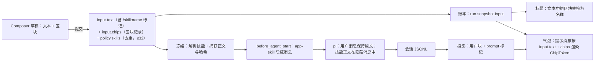

# Composer 技能区块、模糊匹配高亮与技能动态加载

Status: Implemented — 2026-09-23 全部待办已实施并验证；验证记录见 Validation 末尾，未提交
Created: 2026-09-23
Approval: 2026-09-23 用户要求执行本计划（「执行 docs/plans/2026-09-23-composer-skill-chips-and-highlight.md」），授权实施全部待办，含可选的 A6。

## Summary

目标：在已上线的 Composer 输入框（CodeMirror 区块 + `@`/`/` 快捷面板，提交 `0560468`）基础上完成五项优化，五项都在本计划内一并规划、实施：

1. 技能区块可以插在草稿任意位置，并允许重复。
2. 项目内所有带模糊搜索的输入框，结果都高亮关键字匹配。
3. `@` 面板（`use-mention-view.tsx`）及同类视图中，没有内容的分组直接隐藏，不显示空态占位。
4. 输入框中匹配到系统指令（如 `/model 5.` 的 `/model`）时颜色高亮。
5. 发送后的技能在对话记录里保持与输入框一致的区块形态，不再展开成全文；agent 依据技能指令动态加载技能，而不是由用户消息注入完整技能正文。

现状的根因（第 1、5 项）：技能区块在提交时写成开头的 `/skill:<name> `。服务端只放行开头的这一种写法（`apps/agent-service/src/skills/expansion.ts:24-87`），pi 再把它展开成 `<skill name location>…全文…</skill>` 并**作为用户消息正文**存入会话（pi 0.86.1 `agent-session.js:1091-1116`）。对话气泡和标题都直接显示这段文本。因此“只能在开头”“只能一个”“气泡里是全文”是同一个机制带来的三个结果，必须一起改。

推荐方案分四层，每层只有一个归属方：

- **技能加载（服务端）：运行冻结时捕获技能正文，以隐藏消息注入；关闭 pi 自带的技能加载。**（第 5 项，Q1 已确认）
  - 用户文本原样保留 `/skill:<name>` 标记，只作为位置提示，不再展开。
  - 冻结时读取每个技能的 SKILL.md 正文（去 frontmatter）并记录哈希。`before_agent_start` 追加一条 `customType:'app-skill'`、`display:false` 的消息，每个技能一次，按首次出现顺序，并说明“正文已加载，不要再读 SKILL.md”。这与现有的 `app-material`（指令、附件、`@` 引用）走同一条已验证的路径（`apps/agent-service/src/pi-session.ts:124-135`）。
  - pi 的技能加载器不再加载任何技能（`additionalSkillPaths: []`），并且始终 `expandPromptTemplates:false`。这样 `/skill:` 在提示和排队两条路径上都只是普通文本，技能也不再进入系统提示和会话绑定键。
  - 顺带修复三处既有缺陷：注入的是实时文件而非冻结内容；`~/.agents` 下的技能被 `read` 工具拦截（`apps/agent-service/src/service-fs.ts:26-50`）；排队路径把全文展开进队列与草稿。
- **显示契约：提交时携带区块记录，气泡和标题都按区块渲染。**（第 5 项）
  - `TaskInput` 新增可选的 `chips`：每个区块在 `input.text` 中的范围、种类、展示名与 id。它随运行快照存入账本。
  - 投影把每次运行的提示消息标记为 `prompt`。渲染端对提示气泡按 `run.snapshot.input` 渲染“文本 + 区块”，与输入框共用同一个 `ChipToken`。
  - 旧运行没有 `chips`：按开头的 `/skill:<name> ` 兼容为技能区块。账本里存的是原始文本，旧的“全文气泡”也随之恢复成区块，无需迁移。
  - 标题由文本生成，区块替换为其名称（例如 `write-commit-weekly-report 解释一下这个 skill`）。
- **编辑器：技能区块可在任意位置、可重复；识别到快捷指令时着色。**（第 1、4 项）
  - 开头的 `/` 保持现状：快捷指令、技能、钻取、全角 `／` 与 `、` 别名。新增**行内** `/`：只认 ASCII `/`，边界规则与 `@` 共用，只列技能。
  - 去掉 11 处“技能钉在开头 / 只能一个”的规则。`policy.skills` 按首次出现去重，最多 32 个。
  - 新增 `command-mark.ts`：开头的触发命中完整指令 id 时，用 `--ata-syntax-variable` 给 `/model` 等着色，只改颜色。
- **所有搜索列表：一个匹配器、一个高亮组件；快捷面板中没有选项的分组一律隐藏。**（第 2、3 项）
  - 全应用共有 17 处搜索。今天只有 `@` 文件名有高亮，而且由渲染端用 `indexOf` 另算。现有的 `commandFilter` 只是 cmdk 的 `defaultFilter`（`packages/ui/src/lib/command-filter.ts:1`），只返回分数，不返回匹配位置。
  - 新的 `packages/ui/src/lib/fuzzy-match.ts` 基于 `fuzzysort` 3.1.0（它已通过 `shadcn@4.21.0` 进入锁文件），返回分数和每个字段的匹配范围。新的 `packages/ui/src/components/highlighted-text.tsx` 负责渲染，17 处统一接入。两个模型选择器顺带修复一个既有缺陷：它们会按不可见的连接 id 匹配。
  - 分组只在有选项时出现，加载中、不可用、空都不再占位。还有用的原因移到不属于分组的位置：文件搜索不可用的原因放进“浏览文件…”的描述，`/effort` 的原因放进面板的空态行。

非目标：

- 排队消息（运行中的 steer / follow-up）携带区块。运行中仍然拒绝区块（`apps/desktop/electron/agent/service-tasks.ts:243-252`），排队文本里手输的 `/skill:` 只是普通文本。
- 模型自主发现并加载未被选择的技能。产品只给运行提供显式选择的技能（`apps/agent-service/src/skills/loader.ts:74-83`），本次不改变。
- 子代理继承技能：子代理当前不接收技能（`apps/agent-service/src/subagents/agents.ts:52,68,84,128`），本次不改变。
- 迁移旧任务的标题和会话文件。
- 快捷指令出现在草稿中间（见 Clarifying Questions 的默认决定）。

## Clarifying Questions

- [x] 第 5 项是否本次一并处理？是（用户，2026-09-23）：「需要同步处理第五项，之前只是暂时搁置了这个问题」。因此前一份计划（`docs/plans/2026-09-23-composer-mention-slash-panel.md`）的两条非目标在本计划中解除：「对话记录中用户气泡的区块渲染」「改写 `/skill:` 运行的气泡与标题显示」。第 5 项先调研方案，再与其余各项一起落为待办。
- [x] **Q1 技能由谁加载？** 用户选择 C「服务端确定性注入」（2026-09-23）。
  - C（推荐）：服务端确定性注入。看到区块就在同一轮加载，不依赖模型是否照做。这与 Agent Skills 规范对“用户显式调用”的建议一致（[agentskills.io](https://agentskills.io/integrate-skills)：由宿主查找并注入），Claude Code 与 Codex 也都在宿主侧处理显式调用（[Claude Code](https://code.claude.com/docs/en/skills)、[Codex](https://learn.chatgpt.com/docs/build-skills)）。
  - B：注册一个 `skill` 工具，由模型看到标记后自己调用。对话记录里会出现一次可见的“加载技能”调用，但 pi-agent-core 没有 `toolChoice`，无法强制调用，较弱的模型可能跳过；每个技能还多一轮往返。
  - 已排除：A「系统提示列出 + 模型用 `read` 读取」。pi 的列表路径指向 `~/.agents`，而服务端的路径限制会拦截这里的读取；其他位置在默认档位下要逐次询问（`apps/agent-service/src/service-fs.ts:26-50`，`packages/agent-contracts/src/confirms.ts:11,112-117`）。E「每次调用 LLM 前改写上下文」：只作用于单次调用、不落盘，压缩摘要看不到它，冻结版本被清理后也无法重放。
- [x] **Q2 技能目录里的 `references/` 等文件是否允许读取？** 用户选择「允许只读」（2026-09-23），落为 A7。
  - 注入的正文会写“References are relative to <技能目录>”。但 `~/.agents` 下的技能目录现在被拦截，其余位置在默认档位下每次都要确认，所以引用了附属文件的技能只能部分生效。这是既有缺陷，与第 5 项直接相关，但涉及安全边界，需要你决定。
  - 推荐：本次运行已加载的技能目录对 `read` 工具只读放行，不再确认；写入、编辑和 `bash` 仍按现有规则处理。
  - 备选：维持现状，并把它列为已知限制。
- [x] 快捷指令能否出现在草稿中间？默认不能（研究结论，可逆）。行内 `/` 只列技能。依据：`/new` 会清空整个新任务草稿（`apps/desktop/src/features/agent/use-task-panel.ts:172-183`），放在句中是破坏性的；`/model` 钻取的正则也只按开头设计。这沿用前一计划“快捷指令作用于整条草稿”的理由，只放开技能。
- [x] `／` 和 `、` 别名能否用于行内？默认不能。中文列举大量使用 `、`（如 `“苹果”、“香蕉”`），行内放开会频繁误触发，还会抢走 `、@b` 这类现在能正常打开的提及。行内只认 ASCII `/`。
- [x] 指令着色的范围？默认只在开头的触发、指令 id 完全匹配、且面板处于打开状态时着色（`/model 5.` 只给 `/model` 上色）。按 Esc 关闭面板后，这段文本会原样发送，所以不着色。技能和提及已经是蓝色区块，不另外着色。颜色用 `--ata-syntax-variable`（`packages/ui/src/styles.css:22`）：它是仓库里唯一的彩色语义色，已用于区块文字、指令编辑器的 `{{变量}}` 与补全标签，在 Composer 底色上约 5.9:1。`--primary`、`chart-*` 都是灰色，`--destructive` 表示错误。只改颜色、不改字重，避免切换时字形跳动。
- [x] 气泡里渲染哪些区块？默认五种（文件、对话、MCP、子代理、技能）都渲染。依据：`input.chips` 同时带着五种区块，逐一渲染没有额外成本；按仓库规则，同一目的的界面应一致。旧运行只兼容技能。
- [x] 文件区块与气泡上方的附件行会重复吗？默认：以区块形式出现的文件不再列成附件行，附件行只列从附件栏添加的文件，并且只显示在提示气泡上（目前每条追问气泡都会重复这些行，`apps/desktop/src/features/agent/user-context.tsx:20-49`）。
- [x] 已保存命令里的技能（有暂存、文本中没有标记）怎么办？默认与区块一样注入。它们目前依赖“列出 + `read`”，而这条路径对 `~/.agents` 技能本来就不可用。
- [x] 区块里的技能在冻结时不可用怎么办？默认保持现状：运行在提示前失败，并列出不可用的技能名（现在开头 `/skill:` 不可用时就是这样，`apps/agent-service/src/task-runner.ts:146-160`）。只来自已保存命令的技能缺失时，仍只记诊断，与现状相同。
- [x] 手输的 `/skill:x`（不是区块）怎么处理？作为普通文本发送，不再让运行失败（现在会失败）。
- [x] 旧任务迁移？不迁移。旧运行的气泡按账本中的原始文本兼容；旧标题和旧的 `@名称` 文本保持原样。
- [x] 匹配器选型（第 2 项）：`fuzzysort` 3.1.0，最低分 0.5。依据：用约 40 个查询在仿应用数据上对比，结果脚本在会话暂存目录，不入库。
  - 它按字段返回匹配位置。`5.` 作为一个整体匹配；空格分隔的多个词可以任意顺序、跨字段匹配（`openrouter gpt` 现在得分为 0）。中文子串约 0.88 分（现在约 0.17）。
  - 排序变化可以接受：更偏向子串与短名称，并去掉零散噪声（现在 `5.` 会命中 `4[.5]`）。实测噪声分数在 0.24–0.35，想要的匹配在 0.66 以上。
  - 排除的方案：
    - 移植 command-score 的回溯算法：结果一致，但等于复刻 cmdk 未导出的内部实现，而且最佳匹配常落在标题以外的字段。
    - microfuzz：分数不是 API 约定；1.0.0 之后没有新版本。
    - uFuzzy：没有数值分数，无法给分组排序。
    - Fuse.js：排序变化最大，默认只匹配字段开头约 60 个字符。
    - fuzzysort 4.0.2：新的大版本，4 天内发了两个补丁。
  - 适配器集中在一个模块里，以后升级只改这一个文件。
- [x] 高亮范围（第 2 项）：17 处全部接入，包括三处子串过滤（命令、记忆、扩展设置）与指令编辑器的 `{{` 补全。这三处严格说不是模糊搜索，统一后所有搜索框的行为和高亮保持一致，也少了一种匹配模式；这个默认可逆。
- [x] 高亮样式（第 2 项）：沿用已批准的设计。Figma 与代码都只是加粗，没有底色（`quick-panel.tsx:232`）。改为 `<mark class="bg-transparent font-semibold text-foreground">`，使弱化的描述文字里的匹配也看得见，不新增颜色 token。标题本身是 `font-medium`，加粗后的差别偏细，放在视觉验收里核对。如果需要改用 `--ata-syntax-variable` 蓝色，会改变已批准的设计，需要另行确认，改动只在共享组件的一行。
  - 更新（用户，2026-09-23）：「模糊搜索匹配到的关键字高亮颜色需要用 composer 的那个同款蓝色不过可以稍微淡一些」。改为 `<mark class="bg-transparent font-semibold text-match">`：新增 `--ata-text-match`（`--ata-syntax-variable` 与白色在 sRGB 中按 8:2 混合，即 #80b7fb），字重仍为 semibold，无底色；Figma 新增变量 `text/match`。
- [x] 空分组的范围（第 3 项）：所有没有选项的分组都隐藏，包括加载中与服务不可用；提示只能与选项一起出现（例如文件搜索结果不完整时的 `partial`）。
  - 服务断开已有全局状态提示（`apps/desktop/tests/electron.spec.ts:34,81`）。
  - 文件搜索不可用的原因放进“浏览文件…”的描述；`/effort` 的原因放进面板的空态行。
  - 在 `@` 中输入查询后，如果只剩“浏览文件…”，也显示空态行。
  - 这推翻了前一计划中“不可用原因显示在分组内”“空分组引导去扩展添加”的约定（`docs/plans/2026-09-23-composer-mention-slash-panel.md:435,437,528`）。

## File And Code References

编辑器与快捷面板（第 1、4 项）：

- 开头规则与单技能规则（全部需要改）：
  - `apps/desktop/src/features/quick-panel/trigger.ts:26-32`：`SLASH` 锚定草稿开头，别名只在这里生效。`:33-39` 是 `@` 的边界集合，行内 `/` 复用它。
  - `apps/desktop/src/features/composer-editor/draft.ts`：`:28-29` `SKILL_PREFIX`；`:63-72` `chipText`（技能自带尾随空格）；`:102-123` `normalizeDraft` 只接受 `from === 0` 的技能（`:115`）；`:125-133` `seedFromText`；`:161-165` `draftSkill` 只取第一个。
  - `composer-editor/editor-commands.ts:30-51`：每次只插一个技能、写在 0 处并替换已有技能。
  - `composer-editor/chip-state.ts:26,136-140`：`LEADING_TOKEN` 与 `leadingSkillEnd`。
  - `composer-editor/chip-integrity.ts:19-23,28,42,78-99`：把输入在 0 处的文字挪到技能后面；`cursorAfterSkill` 不让光标停在技能之前。
  - `apps/desktop/src/features/agent/use-task-panel.ts:28-38,205-213`：`withChips` 只暂存一个技能；`:115-135` 用 `seedFromText('/skill:create-* ')` 预填扩展会话。当前 312 行，最接近 350 上限。
  - `apps/desktop/src/components/composer.css:132-136`：技能区块的尾部外边距代替了自带的空格。
- 面板：`quick-panel/use-slash-view.tsx:59,127-190`（根视图列出指令与技能；`useThinkingLevels`）；`quick-panel/use-quick-panel.ts:33-35`（运行中关闭 `@`）；`quick-panel/quick-panel.tsx:195`（页脚提示）。
- 着色：`composer-editor/trigger-field.ts:5-7,42-66`（`drillCommands` facet 与 `triggerField`）；`composer-editor/chip-decorations.ts:19-26`（组合输入期间只映射、不重建装饰的先例）；`composer-editor/use-composer-editor.ts:107-114,126-131`（`compositionend` 后刷新触发）；`packages/ui/src/styles.css:22`（`--ata-syntax-variable`）。应用只有深色主题（`apps/desktop/index.html:2`，`styles.css:12`）。
- 快捷指令的执行方式：`/model`、`/effort` 只替换触发范围；`/history`、`/settings` 只清除触发文本；`/new` 会重置整份新任务草稿（`use-slash-view.tsx:81-85,118-138`，`editor-commands.ts:64-85`，`use-task-panel.ts:172-183`）。

技能加载（第 5 项，服务端与 pi）：

- 现有链路：
  - 暂存：`apps/desktop/electron/agent/run-staging.ts:17-44` → `apps/agent-service/src/skills/staging.ts:37-52`（截到 32 个，不去重）。
  - 冻结：`apps/agent-service/src/run-freeze.ts:63-93`、`skills/versions.ts:147-177,211-244`。
  - 绑定：`run-binding.ts:50-68`（技能在绑定键里，技能集合一变就重建会话）。
  - 加载器：`skills/loader.ts:39-56`（`noSkills`、`noPromptTemplates` 与 `additionalSkillPaths`）。
  - 提示：`task-runner.ts:146-161`（`decideExpansion`；不可用时运行失败）。
  - 排队：`task-runner.ts:198-216`、`tasks/queue-replace.ts:22-42`。
- 技能正文当前来自实时文件：`~/.agents/skills` 与 `~/.atd/skills` 原地编目，只记 `agents-<sha256>` 这种版本标签（`skills/user-agents.ts:88-101`、`skills/atd-skills.ts:111-125`）；只有本地、npm、git 安装的技能会被复制（`skills/package-manager.ts:57-101`）。
- 可复用：`skills/resources.ts:18-43` 的 `loadSkillResourceMaps`（读取正文并去掉 frontmatter，单文件上限 256 KB）目前没有调用方。`pi-session.ts:124-135` 的 `app-material` 钩子是注入的先例。
- pi 0.86.1（`node_modules/.pnpm/@earendil-works+pi-coding-agent@0.86.1_*/…/dist/core/`）：
  - `agent-session.js:1091-1116` `_expandSkillCommand`：只处理开头、只处理一个、实时读文件、未知技能名原样透传。
  - `agent-session.js:1117-1147`：steer 和 follow-up 总会展开，没有关闭开关。
  - `messages.js:75-96`：`custom` 消息一律按 user 角色发给模型，与 `display` 无关。
  - `system-prompt.js:99-104`、`skills.js:268-297`：`<available_skills>` 列表，排除 `disable-model-invocation`。
  - 0.85.1 源码 `agent-session.ts:1353-1377` 与之相同，只是 0.85.1 的排队路径不跑 input 处理器。
  - AGENTS.md 写的是“本地 v0.85.1 对应固定版本”，但服务端固定的是 0.86.1（`apps/agent-service/package.json:29`）。
- 路径限制：`apps/agent-service/src/service-fs.ts:26-50`（`confined` 放行任务目录、数据目录、`~/.atd/skills`、`~/.atd/agents`，其余一律拦截）；确认档位 `packages/agent-contracts/src/confirms.ts:11,112-117`，`apps/agent-service/src/tool-proxies.ts:60-141`。
- 预算：`apps/agent-service/src/tasks/run-budget.ts:9-18`（`CONTEXT_BUDGET = 120000` 字符；引用材料只填入剩余部分）。
- 不需要改：`references/conversation.ts:47-51` 生成对话摘录时已经排除全部 `custom` 消息，`app-skill` 不会进入 `@对话` 摘录。
- 要下线：`/v1/skills/expand`（`skills/mount.ts:73-77`、`skills/routes.ts:202-208`、`packages/agent-client/src/skills-client.ts:109-116`），桌面端没有调用方。
- 标题：`apps/agent-service/src/runner-manager.ts:86-100`。

显示契约（第 5 项）：

- 契约：
  - `packages/agent-contracts/src/task.ts:28-47` `TaskInputSchema` 是闭合对象。
  - `snapshot.ts:34` 定义用户块。
  - `skills.ts:11-15` 定义技能名规则，`skills.ts:118-119` 把技能上限定为 32。
  - `references.ts:5` `MAX_RUN_REFERENCES`。
- 账本严格校验：`apps/agent-service/src/ledger.ts:35-40,55`。遇到未知字段整本账本读取失败，因此新增字段后降级版本无法读取新账本。
- 投影：`apps/agent-service/src/transcript.ts:150-191`（`app-invocation` 决定 runId；用户块文本来自 pi 消息；跳过 `custom_message`）。
- 主进程镜像：`apps/desktop/electron/agent/task-schema.ts:24-40`、`transcript-schema.ts:82-89`、`service-map.ts:57-71,125-126`，提交入口 `service-tasks.ts:238-291`。
- 渲染：
  - `apps/desktop/src/features/agent/transcript/turn-view.tsx:60-64`（`message-bubble` 直接渲染 `turn.user.text`）。
  - `transcript.tsx:90-96,124-131` 与 `run-prompt.ts:4-16`（占位气泡）。
  - `user-context.tsx:20-49`（附件行）、`agent.css:170-179`（气泡 `pre-wrap`，行高 24px）。
- 区块外观的归属：`composer-editor/chip-content.tsx:26-40`（React）、`chip-widget.ts:26-34`（组件根节点必须是 inline-block，否则 Chrome 输入法会重复首字）、`components/composer.css:115-150`（区块样式，目前只因 `composer.tsx:27` 引入才在对话记录里生效）。
- 标题的显示位置：`apps/desktop/src/App.tsx:87`、`features/agent/task-history.tsx:41-43,73-74,90`、`features/agent/session-menu.tsx:32-35`、`features/quick-panel/use-mention-view.tsx:74-90`（`@对话` 行与区块标签）。

搜索与高亮（第 2 项）：

| #     | 位置                                | 过滤                                                                                                             | 匹配方式                                                            | 结果渲染                                                                                       | 现在有无高亮                                                                       |
| ----- | ----------------------------------- | ---------------------------------------------------------------------------------------------------------------- | ------------------------------------------------------------------- | ---------------------------------------------------------------------------------------------- | ---------------------------------------------------------------------------------- |
| 1–4   | `/` 指令、技能、`/model`、`/effort` | `quick-panel/use-slash-view.tsx:140-145,176,68-72,108-112`                                                       | `rankByQuery` → `commandFilter`                                     | `quick-panel/quick-panel.tsx:228-255`                                                          | 无                                                                                 |
| 5–7   | `@` 对话、MCP、子代理               | `quick-panel/use-mention-view.tsx:77,99,119`                                                                     | 同上                                                                | 同上                                                                                           | 无                                                                                 |
| 8     | `@` 文件                            | 主进程 `electron/file-search/rank.ts:104-148`；搜索进行中用 `quick-panel/use-file-search.ts:84-87` 的 `includes` | 主进程的分级子串匹配                                                | `quick-panel.tsx:228-240`                                                                      | 仅标题，渲染端用 `indexOf` 另算（`use-file-groups.tsx:56-59`），漏掉去重音后的匹配 |
| 9     | 任务历史                            | `features/agent/task-history.tsx:41-43`                                                                          | `commandFilter`，只过滤                                             | `:73-75,83-85`                                                                                 | 无                                                                                 |
| 10–11 | 设置 › 服务商、服务商目录           | `provider-settings.tsx:105-111`、`provider-catalog.tsx:31-37`                                                    | `commandFilter`，只过滤                                             | `provider-connections.tsx:65-66`、`provider-catalog.tsx:84-86`                                 | 无                                                                                 |
| 12–13 | 模型选择器、模型配置弹层            | `model-picker.tsx:70-112`、`model-config-popover.tsx:231-268`                                                    | cmdk 内置过滤，会匹配不可见的连接 id                                | `:122-129`、`:281-288`                                                                         | 无                                                                                 |
| 14–16 | 设置 › 命令、记忆、扩展             | `command-settings.tsx:140-143`、`memory-settings.tsx:205-206,239-242`、`service-settings.tsx:15-18,89-97`        | 子串（扩展设置会匹配原始 `sourceKind`，界面显示的却是翻译后的标签） | `command-settings.tsx:158-159`、`memory-settings.tsx:210`、`extension-{skills,agents,mcp}.tsx` | 无                                                                                 |
| 17    | 指令编辑器 `{{` 补全                | `instruction-extensions.ts:39-51,68-73`                                                                          | CodeMirror 内置模糊匹配                                             | `instruction-completion-list.tsx:52`，自定义列表丢掉了匹配渲染                                 | 无                                                                                 |

- `commandFilter` 的使用方：`quick-options.ts:53`、`use-file-groups.tsx:150`、`task-history.tsx:42`、`provider-settings.tsx:107`、`provider-catalog.tsx:36`。
- 快捷面板的选项与分组：`quick-panel/quick-options.ts:5-32`。`match` 只能表示单一范围，`visibleGroups` 在 `:74-77`。
- 行数：`model-config-popover.tsx` 302 行，要先把与 `model-picker.tsx:88-136` 重复的列表抽出。其余受影响文件按计划修改后都在上限以内。

空分组（第 3 项）：

- 占位来源：
  - `use-mention-view.tsx:76,96-98,115-118`
  - `use-service-lists.ts:96-113` 的 `serviceNotice`：加载中、失败、仅桌面、未连接
  - `use-file-groups.tsx:61-70,176`
  - `use-slash-view.tsx:67,100-107,123-124,172-175`
  - 面板的空态行在 `quick-panel.tsx:181-183`
- 将不再使用的文案键（`en` 与 `zh-CN` 的 `panel.json` 行号相同）：`states.desktopOnly` 204、`disconnected` 205、`failed` 206、`noSkills` 210、`noConversations` 211、`noMcp` 212、`noAgents` 213、`files.none` 234、`files.noRecent` 235。
- 保留的文案键：
  - `files.indexDisabled`、`unsupported`、`failed` 移到“浏览文件…”的描述中继续使用。它们通过模板字符串引用（`use-file-groups.tsx:65`），删除其他键时要连同模板一起检查。
  - `states.loading`、`noMatches`、`files.partial` 仍在使用。
- 现有测试都没有断言这些占位。

测试（只按改动适配，不新增）：

- `apps/desktop/src/App.test.tsx:10-15,33-39`（草稿读取、标题、历史行、气泡文本）。
- `apps/desktop/tests/app-test-bridge.ts:63,95-106`（模拟标题与用户块）。
- `apps/desktop/electron/agent/transcript-project.test.ts:20-28,170-180,219-228`。
- `apps/desktop/src/features/agent/transcript/fixtures.ts:39-41`。
- `apps/desktop/tests/electron.spec.ts:77-78,134-148`。

agent-service 与 packages 没有测试脚本。

Figma（项目文件 `D9YK1tEeBTEBgstcepesW5`，只读核对）：

- `App / Composer` 72:150（含 `Ready chips` 1453:53356）。
- `App / Composer quick panel` 1447:51964，其中 Loading 1447:51630、Unavailable 1447:51718。
- `App / Quick panel option · Rhea` 1441:51349。
- 标题、提示、页脚：1442:51276、1442:51283、1442:51320。
- 文件行示例 1448:51778；`App / Composer chip` 1451:53451 及其示例 1455:53487。
- `App / User message` 227:1129（气泡里只有一个文本节点，没有区块），消费方 693:4071、693:4141。
- 主屏 01.11–01.15：1449:52529、1449:52811、1454:43556、1449:53028、1449:53294。
- 使用说明 488:2945、1449:52526；`App / Model and service option · Rhea` 917:17424。
- 先例：`App / Command prompt editor` 417:1716，用蓝色、无填充的文字表示 `{{input}}`。
- 已知差距：Figma 变量的代码名写成 `var(--command-variable)`，代码里实际是 `--ata-syntax-variable`。

## Plan Todos

### 阶段 A：契约与服务端技能加载（第 5 项）

- [x] **A1 契约。**
  - `packages/agent-contracts/src/task.ts` 为 `TaskInputSchema` 增加可选的 `chips`：`{ from, to, chip }[]`，最多 64 个。`chip` 为闭合联合，每种只含展示和识别所需的字段：
    - `{kind:'file', fileId, name}`
    - `{kind:'task', taskId, title}`
    - `{kind:'mcpServer', serverId}`
    - `{kind:'agent', name}`
    - `{kind:'skill', name}`（沿用技能名规则）
  - 导出 `MAX_RUN_SKILLS = 32`，技能数组的 schema 与渲染端都引用它。
  - `snapshot.ts` 的用户块增加可选的 `prompt: true`。
  - 同步主进程镜像：`electron/agent/task-schema.ts`、`transcript-schema.ts`、`service-map.ts`。
- [x] **A2 提交校验与标题。**
  - 服务端接受运行时校验 `chips`：范围在 `input.text` 之内、升序、不重叠，否则拒绝。只校验边界，不耦合渲染端的序列化格式。
  - `runner-manager.ts:91-94` 生成标题：先在未修剪的文本上把各区块范围替换为名称（技能名、文件名、对话标题、serverId、子代理名），再压缩空白、截到 120 字符。没有 `chips` 时保持原逻辑。
- [x] **A3 冻结与正文捕获。**（依赖 A1）
  - `skills/versions.ts`、`run-freeze.ts`：`policy.skills` 按名称去重，保留首次出现的顺序。
  - 冻结时用 `loadSkillResourceMaps` 的正文读取逻辑捕获每个技能的正文，并记录内容哈希作为本次运行的版本。此后注入的都是这份捕获内容，不再读实时文件。
  - 技能正文计入 `CONTEXT_BUDGET`，并优先于引用材料；超出预算时运行在提示前失败，并给出明确信息。
  - 区块中的技能不可用时，运行在提示前失败，并列出不可用的技能名。只来自命令的技能缺失时仍只记诊断。
  - 可注入的技能以冻结时的能力快照 `capabilities.skills` 为准，即“请求 ∩ 角色允许 ∩ 撤销”（`skills/roles.ts:163-191`）。它的注释写明只有这份快照授权技能使用，但现有的加载器从来没读过它，这里改为遵守。角色的允许列表为空表示全部允许。角色不允许的区块技能按“不可用”处理。A7 的只读放行也只覆盖这一集合。
- [x] **A4 注入与关闭 pi 技能加载。**（依赖 A3）
  - `pi-session.ts`：加载器的 `skillEntries` 恒为空；`run-binding.ts:50-68` 把技能移出加载器条目与绑定键。
  - `before_agent_start` 增加一个处理器，返回 `{customType:'app-skill', display:false, content, details:{runId, skills:[{name, revision}]}}`。
    - `content` 先用一段英文说明开头：用户消息中的 `/skill:<name>` 标记指向下列技能，正文已加载，按标记所在位置的请求使用，不要再读 SKILL.md。
    - 然后按首次出现的顺序，逐个列出 `<skill name location>References are relative to <baseDir>.\n\n<正文></skill>`。
  - `task-runner.ts:146-161`：删除 `decideExpansion`，改为始终 `expandPromptTemplates:false`。
  - `task-runner.ts:198-216`、`tasks/queue-replace.ts:27-35`：去掉排队路径里对 `/skill:` 的预校验，它现在只是普通文本。
  - `skills/expansion.ts`：删除，或只留下仍被引用的部分。实施时先用 `rg` 确认调用方。
  - 下线 `/v1/skills/expand` 的路由与客户端函数。
- [x] **A5 投影标记提示消息。**（依赖 A1）
  - `transcript.ts:150-191`：每遇到一个 `app-invocation`，就把其后第一条用户消息标记为 `prompt: true`。
- [x] **A6（推荐，可单独推迟）压缩后重新附加。**
  - 监听 `session_compact`。如果被压缩的范围里有本任务的 `app-skill`，就把其中的技能正文（按名称去重，总量设上限）作为新的 `app-skill` 消息，在下一轮投递。
  - 正文从会话里已有的 `app-skill` 内容取，不从技能文件取，因为旧版本在运行释放后会被清理（`skills/versions.ts:218-244`）。
  - 这与 Agent Skills 规范“保护技能不被压缩”的建议一致。现状（pi 展开）在压缩后同样会丢失技能，所以它不属于回归修复。
- [x] **A7 技能目录只读放行（Q2 已确认）。**
  - `service-fs.ts` 的 `confined` 与 `tool-proxies.ts` 的确认逻辑：本次运行已加载技能的 `baseDir` 对 `read` 视为可读，不再确认。
  - 写入、编辑、`bash` 仍按原规则处理。

### 阶段 B：编辑器（第 1、4 项）

- [x] **B1 草稿模型（`draft.ts`）。**
  - `chipText(skill)` 改为 `/skill:<name>`，不再自带尾随空格，分隔符由文档负责（与其他区块一致）；删除 `composer.css:132-136` 的技能尾部外边距。
  - `normalizeDraft` 去掉 `from === 0` 的限制。
  - 新增 `draftSkills(draft): string[]`：按名称去重、保留文档顺序、不超过 `MAX_RUN_SKILLS`；删除 `draftSkill`。
  - 新增 `draftChips(draft)`：把 `ChipRange[]` 映射为契约里的 `input.chips`。
  - `seedFromText` 只保留为旧运行气泡的兼容解析（开头 `/skill:<name> `）；扩展会话的预填改为由区块片段构造。
- [x] **B2 编辑器规则（`editor-commands.ts`、`chip-state.ts`、`chip-integrity.ts`）。**
  - 技能区块在触发范围插入，与其他区块一致：空格连接，末尾补一个空格。
  - 删除 `leadingSkillEnd`、`LEADING_TOKEN`、“在 0 处输入的文字挪到技能后面”以及 `cursorAfterSkill`；`chipIntegrity` 只保留 `keepTokensWhole`，并同步更新注释。
- [x] **B3 行内 `/` 触发（`trigger.ts`、`use-slash-view.tsx`、`use-quick-panel.ts`、`quick-panel.tsx`）。**
  - 把 `@` 的边界集合提取为共享常量 `TOKEN_START`。
  - 行内规则 `TOKEN_START + '/' + [^\s/]*$` 作用于当前行，查询中不含 `/`，所以路径在第二个 `/` 处就不再匹配。
  - 解析顺序：开头、行内、提及。
  - `TriggerState` 的 slash 分支增加 `placement: 'leading' | 'inline'`；行内触发的 `from` 是 `/` 所在位置。
  - 行内视图只列技能，页脚提示为“插入”。`useThinkingLevels` 只在开头触发时加载。运行中行内 `/` 不打开。
  - 新增一个“没有匹配的技能”空态文案（en 与 zh-CN）。
- [x] **B4 提交派生（`use-task-panel.ts`）。**（依赖 A1、B1）
  - `policy.skills = draftSkills(draft).map(name => ({ name }))`，`input.chips = draftChips(draft)`。
  - 派生逻辑放在 `draft.ts`，控制本文件的行数。
- [x] **B5 指令着色。**
  - `parseTrigger` 在开头触发时返回 `command: {id, from, to} | null`：捕获前导空白与别名字符，按不区分大小写的完整 id 匹配。
  - 把 `drillCommands` facet 扩展为“全部指令 id + 可钻取子集”。编辑器不直接引入带 Lucide 图标的 `QUICK_COMMANDS`。
  - 新增 `composer-editor/command-mark.ts`，约 35 行：
    - 一个 `StateField<DecorationSet>`，从 `triggerField` 构建非包含型的 `Decoration.mark({class:'cm-composer-command'})`。
    - 组合输入期间只映射、不重建，与 `chip-decorations.ts:19-26` 相同。
    - 不能用 `decorations.compute`：`triggerField` 在组合输入期间每次都会产生新对象。
  - CSS：`.composer-input .cm-composer-command { color: var(--ata-syntax-variable); }`。

### 阶段 C：模糊匹配高亮（第 2 项）

- [x] **C1 共享匹配器。**
  - 新增 `packages/ui/src/lib/fuzzy-match.ts`，替换 `command-filter.ts`。
  - `packages/ui` 直接依赖 `fuzzysort@3.1.0`。它已在锁文件中，锁文件只多一条 importer 记录。
  - API：
    - `MatchRange = readonly [from, to]`，左闭右开，按 UTF-16 计。
    - `matchFields(query, fields)` 返回 `{ score, ranges: Record<字段, MatchRange[]> } | null`。
    - `rankByQuery` 从 `quick-options.ts` 移到这里；同分时保持源顺序（fuzzysort 本身不保证）。
    - 最低分常量 0.5。
  - 匹配与显示统一先做 NFC 规范化，避免 NFD 文件名的匹配位置错位。
  - 迁移 `commandFilter` 的五个使用方后删除 `command-filter.ts`。
- [x] **C2 共享渲染。**
  - 新增 `packages/ui/src/components/highlighted-text.tsx`：`<HighlightedText text ranges />` 把匹配段包在 `<mark className="bg-transparent font-semibold text-foreground">` 中。
  - `title` 属性保持纯文本，选项的可访问名称不变。
- [x] **C3 快捷面板。**（与 B3、D1 同改 `use-slash-view.tsx`，由同一写入者按 B3 → C3 → D1 进行）
  - `QuickOption.match` 改为按字段的 `ranges`（标题、描述）。
  - 各视图（指令、技能、模型、推理强度、对话、MCP、子代理）按可见字段调用 `matchFields`，`quick-panel.tsx:228-255` 的标题与描述都用 `HighlightedText` 渲染。
- [x] **C4 文件搜索。**
  - `electron/file-search/rank.ts` 的 `nameTier` 返回原文中的匹配范围：`foldName` 记录原始位置，范围向后覆盖组合附加符。
  - `contract.ts:21-38` 增加 `match?: ReadonlyArray<readonly [number, number]>`。结构与 `MatchRange` 相同，但主进程不引入 `@ai/ui`。
  - `service.ts:97-101` 透传该字段。
  - `use-file-search.ts` 在搜索进行中，用共享匹配器为保留的行给出范围；删除 `matchRange`（`use-file-groups.tsx:56-59`）。
- [x] **C5 模型选择器。**
  - `model-picker.tsx`、`model-config-popover.tsx` 先把重复的列表抽成一个组件。
  - 输入框改为受控，设置 `shouldFilter={false}`，与 `/model` 共用一个只看可见字段（名称、id、连接名）的排序器。
  - 这同时修复按不可见连接 id 匹配的问题：例如 `5.` 会命中没有任何可见匹配文字的行。
- [x] **C6 设置与其他列表。**
  - 任务历史（#9）、服务商（#10）、服务商目录（#11）改用 `matchFields` 加 `HighlightedText`。
  - 命令（#14）、记忆（#15）、扩展（#16）从子串过滤改为共享匹配器。扩展设置只匹配界面上可见的字段：翻译后的来源标签，而不是原始 `sourceKind`。
  - 任务历史的进行中状态放在 `Shimmer` 里，而 `Shimmer` 只接受字符串，所以这部分不高亮。
- [x] **C7 指令编辑器 `{{` 补全。** 用共享匹配器排序（补全结果设 `filter:false`），`instruction-completion-list.tsx:52` 渲染匹配范围。

### 阶段 D：空分组隐藏（第 3 项）

- [x] **D1 只保留有选项的分组。**
  - `quick-options.ts:74-77` 的 `visibleGroups` 只保留有选项的分组，`QuickGroup.notice` 只在有选项时出现。
  - 删除 `serviceNotice`，以及 `use-mention-view.tsx`、`use-slash-view.tsx`、`use-file-groups.tsx` 里的空态与不可用占位。
- [x] **D2 仍有用的原因移出分组。**
  - 文件搜索不可用的原因放进“浏览文件…”的描述（`use-file-groups.tsx:162-180`）。
  - `/effort` 的原因（未选模型、加载中、不支持推理强度）放进面板的空态行。
  - 在 `@` 中输入查询后如果只剩“浏览文件…”，显示空态行。
- [x] **D3 文案。**
  - 从 `en` 与 `zh-CN` 的 `panel.json` 删除不再使用的键（见 File And Code References）。
  - B3 新增的“没有匹配的技能”作为行内 `/` 视图的空态行。
  - 执行 `oxfmt` 与 `pnpm typecheck`，类型化的键会暴露残留引用。

### 阶段 E：对话记录中的区块与标题（第 5 项显示）

- [x] **E1 共享区块外观。**
  - `chip-content.tsx` 导出 React 的 `ChipToken`（外层 `span.composer-chip[data-kind]` 加 `ChipContent`），以及一个给 CodeMirror 组件根节点设置同样 class 与 `data-kind` 的辅助函数。
  - 区块样式从 `components/composer.css:115-150` 移到 composer-editor 自己的样式文件，由输入框和对话记录分别引入。
  - 组件根节点保持 inline-block。区块的可见文本就是其名称，避免选中气泡文字时复制到隐藏标签。
- [x] **E2 `SentText` 与提示气泡。**（依赖 A1、A5、B1）
  - 对 `prompt` 用户块，按 `runById(runs, runId).snapshot.input` 渲染文本片段与 `ChipToken`（`turn-view.tsx:63`）；占位气泡同样处理（`transcript.tsx:124-131`）。
  - 存储的范围只校验边界与重叠，不复用 `normalizeDraft`。
  - 没有 `chips` 的旧运行：开头的 `/skill:<name> ` 渲染为技能区块。
  - 非提示消息（排队追问）照旧显示纯文本。
- [x] **E3 附件行。** `user-context.tsx`：只在提示气泡上显示附件行；按 id 排除已经以文件区块出现的文件。
- [x] **E4 气泡内区块的外观。**
  - 适配气泡的 24px 行高（区块现在是 18px，`vertical-align: top`）。
  - 核对 `--input` 填充叠在气泡 `--muted` 底色上的对比度。
  - 检查长名称截断。

### 阶段 F：Figma 同步与验收

- [x] **F1 输入框与区块。**
  - `App / Composer` 72:150：新增“识别到指令”的状态（`/model 5.`，`/model` 为 syntax/variable 蓝），并在主屏配一个带查询与高亮的模型钻取画面。
  - 更新 `Ready chips` 1453:53356、01.13 1454:43556、示例 1455:53487：技能区块放在句中，并有一个重复的技能区块。
  - 行内技能视图的页脚改为“插入”（1442:51320）。
- [x] **F2 用户消息。** `App / User message` 227:1129 改为可换行的自动布局，内容由文本段和 `App / Composer chip` 实例组成，确定区块在 #262626 气泡上的样式与长名称截断；然后检查其消费方 693:4071、693:4141。
- [x] **F3 快捷面板。** 按阶段 C、D 的结论更新 `App / Quick panel option · Rhea` 1441:51349、`App / Model and service option · Rhea` 917:17424（及其嵌套的 Shared option），以及 Loading 1447:51630、Unavailable 1447:51718 两个视图。
- [x] **F4 变量与说明。** 把 Figma 变量的代码名改为 `var(--ata-syntax-variable)`；更新使用说明 488:2945、1449:52526 中与代码的对应关系。
- [x] **F5 视觉与交互验收。** 按 Validation 执行，并记录已验证的范围与剩余差距。

## Grill-Me Outcome

- Transcript: Not run
- Outcome: Not run
- Summary: 未启用访谈。多数决定由仓库证据与既有文档确定；Q1（服务端确定性注入）与 Q2（允许只读）经提问确认。

## Build From Plan

- Ready to build: 是。Q1、Q2 已确认，待办已具体化，验证方式已列出；仍需用户批准实施，可以只选部分待办（A6 可单独推迟）。
- Selected todos: 全部（A1–A7、B1–B5、C1–C7、D1–D3、E1–E4、F1–F5，含 A6）。
- Execution notes:
  - 顺序：A1 先行。A2、A3、A5 可以并行，A4 依赖 A3。B1–B3、B5 可以与阶段 A 并行，B4 依赖 A1 与 B1。阶段 E 依赖 A1、A5、B1。阶段 C、D 与其他阶段独立。F 在各项的行结构和区块样式定稿后，与实现并行。
  - 单一写入者：以下文件各自同时只允许一个写入者。服务端与渲染端并行时使用独立的 worktree。
    - `packages/agent-contracts/src/{task,snapshot,skills}.ts`
    - `apps/agent-service/src/{pi-session,task-runner,run-freeze,runner-manager,transcript}.ts`
    - `apps/desktop/electron/agent/{task-schema,transcript-schema,service-map}.ts`
    - `composer-editor/draft.ts`、`features/agent/use-task-panel.ts`、`components/composer.css`（B1 与 E1 都会改，按 B1 → E1 顺序进行）
    - `quick-panel/{use-mention-view,use-slash-view,use-file-groups,quick-panel,quick-options}`：B3、C3、D1 都会改，由同一写入者按 B3 → C3 → D1 进行
    - `packages/ui/src/lib/`、`packages/ui/package.json` 与 `pnpm-lock.yaml`
    - `i18n/locales/{en,zh-CN}/panel.json`
    - `App.test.tsx`、`tests/app-test-bridge.ts`
  - 行数上限：所有 `.ts`/`.tsx` 不超过 350 行。
    - `use-task-panel.ts`（312 行）只接线，新逻辑放进 `draft.ts`（192 行）或新文件。
    - `model-config-popover.tsx`（302 行）要先抽出重复的列表。
  - 依赖：只新增 `packages/ui` → `fuzzysort@3.1.0`（锁文件已有该版本）。第 5 项不引入新依赖。
  - 实施前重读本文件与最新的用户消息，只执行被批准的待办。

## Validation

- `pnpm --version` 须等于 `packageManager`（12.3.4，已确认）。
- 静态检查：
  - 对本任务改动的文件执行 `pnpm exec oxfmt <files>` 与 `pnpm exec oxlint <files>`。
  - 然后执行 `pnpm lint`（含 350 行上限与 shadcn 规则）和 `pnpm typecheck`。
- 现有测试：执行 `pnpm test`。按新增的可选字段适配 `App.test.tsx`、`transcript-project.test.ts`、`fixtures.ts` 与 `app-test-bridge.ts`；按仓库规则不新增测试。
- 渲染端预览（`pnpm dev:web`，`127.0.0.1:5173`，`strictPort`，启动前确认端口空闲）：
  - 技能区块插在句中、重复插入、删除、撤销；行内 `/` 只列技能；路径（`/Users/…`）在第二个 `/` 处不再匹配。
  - `、` 在句中不触发；`/model 5.` 着色，按 Esc 后恢复无色。
  - 宽度 320、420、640 与 400 px 高度下的面板。
- 真实应用（`AI_TEST_USER_DATA=$(mktemp -d) pnpm dev`，调试端口先确认空闲；只停止自己启动的实例）：
  - 发送一条句中含两个技能、其中一个重复的消息。然后核对：
    - 气泡显示区块，标题为名称替换后的文本。
    - 会话 JSONL 中的用户消息保持原文，另有一条 `app-skill`，每个技能各出现一次。
    - `/v1/skills` 的运行记录中技能已去重。
    - 模型按技能行事，并且没有再去读 SKILL.md。
  - 手输的 `/skill:x` 作为文本发送，运行不失败；排队消息中的 `/skill:x` 不展开。
  - 已有的旧 `/skill:` 任务：气泡显示为技能区块。
  - 区块中的技能被卸载后发送：运行失败并给出技能名。
  - 超出预算的技能：运行失败并给出明确信息。
  - A7（如批准）：读取 `~/.agents` 技能的 `references/` 时不再确认，写入仍被拦截。
  - 真实输入法：光标位于句中技能区块前时开始组合输入，首字不重复（沿用前一计划的输入法检查）。
- 高亮（渲染端预览；设置窗口的服务商、命令、记忆、扩展在预览中没有桌面桥，放到真实应用中检查）：
  - 17 处搜索逐一输入查询。重点查询：`5.`、`gpt 5`、`openrouter gpt`、中文子串、`resume` 对 `Résumé`、一个 NFD 文件名。
  - 核对：高亮的位置正确；描述中的匹配也可见；排序最好的在前，同分保持原顺序；模型选择器不再出现没有可见匹配的行。
  - 在正常查看尺寸下核对加粗的强度，必要时附一张细节截图。
- 空分组：
  - 服务断开、加载中、MCP 与子代理为空时，`@` 面板里都不出现这些分组。
  - 文件搜索不可用时，原因显示在“浏览文件…”的描述里。
  - `/effort` 在没有模型时显示空态行。
  - `@` 查询无匹配时显示空态行。

### 验证记录（2026-09-23）

- 静态检查：`pnpm lint` 0 个错误（desktop 的 432 条 `no-unknown-classes` 警告为既有积压）；`pnpm typecheck`、`pnpm test`（desktop 54/54）、`pnpm build`、`pnpm test:electron`（1/1）均通过。`pnpm format:check` 只在 24 个与本任务无关的既有文件上失败（`.agents/skills/**`、`.claude/launch.json`、`apps/agent-service/product-skills/create-subagent/SKILL.md`、本文件与 `2026-09-22-extensions-settings-configuration.md`）。
- 真实应用（隔离 profile、假 HOME、模拟 LLM，Playwright 驱动）：
  - 第 5 项 12/12 通过：句中与重复区块、标题、会话 JSONL（用户消息保留标记，每次运行一条 `app-skill`，技能去重）、`/v1/skills?runId=`、模型请求中每个技能正文各一次且无 `<available_skills>`、手输与排队的 `/skill:` 保持文本、旧任务显示区块、不可用技能与超预算在调用模型前失败、A7 读取免确认且写入仍被拦截、非法范围返回 400、`/v1/skills/expand` 返回 404、复制跨区块只得名称、气泡 24px 行高（区块对比度 3.65:1）。
  - 第 1、3、4 项通过：开头与行内 `/`、路径与 `、`、`／` 规则、指令着色、空分组、320/420/640 宽与 400 高、CDP 组合输入（非真实输入法）。发现行尾换行前插入区块不补空格（共享插入逻辑的既有问题），已修复。
  - 第 2 项通过：快捷面板、三处模型列表、任务历史、服务商、命令、扩展（含 zh-CN）、`{{` 补全。记忆设置未运行：运行冻结 `memory:false`，界面也无法新增条目。
- 实施中的调整：
  - 匹配高亮按用户决定改为 `text-match`（见 Clarifying Questions），Figma 新增变量 `text/match`。
  - 模型列表的分组标题也标出连接名的匹配；没有模型的连接分组不再显示。
  - 服务商目录只匹配可见名称；服务商总览匹配连接名与服务商名称，只在连接名上高亮（空态提示承诺两者）。
  - 桌面端提交时始终带 `input.chips`；已保存命令替换文本时为 `[]`，避免被当作旧运行显示区块。
  - 另一个会话修复了 `{{` 补全每次按键重建编辑器导致的闪烁，并让 Tab 接受补全；补丁已合入本工作区。
  - 随后按用户要求（2026-09-24）修复：`{{` 补全在输入 `{{` 时就打开列表，快速输入后按 Enter 或 Tab 也能接受；变量按钮直接写入编辑器，不再与正在进行的输入竞争；模板错误在编辑器与保存时都显示翻译后的文案（`TemplateSyntaxError`、`instruction-problem.ts`）。均已在真实应用中验证。
  - 各写入者共用同一工作区、每个文件只有一个写入者，没有使用独立 worktree（worktree 缺少 `node_modules`）。
- 未验证：真实输入法（仅 CDP 组合输入）；已保存命令在已连接服务商下的完整运行；原生窗口合成（本任务未改原生窗口）。
- 已知限制：单个字符的查询如果不在词首则不匹配（阈值 0.5，例如 `{{e`）；截断在省略号之后的匹配看不到高亮；`{{` 补全标签本身是蓝色，匹配段与其区分不明显；拖选气泡文字时区块没有选中底色（复制内容正确）。

## Risks

- 模型可能仍会去读 SKILL.md（Codex 有同类问题，[openai/codex#18770](https://github.com/openai/codex/issues/18770)）。缓解：说明里写明“正文已加载”，同时去掉 pi 系统提示中“用 read 加载技能”的列表。
- 用户消息后紧跟一条 user 角色的隐藏消息，形成连续两条 user 消息。各家模型提供方对此的兼容性，目前只由现有 `app-material` 路径间接证明，需要在真实应用中用常用的几家模型实测。
- 账本降级：新增 `input.chips` 后，旧版本服务读取新账本会整本失败（`ledger.ts:35-40`）。桌面端与服务端一起发布，只影响手动降级。
- 已保存命令的技能改为一开始就全部注入，上下文占用上升；靠预算与失败提示约束。
- 行内 `/` 会在文件路径上短暂打开面板并显示“没有匹配”，直到输入第二个 `/`。
- 去掉 `cursorAfterSkill` 后，可以在技能区块前开始组合输入，需要用真实输入法实测。
- 既有问题（本计划不处理）：
  - 在已有文字前输入开头的 `/new`，会丢弃整份新任务草稿（只解析光标之前的文本）。
  - 旧会话在 `@对话` 摘录里仍会带出展开后的技能正文。
- 文档差异：AGENTS.md 写“本地 v0.85.1 对应固定版本”，实际固定的是 0.86.1。0.86.1 的排队路径会运行 input 处理器，这是两版之间与本方案相关的唯一差异。
- Figma 的变量代码名与代码不一致（F4）；Figma 中浅色模式的取值未核对（应用本身只有深色主题）。
- 匹配器换成 fuzzysort 后排序会变化（更偏向子串和短名称）。已按实测数据取 0.5 的最低分，但真实数据的分布可能不同。
- 只靠隐藏文本命中的行不会有高亮：指令的关键词、作为分组标题的连接名。
- 分组在加载完成后才出现，面板高度会随之跳动。这是隐藏占位的代价。

## Approval

- Status: Draft - awaiting approval
