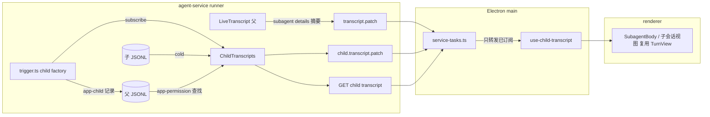

# Subagent 完整消息渲染

Status: In progress - implementing
Created: 2026-09-25
Approval: Approved by user ("执行计划"), all todos

## Summary

目前父会话里的 `subagent` 调用只渲染为一行工具行（Bot 图标 + "调用子代理 · agent 名"），展开后是最终输出文本的 JSON 树。子代理自己的思考、工具调用和回答全都看不到。任务底部还有一个 `transcript-children` 列表，但它按 JSON 解析 `subagent` 输出，而这个输出实际是纯文本，所以通常为空；它算出的 `executionId` 也是错的。

目标：每个子代理都拥有与主会话一致的完整消息渲染，包括思考、活动分组、工具行、Markdown 回答、审批状态和轮次耗时。运行中实时更新，重开任务后能从持久化数据恢复。

方案分三层，都沿用现有的 projection、patch、Transcript 组件，不另起一套：

1. **服务端（agent-service）**：子会话的正文来源是 pi-subagents 写在父会话目录下的子 JSONL（`<sessionsDir>/<parentBase>/<runId>/run-<idx>/session.jsonl`）。用与父会话相同的 `projectServiceBlocks` 投影成 `ServiceBlock[]`。实时路径订阅 `ChildSession.subscribe`；冷路径读取子 JSONL。父会话 JSONL 追加 `app-child` 记录，作为父调用（`toolCallId`）、子会话和 executionId 之间**唯一**的关联来源，这与现有 `app-permission`、`app-question` 的做法一致。
2. **契约与传输**：`subagent` 工具行增加一个有边界的摘要 details（`type: 'subagent'`，按子代理列出状态、agent、任务、当前工具、用量、最终输出预览）。完整的子会话 transcript 按需订阅：服务推送 `child.transcript.patch`，只提供按需的快照 HTTP 端点；main 只转发渲染层已订阅的子会话。
3. **渲染层（desktop）**：消息里的 `subagent` 行保持普通工具行，不渲染子代理卡片。输入框上方进度胶囊的子代理部分（"N running"）点击时弹出精简列表（扁平列表按状态排序，行首图标表示状态 + 任务标题 + 箭头），点击列表项后，任务面板切换到该子代理的钻取视图，用现有的 `adaptTranscript → TurnView/ActivityGroup` 渲染完整对话（Q1 已定，入口形态按用户 2026-09-25 的参考图修订）。

## Clarifying Questions

- [x] **Q1 展示形态**：用户选定 **B：摘要 + 钻取视图**。实现后用户修订了入口：子代理列表不在消息里渲染，而是悬停进度胶囊的子代理部分时以弹出层展示，列表项只显示头像和任务标题，点击进入完整对话（带面包屑和返回）。
- [x] **Q2 运行结束后的入口**：用户确认要保留。胶囊的子代理部分对最近一次回复带摘要的子代理常驻（回复结束后和重开任务时显示 "N subagents"，列表与钻取不变）；没有摘要的旧 transcript 只在运行中显示计数。更早回复的子代理暂无入口。
- [x] 数据来源：以子 JSONL 为正文来源，不把子消息塞进父 tool details。依据是 pi-subagents 最终 details 已经 `compactForegroundDetails` 剥离了 `messages`，而且父 patch 会因此无界膨胀。
- [x] 传输：按需订阅，不随父 patch 推送整段子 transcript。
- [x] 范围：只覆盖前台子代理（service 固定 `async:false`、`maxSubagentDepth:1`）；不做后台/嵌套/恢复路径。

## File And Code References

### 现状（证据）

- `apps/desktop/src/features/agent/transcript/tool-block.tsx:27`：`subagent` 与普通工具共用 `ToolBlock`，body 走 `tool-body.tsx:146` 默认分支 `JsonTree`。
- `apps/desktop/src/features/agent/transcript/subagent-call.ts`：只从 args 推导标签、目标和派发数。
- `apps/desktop/src/features/agent/transcript/transcript.tsx:161-173`：`detail.children` 的简陋列表。
- `packages/agent-client/src/subagents-client.ts:52-70`：`extractSubagentResults` 对纯文本输出做 `JSON.parse`，`executionId` 用 `results.length` 拼接，与服务端全局 `childSequence` 不一致。
- `apps/desktop/electron/agent/service-tasks.ts:66`、`apps/desktop/electron/agent/bridge.ts:50-60`：`TaskDetail.children` 的来源。
- `apps/agent-service/src/transcript-blocks.ts:202-206`：只有 completed 调用才走 `projectToolDetails`；`apps/agent-service/src/transcript-details/index.ts:20-25` 没有 `subagent` 投影器。
- `apps/agent-service/src/live-transcript.ts:62-63`：`tool_execution_update` 只保存 partial 文本，丢掉了 partial details（pi-subagents 的实时 `progress`）。
- `apps/agent-service/src/subagents/trigger.ts:99-146`：child factory 包装器，这是拿到 `ChildSession`（含 `subscribe`、`messages`、`sessionFile`）和 `launch.runtime.agent` 的唯一入口，也是写入 `app-child` 的位置。
- `apps/agent-service/src/subagents/registry.ts:166-193`：`ChildRecord.executionId = child:<parentRunId>:<全局序号>`，与 pi-subagents 的 `SingleResult.index` 无关。
- `apps/agent-service/src/subagents/workflows.ts:104`：并行脚本对每个子结果分别返回 `result.runId`，说明 workflow 中每个子代理有自己的 runId，不能用父 `details.runId` 关联子会话。
- `apps/agent-service/src/subagents/guard.ts:15-18,32`：`GuardInput` 只声明了 `toolName/input`，`guardSubagentCall` 放行时不记录调用 id；但 Pi 的 `tool_call` 事件本身带 `toolCallId`（`pi-coding-agent` `extensions/types.d.ts:679-682`），`delegator.ts:136` 把原始事件直接传给 guard。`delegator.ts:137` 的 `tool_result` 回调（`onSubagentResult`）可用于在调用结束时清除。
- `apps/agent-service/src/harness/gate.ts:60`：子代理的审批记录 `app-permission` 写入**父**会话，子 JSONL 里没有。
- `apps/desktop/electron/agent/permission-schema.ts:112`：请求带 `executionId`；`approval-controls.tsx:112` 与 `question-block.tsx:131` 直接显示原始 id。

### 上游（只读，已安装包为准）

- `pi-subagents/src/shared/types.d.ts:844`（`AgentProgress`）、`:1104`（`SingleResult`：`index/agent/task/exitCode/usage/model/sessionFile/finalOutput/toolCalls/progress/error`）、`:1301`（`Details`：`runId/toolCallId/results/progress`）。
- `pi-subagents/src/shared/utils.js:381-400`：`compactForegroundResult` 在结束时去掉 `messages/progress` 并隐藏 task，但保留 `sessionFile`、`finalOutput` 和 `toolCalls`。
- `pi-subagents/src/extension/index.js:265`：子会话根目录为 `<dirname(parentSessionFile)>/<basename>`，位于服务 `sessionsDir` 内，持久保存。
- `pi-subagents/src/runs/shared/child-session.js:338-357`：`ChildSession` 暴露 `subscribe/messages/sessionFile/sessionId/modelId`。
- `pi-subagents/src/runs/shared/child-runtime-config.d.ts:53`：`runtime.runId`、`runtime.childIndex` 属于 pi-subagents 内部的 run 身份，本方案不用它们做关联（见「身份」）。

### 已有设计约定

- `docs/plans/2026-09-20-pi-subagent-skills-mcp.md` D3："Pi JSONL 仍是会话正文来源；ledger 保存父子关系……父任务 UI 聚合活动，父模型只收到明确的子结果"。D8："父任务活动区展示子执行；确认对话标明所属任务/子任务/具体操作"。本方案落实这两条，不改变父模型可见的内容。

## Design



### 身份

- **`app-child` 是唯一关联来源**。不使用 pi-subagents 的 `runId` 关联父调用与子会话（证据见 `workflows.ts:104`：workflow 中每个子代理有各自的 runId）。它本来就是冷路径找回被中断子代理、审批弹层做 `executionId → agent/任务` 映射的必需记录，不再另外维护第二套关联。
- **toolCallId 的来源**：`guardSubagentCall` 放行一次发起类调用（非 `list/status`）时，把事件的 `toolCallId` 写入父 registry 记录的 `activeToolCallId`，同时把 `launchSeq` 重置为 0。每个父会话同一时间只有一个前台委派（service 的 foreground dispatch guard，见 `2026-09-20` 计划 D4），所以这个单值不会被并发调用覆盖。`onSubagentResult`（`tool_result`）、父会话停止和 `rebindParentRun` 时清除它。
- **记录写入**：`trigger.ts` 创建子会话成功后，读取父记录的 `activeToolCallId`，分配 `seq = launchSeq++`，然后通过父会话的 `appendCustomEntry` 写入：
  `app-child { toolCallId, seq, executionId, agent, sessionFile, startedAt }`
  如果此时没有 `activeToolCallId`，拒绝这次启动并报出明确错误（fail closed），不写无主记录；P0 负责确认正常路径不会触发这个分支。
- **`childKey = <toolCallId>:<seq>`**。父 details 摘要的 `children[].key`、`child.transcript.patch`、订阅 IPC 和 HTTP 端点统一使用它；HTTP 路径中对 key 做 URL 编码。
- **摘要与记录的合并**：details 投影器是纯函数，拿不到启动序号，所以父 `subagent` 行的子代理列表**以该 `toolCallId` 的 `app-child` 记录为准**（`collectBlockLookups` 新增按 toolCallId 分组的 `children` 查找，按 `seq` 排序）。pi-subagents 的 `results/progress` 只用来补充状态、用量和最终输出，按 `sessionFile`（`app-child` 自身的字段，不是另一套关联）匹配到对应卡片；匹配不到的 details 行不单独生成卡片。
- 服务端校验 `sessionFile` 的 realpath 必须位于该任务父会话的子会话根目录内，不接受渲染层传入的路径。

### 子会话 transcript 投影

- 实时：`ChildSession.subscribe` 事件触发重投影。branch 由 `child.messages` 映射为 `{type:'message'}`，加上 streaming partial 和 partial 文本，调用 `projectServiceBlocks({ firstRunId: parentRunId, live: true })`，再用 `diffServiceBlocks` 产出 patch。子会话结束后改用冷路径。
- 冷：`SessionManager.open(sessionFile)` → `fromServiceBranch(getBranch())` → `projectServiceBlocks({ live: false })`。block id（`a:/t:/tool:`）在两条路径上一致。
- 审批：投影时合并**父**会话的 `app-permission` 查找（`collectBlockLookups` 需要接受额外的 lookups），子工具行才能显示已记录的授权结果。

### 父 `subagent` 行 details（新 `ToolBlockDetails` 变体）

```ts
{ type: 'subagent', truncated: boolean,
  children: Array<{ key /* <toolCallId>:<seq> */, seq, agent, task /* ≤500 字 */, status: 'pending'|'running'|'completed'|'failed'|'interrupted',
    model?, currentTool?, toolCount, turnCount?, durationMs, inputTokens?, outputTokens?,
    finalOutput /* ≤8000 字 */, error }> }
```

- 卡片列表来自 `app-child`（见「身份」）。状态和用量在 running 时从 `tool_execution_update.partialResult.details.progress/results` 补充，completed/failed 时从最终 details 补充；子代理已写记录但还没有任何 details 行时，显示为 running，不显示元信息。这放宽了 `transcript-blocks.ts:202` 与 `ToolDetailsSchema.data` 注释中"只有 completed 才有 details"的约定，仅限 `subagent`，需要同步更新注释。
- 完成时 pi-subagents 把 task 隐藏成 `[prompt redacted]`，所以 task 从调用 args 读取（`subagent-call.ts` 已经能解析 `task/tasks/steps`）。

### 渲染

- `subagent` 行（发起类与管理类）都保留普通工具行；子代理摘要只供胶囊列表、钻取视图和审批归属使用（`tool-copy.ts` `structuredDetails` 对 `subagent` 返回 null）。
- 胶囊（`progress/progress-pill.tsx`）最多三个独立控件，依次为：HITL 部分（审批 / 回答 / 排队，有待处理内容时一直显示）、步骤部分（有 todos 时可点）、子代理部分（有子代理摘要时可点）。三者打开的是**同一个**弹层（`components/composer-popover.tsx`，类似 shadcn Navigation Menu 的共享 viewport）：弹层在胶囊上方 8px：Todos 与子代理视图居中对齐各自的胶囊部分（窄窗口下由 8px 碰撞边距夹住），HITL 视图与 composer 等宽对齐；点另一个部分时同一弹层滑到该部分并切换视图（`HitlPanel` / `TodosPanel` / `SubagentPanel`），`MorphViewport` 用 200ms 过渡宽高、新视图 160ms 淡入；再点已展开的部分关闭。`useComposerView` 决定显示哪个视图：HITL 内容变化会自动打开 HITL 视图，但用户主动打开的 Todos / 子代理视图只会被新到达的请求顶替。点击 composer 只在 HITL 视图下不算外部点击。各部分之间是居中的 12px 分割线；窄面板只截断 HITL 标签。子代理列表不分组，按 等待审批 / 等待回答 → 运行中 → 失败 → 已中断 → 已完成 排序（同状态保持启动顺序），行首图标即状态：等待时沿用胶囊的 ShieldAlert / MessageCircleQuestion，运行中为旋转的 LoaderCircle，失败为红色 CircleX，已中断为 CircleSlash，已完成为 CircleCheck（与 Todos 列表同一图标风格）；原彩色头像与 `--subagent-tone-*` 已移除。
- 钻取视图覆盖在父 transcript 之上（`.task-stage` / `.child-conversation`），父 transcript 用 `visibility:hidden` + `inert` 隐藏，滚动位置由浏览器保留。
- 子会话完整对话复用 `adaptTranscript`、`TurnView`、`ActivityGroup`、`AssistantBlock`（Markdown）、`ToolBlock`。`requests` 直接传入任务级 `RequestIndex`，因为子工具的 `toolCallId` 就在子 blocks 里，待审批状态自然会出现。子视图不渲染 `TaskFiles` 与复制整轮的入口，这些归父会话所有。
- 审批弹层与 question 中 `confirms.subtask` 改为显示 "agent 名 · 任务摘要"，数据来自 `app-child` 映射，不再显示原始 `executionId`。
- 删除 `transcript.tsx` 的 `transcript-children` 区块、`TaskDetail.children`、`extractSubagentResults/collectChildRefs/countSnapshotChildren`，以及对应的 `panel` i18n 键。这些由新 details 取代，保证只有一个归属方。
- 新文案进入 `tasks` 命名空间，en 与 zh-CN 同步。

## Plan Todos

- [x] **P0 验证（开工前，只做确认，不用于选方案）**：用真实 runner 分别跑单个委派、`service.parallel`（2 个子代理）和 `service.chain`（2 步），确认以下几点：
  - `app-child` 的 `toolCallId` 能正确对应父 `subagent` 行，三种调用都要验证，而且 parallel/chain 的每个子代理都要归到同一个父行；
  - 子会话 JSONL 的实际路径符合 `<sessionsDir>/<parentBase>/<runId>/run-<idx>/session.jsonl`，并且在子根目录的包含校验范围内；
  - `tool_execution_update` 的 `partialResult.details` 带有 `results/progress`（同时记录行上是否带 `sessionFile`，这是与 `app-child` 合并时要用的字段）。
    若有任一点不符合预期，只调整对应实现细节并更新本计划，关联方案不变。
  - 结果（代码核对，未做真实 runner 运行：隔离 profile 没有模型凭据）：① `service.parallel`/`service.chain` 同样是一次 `subagent` 工具调用（`workflow` 参数，`guard.ts` `guardWorkflowCall`），所有子代理都在 guard 放行到 `tool_result` 之间以前台方式启动，三种形态都归到同一个 toolCallId；② 子根目录见 `pi-subagents/src/extension/index.js:265`；③ `onUpdate` 的 details 为 `{ mode, results, progress }`（`execution.js` 约 857–870、1564–1577 行），但 `result.sessionFile` 只在收尾时写入（约 1941 行），所以运行中的行通常不带 `sessionFile`，卡片按计划降级为只显示 running。
- [x] **S1 契约**（依赖 P0）：`packages/agent-contracts/src/tool-details.ts` 增加 `SubagentDetailsSchema`（`children[].key` 为 `<toolCallId>:<seq>`）并加入联合类型；新增 `ChildTranscriptPatch` 契约（`taskId, childKey, revision, snapshot, blocks, removed`）以及 `app-child` 记录 schema `{ toolCallId, seq, executionId, agent, sessionFile, startedAt }`（与 `transcript-blocks.ts` 中 `PermissionRecordSchema` 的写法一致）。desktop `transcript-schema.ts` 的 `ToolDetailsSchema.data` 注释同步修改。
- [x] **S2 details 投影**（依赖 S1、S3）：新增 `apps/agent-service/src/transcript-details/subagent.ts` 并注册；`collectBlockLookups` 收集 `app-child` 记录，投影时按 toolCallId 取出子代理列表，再按 `sessionFile` 合并 details 行。`LiveTranscript` 除 partial 文本外还要保存有边界的 partial details（仅 `subagent`）；`projectAssistantServiceBlocks` 为 running 的 `subagent` 使用它们。
- [x] **S3 调用记录与子会话记录**（依赖 S1）：
  - `guard.ts`：`GuardInput` 增加 `toolCallId`；`guardSubagentCall` 放行发起类调用时调用 registry 的新函数 `beginDelegation(taskId, toolCallId)`，管理类调用和被拒绝的调用都不写。`onSubagentResult` 调用 `endDelegation(taskId, toolCallId)`，只有 id 相同时才清除。
  - `registry.ts`：`ParentRecord` 增加 `activeToolCallId: string | null`、`launchSeq: number`，以及 `appendChildEntry` 回调（在 delegator 注册父会话时从父 `sessionManager.appendCustomEntry` 注入，不序列化）；`markParentStopping`、`rebindParentRun` 和 `forgetTaskTree` 清除 `activeToolCallId`。`ChildRecord` 增加 `toolCallId`、`seq`、`sessionFile`，`key` 改为 `<toolCallId>:<seq>`（原先的 `<runId>:<全局序号>` 只在内部使用，统一掉）；`executionId` 格式保持不变。
  - `trigger.ts`：`tryTrackChildStart` 读取 `activeToolCallId` 并分配 `seq`，没有时拒绝启动；子会话创建成功后写入 `app-child`，然后把 `ChildSession` 交给 `ChildTranscripts`。
- [x] **S4 ChildTranscripts**（依赖 S3）：新增 `apps/agent-service/src/subagents/child-transcript.ts`，负责实时订阅、重投影、diff 并通过 `ctx.events` 发布 `child.transcript.patch`，子会话 dispose 后停止。冷投影函数与实时路径共享 `projectServiceBlocks`，另外合并父会话 `app-permission` 查找（`transcript-blocks.ts` 的 `collectBlockLookups` 需要支持外部 lookups）。
- [x] **S5 服务端点**（依赖 S4）：`server.ts` 或任务路由增加 `GET /v1/tasks/:taskId/children/:childKey/transcript`（`childKey` 需 URL 编码），在父会话中按 `childKey` 查找 `app-child` 记录并解析路径并做 realpath 包含校验；子会话仍在运行时返回实时快照。`packages/agent-client` 增加对应的 client 方法。
- [x] **M1 main 转发**（依赖 S5）：`service-tasks.ts` 处理 `child.transcript.patch`，只为已订阅的 `(taskId, childKey)` 维护缓存并转发，出现 revision 断档时重新拉取快照。新增 IPC 请求 `child-transcript:subscribe/unsubscribe`，main 端校验 payload 并用 typebox 校验 blocks（复用 `BlockSchema`、`mapBlock`）。preload 通过现有 typed bridge 暴露，不暴露 raw ipc。
- [x] **M2 清理旧聚合**（依赖 M1）：删除 `TaskDetail.children`、`extractSubagentResults` 及相关导出，删除 `transcript.tsx:161-173`，并清理 `panel` 命名空间中不再使用的 `children.*` 键（en 与 zh-CN）。
- [x] **R1 摘要入口**（依赖 S2；按用户修订改为胶囊悬停列表，见「渲染」）：原方案为 新增 `transcript/subagent-body.tsx`，`tool-body.tsx` 为发起类 `subagent` 分派到它，`tool-copy.ts` 的 `hasToolDetail` 同步修改。每个子代理显示 agent、任务（两行截断，可查看全文）、状态（running 时 Shimmer 显示当前工具）、元信息（工具数、耗时、tokens）、最终回答预览（`Markdown` 组件，折叠显示）和失败原因。并行子代理按启动序号排列，使用统一的行结构（见 AGENTS 的 List And Row Consistency）。
- [x] **R2 子会话钻取视图**（依赖 M1）：新增 `use-child-transcript.ts`（订阅、`applyTranscriptPatch` 和卸载时退订）与 `child-transcript-view.tsx`，复用 `adaptTranscript` 和 `TurnView`。在 `use-task-panel.ts` 所属的任务面板中加入子视图状态：面包屑 "任务 › agent"、使用 `App / Icon button` 的返回按钮、Escape 返回、返回后焦点回到触发的卡片、返回时恢复父 transcript 的滚动位置。子视图头部显示任务全文、状态和用量；composer 保持为父任务的 composer，审批弹层照常工作。子会话运行中时视图实时更新，并沿用 `use-transcript-scroll` 的跟随底部行为。
- [x] **R3 审批归属**（依赖 S3）：`approval-controls.tsx` 与 `question-block.tsx` 的 subtask 标签改为 "agent · 任务摘要"，数据来自 `app-child` 映射。当子代理有待审批请求时，摘要卡片显示 "等待批准"。
- [x] **R4 i18n**（与 R1–R3 同步）：`tasks.json` 的 en 与 zh-CN 新增 `subagent.*` 键，键集合保持一致。
- [x] **F1 Figma 同步**：已同步到项目文件：`App / Progress pill`（1499:53918，改为两段式）、新增 `App / Progress pill segment`（1523:57936）、`App / Subagent list row`（1523:58148）、`App / Subagent list popover`（1524:57971）、`App / Subagent drill-in header`（1525:58108）、色调变量 `subagent/tone-0..4`，以及 H 页的 420/320 弹层与 420 钻取视图示例（1525:58160、1525:58352、1526:48076）和映射表（1526:58532）。遗留：面包屑标题在 Figma 中按 284px 上限处理；钻取头部没有 Interrupted 变体；旧参考「Q2 · 面板与渲染参考」中的 `App / Activity group` 实例（237:1418）仍展示子代理结果，未改动共享组件。胶囊三段式（HITL / Step / Subagents）已同步：`App / Progress pill segment` 新增 Kind=HITL 与 State=Expanded，`App / Progress pill` 新增 HITL=Shown 变体，示例 1500:56473（420）、1500:56852（320）已更新；窄面板的 HITL 截断在 Figma 中用变量模式「Panel 320 · three parts」切换。共享弹层已同步：新增 `App / Composer popover`（1533:58668，View = HITL / Todos / Subagents，唯一的弹层外观），原 `App / Approval popover`（1500:54974）、`App / Todos popover`（1499:53978）、`App / Subagent list popover`（1524:57971）改为无外观的 `App / HITL panel` / `App / Todos panel` / `App / Subagent panel`；420/640/320 的 Todos、HITL、Subagents 示例都只显示一个居中于 composer、距胶囊 8px 的弹层，对应部分为 Expanded。遗留：Figma 圆角沿用 22px 变量（与代码 `rounded-3xl` 一致）；尺寸过渡与淡入只在说明中记录，未做原型动画。
- [ ] **V1 验证**：见 Validation。已完成：typecheck、lint（0 错误）、oxfmt、`pnpm test`（54 个测试）、en/zh-CN 键集一致；渲染层用 mock bridge 在 420/320px 和矮高度下验收了胶囊列表（悬停、点击、Enter/Tab/Escape）、钻取视图、审批归属标签、返回后的焦点与滚动保持。未完成：真实 runner 的端到端运行（隔离 profile 无模型凭据），包括实时 patch、冷路径重开和服务端点。

## Grill-Me Outcome

- Transcript: Not run
- Outcome: Not run
- Summary: 未运行。唯一需要用户判断的 Q1 已通过结构化提问解决（B），其余由代码证据和已有设计决定。

## Build From Plan

- Ready to build: Yes
- Selected todos: 全部。S1 由主会话先行冻结（contracts 包 + desktop `bridge.ts`/`transcript-schema.ts` 的子会话类型），随后按写范围并行：服务端 S2–S5、main 与 agent-client M1/M2/S5 client、渲染层 R1–R4 与 M2 渲染部分。
- Execution notes: P0 是真实运行验证，按 AGENTS 的 Runtime Debugging 流程使用隔离 profile（`AI_TEST_USER_DATA=$(mktemp -d)`），端口先确认空闲。新文件保持在 350 行以内；`service-tasks.ts`（296 行）加上子会话转发后可能超限，届时把子 transcript 转发拆到 `electron/agent/child-transcripts.ts`。

## Validation

- `pnpm --version` 与根 `packageManager` 一致。
- `pnpm typecheck`、`pnpm lint`（包括 350 行限制和 `@shadcn/lint`），`pnpm exec oxfmt <changed-files>`。
- `pnpm test`：已有的 `activity.test.tsx`、`approval.test.tsx`、`question.test.tsx`、`transcript-project.test.ts` 和 agent-service 的 transcript 测试继续通过。用户未要求时不新增测试。
- 运行时（隔离实例）：单个委派与 parallel 各一次，检查运行中卡片实时更新；钻取进入子会话对话，确认面包屑、返回、Escape 和焦点恢复正常，确认思考、工具、Markdown 回答都能渲染；子代理触发 bash 审批时卡片和子视图显示等待批准，审批弹层显示 agent 名；中途停止后，被中断的子代理仍能打开已产生的对话；重启应用重开任务后，冷路径渲染的内容与实时一致。
- 面板宽度 320、420、640px 以及矮高度下检查长 agent 名、长任务、长最终回答、并行 3 个子代理和失败状态，确认没有横向滚动，动作位置稳定。

## Risks

- **身份关联**：以 `app-child` 为唯一来源后，风险集中在 `activeToolCallId` 这个单值上。它依赖「每个父会话同一时间只有一个前台委派」这一约束；如果日后放开并发委派或后台委派，需要改为在 launch 上携带调用 id（例如通过 required extension 或 managed settings 传入），不能继续用单值。缺少 `activeToolCallId` 时拒绝启动（fail closed），不会产生无主子会话。另一个依赖是：用 pi-subagents details 行补充卡片信息时按 `sessionFile` 匹配，如果 running 阶段的行不带 `sessionFile`（由 P0 确认），卡片在运行期只显示 running，不显示实时元信息，完成后恢复正常。
- **放宽 details 约定**：running 时带 details 会让每次 `tool_execution_update` 都 diff 整个摘要。摘要有边界（task 500 字、finalOutput 8000 字、子代理数量受 workflow 上限约束），开销可控。
- **实时投影开销**：子会话每个事件都做全量重投影，与父会话做法相同。子代理并发不超过 3 个且仅在服务进程内进行；推送到 main 的 patch 只做 diff。
- **审批记录分散**：子工具的 `app-permission` 在父 JSONL 中，冷投影需要同时读父会话。遗漏时只影响已结束行的授权标签，不影响审批本身。
- **上游变动**：依赖 pi-subagents 0.70.0 的 `ChildSession.subscribe/messages/sessionFile`、`SingleResult.sessionFile` 和 `compactForegroundDetails` 行为，以及 Pi `tool_call`/`tool_result` 事件携带 `toolCallId`，升级时需要复核。
- **Figma**：Figma 插件需要认证；cloud Figma MCP 可用性需在 F1 时确认。

## Approval

- Status: Approved - implementing all todos
- 阻塞项：无。
