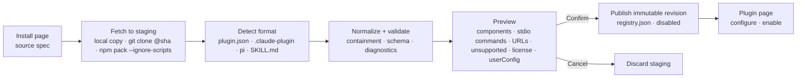

# Plugin-grouped extensions settings

Status: Implemented 2026-09-28 (uncommitted; see Implementation Notes)
Created: 2026-09-28
Approval: Approved by user 2026-09-28 (all todos)

## Summary

Rework Settings → Extensions so the top-level list item is a **plugin**. Opening a plugin shows what it contributes: commands, skills, subagents, MCP servers and memory. The same work adds real **plugin bundle install**: Agent Plugins 1.0, the `.claude-plugin/` layout and pi packages are normalized into the project's own models.

Today no layer has a plugin concept — not the service, the contracts, the bridge or the renderer. The five kinds are separate silos. Each has its own store and its own enable state. Only skills record where they came from. npm/git "install" only records a package that is already present under `agentDir/npm` (`apps/agent-service/src/skills/routes.ts:122-148`).

This plan follows current market practice (Claude Code, Codex, Copilot, Cursor, Agent Plugins 1.0):

- A plugin is a **provenance, revision and enablement unit** owned by the service.
- Plugin items use **namespaced names**.
- Install never runs code and never auto-enables anything.
- The settings UI is a view over the service's plugin model.

User decisions (2026-09-28):

- **Q1:** The standalone **Commands** and **Memory** settings sections stay. Plugin pages show their contents and link to those sections.
- **Q2:** Bundle install is **in scope**.
- **Q3:** The plugin solution lives in `packages/` as a host-agnostic library that can be open-sourced later. See [Package architecture](#package-architecture).

## Decisions

| #   | Decision                                                                                                                                                                                                                                                                                                                                                                                                                                                      | Evidence / reason                                                                                                                                                                                                                                                                                                                                |
| --- | ------------------------------------------------------------------------------------------------------------------------------------------------------------------------------------------------------------------------------------------------------------------------------------------------------------------------------------------------------------------------------------------------------------------------------------------------------------- | ------------------------------------------------------------------------------------------------------------------------------------------------------------------------------------------------------------------------------------------------------------------------------------------------------------------------------------------------ |
| D1  | The service owns the plugin model. Every item row carries a service-computed `pluginId`. The renderer groups by it and never infers a plugin from paths or names.                                                                                                                                                                                                                                                                                             | Single-authority rules: D5 packages, D6 MCP and D7 memory in `docs/plans/2026-09-20-pi-subagent-skills-mcp.md:187-230`                                                                                                                                                                                                                           |
| D2  | One registry owns installs: `<dataDir>/plugins/registry.json`. A plugin revision is an immutable directory snapshot of the whole bundle. Skill revisions inside a plugin are addressed through it. The existing installed skill records in `skills/revisions.json` are migrated once, as legacy single-skill plugins.                                                                                                                                         | Avoids two install owners. The existing staging and publish pattern (`skills/versions.ts`, `skills/package-manager.ts`) is reused.                                                                                                                                                                                                               |
| D3  | Plugin items use qualified names `<plugin>:<item>`. Personal, built-in and shared items stay unqualified. A single `QualifiedName` pattern in `packages/agent-contracts` replaces the six copies of `^[A-Za-z0-9][A-Za-z0-9_-]*$`. Instruction tokens accept `/skill:<plugin>:<item>`.                                                                                                                                                                        | Claude Code convention (`plugin:skill`, `plugin:agent`). Today, name-keyed merge and enablement let two sources shadow each other (`skills/atd-skills.ts:60`). Current patterns: `agent-contracts/src/skills.ts:14`, `roles.ts:15`, `instruction-tokens.ts:44`, `atd-agents/catalog.ts:6`, `skills/atd-skills.ts:16`, `skills/diagnostics.ts:27` |
| D4  | An item is effectively enabled only if both the plugin and the item are enabled. This is evaluated at run freeze. A running run keeps its frozen selection.                                                                                                                                                                                                                                                                                                   | D8 in `pi-subagent-skills-mcp.md` (edits apply to the next run). `run-freeze.ts:47-67` already freezes the agent harness this way.                                                                                                                                                                                                               |
| D5  | Memory stays a single authority. It is **part of Personal**, not an extension of its own (user, 2026-09-28 follow-up): Personal carries one `memory` item, listed only once there are memories, whose switch is the persisted pause; Personal's page shows the Memory group (pause switch, entry count, link to the Memory section). Bundles can never contribute memory. Claude's `memory` agent field is dropped.                                           | D7 in `pi-subagent-skills-mcp.md`. `general-agent-requirements.md:237` says role config never creates another store.                                                                                                                                                                                                                             |
| D6  | Installing never auto-enables. A new plugin lands disabled. Stdio MCP servers from a plugin also stay disabled until the user turns each one on.                                                                                                                                                                                                                                                                                                              | Requirement C10 (no auto-enable on import) in `docs/plans/2026-09-10-general-agent-requirements.md:225`                                                                                                                                                                                                                                          |
| D7  | Install never runs code. npm uses `--ignore-scripts`. git is pinned to the resolved commit SHA. Every path must realpath inside the plugin root. Hooks, `bin/`, LSP, output styles, pi `extensions`/`themes` and Claude `` !`cmd` `` prompt injection are imported as **unsupported diagnostics**, not executed.                                                                                                                                              | Service sets `noExtensions` (`skills/loader.ts:38-41`). Agent Plugins requires path containment. Claude plugin security docs.                                                                                                                                                                                                                    |
| D8  | Items from installed and shared plugins are read-only. The user may still toggle them, set subagent permission overrides, and **Duplicate to Personal** to customize a copy. Subagent tools are intersected with the role ceiling.                                                                                                                                                                                                                            | Existing `subagents/intersection.ts` and agent-harness overrides. This matches how Claude Code and Copilot treat plugin components.                                                                                                                                                                                                              |
| D9  | Marketplace catalogs (`marketplace.json`) remain a non-goal. Install takes an explicit source: a local path, `git` URL (optionally `#ref` and `:subdir`), or an npm spec.                                                                                                                                                                                                                                                                                     | `docs/plans/2026-09-22-extensions-settings-configuration.md:102`                                                                                                                                                                                                                                                                                 |
| D10 | Plugin state lives in `<dataDir>/plugins/`, never in `agentDir/settings.json`.                                                                                                                                                                                                                                                                                                                                                                                | `subagents/config.ts:75-79` rewrites that file wholesale.                                                                                                                                                                                                                                                                                        |
| D11 | The format-neutral pieces go in a new workspace package, working name `@ai/plugin-kit`. The public npm name is chosen at publish time. It covers the plugin model, format adapters, substitution, qualified names, enablement resolution, fetch, staging, the revision store, the registry and GC. The package never imports `@ai/*`, pi, Electron or React.                                                                                                  | Q3. The package must be publishable without the app.                                                                                                                                                                                                                                                                                             |
| D12 | The host plugs in through **ports**. The package defines interfaces and ships default Node implementations where one is generic: `ReadonlyFs`, `FetchSource`, `SecretStore`, `Clock`, `Logger`, and a host-plugin provider for synthetic plugins. The app implements the app-specific ports: the keyring secret store, and a provider that exposes Core, Memory, Personal and shared skills as plugins. It also maps normalized components to service models. | Keeps D1/D5 authority in the app while the library stays generic.                                                                                                                                                                                                                                                                                |
| D13 | Two entry points:<br>• `.` (pure): model, TypeBox schemas, adapters over `ReadonlyFs`, substitution, qualified names, resolution. Runs in any JS runtime.<br>• `./node`: Node fs, the git/npm/local fetchers, staging, the revision store, the registry and state files.                                                                                                                                                                                      | Browser-safe types and schemas can be consumed by `agent-contracts` and UIs without pulling in Node.                                                                                                                                                                                                                                             |
| D14 | Dependencies run in one direction:<br>• `agent-contracts` → `plugin-kit` (pure entry only)<br>• `agent-service` → `plugin-kit` + `plugin-kit/node`<br>• the renderer imports only DTO types through `agent-contracts`. `QualifiedName` is owned by `plugin-kit` and re-exported by `agent-contracts`.                                                                                                                                                         | Single owner for the name contract (D3). No cycles.                                                                                                                                                                                                                                                                                              |
| D15 | The settings UI stays in `apps/desktop`, because it depends on shadcn `packages/ui`, i18n and the settings shell. The package exports the DTOs and the route and diagnostic vocabulary any UI needs. A headless React package is a later option, not part of this plan.                                                                                                                                                                                       | Avoids open-sourcing app-styled components.                                                                                                                                                                                                                                                                                                      |

### Plugin model

```ts
// packages/agent-contracts/src/plugins.ts (target shape)
type PluginSourceKind = 'builtin' | 'user' | 'shared' | 'local' | 'npm' | 'git';
type PluginFormat = 'agent-plugins' | 'claude' | 'pi' | 'skill';
interface PluginSummary {
  id: string; // 'builtin:core' | 'user' | 'shared:agents-skills' | <plugin name>
  name: string;
  displayName?: string;
  description: string;
  version?: string;
  source: { kind: PluginSourceKind; spec?: string; revision?: string; format?: PluginFormat };
  license?: string;
  installedAt?: string;
  enabled: boolean;
  toggleable: boolean;
  removable: boolean;
  updatable: boolean;
  counts: { commands: number; skills: number; agents: number; mcp: number; memory: number };
  diagnostics: PluginDiagnostic[]; // unsupported components, config needed, invalid entries
  needsConfig: boolean; // required userConfig values are missing
}
```

| Plugin                 | Contents                                                                                   | Toggle                  | Items editable          |
| ---------------------- | ------------------------------------------------------------------------------------------ | ----------------------- | ----------------------- |
| `builtin:core`         | built-in skills (`builtins/manifest.ts:49`), `service.*` agents (`subagents/agents.ts:66`) | No                      | Restore only (as today) |
| `user` (Personal)      | `commands.json`, `~/.atd/skills`, `~/.atd/agents/*.md`, `mcp/servers.json`, Hermes memory  | No (memory item: pause) | Yes; memory via Memory  |
| `shared:agents-skills` | `~/.agents/skills` (`skills/user-agents.ts:19`)                                            | Yes                     | Read-only               |
| installed `<name>`     | normalized bundle components                                                               | Yes                     | Read-only (D8)          |

### Package architecture

```text
packages/plugin-kit/                 # working name @ai/plugin-kit, "private": true until publish
  package.json                       # exports "." and "./node"; publishConfig points exports/types at dist
  README.md                          # formats supported, ports, security model, non-goals
  src/
    index.ts                         # pure entry
    model/        names.ts           # QualifiedName pattern, parse/format (D3)
                  manifest.ts        # NormalizedPlugin, components, PluginSource, PluginFormat (TypeBox)
                  diagnostics.ts     # PluginDiagnostic codes: unsupported, invalid, escape, needs-config…
    formats/      detect.ts          # plugin.json · .claude-plugin · package.json pi · SKILL.md
                  agent-plugins.ts   # Agent Plugins 1.0 adapter
                  claude.ts          # .claude-plugin adapter (skills, agents, commands, mcp, userConfig)
                  pi.ts              # pi package adapter (skills, prompts→commands)
                  skill.ts           # bare SKILL.md folder
                  frontmatter.ts     # SKILL.md / agent / command frontmatter parsing
    substitute/   index.ts           # per-format variable rules, single pass, non-recursive
    resolve/      catalog.ts         # merge host + installed plugins, collision rules, effective enablement (D4)
                  snapshot.ts        # frozen selection record for a run (ids + revisions)
    ports.ts                         # ReadonlyFs, FetchSource, SecretStore, Clock, Logger, HostPluginProvider
    node.ts                          # "./node" entry
    node/         fs.ts              # ReadonlyFs over node:fs with realpath containment
                  fetch-local.ts · fetch-git.ts · fetch-npm.ts   # staging generations, no scripts (D7)
                  store.ts           # immutable revisions, registry.json, state.json, atomic writes
                  installer.ts       # preview → publish → update → uninstall, GC by run references
```

**Normalized component shape.** The package emits these and the host maps them to its own models:

- `skill`: `{ name, dir, entry, frontmatter }` (an Agent Skills folder)
- `agent`: `{ name, description, tools[], model?, prompt }`
- `command`: `{ name, description, argumentHint?, arguments[], body, allowedTools[] }` (placeholders pre-translated)
- `mcp`: `{ name, transport: stdio{command,args,env,cwd} | http{url,headers} }`
- `userConfig`: `{ key, type, title, required, sensitive, default }[]`

No component carries memory (D5).

**App integration** (`apps/agent-service/src/plugins/`):

- `host.ts` binds the ports: keyring `SecretStore`, `<dataDir>/plugins` roots, a logger, and a host provider that emits `builtin:core`, `user` (with the memory item) and `shared:agents-skills`.
- `map.ts` converts normalized components into `SkillRevisionRecord`, `RuntimeAgent`, `McpServerConfig` and `ServiceCommandFull`.
- `routes.ts` exposes the HTTP API.

The package owns the formats, installation and resolution. The app owns authority, persistence locations, secrets, runtime wiring and the API.

**Open-source readiness criteria** (checked in validation):

- no imports of `@ai/*`, pi, Electron, React or app paths (enforced by an oxlint `no-restricted-imports` override scoped to the package)
- builds standalone to `dist` with declarations
- the `.` entry passes typecheck with `lib: ["ES2023"]` and no Node types
- a README documenting the formats, ports, security model (no code execution at install, no signing) and non-goals
- a license file, once the license is chosen

### Bundle normalization

| Source component | Agent Plugins 1.0                                                                                            | Claude `.claude-plugin/`                                                                                        | pi package                                      | Normalized into                                                         |
| ---------------- | ------------------------------------------------------------------------------------------------------------ | --------------------------------------------------------------------------------------------------------------- | ----------------------------------------------- | ----------------------------------------------------------------------- |
| Manifest         | `plugin.json` (`$schema`, `name` `[a-z0-9.-]{1,64}`, closed schema; unknown fields are reported and ignored) | `.claude-plugin/plugin.json` (optional; name falls back to the directory; unknown keys stripped with a warning) | `package.json` `pi` key, or conventional dirs   | `PluginSummary` + registry record                                       |
| Skills           | `skills/<dir>/SKILL.md`, one level deep                                                                      | `skills/` + manifest `skills` (additive), root `SKILL.md`                                                       | `pi.skills` globs                               | Skill catalog entries `<plugin>:<name>`                                 |
| Subagents        | —                                                                                                            | `agents/**.md` (`name`, `description`, `tools`, `model`; drop `hooks`/`mcpServers`/`permissionMode`/`memory`)   | —                                               | Runtime agent `<plugin>:<name>`, tools ∩ role ceiling                   |
| Commands         | —                                                                                                            | `commands/**.md` (`description`, `argument-hint`, `allowed-tools`, `arguments`)                                 | `prompts/*.md` (`description`, `argument-hint`) | `ServiceCommandFull` read-only, name `<plugin>:<path>`                  |
| MCP              | `mcp.json` (`stdio` / `streamable-http` / `sse`)                                                             | `.mcp.json` + manifest `mcpServers`                                                                             | —                                               | `McpServerConfig` id `<plugin>:<server>`; stdio disabled until approved |
| User config      | —                                                                                                            | `userConfig` (`sensitive` → keyring)                                                                            | —                                               | Install / configure form; values stored per plugin                      |
| Unsupported      | reverse-domain extension dirs                                                                                | hooks, `bin/`, LSP, output styles, workflows, channels, monitors, `.mcpb`, `ws`, `headersHelper`, `oauth`       | `extensions`, `themes`                          | Diagnostics listed on the plugin page                                   |

**Substitution.** The installer and resolver implement exactly each format's rules:

- **Agent Plugins:**
  - Only `${PLUGIN_ROOT}` and `${PLUGIN_DATA}` are expanded.
  - They apply in `args`, `env` values and `cwd`, as a single non-recursive pass.
  - `command` is a bare name or `./` path.
- **Claude:**
  - `${CLAUDE_PLUGIN_ROOT}`, `${CLAUDE_PLUGIN_DATA}` and `${user_config.KEY}` are expanded in MCP config and in skill/agent bodies. Sensitive values are redacted in bodies.
  - `${VAR:-default}` is expanded in `.mcp.json` only.
- **Both formats:**
  - Stdio processes receive `PLUGIN_ROOT`/`PLUGIN_DATA` and the `CLAUDE_PLUGIN_*` aliases.
  - `PLUGIN_DATA` = `<dataDir>/plugins/data/<id>/`. It survives updates and is deleted on uninstall.
- **Command placeholders:**
  - Claude `$ARGUMENTS`, `$N` and pi `$1` are translated into the project's command `input`/`parameters` model.
  - Claude `$N` indexing (0-based in current docs, unverified) is re-checked against the docs before mapping.

### Install flow



- **Update** re-fetches the recorded source spec and publishes a new revision. It keeps the enabled state, user config and per-item toggles. Frozen runs keep their old revision.
- **Uninstall:**
  - Removes the registry record, `PLUGIN_DATA` and keyring secrets.
  - Revision directories are garbage-collected once no frozen run references them. This follows the existing `releaseRun` pattern.
  - Commands, skills or agent references to the removed plugin surface as the existing missing-reference diagnostics.

### Settings UI

Navigation inside Extensions uses a typed route stack:

```ts
type ExtensionRoute =
  | { level: 'list' }
  | { level: 'install' }
  | { level: 'plugin'; pluginId: string }
  | { level: 'item'; pluginId: string; kind: 'skill' | 'agent' | 'mcp'; name: string };
```

- **Back** pops one level. A search hit enters at item level, and Back returns to that item's plugin. Leaving the section resets the stack to `list`, the same pattern as commit 550b6fe.
- **Commands and memory** are never item-level routes here. They navigate to their own sections (Q1).

**Plugin list:** `SettingsHeading` with search and an Add menu. The Add menu has:

- **Install plugin**
- **Create** (makes things in Personal): Skill / Subagent / MCP / Command / Memory, offering the form or the AI session (Memory opens the `create-memory` AI session, and says why when learning is paused)
- **Import from folder** (local install; omitted, see Implementation Notes)

Below it, two sections: Built-in, then Personal and shared, which holds Personal, the shared skills folder and every installed plugin (user follow-up 2026-09-28: installed plugins belong to the user's own extensions). Each plugin is a **card** (shadcn `Card` size sm, user follow-up 2026-09-28) in a grid that fits as many 240px-minimum columns as the width holds:

- header: icon ring, name, and for installed plugins the source and version ("Local · v1.2.0"); the Switch and More at the right
- description: clamped to two lines
- footer: contents summary ("3 skills · 1 MCP server · 2 commands"; Personal's memory is named, not counted) and the state badges "Needs configuration" and "Disabled"
- More: View details, Update, Configure, Uninstall

A click anywhere else on the card opens the plugin page. When there is no Switch (Core, Personal), the action column keeps its footprint. A search shows the matching plugins' cards, then each plugin's matching items as rows.

**Plugin detail** (`ExtensionPage` shell):

- **Header:** Back, name, version, Switch.
- **Metadata:** source spec, revision, license, installed-at, format.
- **Kind tabs,** in order: Commands, Skills, Subagents, MCP, Memory (Personal only), each labeled with its count; kinds a plugin lacks get no tab (user follow-up 2026-09-28, restoring the earlier Extensions tabs inside the plugin page).
  - Skills, Subagents and MCP rows open the existing detail pages. These are read-only for non-Personal plugins, with a **Duplicate to Personal** action.
  - Commands rows navigate to the Commands section with that command selected.
  - The Memory group shows the pause switch, an entry count and **Open memory settings**.
  - While the plugin is disabled, an item's own Switch is disabled and a tooltip explains why.
- **Unsupported components:** a diagnostics block lists them.
- **Configuration form:** shown when `userConfig` exists.

**Install page:** replaces the current skill install page. It has a source field (auto-detects local/git/npm), a Fetch step, and a preview of components, executables, URLs, unsupported parts and license. Install confirms the preview.

**Commands section:** lists plugin commands under a plugin label. They are read-only, can be toggled, and support Duplicate. Personal commands behave as today. The existing deep-link target (`settings-window.tsx:98-124`) is reused for plugin → command navigation.

**Memory section:** its pause control reads and writes the persisted pause.

## Clarifying Questions

- [x] Q1: Keep the Commands and Memory sections; plugin pages show and link to their contents. (User, 2026-09-28)
- [x] Q2: Include bundle install. (User, 2026-09-28)
- [x] Q3: Put the solution in `packages/` so it can be open-sourced. (User, 2026-09-28) → D11–D15, workstream P.
- [x] Q4: License MIT (user, 2026-09-28). Public npm name deferred; the package stays `private` as `@ai/plugin-kit` until release.
- [x] Q5: Ship unit tests and format fixtures with the package (user, 2026-09-28).
- [x] Namespacing, install trust, and the marketplace were resolved from evidence (D3, D6, D7, D9). They do not need user input.

### Dependency decisions (community reuse)

- Frontmatter: `yaml` 2.9.0 (ISC). It is already in the lockfile.
- npm fetch: registry HTTP plus SRI `sha512` verification (`node:crypto`), extracted with `tar` 7.5.22 (BlueOak-1.0.0, already in the lockfile).
  - `pacote` was rejected. It pulls in `@npmcli/run-script`, `sigstore` and `@npmcli/git`, which is disproportionate for an embeddable library, and it may run `prepare` scripts for git dependencies.
  - Semver ranges are not supported; exact versions and dist-tags are.
- git fetch: `isomorphic-git` 1.42.2 (MIT). It is pure JS, so no git binary is needed on end-user machines, and it reports the resolved commit.
  - 1.42.3 was avoided because it is younger than the repository's minimum release age policy.
- Tests: `vitest` 5.0.0, the same version as `apps/desktop`.

## File And Code References

**Renderer: `apps/desktop/src/features/service/`**

- `service-settings.tsx` (330 lines; must be split):
  - flat `page` state and tab state: `:25`, `:36-42`
  - sub-page switch: `:132-182`
  - overview (tabs, search, add): `:258-329`
  - `reserveMenu`: `:189`
  - `busyKey` parsing: `:115-120`
- `extension-rows.ts` (335 lines):
  - row types: `ExtensionSkillRow` `:15` (the only one with a source field, `sourceKind`), `ExtensionAgentRow` `:33`, `ExtensionMcpRow` `:56`
  - parsers: `:210`, `:237`, `:262`
- Reusable components:
  - `extension-group.tsx`, `extension-row.tsx`, `extension-page.tsx`, `extension-detail-fields.tsx`
  - the three `*Group` components (they already take pre-filtered `items` and `showTitle`)
  - `use-extension-matches.ts`
  - `extension-skill-install-page.tsx`: the base for the plugin install page
- Tied to tabs: the `ExtensionTab` union (`extension-add-button.tsx:5`) and the `use-extension-ai-session.ts` kind map.
- Data hooks:
  - `use-service.ts`: `:59`, `:108`, `:134`
  - `use-extension-mutations.ts`
  - refresh on `service.onChange({type:'extensions'})`: `service-settings.tsx:94-106`
- Commands: `features/commands/command-settings.tsx` (315 lines) reads from `useAgent().snapshot.commands` (`:117`).
- Memory: `features/memory/memory-settings.tsx` (309 lines, `:41` section exit, `:52-66` data).
- Settings shell:
  - `settings/settings-window.tsx`: sections `:33-40`, breakpoints `:42-55`, command deep link `:98-124`, mounted sections `:145-154`
  - `settings-navigation.tsx:18-25` (`useSettingsSectionExit`)
  - `settings.css`: `:82-111`, `:256-545`
- i18n: `i18n/locales/{en,zh-CN}/settings.json` (`extensions.*` `:160-420`), plus the `commands.json` and `memory.json` namespaces.

**Bridge and contracts**

- `apps/desktop/electron/service/ipc.ts:195-268`: `ServiceBridge`; list results are `unknown[]`.
- `electron/service/extension-requests.ts:42-105`: request dispatch.
- `electron/service/mcp-catalog.ts:122-157`: whole-list MCP rewrite (user servers only).
- `electron/agent/agent-requests.ts:189-191` handles commands and `:238-253` handles memory.
- `electron/agent/store.ts:16` (dead `memoryPaused` field).
- `src/web/index.ts`: web client.
- `packages/agent-contracts/src/{skills.ts:14,146, roles.ts:15, instruction-tokens.ts:44-46, commands.ts:126, mcp.ts:67,82, memory.ts:17}`.
- `packages/agent-client/src/{skills-client.ts:9, atd-agents-client.ts:41, mcp-client.ts:17}`.

**Service: `apps/agent-service/src/`**

- Skills:
  - `skills/versions.ts:19` (`SkillRevisionRecord`)
  - `skills/routes.ts:53-61` and `:122-175` (install/update)
  - `skills/package-manager.ts:15-171` (confined `DefaultPackageManager`, `installLocal`, `verifyRealpath` `:143`)
  - `skills/atd-skills.ts:16,30-69`
  - `skills/harness.ts:9-55`
  - `skills/loader.ts:38-41`
  - `skills/mount.ts:56-103`
- Subagents:
  - `subagents/agents.ts:37,66`
  - `subagents/intersection.ts`
  - `atd-agents/{catalog.ts:6,13,36,87, harness.ts:18, mount.ts:19,47,83-112}`
- MCP: `mcp/{servers.ts:26,49, routes.ts:283-301, staging.ts:33-39}`, `configure-mcp-tool.ts:61`.
- Commands: `commands/{store.ts:32, routes.ts:30-58, templates.ts:17}`.
- Memory: `memory/{authority.ts:78-79, routes.ts:25-41}`, `harness/memory-extension.ts:15`.
- Run: `run-freeze.ts:47-80` (freeze and release), `run-binding.ts:20-27`.
- Other: `credentials/` (keyring for sensitive `userConfig`), `builtins/{manifest.ts:49, mount.ts:10-11}`.

**Design and docs**

- Figma file `PROJECT_FILE_KEY`, nodes:
  - settings layout: `1119:36110`, `1181:38808`, `1045:32910`
  - editor: `1093:34262` / `1093:34242`
  - commands: `373:1416`
  - memory: `339:1153`
  - The current Extensions frame has no recorded node ID; locate it with `get_metadata`.
- Constraining docs:
  - `docs/plans/2026-09-20-pi-subagent-skills-mcp.md` D4–D8
  - `2026-09-22-extensions-settings-configuration.md:72-102`
  - `2026-09-22-extensions-tab-add-actions.md:11-30`
  - `2026-09-26-model-skill-catalog.md`
  - `2026-09-10-general-agent-requirements.md:31,63,225,237-251`

**Format specs**

- Agent Plugins 1.0: https://agent-plugins.org/specification and https://github.com/agentplugins/agent-plugins-spec/blob/main/spec/1.0.0.md
- Claude plugins: https://code.claude.com/docs/en/plugins-reference
- pi packages: `apps/agent-service/node_modules/@earendil-works/pi-coding-agent/docs/{packages,prompt-templates}.md`
- Codex: https://developers.openai.com/codex/plugins/build

## Plan Todos

The workstreams, with their dependencies:

- **P. Package (`packages/plugin-kit`)**: P1 → P2 → P3 → P4 → P5
- **A. Contracts** (depends on P1): A1, A2
- **B. Service integration** (depends on P3, A): B1 → B2 → B3 → B4
- **D. Bridge** (depends on B4): D1
- **E. Extensions UI** (depends on D1): E1 → E2 → E3/E4/E5 → E6
- **F. Commands and Memory sections** (depends on D1): F1, F2
- **G. Design**: G1, in parallel with E
- **H. Cleanup**: H1

### P. Package `packages/plugin-kit` (host-agnostic)

- [x] **P1. Scaffold and model.**
  - Create the workspace package with the existing conventions: ESM, `tsc` build, `typecheck` and `lint` scripts, extending `@ai/typescript-config`.
  - Add two exports, `.` and `./node`. Add `publishConfig.exports` pointing at `dist`.
  - Keep `"private": true` until publish.
  - Add an oxlint `no-restricted-imports` override that forbids `@ai/*`, `@earendil-works/*`, `electron` and `react` in this package.
  - Contents:
    - `model/names.ts`: QualifiedName (D3)
    - `model/manifest.ts` and `model/diagnostics.ts`: TypeBox schemas and types
    - `ports.ts`
    - a README skeleton
- [x] **P2. Format adapters (pure).**
  - Create `formats/{detect,agent-plugins,claude,pi,skill,frontmatter}.ts` over `ReadonlyFs`, following the normalization table.
  - Choose the frontmatter/YAML dependency through the AGENTS community-reuse check (candidates: `yaml`, `gray-matter`) and record the decision in the README.
  - Unknown fields produce diagnostics and never fail the load.
  - Every path is checked for containment.
  - Before translating command placeholders, confirm Claude's current `$N` base from its docs.
- [x] **P3. Substitution and resolution (pure).**
  - `substitute/index.ts` implements each format's exact variable rules.
  - `resolve/catalog.ts` merges host and installed plugins, applies qualified-name collision rules, and computes effective enablement.
  - `resolve/snapshot.ts` produces the frozen `{pluginId, revision, itemIds}` record for a run.
- [x] **P4. Node installer (`./node`).**
  - **Fetchers.** Pick them through the community-reuse check and record the evidence:
    - npm: `pacote` (check that it skips lifecycle scripts, including git-dependency `prepare`)
    - git: `giget` or `isomorphic-git` versus the system `git` CLI through an injectable exec
    - local: copy with realpath containment
  - Use `DefaultPackageManager` from pi only in the app, never in the package (D11).
  - **Staging and limits.** Fetch into staging generations with size and file-count limits. Resolve the git ref to a commit SHA.
  - **Store (`store.ts`).** Immutable revisions plus `registry.json` and `state.json`, written with atomic writes and preserve-on-malformed reads.
  - **Installer (`installer.ts`).** Preview (short-TTL staging) → publish (the plugin lands disabled, D6) → update (state kept) → uninstall (secrets removed through `SecretStore`, `PLUGIN_DATA` deleted, GC once no run references the revision).
- [x] **P5. Package README and open-source readiness.**
  - Document the supported formats and versions, the port contracts, the security model (no code runs at install; no signing, so integrity comes only from the git SHA and the npm tarball hash) and the non-goals (marketplace catalogs, hooks, code extensions).
  - Add the LICENSE once the license is decided.
  - Check that the package builds and typechecks standalone.

### A. Contracts

- [x] **A1. Qualified names in contracts.**
  - `agent-contracts` imports `QualifiedName` from `plugin-kit` and replaces the six local name patterns.
  - Widen the instruction-token regex so `/skill:`, `@agent:` and `@mcp:` accept an optional `<plugin>:` prefix, and update composer highlighting.
  - Check that the MCP tool-proxy sanitizer (`mcp/tool-proxies.ts:77`) cannot produce colliding names.
- [x] **A2. Plugin wire types.**
  - Add `agent-contracts/src/plugins.ts` with `PluginSummary`, `PluginDetail` and `PluginInstallPreview`, composed from the `plugin-kit` schemas.
  - Add a required read-only `pluginId` to `SkillListRow`, the agent catalog wire, `McpServerStatusDto` and `ServiceCommandFull`. The command schema has `additionalProperties:false` and must be updated to allow it.

### B. Service integration (`apps/agent-service/src/plugins/`)

- [x] **B1. Host binding (`host.ts`).**
  - Bind the ports: keyring `SecretStore` via `credentials/`, `<dataDir>/plugins` roots and a logger.
  - Implement the host provider for `builtin:core`, `user` (with the memory item) and `shared:agents-skills`.
  - Migrate the installed records in `skills/revisions.json` once into `skill`-format plugins, keeping the old file as a backup (D2).
- [x] **B2. Component mapping (`map.ts`).** Convert normalized components into `SkillRevisionRecord`, `RuntimeAgent` (tools ∩ role ceiling, `subagents/intersection.ts`), `McpServerConfig` (stdio servers stay disabled until approved) and read-only `ServiceCommandFull`.
- [x] **B3. Consumer wiring.**
  - The skill catalog merge (`atd-skills.ts:60`) and skill freeze.
  - The agent registry.
  - The MCP authority gets a read-only plugin layer next to `servers.json`. Electron's whole-list rewrite still touches only user servers.
  - The command service merges in plugin commands.
  - `run-freeze.ts` records the plugin snapshot from P3 and releases it in `releaseRunSelections`, which feeds GC.
  - `MemoryAuthority` persists its pause, driven by Personal's memory item.
- [x] **B4. Routes (`routes.ts`).**
  - `GET /v1/plugins`, `GET /v1/plugins/:id`, `POST /v1/plugins/:id/enabled`, `POST /v1/plugins/:id/items/:kind/:name/enabled`.
  - `PUT /v1/plugins/:id/config`, `POST /v1/plugins/:id/duplicate/:kind/:name`.
  - `POST /v1/plugins/install/preview`, `POST /v1/plugins/install`, `POST /v1/plugins/:id/update`, `DELETE /v1/plugins/:id`.
  - Every change emits the `extensions` change event.
  - Retire the skill-only install and update routes (`skills/routes.ts:122-175`), with `skills/mount.ts` forwarding to the plugin installer until the renderer migrates.

### D. Bridge

- [x] **D1. Client and bridge.**
  - Add `packages/agent-client/src/plugins-client.ts`.
  - Add `plugins*` actions in `electron/service/extension-requests.ts` and `ServiceBridge` (`ipc.ts`), validating payloads in main.
  - Mirror them in the web client (`src/web/index.ts`).
  - Commands and memory keep the agent bridge. They receive `pluginId` and the persisted pause through their existing snapshots.

### E. Extensions UI (renderer)

- [x] **E1. Route.**
  - Create `use-extension-route.ts` for the route stack, Back, search-hit entry and section-exit reset.
  - Split `service-settings.tsx` into a route switch, `extension-overview.tsx` and `extension-plugin-page.tsx`, each at most 350 lines.
- [x] **E2. Rows.**
  - Create `plugin-rows.ts` with `asPluginRow`, `asPluginDetail`, `groupByPlugin` and the count summary.
  - Add `useServicePlugins` to `use-service.ts`.
  - Extend the `as*Row` parsers with `pluginId` and a read-only flag, moving them out of `extension-rows.ts` if needed.
  - Replace `busyKey` string prefixes with a typed busy target.
- [x] **E3. Plugin list.** Grouped list with the row anatomy above and the Add menu. Remove the tabs, the `ExtensionTab` union and `reserveMenu`. The AI session map becomes a kind map.
- [x] **E4. Plugin detail.**
  - Header, metadata, kind groups, diagnostics and the `userConfig` form.
  - Read-only mode and **Duplicate to Personal** in the existing skill, agent and MCP detail pages.
  - Command rows navigate to the Commands section. The Memory group is the pause switch plus a link.
- [x] **E5. Install page.** Build it from `extension-skill-install-page.tsx`: source → Fetch → preview → Install, then land on the plugin page. The preview lists executables, URLs, unsupported components and license. Required `userConfig` shows "Needs configuration".
- [x] **E6. Search and i18n.**
  - Extend `use-extension-matches.ts` to match plugin metadata and all item kinds, grouped by plugin. A command hit navigates to the Commands section.
  - Add `extensions.plugins.*` keys in `en` and `zh-CN`: list, detail, install, preview, source and format labels, plural counts, disabled-by-plugin, unsupported, configure.

### F. Commands and Memory sections

- [x] **F1. Commands section.** In `command-settings.tsx`, plugin commands appear grouped under their plugin label. They are read-only, can be toggled, and support Duplicate. Extract a row or list module so the file stays under 350 lines.
- [x] **F2. Memory section.** In `memory-settings.tsx`, the pause control uses the persisted pause. Remove Electron's dead `memoryPaused` field.

### G. Design

- [x] **G1. Figma** (runs in parallel with E3–E5; required by the AGENTS design/code sync rule).
  - In file `PROJECT_FILE_KEY`, locate the current Extensions frame.
  - Add three compositions:
    - `App / Plugin row`: Rhea `Item`, `Switch`, `Badge` and icon-button instances.
    - Plugin detail: kind groups, metadata and diagnostics.
    - Install page: source, preview and actions.
  - Give them responsive variants at 320, 480, 760, 1000 and 1280.
  - Add Extensions to the settings nav frame (`design-source.md:61`).

### H. Cleanup

- [x] **H1. Cleanup.**
  - Delete the superseded tab code, the skill-only install route and unused i18n keys.
  - Run `pnpm exec oxlint` on changed files (350-line limit).
  - Update `2026-09-22-extensions-*` plan statuses to say they were superseded by this plan.

## Implementation Notes

- **Package:** `packages/plugin-kit` has three entry points:
  - `.`: model, adapters, substitution and resolution.
  - `./model`: schemas and names only, typebox as the sole dependency. `agent-contracts` imports it so the format parsers stay out of the sandboxed preload bundle.
  - `./node`: the installer.
  - 142 tests across 17 files.
- **Naming:** standalone `skill`-format plugins keep their bare skill name (`installedItemName`). Everything else is `<plugin>:<item>`. Hosts find an item's plugin through `pluginId`, never by parsing its name.
- **Service:**
  - Legacy installed skills migrate once into the registry; `skills/revisions.legacy.json` is kept as a backup.
  - The memory pause is persisted.
  - The skill-only install/update routes and `skills/package-manager.ts` were removed.
- **Deviations:**
  - The Add menu uses a labelled group instead of a submenu, because the shared `DropdownMenuSubContent` did not render reliably.
  - Create in Personal → Command opens the Commands section without a create deep link.
  - Reveal source and Import from folder were omitted: no bridge action exists, and the install field detects local paths.
  - `memoryPaused` stays in the desktop store schema, kept as dead data (it is now optional in the service migration schema).
- **Verified at runtime:**
  - An isolated service exercised every route.
  - The web client was checked at 320/480/760/1000/1280 widths and short heights, in English and Chinese.
  - The Electron smoke suite passes.
  - A throwaway real-app script drove install → enable → list → plugin page → toggle → uninstall through IPC with an isolated profile and HOME. It found and fixed an optional-call bug where the plugin list switch never saved.
- **Follow-up (2026-09-28, user):**
  - Memory moved from the `builtin:memory` plugin into Personal as its `memory` item, listed only while Hermes holds at least one entry; the item switch is the persisted pause, and toggling it announces the `memory` invalidation to web clients.
  - The Installed section was folded into Personal and shared; its empty state is gone (Install stays in the Add menu).
  - The Add menu's group is now **Create** and includes **Memory** (`features/memory/use-memory-create.ts`, shared with the Memory section's button).
  - Plugin pages show one tab per kind (`plugin-item-tabs.tsx`) instead of stacked titled groups.
  - The list is a grid of plugin cards (`plugin-card.tsx`, shadcn `Card` added to `packages/ui`); in dark mode cards use the input fill (`bg-input/40`) so they read above the translucent settings surface.
  - Verified in the real app (isolated profile and HOME) at 1280/1000/760/480/320 and 1000×420, English and Chinese: no horizontal overflow, Add menu entries, search, hover, Personal's memory switch pausing learning in both the agent and the service, and the paused-memory toast; no page errors.
- **Not verified:**
  - npm and git installs against real registries or hosts (covered by tests with injected fetch and clone).
  - Keyring secrets on a real keychain.
  - A model actually completing a run with plugin items.

## Grill-Me Outcome

- Transcript: Not run
- Outcome: Not run
- Summary: Not needed. The product decisions were asked directly (Q1, Q2) or stated by the user (Q3). The remaining choices (D3, D6, D7, D9) are resolved from repository docs and published format specs.

## Build From Plan

- Ready to build: Yes (approved; in progress).
- Selected todos: P1–P5, A1–H1.
- Execution notes:
  - **Order:** P1–P3 (pure package) → A → P4 (Node installer) with B → D → E and F. G runs alongside E.
  - **Package boundary:** anything the package needs from the app becomes a port. If an implementation is tempted to import app code into `packages/plugin-kit`, move that behavior to `apps/agent-service/src/plugins/` instead.
  - **First UI slice:** build one representative composition before the full list:
    - the Personal plugin with every kind, a long title and an unset shortcut
    - one installed Claude-format fixture with `userConfig`, a stdio MCP server and an unsupported hook
  - **Parallel implementation:** if this is run with multiple workers, give each an exclusive write boundary: P (package), A (`agent-contracts`, single owner), B (service), D + E (bridge and renderer), F, G.
  - Preserve unrelated worktree changes.

## Validation

- Confirm `pnpm --version` matches `packageManager`, then run `pnpm typecheck`, `pnpm lint` and `pnpm test`.
- **Package:**
  - `pnpm --filter <plugin-kit> build`, `typecheck` and `lint`.
  - A restricted-import check proves there are no `@ai/*`, pi, Electron or React imports.
  - The `.` entry typechecks without Node types.
  - `npm pack --dry-run` lists only `dist`, the README and the LICENSE.
  - If Q5 is yes: `vitest` over fixtures for each format, substitution, containment escapes and collision/enablement resolution.
- **Service:** run an isolated `agent-service serve --dataDir <temp>` and install fixture bundles. Use one fixture per format, kept under `tmp/`, not committed unless tests are requested. Verify:
  - it installs disabled
  - preview lists stdio commands and unsupported components
  - a path escape is rejected
  - `--ignore-scripts` is honored
  - the git SHA is pinned
  - a disabled plugin is absent from a new run's frozen skills, agents and MCP, while an already-frozen run is unaffected
  - an update keeps state
  - uninstall garbage-collects revisions only after the frozen run releases them
  - the memory pause survives a restart
  - a qualified-name `/skill:<plugin>:<item>` token resolves
- **Renderer:**
  - Run `pnpm dev:web` against that service.
  - Check the list, plugin, item and install levels, Back, search hits, and section exit.
  - Check command links into the Commands section and memory links.
  - Check settings widths 320, 480, 760, 1000 and 1280, plus a short height.
  - Cover long names, a plugin that needs configuration, a disabled plugin, empty kinds, and both languages.
- **Real app:** run `AI_TEST_USER_DATA=$(mktemp -d) pnpm dev` to verify the bridge actions, the change-driven refresh across both bridges, and the command deep link.
- No new automated tests unless you request them. The Electron smoke suite never opens Extensions; extending it is a separate ask.

## Risks

- **Qualified-name migration (A1):**
  - It touches tokens already typed in saved commands and in the composer. Unqualified names must keep resolving exactly as today.
  - Only plugin items gain a prefix, so existing data needs no migration.
- **Third-party executables:**
  - Stdio MCP servers and skill scripts run with service privileges once enabled. The mitigations are D6/D7 and per-server approval.
  - There is no signing in any format; the only integrity checks are the git SHA and npm tarball hash. Report this honestly in the preview.
- **Format drift:**
  - Agent Plugins 1.1 is a draft.
  - Claude's plugin format changes often (e.g. `$N` base, new component types).
  - Adapters stay pure and report unknown fields instead of failing, so drift degrades to diagnostics.
- **Two bridges:** commands and memory arrive via `window.desktop.agent`, while the rest arrive via `window.desktop.service`. Mitigations: plugin counts come from the service, and the list refreshes on both change events.
- **Line limits:** `service-settings.tsx`, `extension-rows.ts`, `command-settings.tsx` and `memory-settings.tsx` are all over 300 lines. The planned splits (E1, E2, F1) are required.
- **Scope size:** this is a multi-workstream change. If it must ship in increments, P1–P3, A, B (host plugins only), D and E3/E4 form a coherent first release: a plugin view over existing items. P4 and E5 (install) can follow without contract changes.
- **Package boundary erosion:** app-specific rules (memory authority, role ceiling, `dataDir` layout) could leak into the library. The mitigations are the restricted-import lint and the ports list (D12). Items that are specific to this app belong in `host.ts` / `map.ts`.
- **Public API stability:** once published, the normalized model and port interfaces become a semver contract. Keep the exported surface minimal (the `index.ts` and `node.ts` barrels only), and mark it `0.x` until a second host has used it.
- **No regression net:** no unit tests cover `features/service/*`. Runtime verification carries acceptance.

## Approval

- Status: Approved (user, 2026-09-28): implement P1–P5 and A1–H1, MIT license, package tests included.
