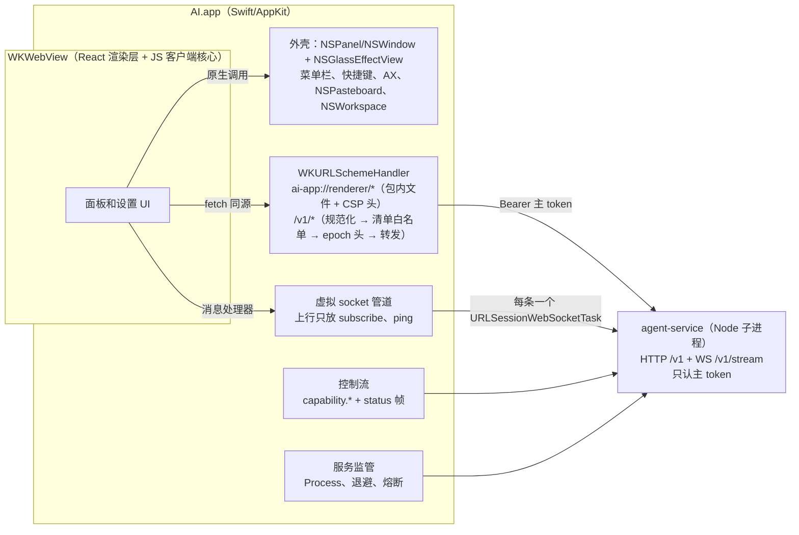

# macOS 原生前端与剔除网页端

Status: Approved - P0–P6 implemented; P7 awaiting manual acceptance
Created: 2026-09-29
Approval: Approved by user on 2026-09-29 (execute all phases)

## Summary

把桌面前端从 Electron 换成参照 Raycast 2.0 的 macOS 原生外壳，并删除网页端访问。决策全部来自本次 grill（见 Grill-Me Outcome），本计划只负责落成可执行的步骤。

- **分层**：
  - Swift/AppKit 外壳负责窗口、面板、菜单栏、全局快捷键、选中文本、原生能力和服务进程。
  - 现有 React 渲染层跑在 WKWebView 里，页面从包内的 `ai-app://renderer/` 加载，不开放任何 HTTP 源。
  - `agent-service`（Node）继续做唯一的数据源。
- **客户端核心留在 JS**：任务缓存、事件归约、命令、模型服务、设置同步约 8k 行 TS，复用 `src/web` 已经验证过的宿主路径，不用 Swift 重写。
- **Swift 做中继，WebView 不持有凭据**：
  - HTTP 走同源的 `WKURLSchemeHandler`。
  - 流走一对一的透明虚拟 socket。
  - 路由白名单由 service 为每条路由标注 exposure，并在运行时下发。
- **Liquid Glass**：
  - 窗口背景用 `NSGlassEffectView`。
  - 页面内用私有 CSS `-apple-visual-effect`，spike 失败就退回 `backdrop-filter`。
  - 只支持 macOS 26 和 arm64。
- **推进顺序**：
  1. 先单独删除网页端访问。
  2. 原生外壳在 `apps/macos` 并行开发，日常仍用已安装的 0.2.1。
  3. 功能对等清单验收通过后，用一个 PR 删除 Electron 和旧数据迁移代码。
- **文件搜索**：先原样迁入 service，再并行做 Raycast 式的 Rust 索引。它不挡切换。

## Clarifying Questions

- [x] 原生的边界：选方案 b，原生外壳加 WKWebView 承载富内容（grill 问题 2）。
- [x] 客户端核心和凭据：采用 Swift 中继，WebView 不持有凭据（问题 3、4、5、6、7）。
- [x] 切换方式：唯一用户是作者本人，并行开发后一次性删除 Electron，不做迁移桥，Electron 本地数据全部丢弃（问题 8、11、20）。
- [x] Liquid Glass 覆盖范围和最低系统版本（问题 13）。
- [x] 工程、CI、测试范围：Swift Testing 覆盖中继白名单和路径规范化（问题 14）。
- [x] 文件搜索：迁入 service，并行做 Rust 索引，只在索引上沿用 Raycast 模式（问题 15–18）。
- [x] 切换门槛：使用本文的功能对等清单（问题 19）；旧迁移代码随 Electron 一起删除（问题 20）；原生界面文案本地化（问题 21）。
- [ ] 不阻塞实施：没有设定内存和冷启动的量化目标，grill 问题 1 被调研取代，没有直接回答。当前门槛只有功能对等。如需量化目标，在 P0 里测出 0.2.1 的基线后再定。

## File And Code References

**剔除网页端**

- **service**：
  - `apps/agent-service/src/web/{access,routes,sessions,static}.ts`
  - 挂载点：`server.ts:37-39`、`:98-100`、`:273-274`
  - CLI：`--web-root` 参数在 `cli.ts:43`；`web` 子命令在 `cli.ts:181-206`、`:255`；帮助文案在 `:66-78`、`:101`
  - 配置：`config.ts` 里的 `webRoot`
  - 依赖：`package.json:31` 的 `@fastify/static`
- **保留**：`web/invalidate.ts`，多窗口同步还要用它。
- **契约和客户端**：
  - `packages/agent-contracts/src/workspace.ts` 里的 `WebPairing*`、`WebSession*`
  - `packages/agent-client/src/workspace-client.ts:55`、`:71`、`:90`
- **渲染层**：
  - 删除：`apps/desktop/src/web/host-session.ts`、`web-sign-in.tsx`，以及相应的 `web.css` 片段和 `webSignIn.*` 文案
  - 修改入口：`src/main.tsx:33-50`
  - 保留：`web-connection.ts`、`web-commands.ts`、`web-settings.ts`、`web-platform.ts`、`web-events.ts`
- **开发服务器**：`apps/desktop/plugins/agent-service-dev.ts:57-71`，包括 `/v1` 代理和 `/__ai/dev-pair`；接入点在 `vite.config.ts:60-72`。
- **Electron 入口**：
  - `electron/service/manager.ts:119`（`openInBrowser`）
  - `electron/app-menu.ts:157`
  - `main.ts:304`、`ipc.ts:91`、`service/bridge-client.ts:17`、`service/extension-requests.ts:27`
  - `src/features/settings/open-in-browser-button.tsx`

**打包对 `dist-web` 的依赖**

- `electron-builder.yml:27-30`
- `electron/window-content.ts:69`
- `electron/service/launcher.ts:49`、`:156`（`--web-root`）
- 构建脚本：`apps/desktop/package.json` 的 `build` 和 `build:web`；`vite.config.ts:77`、`:110`、`:121` 的 `mode === 'web'`；`turbo.json` 的 `dist-web/**`

**中继和流**

- `packages/agent-client/src/http-client.ts:46`：`fetchImpl` 保持默认。
- `packages/agent-client/src/ws-client.ts:69-110`：写死了 `new WebSocket`，要改成传输工厂。
- `apps/agent-service/src/stream.ts`：
  - `:62`：subscribe 之前 `tasks` 为 null
  - `:91`：broadcast 过滤
  - `:126-130`：capability 投递给所有持有 clientId 的连接
  - `:134-153`：上行消息分派
  - `:156-190`：subscribe 处理
- `capabilities.ts`：`:28` 定义 `LEASE_MS`，`:89` 检查租约，`:132-138` 的 `result` 与 clientId 无关。
- `packages/agent-contracts/src/snapshot.ts:235-242`：`SubscribeSchema`，要新增 `status`。
- `apps/desktop/electron/menu-bar-status.ts`：计数推导，迁到服务端。
- `electron/quit-guard.ts:182-195`：退出保护读的是 `activeRuns`。
- `server.ts:116`、`:175-178`：`x-service-id` 和 epoch。

**快捷键、选中文本、原生能力**

- `electron/agent/command-service.ts:52`、`:73-127`、`:196-212`
- `electron/main.ts:90-106`：`togglePanel` 在显示前先捕获选中文本。
- `electron/service/capabilities.ts:47-66`、`:117-135`：`selection.read` 的现状语义。
- `electron/agent/artifacts.ts`，以及 `electron/agent/service.ts:53-61` 的对话框、剪贴板和外链。

**进程监管**

- `electron/service/{launcher,supervisor,autostart,node-runtime,shell-path,data-dir,endpoint,connection,manager,service-log,service-code}.ts`，约 1.7k 行。
- `shell-path.ts:62-67`：只在打包版解析登录 shell PATH。
- `data-dir.ts:28-31`：`AI_AGENT_DATA_DIR`。
- 读取 PATH 的地方：`apps/agent-service/src/mcp/servers.ts:163`、`harness/search/ripgrep.ts:21`。
- 服务身份和凭据：`config.ts:127-156`，`credentials/keyring.ts`（`ai-agent-service:<serviceId>`）。

**文件搜索**

- `apps/desktop/electron/file-search/*`，约 1.3k 行，除 `recents.ts:59` 的 Windows 分支外都是纯 Node。
- `electron/agent/attachable-rules.ts`。

**材质和样式**

- `apps/desktop/src/native-overlay-blur.ts`、`src/overlay-blur-filter.ts`，共 301 行。
- `src/styles.css:15`、`:65-110`：`data-runtime` 和 `data-platform` 分支，以及 `-webkit-app-region: drag`。
- `packages/ui/src/styles.css`。
- `apps/desktop/index.html`：meta CSP。

**遗留代码**

- `src/features/agent/use-task-panel.ts:113-116`
- `electron/agent/bridge.ts:200`、`:314`
- `bridge-client.ts:72`
- `agent-requests.ts:268`：`importLegacy` 已经是空操作。
- `src/lib/task-store.ts`：只有 `fileSize` 仍在使用，被 `task-files.tsx`、`user-context.tsx`、`use-file-groups.tsx` 引用。
- 旧数据迁移：`apps/agent-service/src/migration/*`（约 1.7k 行）、`apps/desktop/electron/migration/*`（约 0.4k 行）。

**文档和 CI**

- `AGENTS.md:46`、`:58-59`，以及 Electron 原生表面规则 `:103-114`、`:209`。
- `README.md:24`、`:62-90`、`:98`、`:105`、`:143`。
- `.github/workflows/ci.yml`、`.github/workflows/release.yml`。

**参考**

- Raycast 2.0 工程博文：<https://www.raycast.com/blog/a-technical-deep-dive-into-the-new-raycast>
- 本机 `/Applications/Raycast.app`（只读检查结论已记录在 grill 记录里）。

## Plan Todos

阶段之间的依赖：

- P0（spike）和 P1（剔除网页端）可以立即并行开始。
- P2 依赖 P1。P3 依赖 P2 的契约。P4 依赖 P0 的结论，以及 P2、P3。
- P5 贯穿各阶段。P6 在 P2 的文件搜索迁移之后并行进行。
- P7 依赖 P4 和 P5。P8 依赖 P7。

### P0 原生可行性 spike

在 `tmp/spikes/` 下做最小的 Swift/WKWebView 原型，结论写回本文件。

- [x] **S1**：`WKURLSchemeHandler` 能完整收到最大附件大小的 POST 请求体，响应用 `didReceive` 分块回传，`stop` 能对应 `AbortController`。
  - 结论：部分通过。ArrayBuffer/Uint8Array 请求体 1、8、32 MiB 都完整到达 `httpBody`；Blob/File 请求体被静默丢成 0 字节，ReadableStream 直接报错，所以 WebView 宿主只能发 ArrayBuffer 或类型化数组。`didReceive` 分块能逐块到达，五种中止方式都会触发 `stop`。实际上传上限是 Fastify `bodyLimit` 的 1 MiB。handler 要按任务对象保存存活表，`stop` 之后不再回调（用 `ObjectIdentifier` 会因地址复用而漏答）。
- [x] **S2**：跨源 iframe 或其他源对 `ai-app://` 发起的 fetch 会被拦截；`HTTPURLResponse` 头里的 CSP 生效，包括内联脚本被拦截和 `frame-ancestors`。
  - 结论：部分通过。其他源读不到响应，但 WebKit 对自定义 scheme 不发预检，跨源 no-cors 和 CORS POST 会带着请求体到达 handler。响应头 CSP 对内联脚本、eval、`frame-src`、`connect-src` 生效；`frame-ancestors` 和 `X-Frame-Options` 对 `ai-app://` 不生效。改为决策 R6、R7（见 Execution notes）。
- [x] **S3**：`ai-app://` 页面的 `window.isSecureContext`。如果是 false，就为 4 处 `crypto.randomUUID()` 准备基于 `getRandomValues` 的替代。
  - 结论：通过。`isSecureContext` 为 true，`crypto.randomUUID` 可用，不需要替代函数（P3 对应待办取消）。
- [x] **S4**：开发模式下 handler 代理 Vite 的模块请求，HMR 直连 `ws://127.0.0.1:<port>` 时不会被当成混合内容拦截。失败则退回 `vite build --watch` 加整页重载。
  - 结论：通过。`server.hmr = { protocol: 'ws', host: '127.0.0.1', clientPort }` 加开发 CSP `connect-src 'self' ws://127.0.0.1:<port>`，HMR 直连不被当成混合内容，热更新约 24ms。开发代理要放行 `/@vite/*`、`/@fs/<绝对路径>` 和 `?t=`、`?import` 查询串。React 刷新前导内联脚本尚未实测。
- [x] **S5**：`-apple-visual-effect: -apple-system-glass-material` 在我们的 WKWebView 配置下，不开私有偏好也能生效。失败则退回 `backdrop-filter`。
  - 结论：不开私有偏好时失败：`CSS.supports` 对 `-apple-visual-effect` 全部为 false。打开私有偏好 `useSystemAppearance` 后是真玻璃（Raycast 疑似如此）。按用户决定打开（决策 R5）。透明 WKWebView 叠在 `NSGlassEffectView` 上需要私有 KVC `drawsBackground = false`，没有公开替代，已接受。
- [x] **S6**：`callAsyncJavaScript` 按 runloop 合批推帧的吞吐。用长对话流式输出实测，定出门槛。
  - 结论：通过，但合批规则改为“每个 WKWebView 同时最多一个 `callAsyncJavaScript` 在途”：入队时若无在途调用，就在下一轮主队列投递；调用完成后把积压的帧一次投出；JS 端同步处理整批。只按 runloop 合批时平均每次仍只有约 1 帧，在 JS 每批耗时 2ms 时突发 2000 帧的 p99 为 141ms；一次在途规则为 8.1ms，且无掉帧。不需要计数或计时门槛，超过约 4 MiB 可拆批。
- [x] **S7**：标题栏拖动由 Swift 处理，可以叠原生拖动区域，也可以由 JS 请求执行拖动；使用标准交通灯按钮；`.nonactivatingPanel` 下的键盘和中文输入法正常。
  - 结论：部分通过，拖动和中文输入法待手动验证（`tmp/spikes/native-input/S7-MANUAL.md`）。`.nonactivatingPanel` 成为 key 后前台应用不变，WKWebView 能收到键盘；交通灯可用；`alphaValue = 0` 隐藏时计时器和动画帧保持全速，`orderOut` 会降到 1/s。隐藏时还要设 `ignoresMouseEvents` 并放弃 key；活动状态按面板的 key 通知判断，不看 `NSApp.isActive`。拖动暂定方案 C（决策 R9）。
- [x] **S8**：原生 AX 读取选中文本的覆盖范围，至少测 Safari、Chrome、VS Code 和终端，设置 250ms 消息超时；和 `selection-hook` 对比。覆盖不到的应用记录下来，不回退到模拟 Cmd+C。
  - 结论：部分通过，Safari、Chrome、VS Code、终端待手动验证（`tmp/spikes/native-input/S8-MANUAL.md`）。TextEdit 能读到中文和 emoji 选区，耗时 0.1–21ms；250ms 消息超时生效。系统级焦点查询在前台是 Electron 应用时会失败，必须回退到前台应用 pid（与 `selection-hook` 相同）。100000 字符上限按 UTF-16 计。面板为 key 时前台应用仍是对方应用，“面板获得焦点时读不到其他应用选区”的既有问题可能不再出现，待手动确认。
- [x] **S9**：候选快捷键库（优先 HotKey）能报告被其他应用占用的组合键。如果库吞掉了错误码，就按复用规则记录缺口，用最薄的一层 Carbon 调用补上。
  - 结论：通过，但前提不成立：普通（非独占）注册在应用之间从不冲突，HotKey、KeyboardShortcuts 和 Electron 都是如此，所以没有错误可吞；`eventHotKeyExistsErr` 只在同进程重复注册或双方都用独占标志时出现。HotKey 会吞掉错误且不再维护。改为决策 R8。
- [x] **S10**：开发服务热重载，按顺序尝试：`node --watch` 加 jiti 跑 `src/cli.ts` → `tsx watch` → `--watch-path` 监听 tsc 输出目录。
  - 结论：通过，但只有带 `--watch-path` 的第 1 种方案可用：纯 `node --watch` 加 jiti 只监听入口文件。命令为 `node --watch-path=src --watch-preserve-output --import jiti/register src/cli.ts serve --dataDir "$HOME/Library/Application Support/AgentService Dev"`，改动后约 2.7–3s 重启完成，锁、端口和 `endpoint.json` 都能干净交接。开发数据目录定为 `~/Library/Application Support/AgentService Dev`（`AI_AGENT_DATA_DIR` 仍然优先）。

### P1 剔除网页端访问（独立 PR，不影响 Electron）

实施状态：已完成，分支 `refactor/remove-web-access` 上 5 个提交。`authorize` 只认主 token，不再有公开路由；`invalidate.ts` 移到 service 根目录；`task-store.ts` 整体删除，`fileSize` 移到 `src/lib/file-size.ts`。

- [x] **service**：删除 `/v1/web/*`、配对、会话存储和浏览器会话角色。`authorize` 收敛为只认主 token，`isPublic` 只剩必要的公开接口。删除静态托管（`static.ts`、`@fastify/static`、`--web-root`、`AI_AGENT_WEB_ROOT`、`config.webRoot`）和 CLI `web` 子命令。保留 `invalidate.ts`。
- [x] **契约和客户端**：删除 Web 配对和会话的 schema，以及 `createWebPairing`、`exchangeWebPairing`、`revokeWebSession`。
- [x] **渲染层**：
  - 删除 `host-session.ts`、`web-sign-in.tsx` 和相关 CSS、两种语言的文案。
  - 删除 `main.tsx` 里“无 `window.desktop` 时安装 Web 宿主”的入口，保留 `?preview`。
  - 保留其余 `src/web/*` 文件。它们在原生外壳接上之前没有运行入口，只受类型检查保护，这是已接受的空窗期。
- [x] **开发服务器**：`plugins/agent-service-dev.ts` 删除 `/v1` 代理和 `/__ai/dev-pair`。如果插件因此变空，就整体删除并更新 `vite.config.ts`。
- [x] **Electron**：删除“在浏览器中打开”的全部入口（菜单、设置按钮、IPC、bridge、manager），以及 launcher 传给服务的 `--web-root`。`dist-web` 仍然作为 Electron 的渲染层产物打包，文件路径加载保持不变。
- [x] **删除遗留代码**：`importLegacy` 整条链路；`task-store.ts` 里只给测试用的 `loadState`、`saveState`、`createTask`、`STORAGE_KEY`，连同测试一起删掉；`fileSize` 移到合适的 lib 模块。
- [x] **文档**：更新 README 的 Web 客户端章节和 CLI 表，以及 AGENTS.md:46、:58-59 里与 Web 客户端相关的命令和运行时调试行；在 `docs/plans/2026-09-25-web-client.md` 顶部标注“已由本计划撤销网页端访问”。

### P2 service 契约（为原生外壳准备）

实施状态：已完成。清单共约 100 条路由，其中 7 条 shell。`exposeHeadRoutes` 关闭；`/v1/subagents` 的 501 占位路由删除。epoch 不一致返回 409 `epoch_mismatch` 加 `x-relay-epoch-current`（R4）。`attachable-rules` 移到 `packages/agent-contracts/src/attachments.ts`；文件搜索路由为 `POST /v1/files/search` 和 `/v1/files/attach`，Electron 的 IPC 改为转发到 service。`menu-bar-status.ts` 保留到 P8，供 Electron 菜单栏使用。

- [x] **路由分类**：
  - 对 `FastifyContextConfig` 做声明合并，加上 `exposure?: 'renderer' | 'shell'`。
  - 每条 `/v1` 路由都声明 exposure。`/v1/admin/*`、`/v1/migration/*`、`/v1/capabilities/result`、`/v1/stream` 标为 `shell`，并在 `/v1/stream` 旁边加注释说明原因。
  - `onRoute` 钩子在启动时断言所有路由都已分类，包括 Fastify 为 GET 自动生成的 HEAD 路由：要么确认它继承了 config，要么关闭 `exposeHeadRoutes`。
- [x] **清单下发**：新增只接受主 token 的 `GET /v1/admin/routes`，返回 `{ method, pathPattern, exposure }[]` 和 epoch。`onRequest` 阶段检查中继带来的 epoch 前置条件头，不一致就返回 409。
- [x] **status 帧**：`SubscribeSchema` 新增可选字段 `status: true`，服务端推送 `{ type: 'status', running, attention }`。计数规则从 `menu-bar-status.ts` 迁过来：只统计根任务；attention 优先；running 包括 queued、running、stopping。订阅时先发一次基线，之后按连接去重，只在变化时发送。
- [x] **登录 shell PATH**：解析逻辑迁入 service，由 `--login-shell-path` 显式开启，默认关闭。它在构建服务器和开始监听之前完成，结果写回 `process.env.PATH`；超时就保留原 PATH 并记日志。
- [x] **附件导入**：新增 shell 专用路由 `POST /v1/resources/import { paths }`，按 `attachable-rules` 读盘并生成 resource。`attachable-rules` 需要移到 service 和桌面端都能引用的位置。
- [x] **文件搜索**：把 `electron/file-search` 原样迁入 service，作为 renderer 路由（搜索和按结果 id 附加）。附加时由 service 自己读盘，删除 Windows 分支。

### P3 客户端包与渲染层

实施状态：已完成（CSP 见下）。宿主在 `apps/desktop/src/native-host/`，桥契约在 `apps/desktop/src/native-bridge/contract.ts`，JSON Schema 由 `pnpm --filter @ai/desktop bridge-schema` 导出并在 lint 中检查。`AgentClientOptions` 区分 `{ token }` 和 `{ relay: true }`，中继模式给每个请求加 `x-ai-relay: 1`（R7）。构建模式改为 `native`，输出 `dist-native`（R3）。

- [x] **流传输**：`AgentStreamClient` 改为接收一个类 WebSocket 的传输工厂，浏览器的 WebSocket 仍是默认实现，供测试和 CLI 使用。重连、退避、epoch/seq 和 subscribe 逻辑不变。
- [x] **WebView 宿主**：把保留的 `src/web/*` 改名为 WebView 宿主，实现 `DesktopBridge`，并把 `runtime` 设为 `native`：
  - HTTP 的 `baseUrl` 用页面源；
  - 流使用桥传输；
  - 流不再注册任何原生能力；
  - 选文件、剪贴板、外链、产物操作改为调用原生。
- [x] **桥契约**：用 TypeBox 定义为唯一来源，放在桌面端的桥契约模块里，JS 端用 `parse()` 校验。它覆盖以下内容：
  - 窗口：show、hide、pin、Dock、登录项，以及窗口活动状态的推送；
  - 快捷键和选中文本：快捷键注册集合 `[{ id, accelerator }]` 与每项的注册结果、`selectionWanted`、命令快捷键事件 `{ id }`、`capture('selection')`；
  - 语言推送；
  - 资源：附件导入结果、`{ artifactId, operation }`、openLink、剪贴板读写。
- [x] **样式**：`data-runtime` 从 `electron` 改为 `native`；删除 SVG 模拟磨砂；在 `packages/ui` 新增唯一的玻璃令牌或工具类，内部用 `@supports` 回退；窗口失去焦点时暗化；`prefers-reduced-transparency` 生效时改为不透明；去掉 `-webkit-app-region`，改为按 S7 的结论请求原生拖动。
- [x] **构建产物**：`--mode web` 构建改名为原生渲染层产物，输出目录、`turbo.json` 和 Electron 打包路径同步修改。
- [ ] **CSP**：删除 `index.html` 里的 meta CSP，由 handler 分别为开发和生产生成响应头，包含 `frame-ancestors 'none'` 和 `frame-src 'none'`。
  - 状态：按 R2 推迟到 P8。handler 已下发开发和生产两套头部 CSP；`index.html` 的 meta CSP 在并行期保留给 Electron。
- [x] 如果 S3 证明不是安全上下文，就实现 `crypto.randomUUID` 的替代函数并替换那 4 处调用。
  - 状态：不需要。S3 证明 `ai-app://` 是安全上下文。

### P4 Swift 外壳 `apps/macos`

实施状态：已完成代码和自动化验证（161 项 Swift Testing，以及对隔离服务的端到端运行）。目标拆分为 `AICore`（纯逻辑）、`AIRelay`（中继、流、服务监管）、`AIShell`（窗口和输入）。Codable 类型由仓库脚本 `apps/macos/scripts/generate-bridge-types.mjs` 生成：quicktype 26.0.0 的输出在 Swift 6 下无法编译，并且会把可辨识联合压平。另评估过 swift-openapi-generator 1.13.1：它能生成 Sendable 类型和枚举联合，但解码时不检查长度、pattern、范围和数量（13 个非法输入探针放过 7 个，包括 `link.open` 的 `file://`），还会新增 8 个依赖包，因此保留仓库脚本（证据在本机 `tmp/spikes/openapi-eval/`）。视觉、手感和需要真实键鼠的项目留给 P7 手动验收。

- [x] **工程**：
  - 一个 SwiftPM 包承载全部逻辑。
  - XcodeGen 的 `project.yml` 生成很薄的 App target：Debug 用 `com.junerdd.ai.dev`，Release 用 `com.junerdd.ai`；最低 macOS 26，只构建 arm64；Swift 6 语言模式，开启完整严格并发检查。
  - 生成的 `.xcodeproj` 不入库。
  - Info.plist 设置 `LSUIElement`，并迁入 `NS*FolderUsageDescription`。
- [x] **窗口**：
  - 面板：NSPanel 加 `.nonactivatingPanel`，以 `NSGlassEffectView` 为背景，上面叠透明 WKWebView；停靠到光标所在显示器工作区的右下角，处理负坐标和小屏；支持置顶。
  - 隐藏：窗口保持原尺寸，用 `alphaValue = 0` 隐藏，并关闭遮挡检测，避免 WebKit 降频。
  - 设置窗口：NSWindow 加玻璃背景。
  - 其他：标题栏拖动、交通灯、WebContent 进程崩溃后重建 WebView 并补发排队中的事件。
- [x] **scheme handler**：
  - 先规范化路径，拒绝 `..`、编码斜杠和二次解码。
  - 静态文件从包内读取。
  - `/v1/*` 按运行时清单做方法加路径的白名单匹配，默认拒绝，路径参数只匹配单个段。
  - 请求头和响应头都按白名单复制，`Authorization` 只由 Swift 设置。
  - 请求带上 epoch 前置条件头；收到 409 时重拉清单并重放一次。
  - 清单拉取期间，请求挂起并有上限，超时返回 503。
  - HTML 响应附带 CSP 头。
- [x] **消息处理器**：只接受主框架且 `securityOrigin` 为 `ai-app` 的消息。原生调用的类型由 JSON Schema 生成 Codable。
- [x] **虚拟 socket 管道**：每条虚拟 socket 对应一条 `URLSessionWebSocketTask`，socket 按 WKWebView 归属管理。上行只读 `type` 字段，只放 `subscribe` 和 `ping`，其他一律用 1008 关闭；下行不解析。服务重启时用 1012 关闭全部 socket；Swift 自己从不重连。
- [x] **控制流**：
  - 建立后立即发 `subscribe { epoch:0, seq:0, taskIds: [], status: true }`，然后注册五项原生能力，并在 `LEASE_MS` 内定时 ping。
  - 只解码 status、`capability.request`、`capability.registered`、`capability.ack`、pong、error 这六种帧。
  - 这是 Swift 唯一自行退避重连的连接。
- [x] **原生能力**：
  - file.pick 和 file.save 用系统面板；clipboard 读写用 NSPasteboard。
  - `selection.read` 读实时选区，只在面板可见时允许，保持现状语义。
- [x] **快捷键和选中文本**：
  - 按 JS 推送的集合做差异注册，并回报每项结果。
  - 召唤面板时，只有真正要显示面板，并且 `selectionWanted` 为真，才先读取选中文本（带超时）并暂存；否则清空暂存。
  - 命令快捷键只投递 `{ id }`。
  - accelerator 格式保持 Electron 字符串，由 Swift 转换。
- [x] **附件、产物、外链**：
  - 附件：NSOpenPanel、在 WKWebView 上拦截文件拖放、剪贴板文件 URL 和位图，统一调用 `/v1/resources/import`。
  - 产物：用主 token 下载后交给 NSWorkspace 打开或定位。
  - 外链：再校验一次只允许 http/https。
- [x] **服务监管**：
  - Release：用包内 Node 以绝对路径启动 service，并传 `--login-shell-path`；同 build 就复用；按 500ms–15s 退避，5 分钟内 3 次失败就熔断；退出时先 shutdown 再 SIGTERM；日志写入文件。
  - Debug：只读取开发数据目录里的 `endpoint.json` 和 token 来连接，不启动服务；服务不可用时提示“请运行 pnpm dev”。每次连接前都重新读取 `endpoint.json`。
- [x] **应用级**：
  - 菜单栏：NSStatusItem 四种状态，NSMenu 菜单。
  - Dock 显隐；开机启动用 `SMAppService.mainApp`。
  - 退出保护：用 `GET /v1/status` 读取 `activeRuns`，用 NSAlert 确认。
  - 重启服务、查看日志；单实例。
  - String Catalog 提供 en 和 zh-Hans；语言跟随 JS 推送的服务端设置，收到之前先用系统语言。
- [x] **Swift Testing**：覆盖路径规范化（`..`、编码斜杠、二次解码）、方法白名单、路径参数单段匹配、默认拒绝、上行类型过滤。

### P5 工具链、CI、文档、设计同步

实施状态：已完成。CI 的 macOS job 保留原 id 和名称（主分支规则集要求这个状态检查），运行在 `macos-26` 上；`release.yml` 只剩 `workflow_call` 触发，不再发布。Figma 里原本没有“在浏览器中打开”和 Web 专属界面，无需删除；材质改为三种模式的变量（Glass、Inactive window、Solid）。

- [x] **`pnpm dev`**：改为只启动开发服务（`AI_AGENT_DATA_DIR` 指向开发数据目录，热重载方式按 S10 的结论）和 Vite 渲染层开发服务器。新增 `pnpm dev:electron`，必须用 `AI_TEST_USER_DATA` 隔离启动，并且不和 `pnpm dev` 同时运行。
- [x] **开发数据目录**：用默认目录的副本作种子时，删除 `service.json`、token 文件和陈旧的 `endpoint.json`，并在 README 写明开发环境要重新录入全部机密。
- [x] **`apps/macos/package.json`**：提供 build、lint、`format:check`、`codegen:check`、test 脚本，由 turbo 调用 xcodebuild 和 swift。App 的构建阶段先生成渲染层产物和 service 包，再拷进 Resources；内置 Node 沿用 `prepare-service-pack.mjs`。
- [x] **Swift 检查**：`swift format` 做格式化和 lint；SwiftLint 只启用 `file_length`，上限 350，超出即报错；`codegen:check` 纳入 `pnpm check`。
- [x] **CI**：`ci.yml` 的 macOS job 在删除 Electron 之前同时跑 `test:electron` 和 Swift 检查，删除后只跑 Swift 检查。停用 `release.yml` 的 Electron 发布。
- [x] **AGENTS.md**：
  - 改写 Electron 原生表面相关章节：NSGlassEffectView、页面内玻璃令牌、单一填充所有者。
  - 改写 Commands And Local Runtime 与 Runtime Debugging 表：原生 App 的隔离启动方式、Debug bundle id、开发数据目录。
  - 350 行上限扩展到 `.swift` 和 `.rs`。
  - 更新第 89 行关于原生表面本地化的说法。
- [x] **Figma**（按设计与代码同步规则）：更新面板和设置窗口材质的表示，以及页面内玻璃的位置；移除“在浏览器中打开”按钮；移除 Web 专属界面，包括快捷键页的网页端说明。

### P6 Rust 文件索引（并行，不挡切换）

实施状态：已完成，并已替换 mdfind 加 fdir。作者主目录实测（约 6 万个文件）：首次建索引 1.9s，服务进程物理内存约 190MB，查询 p95 为 7ms（HTTP 端到端 10ms），新建或改名文件约 0.5s 后可搜到，四项门槛都达到。按 R10 增加了词中子串回退；“最近使用”排序改为按修改时间。

- [x] **Cargo workspace**：`crates/file-index` 放核心，负责 `ignore` 遍历、FSEvents 增量（在 `fsevent-sys` 和 `notify` 之间二选一）、事件断点持久化、索引和排序；`crates/file-index-node` 放 napi-rs 绑定。`rust-toolchain.toml` 固定工具链版本。
- [x] **依赖**：`minidex` 固定精确版本，并包在自有 trait 后面，不向外暴露它的类型。
- [x] **pnpm 包**：`packages/file-index` 承载加载器和 `.d.ts`，由 service 在 worker_thread 中使用。
- [x] **索引范围**：只收可附加扩展名的文件，范围为主目录；排除规则合并 `scope.ts` 和 Raycast 的列表，遵守 `.gitignore`；不收网络卷和可移动卷，不做全文搜索。
- [x] **构建与 CI**：turbo 在 service 之前执行 `napi build --release`，只构建 darwin-arm64，签名路径和 `@napi-rs/keyring` 相同。CI 跑 `cargo fmt --check`、`cargo clippy -D warnings`、`cargo test`。
- [x] **验收**：用作者主目录实测首次建索引耗时、常驻内存、查询 p95 延迟、新建或改名文件多久能搜到，定出门槛后替换 P2 迁入的 mdfind 加 fdir 后端。

### P7 对等验收与切换

- [ ] **对等验收**：Release 构建用 `open --env AI_AGENT_DATA_DIR=<测试目录>` 启动，逐项验证下面的功能对等清单，推迟项单独列出。
- [ ] **切换**：退出 0.2.1，确认它的服务已经停止监听，整体复制默认数据目录作为回滚点，再安装并启动原生版 0.3.0 接管。
- [ ] **回滚预案**：恢复数据目录副本并重装 0.2.1。钥匙串里切换后改过的条目不会随之恢复。

功能对等清单：

- **面板**：
  - 召唤和窗口：面板开关快捷键和菜单栏图标召唤、停靠、置顶、调整尺寸。
  - 输入：输入框（chip、@ 提及文件搜索、斜杠命令、技能 chip）；附件（选择、拖放、粘贴）。
  - 对话：发送；流式 Markdown、代码、Mermaid、diff；工具和思考过程展示。
  - 流程控制：审批、提问、队列、停止、压缩、上下文气泡；子代理钻取视图。
  - 任务：历史、改名、删除；命令全局快捷键配合选中文本或剪贴板输入。
  - 产物：打开、定位、复制路径、作为附件；服务状态横幅和重连。
- **设置**：
  - 模型：模型服务（API key 和浏览器登录）、模型目录。
  - 命令和快捷键：命令编辑器与快捷键、通用快捷键。
  - 权限：权限档位、shell 白名单。
  - 扩展和其他：扩展（技能、角色、子代理、MCP、插件）、记忆、语言切换。
- **应用**：菜单栏四种状态、在 Dock 显示、开机启动、重启服务、查看日志、退出保护。
- **安全确认**（R13、R14）：MCP 启动许可的原生对话框（内容、Return 和 Escape 都落在取消、长参数时的滚动、中文排版、面板置顶时对话框在最前）；一次性提示和“撤销允许”；产物打开确认（文档直接打开，可执行类型弹确认，“仍要打开”后 Gatekeeper 生效）。
- **明确不迁移**：在浏览器中打开、自动更新、迁移菜单项。语音按钮保持现有的占位行为。

### P8 删除 Electron（一个 PR）

- [ ] 删除 `apps/desktop/electron/`、electron-builder 配置、`electron-updater`、`selection-hook`、Playwright Electron 冒烟测试，以及只服务于 Electron 的 Vite 插件和脚本。渲染层保留在 `apps/desktop/src`，也可以在同一个 PR 里挪到更合适的位置。
- [ ] 删除旧数据迁移：`electron/migration`、service 的 `src/migration` 和 `/v1/migration/*`、迁移相关的 schema 和客户端调用，并从 shell 路由清单里移除。
- [ ] 清理 CI 和文档里剩余的 Electron 内容。原生版本号从 0.3.0 开始。

## Grill-Me Outcome

- Transcript: [tmp/grill-me/session-macos-native-3a585a6f-20260929-143523.md](../../tmp/grill-me/session-macos-native-3a585a6f-20260929-143523.md)
- Outcome: [tmp/grill-me/outcome-macos-native-3a585a6f-20260929-143523.md](../../tmp/grill-me/outcome-macos-native-3a585a6f-20260929-143523.md)
- Summary: 21 个问题中，2 个被调研取代（问题 1、12），其余都已确认。两份文件都在被忽略的 `tmp/` 目录里，只存在于本机。

## Build From Plan

- Ready to build: Yes（决策完整；P0 的 spike 结论会影响 P3 和 P4 的具体实现，并且都预先记录了退路）
- Selected todos: 等待批准。建议的第一批是 P0 和 P1，两者互不依赖，可以并行。
- Execution notes:
  - **分支与 PR**：P1 单独成 PR，从 `main` 拉分支；每个阶段一个或多个聚焦的 PR，遵守不直接提交到 `main` 的规则。
  - **spike**：原型放在 `tmp/spikes/`，不入库，结论写回本文件的对应待办。
  - **运行时**：所有运行时验证都使用隔离的数据目录，不连接日常 0.2.1 使用的默认数据目录。
  - **协调**：多代理执行时，service 契约（P2）和桥契约（P3）各只有一个写入者，Swift 外壳按模块划分写入边界。
  - **执行中的根决策**：
    - R1 路由清单 `GET /v1/admin/routes` 返回 `{ epoch, routes: [{ method, pathPattern, exposure }] }`，pathPattern 只用单段 `:param`，不允许通配符；epoch 前置条件头是 `x-relay-epoch`。
    - R2 `index.html` 的 meta CSP 保留到 P8：并行期 Electron 以文件路径加载，拿不到响应头 CSP；原生 handler 另外下发头部 CSP。
    - R3 `--mode web` 构建改名为 `--mode native`，输出 `dist-native`；仅渲染层的开发脚本改名为 `dev:renderer`。
    - R4 epoch 不一致的 409 必须带响应头 `x-relay-epoch-current`，其他 409 不带；中继只对带这个头的 409 重拉清单并重放。
    - R5（2026-09-29 按用户决定修订）页面内玻璃打开 WebKit 私有偏好 `useSystemAppearance`，`surface-glass` 在壳里渲染系统玻璃；Electron、预览页和不再支持该偏好的 WebKit 走 `backdrop-filter` 回退。窗口背景透明依赖私有 KVC `drawsBackground`。两项都只在 WebKit 仍响应对应的 `_set…:` 选择器时才设置，缺失时退回公开行为，不会崩溃。实测对渲染层的常见表单控件没有像素差异。
    - R6 导航锁定：拒绝所有子框架导航，以及主框架导航到 `ai-app://renderer` 以外的地址（替代不生效的 `frame-ancestors`）。
    - R7 中继拒绝 `Origin` 不是 `ai-app://renderer` 的请求；非 GET/HEAD 的 `/v1` 请求必须带 `x-ai-relay: 1`，由 WebView 宿主的 HTTP 客户端发送。
    - R8 全局快捷键用最薄的 Carbon 包装做非独占注册（与 Electron 现状一致），回报真实错误码，并检查系统保留快捷键；只借用 HotKey 的键名到键码映射。不用独占标志，避免抢走其他应用的快捷键。 macOS 无法查询其他应用的全局快捷键，所以快捷键设置页和命令编辑器里提示“按下没反应时可能被其他应用占用”。
    - R10 文件索引在词首前缀匹配之外增加内存子串回退，排在前缀命中之后；门槛为首次建索引 ≤ 60s、常驻内存 ≤ 200MB、查询 p95 ≤ 50ms、新文件 ≤ 2s 可搜到，全部达到才替换 mdfind。
    - R11（安全复审后）MCP 的 env 和 header 值只写不读：`GET /v1/mcp/servers` 返回 `{ set: true }`；合并由 service 的 `PUT/DELETE /v1/mcp/servers/:serverId` 和 `…/enabled` 负责，删除 `/v1/mcp/configure`；换 URL 源或换命令时不能保留旧机密；`configure_mcp` 不再把机密返回给模型；复制插件服务器时不复制来自钥匙串或环境变量的值。
    - R12 MCP 的 env 和 header 值存入系统钥匙串，`servers.json` 只留名字；启动时一次性迁移明文；删除服务器同时删除它的全部钥匙串条目。OAuth 令牌本来就由 pi-mcp-adapter 存在钥匙串里。
    - R13 启动许可：stdio MCP 服务器（用户和插件）以及会读取服务端环境变量的 HTTP 服务器（`tokenEnv`、URL 或 header 里的 `${VAR}` 等引用），必须经过网页无法伪造的原生确认后才能运行（外壳用 NSAlert，Electron 用主进程对话框，另有 CLI `approve mcp`）。许可绑定命令指纹（HMAC，密钥在钥匙串），配置、插件版本或解析路径变化即失效；许可存储在 `<dataDir>/security/`，只有 shell 路由能写，代理文件工具不能写。已有服务器全部需要重新允许一次，并显示一次性提示。以 `!` 开头会被适配器当命令执行的值直接拒绝。页面从不调用的 MCP 路由改为 shell 专用。
    - R14 产物打开：所有下载文件加 `com.apple.quarantine`；只有文档类型（外壳按 UTType、Electron 按扩展名白名单）直接打开，其余类型先弹原生确认（默认“在访达中显示”）。放宽权限档位和 shell 白名单不加原生确认（用户决定）。
    - R9 面板拖动用方案 C：页面推送拖动矩形 `window.dragRegions`，Swift 在 `WKWebView.mouseDown` 里命中测试后调用 `performDrag`；Electron 仍用 `-webkit-app-region`。面板隐藏用 alpha 0 加 `ignoresMouseEvents` 并放弃 key，另推送 `window.visibility`。
  - **提交**：只在获得授权的范围内提交，遵守 Conventional Commits。

## Validation

- **TS 部分**（每个阶段）：
  - `pnpm --version` 与 `packageManager` 一致；
  - 改动文件 `pnpm exec oxfmt --check`、`pnpm exec oxlint <files>`；
  - `pnpm typecheck`；
  - `pnpm test`（覆盖受影响的现有测试）。
- **P1**：
  - 在隔离数据目录上跑 `agent-service serve`，确认 `/v1/web/*` 返回 404，`/` 不再托管静态页面，浏览器会话 token 被拒绝；
  - `pnpm test:electron` 通过，确认 Electron 不受影响；
  - `grep` 确认 `web-sign-in`、`dev-pair`、`openInBrowser` 已经没有残留。
- **P2**：
  - service 启动断言能拦住未分类的路由；
  - 用主 token 调 `/v1/admin/routes`，返回的清单完整；
  - epoch 不一致时返回 409；
  - status 帧先发基线、之后去重。
- **P4、P5**：
  - `pnpm --filter <macos 包> build lint format:check codegen:check test`；
  - Swift Testing 的中继安全用例全部通过。
  - 运行时验收按 AGENTS.md 的隔离规则执行：Debug 版连接开发服务；Release 构建用 `open --env` 指向测试目录。
- **P6**：`cargo fmt --check`、`cargo clippy -D warnings`、`cargo test`；主目录实测指标达到门槛。
- **P7**：
  - 功能对等清单逐项通过。
  - 原生窗口的视觉验收必须检查真实的系统合成效果：在对比强烈的背景下看四角、边缘、玻璃、阴影和失焦状态。只看渲染层截图不能算作验证。
  - 所有 spike 结论都已写回本文件。
- **Markdown**：本文件用 `oxfmt` 格式化；Mermaid 图可以渲染。

## Risks

- **私有 WebKit 设置**（R5）：`useSystemAppearance` 和 `drawsBackground` 都没有公开替代，系统更新可能移除。代码在设置前检查选择器，缺失时分别退回 CSS 回退材质和不透明页面；`AIShellTests` 用真实 WKWebView 检查这两项仍然生效。
- **页面仍是“用户本人”**（R13 之后的残余）：XSS 仍能启动任务并替用户回答 bash 确认，或利用 `always`、`auto` 档位和 shell 白名单执行命令。原生许可关闭的是绕过模型、不留痕迹和能长期驻留的路径，不能关闭这一条；真正的防线仍是 CSP 和 Markdown 净化。放宽档位和白名单不加原生确认是用户的决定。
- **许可只绑定启动行**：`npx pkg@latest`、被 bash 改过的脚本等，所加载的代码本身不在指纹里；环境变量的值也不在指纹里，只绑定变量名。
- **pi-mcp-adapter 的 OAuth 钥匙串服务**按服务器名共享给本机所有配置档，在一个配置档里注销会删掉另一个配置档同名服务器的登录。
- **Release 包**：约 906MB，主要是 service 的 `node_modules`；内置 Node 和 `.node` 插件目前只作为资源被封装，Developer ID 签名和公证时需要单独签名。只跑 `xcodebuild` 而不先跑 `bundle` 会打进旧的服务包，应使用 `pnpm --filter @ai/macos build:release`。
- **Intel Mac**：文件索引只构建 darwin-arm64，x64 上文件搜索不可用（原生版本来只支持 arm64）。
- **私有 WebKit 属性**：`-apple-visual-effect` 可能被系统更新改掉。已接受这个风险，回退方案是 `backdrop-filter`（`@supports` 自动切换）。
- **scheme handler 请求体和混合内容**（S1、S4）：附件上传的退路是 Swift 按路径导入，已经不再依赖大请求体；HMR 的退路是整页重载。
- **流吞吐**（S6）：长对话流式输出可能卡顿。可以用按 runloop 合批的方式缓解，门槛由 spike 定出。
- **XSS 仍能驱动白名单内的路由**：WebView 虽然不持有凭据，真正的防线是 CSP 和 Markdown 净化，与 Electron 渲染层的边界相同。P2 的回读审计结论见 R11。
- **产物打开**（已由 R14 处理）：非文档类型需要原生确认并带隔离属性；选择“仍要打开”后的安全性取决于 Gatekeeper。
- **`selection.read` 的既有语义问题**：面板获得焦点时读不到其他应用的选区。照搬现状，不在本次修改。
- **`minidex`**：单一维护者，没有列出公开仓库。已通过固定版本和自有 trait 隔离，必要时 vendoring 或替换。
- **空窗期**：P1 到 P3 之间，保留的 WebView 宿主文件没有运行入口，只受类型检查保护。
- **没有资源占用目标**：WebView 加 Node 的内存不会降到纯原生水平。按 Raycast 的实测，常驻约 300MB 以上。

## Approval

- Status: Approved by user on 2026-09-29 (execute all phases)
- Scope: P0–P6 已实施并通过自动化验证，另加 R11–R14 的安全加固；P7 需要作者手动验收和切换，P8 在 P7 通过后进行。
