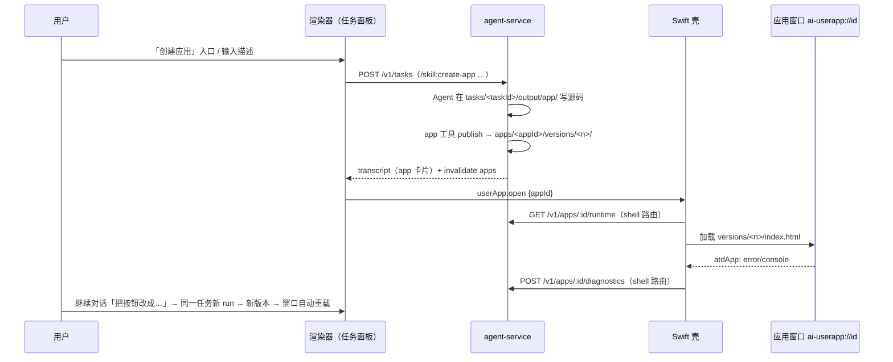

# Create App 能力（参考 Glaze）

Status: Draft - 规划完成，3 个产品决策待确认（见 Clarifying Questions）
Created: 2026-10-03
Approval: 仅授权规划；尚未授权实现

## Summary

参考 Raycast 的 [Glaze](https://www.glaze.app/)，让用户在任务面板里用自然语言描述一个小应用，Agent 生成、预览、按对话迭代，并保存为可随时启动的「我的应用」。

推荐形态（待 Q1–Q3 确认）：

- **生成物是静态 Web 应用**（HTML/CSS/JS，无构建、无依赖、无 CDN），不是 Glaze 默认的 Electron + Node 主进程，也不生成 Swift。理由：服务的 bash 有 120 s 上限且逐条确认（`apps/agent-service/src/shell-tool.ts:24`、`shell-policy.ts:124-141`），无法可靠跑 `npm install` / dev server；WKWebView 可直接、隔离地承载静态包。
- **应用是服务拥有的新实体**（`<dataDir>/apps/<appId>/`），带不可变版本快照；迭代仍是在创建它的那个任务里继续对话，不新增任务类型。
- **运行在原生壳的独立窗口**：每个应用一个 WKWebView，独立 scheme `ai-userapp://<appId>/`、独立 `WKWebsiteDataStore(forIdentifier:)`、独立且极窄的桥。绝不在渲染器内用 iframe（会继承 `ai-app://renderer` 源，拿到完整桥与带 token 的 relay）。
- **对话入口是产品技能 `create-app`**，与现有 `create-skill` / `create-command` 一致；发布/版本由新 harness 工具 `app` 完成；转录里显示应用卡片。

### Glaze 能力映射

| Glaze 能力                                        | 本项目对应                                                                       | 阶段           |
| ------------------------------------------------- | -------------------------------------------------------------------------------- | -------------- |
| 新建项目 + 对话生成（Plan/Build 模式、澄清问题）  | `create-app` 技能；复用已有 plan-mode 技能与 `ask_user`                          | P1             |
| 构建中即可交互的实时预览、更新后自动重载          | 应用窗口在每次发布新版本后自动重载                                               | P2             |
| 每次完成修改自动生成整包版本、版本历史、回退      | `app.publish` 生成不可变版本；版本列表与回退                                     | P1 / P4        |
| 应用有名称、图标、独立窗口、可从启动器打开        | 源码内 `app.manifest.json`（名称、描述、窗口尺寸）+ `icon.svg`；「我的应用」列表 | P1 / P3        |
| 运行时错误回流给 Agent 修复（Glaze 排障常见问题） | 应用窗口捕获 `error` / `unhandledrejection` / console.error，Agent 可读取        | P4             |
| 应用内 AI 能力（按使用者计费、需同意、可设上限）  | 待 Q2：经壳代理到用户已配置的提供商，按应用授权                                  | P5（待确认）   |
| Dock 图标、Spotlight、/Applications 安装          | 待 Q3：每个应用生成独立 `.app` 外壳                                              | 后续（待确认） |
| Annotate（点选元素修改）、Inspector               | 非本期                                                                           | 非目标         |
| Store、Team Store、Remix、发布审核、积分计费      | 非本期                                                                           | 非目标         |

Glaze 调研来源：[官网](https://www.glaze.app/)、[手册](https://manual.glaze.app)、[定价](https://www.glaze.app/pricing)、[changelog](https://www.glaze.app/changelog)、[Raycast 博客](https://www.raycast.com/blog/meet-glaze)、[HN 讨论](https://news.ycombinator.com/item?id=47247033)。手册写明生成物「built as Electron applications」，v0.13 起可选原生 Swift（需 Xcode）；应用以「full system access」运行，无沙箱。我们刻意选更窄的安全模型。

### 端到端流程



## Clarifying Questions

- [ ] **Q1 生成物形态**：推荐「静态 Web 应用 + 独立隔离窗口」。备选：Glaze 式 Electron/Node 后端（需长驻进程与依赖安装，超出现有工具能力）；原生 Swift（需用户装 Xcode）。
- [ ] **Q2 首版应用能力边界**：推荐「离线 + 本应用持久存储 + 剪贴板写入 + 打开外链（需确认）」，网络请求与应用内 AI 调用放到 P5 并按应用授权。备选：首版就开放 AI 调用。
- [ ] **Q3 应用身份**：推荐首版应用以本产品的子窗口运行（跟随「在 Dock 显示」设置），从「我的应用」列表或转录卡片启动；每应用独立 `.app`（Dock 图标、Spotlight）留到后续。
- 已按仓库证据解决、无需询问：
  - 迭代源码位置：沿用任务 cwd `tasks/<taskId>/output/app/`（四处 cwd 推导不需改动）；发布时复制为版本快照。任务被删除后应用仍可运行；「继续编辑」会新建任务并把最新版本复制进其 output。
  - 发布内容的写入所有权：只有服务的 apps 模块写 `<dataDir>/apps`；把它加入 `protectedWriteRoots`（`service-fs.ts:112-114`），Agent 的文件工具不能篡改已发布版本。
  - 内联脚本：技能要求外置 `app.js`，CSP 用 `script-src 'self'`；源隔离使 `'unsafe-inline'` 也可接受，但不需要。

## File And Code References

### 服务（`apps/agent-service/src/`）

- 装配：`index.ts:54-183`；路由挂载放在 `manage.ts:33-51`（`server.ts` 已 344 行，不能再加）。
- 先例：`commands/store.ts`（带修订号的存储 + `onChanged`）、`commands/tool.ts`（经授权门写入的 Agent 工具）、`server.ts:164`（onChanged → invalidate）。
- 工具注册与白名单：`harness/index.ts:25-35`、`run-binding.ts:26-35`；参考 `harness/web-extension.ts`（独立授权范围）。
- 授权门：`harness/gate.ts:65-141`；授权范围与层级 `packages/agent-contracts/src/confirms.ts:23-38, 145-152`。
- 文件边界：`service-fs.ts:89-133`；子代理写限制 `subagents/child-tools.ts:176-198`。
- 产品技能：`product-skills/*/SKILL.md`、`builtins/manifest.ts:48-56`、`builtins/skills.ts`。
- 转录详情投影：`transcript-details/index.ts:30-36`；详情 schema `packages/agent-contracts/src/tool-details.ts:267-274`。
- 路由暴露：`route-exposure.ts:1-13`、`relay-routes.ts:59-76`（每个路由必须声明 `RENDERER_ROUTE` 或 `SHELL_ROUTE`）。
- 数据目录：`storage.ts:55-69`；任务删除不清理 output：`tasks/manage.ts:72-95`。

### 契约与客户端

- `packages/agent-contracts/src/`：新增 `apps.ts`；invalidate 范围 `workspace.ts:148-159`；错误码 `protocol.ts:18-44`；`index.ts` 导出。
- `packages/agent-client/src/`：新增 apps 客户端。

### Swift 壳（`apps/macos/Sources/`）

- 窗口先例：`AIShell/Windows/SettingsWindowController.swift:10-112`、`Screens.swift:6-118`（`UnifiedTitleBar`、工作区几何）。
- 不可复用为宿主：`AIShell/Web/WebViewHost.swift:153-233`（自带 relay、socket、`ShellBridge`、私有玻璃键），新建 `UserAppHost`。
- 可复用：`AICore/Relay/RelayPath.swift:54-124`（需泛化 `classify` 的硬编码 scheme/host）、`StaticFileResolver.swift:18-32`（符号链接与根目录约束）、`RendererMIMEType`、`SchemeTaskTable`。
- 安全基线：`AICore/Bridge/RendererOrigin.swift:21-39`、`BridgeMessageHandler.swift:22-46`、`AICore/Relay/ContentSecurityPolicy.swift:43-59`、`RelayRequestGate.swift`。
- 编辑命令路由仅覆盖三个宿主：`AIShell/App/ShellController.swift:261-265, 316-328`，`WebViewRole` 在 `Integration/ShellServices.swift:7-11`。
- 服务→壳能力通道：`AICore/Stream/ControlFrame.swift:4`、`AIShell/Capabilities/ShellCapabilities.swift:23-31`。
- 打开策略：`AICore/Service/ArtifactOpenPolicy.swift:44-72`。
- 原生字符串：`apps/macos/App/Localizable.xcstrings`。

### 桥与渲染器（`apps/desktop/src/`）

- 桥契约：`native-bridge/contract.ts`、`window-calls.ts`；生成链 `apps/desktop/scripts/export-bridge-schema.mjs` → `apps/macos/scripts/generate-bridge-types.mjs`。
- 转录卡片插入点：`features/agent/transcript/tool-body.tsx:30-89`、`tool-copy.ts:242-256`。
- 面板视图：`features/agent/use-task-panel.ts:31`、`App.tsx`；设置分区 `features/settings/settings-sections.ts:4-11`。
- 「通过技能新建」入口先例：`docs/plans/2026-09-22-extensions-tab-add-actions.md:11-19`。
- i18n 命名空间注册：`i18n/index.ts:4-27`。
- 需求文档中未实现的 ArtifactRef（C8/C10）：`docs/plans/2026-09-10-general-agent-requirements.md:204-206, 224`。客户端写死 `artifacts: []`（`client/agent/service-map.ts:72`）。应用记录不顺带实现通用 ArtifactRef，只在卡片中引用 appId。

## 设计

### 数据模型（服务拥有）

```
<dataDir>/apps/
  index.json                 # 修订号 + 应用摘要列表（AppStore 唯一写者）
  <appId>/
    app.json                 # id, name, description, sourceTaskId, currentVersion,
                             # dataStoreId(UUID), window{width,height,minWidth,minHeight},
                             # grants{}, createdAt, updatedAt
    versions/<n>/            # 不可变；index.html 必须存在
      index.html, app.js, styles.css, icon.svg, assets/...
      version.json           # n, createdAt, runId, summary
    diagnostics.jsonl        # 最近 N 条运行时错误（环形）
```

- `app.manifest.json`（在源码目录，由 Agent 编写）：`name`、`description`、`window`。`publish` 校验后写入 `app.json`。
- `publish` 校验：`index.html` 存在；总大小 ≤ 16 MiB，单文件 ≤ 8 MiB（与资源上限一致）；拒绝符号链接、隐藏文件、`.env`、可执行位；文件类型白名单（html/css/js/mjs/json/svg/png/jpg/webp/gif/woff2/txt/md）。先复制到临时目录再原子重命名。
- 版本保留：默认保留最近 20 个版本，回退会生成一个新版本（内容复制自旧版本），从不改写历史。
- 删除应用：服务删除目录；壳收到 invalidate 后关闭窗口，并调用 `WKWebsiteDataStore.remove(forIdentifier:)`。

### 服务接口

| 路由                               | 暴露     | 作用                                                          |
| ---------------------------------- | -------- | ------------------------------------------------------------- |
| `GET /v1/apps`                     | renderer | 列表（名称、图标 URL 由壳提供、当前版本、更新时间、来源任务） |
| `GET/PATCH/DELETE /v1/apps/:appId` | renderer | 详情、重命名、删除                                            |
| `GET /v1/apps/:appId/versions`     | renderer | 版本列表                                                      |
| `POST /v1/apps/:appId/revert`      | renderer | 以旧版本内容发布新版本                                        |
| `POST /v1/apps/:appId/edit`        | renderer | 来源任务仍在则返回其 taskId；否则新建任务并复制最新版本源码   |
| `GET /v1/apps/:appId/runtime`      | shell    | 当前版本根路径、dataStoreId、窗口尺寸、授权                   |
| `POST /v1/apps/:appId/diagnostics` | shell    | 写入运行时错误                                                |

Harness 工具 `app`（新授权范围 `app`；`auto` 层级下允许，其余层级确认）：

- `publish { dir = "app", summary }` → 新版本，返回 `ToolBlockDetails` 的 `app` 变体（appId、name、version、summary）。首次 publish 创建应用并把 `sourceTaskId` 设为当前任务。
- `diagnostics { appId }` → 最近错误，供 Agent 自修。
- `list` → 当前用户的应用摘要（用于「把之前那个记账应用改一下」）。

产品技能 `product-skills/create-app/SKILL.md`（英文，遵守全局技能编写规则：描述意图，不列触发短语）：文件结构、只用浏览器原生 API、不引用远程资源、数据存在 `localStorage`/`IndexedDB`、可访问性与浅深色主题、每完成一次可运行的修改就调用 `app.publish`、需求模糊时用 `ask_user`、大需求先用 plan-mode。

### 壳：应用窗口宿主

- `UserAppWindowController`（每个应用最多一个窗口，注册表按 appId）：标准带标题栏、可缩放的 `NSWindow`，不透明内容，不复用面板玻璃；位置按工作区约束并按 appId 记忆帧。
- `UserAppHost`：独立 `WKWebViewConfiguration`；**不注册 `ai-app` 处理器**；`UserAppSchemeHandler` 只服务 `ai-userapp://<appId>/` 的 GET/HEAD，根目录为当前版本目录（经 `StaticFileResolver`）；`websiteDataStore = WKWebsiteDataStore(forIdentifier: dataStoreId)`。
- CSP：`default-src 'self'; script-src 'self'; style-src 'self' 'unsafe-inline'; img-src 'self' data: blob:; font-src 'self' data:; connect-src 'none'; frame-src 'none'; form-action 'none'; base-uri 'none'; object-src 'none'`，并用 `WKContentRuleList` 阻断一切非 `ai-userapp` 加载（含 loopback，防止触达 Vite `/@fs/` 与服务）。
- 导航锁：主框架只能留在自身 `ai-userapp://<appId>/`；子框架拒绝；`createWebViewWith` 返回 nil；外链经 `ConfirmationPrompter` 后交给 `NSWorkspace`（仅 http/https）。
- 用户应用桥（`atdApp`，`WKScriptMessageHandlerWithReply`，独立 TypeBox 契约 `native-bridge/user-app-contract.ts`，独立分发器，绝不经过 `ShellBridge`）：首版只有 `app.ready`、`app.error`、`clipboard.write`、`link.open`。注入一段文档开始时的用户脚本，提供 `window.atd` 包装与错误捕获。来源校验：主框架 + `ai-userapp` + host == 窗口 appId + 端口 0。
- 编辑菜单：`sendEditCommand` 对用户应用窗口回退到 WebKit 的 `undo:`/`redo:`；粘贴走 `ShellWebView` 的回退路径。
- 渲染器桥新增调用：`userApp.open { appId }`（已开则前置并在版本变化时重载）、`userApp.close { appId }`；事件 `userApp.state { appId, open, version }`。

### 渲染器

- 转录：`ToolBlockDetailsSchema` 增加 `app` 变体，`DetailsBody` 增加 `AppCard`（图标、名称、版本、摘要；操作：打开、版本历史）。卡片复用 `Item` 组合与 `Button` 变体，不新造控件。
- 面板入口：新任务视图加「创建应用」操作，播种 `/skill:create-app`（与扩展页「通过技能新建」一致）；面板新增 `apps` 视图（我的应用列表：打开、继续编辑、更多→重命名/版本/删除）。
- 设置：新增「应用」分区，管理列表、版本回退、清除应用数据、删除。
- 自动重载：渲染器收到 `apps` invalidate 后，对已打开且版本变化的应用调用 `userApp.open`。
- i18n：新增 `apps` 命名空间（en、zh-CN），原生窗口标题与确认文案进 String Catalog（en、zh-Hans）。
- Figma：在项目文件中新增/更新 `App card`、「我的应用」列表、应用窗口外观与设置「应用」分区，复用 `App / Icon button` 与共享库实例。

## Plan Todos

依赖关系：T1 → T2/T3 → T4 → T5；T6 依赖 T2 与 T4；T7 依赖 Q2。

- [ ] **T0 决策确认**：确认 Q1–Q3，并把结论写回本文件。
- [ ] **T1 契约**（`packages/agent-contracts`、`packages/agent-client`）：`apps.ts` schema（App、AppVersion、AppRuntime、Diagnostics、路由请求/响应）、`apps` invalidate 范围、错误码、`app` 授权范围、`ToolBlockDetails.app` 变体、客户端。
- [ ] **T2 服务 apps 模块**（`apps/agent-service/src/apps/`：`store.ts`、`publish.ts`（校验 + 原子复制）、`routes.ts`、`tool.ts`、`edit.ts`）；在 `manage.ts` 挂载，在 `harness/index.ts` 与 `run-binding.ts` 注册工具，在 `service-fs.ts` 保护 `apps/`，在 `transcript-details` 投影卡片详情，`onChanged` → invalidate。
- [ ] **T3 产品技能** `product-skills/create-app/SKILL.md` + `builtins/manifest.ts` 注册；附一个最小起始模板（`references/` 下的 index.html/app.js/styles.css/manifest 示例）。
- [ ] **T4 壳应用宿主**：`RelayPath` 泛化、`UserAppSchemeHandler`、CSP 构建与 `WKContentRuleList`、`UserAppHost`、`UserAppWindowController` 与注册表、用户应用桥契约 + 生成 + 分发器、错误上报到 shell 路由、编辑命令回退、String Catalog 文案。
- [ ] **T5 渲染器**：桥调用 `userApp.open/close` 与事件；`AppCard`；新任务「创建应用」入口；面板 `apps` 视图；设置「应用」分区；`apps` i18n 命名空间；invalidate 驱动的自动重载。
- [ ] **T6 迭代闭环与版本**：`app.diagnostics` 工具、版本历史 UI 与回退、「继续编辑」在来源任务缺失时的新任务分支、删除时清理数据存储。
- [ ] **T7（待 Q2）应用内能力扩展**：按应用授权的网络白名单与 `atd.ai.complete`（壳代理到 shell 路由，使用用户已配置提供商，带每日上限与撤销）。
- [ ] **T8 Figma 同步**：卡片、列表、应用窗口、设置分区，与代码同一任务内完成。
- [ ] **T9 验证**：见 Validation。

## Grill-Me Outcome

- Transcript: Not run
- Outcome: Not run
- Summary: 未运行；三个待决问题直接以结构化问题询问用户。

## Build From Plan

- Ready to build: No（等待 Q1–Q3 与实现授权）
- Selected todos: 无
- Execution notes:
  - 新行为放在新模块；`server.ts`(344)、`task-runner.ts`(349)、`runner-manager.ts`(343)、`pi-session.ts`(331) 接近 350 行上限，不往里加逻辑。
  - 实现顺序按依赖：T1 → (T2 ∥ T3 ∥ T4 的 Swift 部分) → T5 → T6。T2 与 T4 写入边界不重叠，可并行；桥契约文件由 T4 单一拥有，T5 只消费生成结果。
  - 运行时验证使用临时 `AI_AGENT_DATA_DIR` 与确认空闲的端口，不触碰用户的 dev 或已安装实例。

## Validation

- 静态：`pnpm --version` 与 `packageManager` 一致；`pnpm typecheck`、`pnpm lint`（含 350 行与 shadcn lint）、`pnpm --filter @atd/desktop bridge-schema --check`、`pnpm --filter @atd/macos codegen` 后无差异、`pnpm check:swift`。
- 测试：运行现有 Vitest、服务 Node 测试与 Swift Testing（`pnpm test`）。未经用户要求不新增测试；若用户要求，优先覆盖 publish 校验（符号链接、大小、类型）、`RelayPath` 泛化与用户应用来源校验。
- 运行时（隔离数据目录，`AI_AGENT_DATA_DIR=$(mktemp -d) pnpm dev`）：
  - 用技能创建一个待办应用 → 卡片出现 → 打开窗口 → 数据刷新后保留 → 对话修改 → 窗口自动重载为新版本 → 回退。
  - 安全探针：应用内 `fetch('ai-app://renderer/v1/status')`、`fetch('http://127.0.0.1:<vite>/@fs/…')`、`window.webkit.messageHandlers.aiNative`、iframe、`window.open` 全部失败。
  - 制造运行时错误 → `app.diagnostics` 能读到 → Agent 修复。
- 视觉：按 Visual Acceptance 检查卡片、列表、设置分区的宽度矩阵与深浅色；应用窗口为原生窗口，需看 OS 合成的实际窗口。

## Risks

- **生成代码的信任**：生成 JS 的唯一隔离是 WebKit WebContent 沙箱 + 我们的 scheme/CSP/数据存储/规则列表；应用本身没有 App Sandbox。桥必须保持极窄，每加一个能力都需要按应用授权。
- **WebKit 行为待验证**：自定义 scheme 是否为安全上下文（影响 `crypto.subtle`、Clipboard API）；`WKWebsiteDataStore(forIdentifier:)` 下自定义 scheme 源的 localStorage/IndexedDB 是否持久；自定义编辑菜单下普通 WKWebView 的 ⌘V/⌘Z。T4 开始时先做最小原型确认。
- **静态应用的能力天花板**：没有 Node 后端，无法读写任意文件或长期后台运行；与 Glaze 相比是刻意取舍，后续扩展经桥按需开放。
- **生成质量**：空白或打不开的应用是 Glaze 排障首要问题；依靠 diagnostics 回流与技能约束缓解。
- **磁盘占用**：版本快照累积，以保留上限与总大小上限约束。

## Approval

- Status: Draft - awaiting approval（需 Q1–Q3 结论与实现授权）
