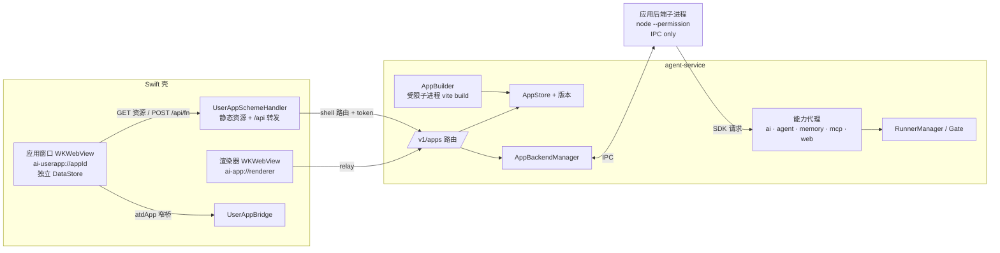
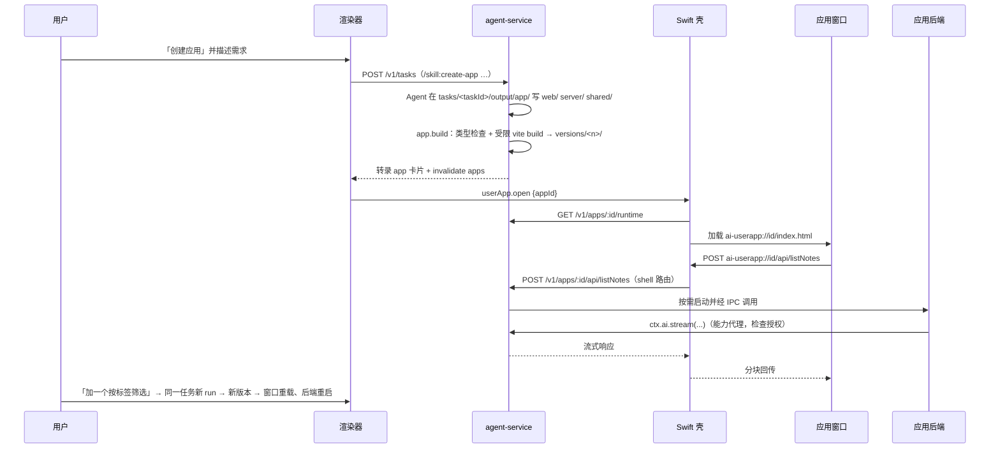
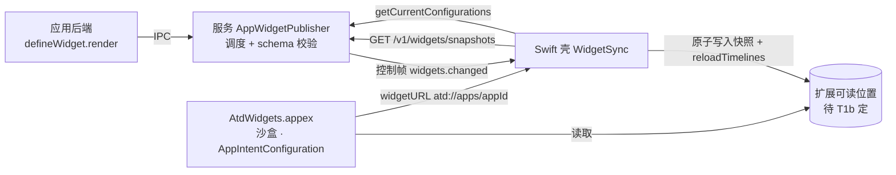

# Create App 能力（参考 Glaze）

Status: Implemented - T2–T9、T11、T12 已实现（代码见提交 591437a，Figma 同步见 `docs/design-source.md` 2026-10-04 各节）；T10 验证结果未在本计划记录；2026-10-05 的修订见「2026-10-05 修订」一节，与上下文冲突时以该节为准
Created: 2026-10-03
Approval: 已授权规划与 T1 原型（2026-10-04 完成）；T2–T10 尚未授权实现

## Summary

参考 Raycast 的 [Glaze](https://www.glaze.app/)，让用户在任务面板里用自然语言描述一个应用。Agent 生成带前端与后端的完整应用，用户可以预览、按对话迭代，并保存为可随时启动的「我的应用」。

用户已确认（2026-10-03）：

1. **前端沿用本项目的技术栈架构**：React + TypeScript + Vite + Tailwind v4 + `@atd/ui`（shadcn Rhea 预设）+ lucide-react，与 `apps/desktop` 的渲染器同构。
2. **每个应用有自己的后端服务**。
3. **首版开放本项目已有的完整 AI 能力与后端能力**，包括模型调用、Agent 运行（工具、技能、子代理）、记忆、MCP、联网搜索与抓取，以及持久存储。
4. **应用以本产品的子窗口出现**：跟随「在 Dock 显示」设置，从「我的应用」或转录卡片启动；每个应用独立 `.app` 留到以后。

由此得出的架构：

- **应用是服务拥有的新实体**（`<dataDir>/apps/<appId>/`），带不可变版本。迭代就是在创建它的任务里继续对话，不新增任务类型。
- **工具链由服务提供，不由 Agent 安装**：新增工作区包 `packages/app-kit`，内含模板、SDK、固定依赖集与 Vite 构建管线。服务在受限子进程里构建，Agent 不跑 `npm install` 或 dev server（bash 有 120 s 上限且逐条确认，见 `apps/agent-service/src/shell-tool.ts:24`、`shell-policy.ts:124-141`）。
- **后端是每个应用一个 Node 子进程**，由 agent-service 托管，只经 IPC 通信。它同时受 Node 24 权限模型和 macOS Seatbelt 约束：文件写入限于应用数据目录，可以访问外网，但碰不到本机服务（T1 已实测）。所有 AI 和后端能力由父进程的「能力代理」提供，凭据和服务 token 永不进入子进程。
- **前端运行在原生壳的独立窗口**：每个应用一个 WKWebView，用独立 scheme `ai-userapp://<appId>/` 和独立 `WKWebsiteDataStore(forIdentifier:)`。同源 `/api/*` 由壳转发到服务，再经 IPC 到该应用的后端。绝不在渲染器里用 iframe，因为 iframe 会继承 `ai-app://renderer` 源，拿到完整的桥和带 token 的 relay。
- **对话入口是产品技能 `create-app`**，与 `create-skill`、`create-command` 一致。构建和发布由新 harness 工具 `app` 完成，转录里显示应用卡片。

### Glaze 能力映射

| Glaze 能力                                        | 本项目对应                                                                     | 任务     |
| ------------------------------------------------- | ------------------------------------------------------------------------------ | -------- |
| 对话生成，Plan/Build 模式，澄清问题               | `create-app` 技能，复用 plan-mode 技能与 `ask_user`                            | T5       |
| Electron 渲染进程 + Node main 进程                | React/Vite 前端 + 每应用 Node 后端子进程                                       | T2、T4   |
| 实时预览，更新后自动重新启动                      | 每次构建发布新版本后，窗口重载、后端重启                                       | T4、T7   |
| 每次完成修改自动生成整包版本，版本历史与回退      | `app.build` 生成不可变版本（含源码快照），版本列表与回退                       | T4、T7   |
| 名称、图标、独立窗口                              | `atd-app.json` 清单（名称、描述、窗口尺寸、能力）+ `icon.svg`                  | T2、T6   |
| 应用内 AI：按使用者计费，需同意，可设上限、可撤销 | 能力代理使用用户已配置的提供商；每个应用每类能力首次使用时同意，可在设置中撤销 | T4、T7   |
| 集成（MCP、OAuth）                                | 复用服务现有 MCP 授权与策略                                                    | T4       |
| 文件与数据：每应用数据目录、本地数据库            | 应用数据目录 + `node:sqlite`                                                   | T2、T4   |
| 运行时错误与「空白应用」排障                      | 前端错误、后端 stderr 与崩溃回流成 diagnostics，Agent 可读取并修复             | T4       |
| （Glaze 没有）macOS 桌面小组件                    | Atd 内置一个 WidgetKit 扩展，由生成的应用声明小组件（Q4）                      | T11、T12 |
| Dock 图标、Spotlight、/Applications               | 非本期（Q3 已定：子窗口）                                                      | 非目标   |
| Annotate/Inspector、Store、Remix、发布审核、积分  | 非本期                                                                         | 非目标   |

Glaze 调研来源：[官网](https://www.glaze.app/)、[手册](https://manual.glaze.app)（其中 [editing-code](https://manual.glaze.app/advanced/editing-code) 写明生成物「built as Electron applications」）、[定价](https://www.glaze.app/pricing)、[changelog](https://www.glaze.app/changelog)、[Raycast 博客](https://www.raycast.com/blog/meet-glaze)、[HN 讨论](https://news.ycombinator.com/item?id=47247033)。Glaze 应用以「full system access」运行。我们开放同等范围的能力，但通过能力代理和现有授权门提供，而不是给生成代码裸系统权限。

### 架构





## 2026-10-05 修订

用户要求（2026-10-05）优化 create app。以下决定取代本计划中对应的内容。

1. **一次请求一个版本**（取代"每次构建发布一个新版本"）：同一次运行中第一次成功的 `app.build` 发布下一个版本，之后的构建原地更新这个版本，版本号不变；其他运行、没有运行 id 的构建和回退各自产生新版本。每次构建有自己不再改动的目录 `versions/.rev-<k>/`，`versions/<n>` 是指向它的符号链接。应用记录的 `revision` 每次发布加一，窗口重载、后端重启、小组件渲染和图标缓存都以它为键。代码见 `apps/agent-service/src/apps/versions.ts`、`publish.ts`；契约为 `AppSummary`、`AppRuntime`、`AppVersion` 的 `revision`。起因是案例 837a9d48：首次创建一个应用就有 7 个版本。
2. **应用可以声明 npm 依赖**（取代"依赖集固定、Agent 不可扩展"）：写在 `atd-app.json` 的 `dependencies` 里，最多 24 个，值为版本号或 `^`/`~` 范围。
   - 服务用 app-kit 自带的 npm 11.19.0，在单独的 Seatbelt 沙盒里解析和安装：只用公共 registry，不执行安装脚本，只装发布满 3 天的版本，拒绝原生代码和包 CSS 里的 Tailwind 指令。
   - 锁文件随每次构建记在 `deps/`，依赖树按内容寻址缓存在 `apps/.cache/deps`。
   - React、`@atd/ui` 等内置包始终用 app-kit 的副本。后端仍整体打包。
   - 代码见 `packages/app-kit/src/node/deps/`。
3. **默认窗口外观与主界面一致**（取代「壳：应用窗口宿主」里的标准不透明窗口）：
   - 新应用以 `window.surface: "glass"` 创建。窗口沿用设置窗口的做法：`NSGlassEffectView`、52 pt 的 `UnifiedTitleBar`、透明 web view 和 `useSystemAppearance`。
   - 页面由构建生成的 `#root` 填充 `--ata-surface-panel`，默认深色。页面第一行 `.atd-titlebar` 给红绿灯让出位置；壳注入一段脚本，把顶部 52 px 中非交互的部分报告为拖动区域。
   - 应用有四种方式改背景：重定义 token、替换 `#root` 的填充、用不透明的子元素盖住、或设 `surface: "opaque"`。
   - 没有声明 `surface` 的旧应用保持原样。
4. **桌面固定组件**：macOS 没有用代码添加 WidgetKit 小组件的公开 API，所以由壳在桌面层自己绘制窗口。
   - 在面板「我的应用」卡片上点固定按钮，或把卡片拖出面板，即可固定。
   - 固定组件显示应用声明的小组件，与小组件扩展用同一份快照和同一个 `WidgetTreeView`；没有小组件的应用显示图标和名称。
   - 每个应用一个，按数据目录持久化。右键菜单顶层列出应用声明的尺寸（小、中、大）作为预设，也可以切换小组件或者移除。
   - 拖动任意一角可以自由调整大小：对角不动，靠近标准尺寸时吸附，范围是所声明尺寸的区间（小 170–320 × 170–270，中 320–480 × 170–270，大 320–480 × 270–440）。不缩放：按当前大小选用区间包含它的那个尺寸的布局，在实际空间里重新排布，列表只显示能放下的整行，图表填满，字号不变。
   - 没有小组件的应用显示图标卡片：宽度不足 320 时图标在上、名称在下；更宽时图标在左，右侧是名称和能放下的描述，描述随小组件同步数据下发。
   - `create-app` 技能引导有可一眼查看内容的应用同时声明小、中两种尺寸，列表在各尺寸都返回最多 8 行，由空间决定显示多少。
   - 可发现性：固定按钮的提示写明也可以拖动卡片；第一次用按钮固定后，额外提示一次「下次可以直接把应用卡片拖到桌面来固定」。
   - 代码见 `apps/macos/Sources/AIShell/DesktopPins/`；桥为 `userApp.pin`、`userApp.unpin`、`userApp.pinDrag` 和 `userApp.pins`。
5. **多智能体创建的评估**：案例 837a9d48 约 2.5k 行、用时 24 分钟，其中 83% 是模型生成。用子代理并行写文件最多省 5–6%，协调却要 100–250 s；子代理也不能构建、测试、询问用户或读取技能参考。
   - 因此不默认委派。`create-app` 技能默认吸收它的原则：先定范围和契约，每个文件只有一个作者，以证据收尾。
   - 只有应用较大且各部分独立时，才按技能里的方式委派。
   - 收益最大的是把 SDK 的限制写进参考文档，如文件选择的上限、`ctx.files` 是同步的、`$atd:bytes`。

## Clarifying Questions

- [x] **Q1 生成物形态**：用户确认前端沿用本项目前端技术栈架构，应用具备自己的后端服务。
- [x] **Q2 首版能力边界**：用户确认首版开放项目已有的完整 AI 能力与后端能力。
- [x] **Q3 应用身份**：用户确认作为本产品的子窗口。
- [x] **Q4 桌面小组件**（2026-10-04）：用户要求生成的应用能出现在 macOS 小组件库里，并确认**统一放在小组件库的「Atd」一项下**：用户添加小组件后，在小组件的编辑界面里选择它属于哪个应用、是哪个小组件。不为每个应用单独生成 `.app`。Glaze 没有 WidgetKit 小组件，它商店里的 [WidgetGrid](https://www.glaze.app/app/widgetgrid-oil9CK) 是应用自己画在桌面上的窗口。
- [x] **小组件库可见性**（2026-10-04 用户目视确认）：ad hoc 签名的探针（与 dmg 相同的签名方式，从 `/private/tmp` 启动）作为独立的一项出现在小组件库，小、中、大三种尺寸都有。Release 不需要改用 Developer ID。
- [x] **小组件的配置、刷新、点击**（2026-10-04 用户目视确认，并有日志佐证）：
  - 小组件能显示快照内容，编辑界面显示「App」参数并默认选中第一个应用。
  - 写入新快照并 `reloadAllTimelines` 后，内容刷新为 r2。
  - 点击后宿主收到 `t1widget://open?app=notes`。
  - 新增的应用会出现在扩展返回的实体列表里（`notes,habits`）。下拉列表本身没有目视确认。
  - 起初点击没有反应，根因是**宿主装在 `/private/tmp`**：系统的 App Intents 元数据服务找不到宿主 bundle（`LNMetadataProviderErrorDomain 9001`），于是 `hasDefaultIntent: NO`，时间线一直以 `CHSErrorDomain 1103` 失败，小组件卡在占位状态。挪到 `~/Applications` 后立即恢复。签名与数据通道已由 T1b 定（见「T1b 结论」）。本机只有 `Apple Development` 身份（team `FQTCTDP4B2`），没有 `Developer ID Application`。
- 以下按仓库证据与安全约束定为默认，用户可以直接改：
  - **能力同意**：每个应用对每类能力（`ai`、`agent`、`memory`、`mcp`、`web`）在首次使用时询问一次，结论存进 `app.json`，可在设置中撤销。`agent.run` 里有副作用的工具仍按当前权限层级走现有授权门（`harness/gate.ts:65-141`）。存储与日志不需要同意。
  - **后端系统权限**：
    - 文件写入只限应用数据目录；`/Users` 下的读取只限版本目录、运行时目录和数据目录。
    - 禁止子进程、Worker、原生插件，信号只能发给自身。
    - 出站 internet 放行，作为「后端能力」的一部分，应用可以直接调第三方 API；loopback（包括本服务）、unix socket 和监听端口一律禁止。
    - 由 Node 权限模型与 Seatbelt 共同实施，T1 已实测。
    - 更广的文件或命令操作通过 `ctx.agent.run` 交给 Agent 与授权门。
  - **工具链随应用分发**：剪枝后的工具链约 143 MB，加 TypeScript 原生 `tsc` 30 MB。当前 Release `Atd.app` 为 618 MB、dmg 421 MB，相当于增加约 28%。备选方案是首次创建应用时按需下载，但需要额外做签名校验与下载基础设施，首版不做。
  - **依赖集**：首版固定、不可由 Agent 扩展，只有 react、react-dom、`@atd/ui`、lucide-react、motion、@tanstack/react-query、typebox、tailwindcss，以及 SDK。引入白名单之外的包会让构建失败，并把可读的错误返回给 Agent。
  - **迭代源码位置**：沿用任务 cwd `tasks/<taskId>/output/app/`，不改四处 cwd 推导。每个版本保存源码快照；来源任务删除后，「继续编辑」会新建任务并恢复最新源码。
  - **发布内容只有服务写**：`<dataDir>/apps` 加入 `protectedWriteRoots`（`service-fs.ts:112-114`），Agent 的文件工具不能篡改已发布版本或应用数据。
  - **应用发起的 Agent 运行**：创建普通任务并标记 `origin: { kind: 'app', appId }`，在历史中带应用标识，用户可以审计，确认也走现有面板确认界面。

## File And Code References

### 服务（`apps/agent-service/src/`）

- 装配在 `index.ts:54-183`。路由挂在 `manage.ts:33-51`；`server.ts` 已有 344 行，不再往里加。
- 先例：
  - 带修订号的存储与 `onChanged`：`commands/store.ts`
  - 经授权门写入的工具：`commands/tool.ts`
  - onChanged → invalidate：`server.ts:164`
- 模型调用：
  - `connectionRuntime` 与 `completeSimple`：`providers/runtime.ts:45, 204-221`
  - 先例 `harness/auto-review.ts:98`
  - 流式 `streamSimple`：`providers/llama.ts:212`
  - 默认模型解析：`run-model.ts`
- Agent 运行与授权：
  - `RunnerManager.submit`：`runner-manager.ts:94-177`
  - 授权门：`harness/gate.ts:65-141`
  - 授权范围与层级：`packages/agent-contracts/src/confirms.ts:23-38, 145-152`
- 工具注册：`harness/index.ts:25-35`、`run-binding.ts:26-35`，参考 `harness/web-extension.ts`。
- 记忆、MCP、联网：`memory/*`、`mcp/*`（策略 `mcp/policy.ts`）、`pi-web-access` 扩展。能力代理应调用这些模块现有的入口，不另起实现。
- 文件边界：`service-fs.ts:89-133`。数据目录布局在 `storage.ts:55-69`。任务删除不清理 output：`tasks/manage.ts:72-95`。
- 账本是严格 schema（`ledger.ts:18-25, 119-149`），新增 `origin` 需要迁移。
- 路由暴露：`route-exposure.ts:1-13`、`relay-routes.ts:59-76`。每个路由必须声明 `RENDERER_ROUTE` 或 `SHELL_ROUTE`，且不允许通配。
- 产品技能：`product-skills/*/SKILL.md`、`builtins/manifest.ts:48-56`、`builtins/skills.ts`。
- 转录详情投影：`transcript-details/index.ts:30-36`。
- Node 版本：`.node-version`（24.21.0）、`node-runtime.ts`，服务包打包脚本 `apps/macos/scripts/prepare-service-pack.mjs:53, 148`。

### 契约与客户端

- `packages/agent-contracts/src/`：
  - 新增 `apps.ts`
  - invalidate 范围：`workspace.ts:148-159`
  - 错误码：`protocol.ts:18-44`
  - 工具详情：`tool-details.ts:267-274`
  - 任务 origin：`task.ts`
- `packages/agent-client/src/`：新增 apps 客户端。

### Swift 壳（`apps/macos/Sources/`）

- 窗口先例：`AIShell/Windows/SettingsWindowController.swift:10-112`；`Screens.swift:6-118`（`UnifiedTitleBar`、工作区几何）。
- 不复用为宿主：`AIShell/Web/WebViewHost.swift:153-233`，它自带 relay、socket、`ShellBridge` 和私有玻璃键。另建 `UserAppHost`。
- 可复用：
  - `AICore/Relay/RelayPath.swift:54-124`（泛化 `classify` 里写死的 scheme 和 host）
  - `StaticFileResolver.swift:18-32`
  - `RelayHeaders.swift:16, 45-52`（注入 token）
  - `AIRelay/APIRelay.swift:26-90`
  - `RendererMIMEType`、`SchemeTaskTable`
- 安全基线：`AICore/Bridge/RendererOrigin.swift:21-39`、`BridgeMessageHandler.swift:22-46`、`AICore/Relay/ContentSecurityPolicy.swift:43-59`、`RelayRequestGate.swift`。
- 编辑命令路由目前只覆盖三个宿主：`AIShell/App/ShellController.swift:261-265, 316-328`；`Integration/ShellServices.swift:7-11`。
- 确认弹窗与外链：`ConfirmationPrompter`、`ExternalLink`。文件选择沿用现有的 `files.pick`、`files.save` 实现。
- 原生文案：`apps/macos/App/Localizable.xcstrings`。

### 桥与渲染器（`apps/desktop/src/`）

- 桥契约在 `native-bridge/contract.ts`、`window-calls.ts`。生成链：`apps/desktop/scripts/export-bridge-schema.mjs` → `apps/macos/scripts/generate-bridge-types.mjs`。
- 转录卡片插入点：`features/agent/transcript/tool-body.tsx:30-89`、`tool-copy.ts:242-256`。
- 面板视图在 `features/agent/use-task-panel.ts:31`、`App.tsx`；设置分区在 `features/settings/settings-sections.ts:4-11`。
- 「通过技能新建」入口的先例：`docs/plans/2026-09-22-extensions-tab-add-actions.md:11-19`。
- i18n 命名空间注册：`i18n/index.ts:4-27`。
- 前端技术栈来源：`apps/desktop/package.json`、`apps/desktop/vite.config.ts`、`packages/ui/package.json`、`packages/ui/src/styles.css`、`components.json`。

## 设计

### 应用源码结构（Agent 编写，位于 `tasks/<taskId>/output/app/`）

```
app/
  atd-app.json          # name, description, accentColor?(#RRGGBB),
                        # window{width,height,minWidth,minHeight},
                        # capabilities: ["ai","agent","memory","mcp","web"] 的子集
  icon.svg              # 用 accentColor 绘制
  web/                  # 前端，结构与 apps/desktop/src 同构
    index.html
    src/main.tsx, App.tsx, features/…, styles.css（@import "@atd/ui/styles.css"）
  server/               # 后端
    index.ts            # export default defineBackend({ api: {...}, onStart, onStop })
  shared/               # 前后端共享的 typebox schema 与类型
```

### `packages/app-kit`（新工作区包，工具链与 SDK 的唯一拥有者）

- `template/`：最小可运行应用，含一个调用后端的示例，使用 `@atd/ui` 组件和 Rhea token。
- 应用的识别色（2026-10-04 追加，用户反馈「创建的应用长得都一样」）：`atd-app.json` 的可选 `accentColor`（`#RRGGBB`，契约 `AppAccentColorSchema`）是应用唯一的识别色来源，相当于原生应用资源目录里的 AccentColor。
  - 构建（`src/node/theme.ts`）生成一份替身样式表，把 `@atd/ui/styles.css` 的别名指向它：先 `@import` 真正的 `@atd/ui` 样式，再写浅色（`:root`）与深色（`.dark`）两套 `--primary`、`--primary-foreground`，`--ring`、`--chart-1`、`--sidebar-primary`、`--sidebar-ring` 跟随 primary。这样主题位于 `@atd/ui` 默认值之后、应用自己的 `styles.css` 规则之前，应用仍可覆盖任何 token。`--accent` 保持中性，因为它在 shadcn 里是悬停底色。
  - 对比度按 WCAG 2 计算：保持色相，只在 OKLCH 里调整亮度，直到识别色对页面背景 ≥ 3:1，识别色上的文字在静止和悬停（`bg-primary/80`）时都 ≥ 4.5:1。
  - 没有 `accentColor` 的应用产物与以前逐字节相同；格式错误时构建失败（`invalid_manifest`）。
  - 小组件的 `accent` 颜色 token 与 Atd 自己的预览使用同一个识别色。
  - `create-app` 技能在写界面前先按应用的用途设计外观：布局来自主要任务、选识别色并用它画图标、需要强调的数值用大号等宽数字、有意义的动效（尊重减弱动态效果）、按含义分组的表面；只有当浏览一个列表本身就是任务时才用「上方控件 + 卡片列表」。原始颜色只允许出现在 `web/src/styles.css` 的 token 定义里。starter 改用琥珀色识别色与对应图标，`references/example.md` 改为另一种布局（Mood：一键打卡、五周网格、流式 AI 回顾），避免两个示例都教同一种列表布局。
- `sdk/client`：
  - `api.call(name, input)`、`api.stream(name, input)`、`events.subscribe(channel)`：同源 `fetch('/api/…')`，流式响应为 NDJSON。
  - `native.clipboard.write`、`native.openLink`、`native.files.pick/save`：通过 `window.webkit.messageHandlers.atdApp` 调用。`files.pick` 返回字节，不返回 Blob。
  - 上传二进制只能用 `ArrayBuffer` 或 `Uint8Array`，SDK 会把 Blob 和 File 先转成 `arrayBuffer()`（T1：Blob、FormData 文件和流式上传到达壳时 body 为空或直接报错）。
- `sdk/server`：`defineBackend`，类型化的 `ctx`：
  - `ctx.ai.generate/stream({ messages, model?, maxTokens? })`
  - `ctx.agent.run({ prompt, tools?, skills? })`：返回流式事件与最终文本。
  - `ctx.memory.search/read/write`
  - `ctx.mcp.listTools/callTool`
  - `ctx.web.search/fetch`
  - `ctx.db`：`node:sqlite`，位于数据目录的 `app.db`。
  - `ctx.kv`、`ctx.files`（数据目录内）
  - `ctx.events.publish(channel, data)`、`ctx.log`
- `runtime/bootstrap.mjs`：后端子进程入口。加载构建产物 `server/index.mjs`，把 `ctx` 的能力请求序列化为 IPC 消息，路由 `api` 调用，转发 stdout/stderr 与未捕获异常。
- `build/`：
  - Vite 配置工厂：`@vitejs/plugin-react`、`@tailwindcss/vite`，web 端 `build`，server 端 SSR 构建为单个 ESM。
  - 白名单解析插件：裸导入只从 app-kit 自身的 `node_modules` 解析，白名单之外的包报错。
  - `tsc --noEmit` 类型检查，结果作为非阻断的 diagnostics。
- 依赖使用 catalog，版本与渲染器一致。

### 数据模型（服务拥有）

```
<dataDir>/apps/
  index.json                  # 修订号 + 应用摘要（AppStore 唯一写者）
  <appId>/
    app.json                  # id, name, description, accentColor?, sourceTaskId, currentVersion,
                              # dataStoreId(UUID), window, capabilities, grants{cap: granted|denied},
                              # createdAt, updatedAt
    versions/<n>/
      web/…                   # 构建后的静态资源
      server/index.mjs        # 构建后的后端
      source/…                # 源码快照（用于继续编辑与回退）
      version.json            # n, createdAt, runId, summary, typecheck 结果
    data/                     # 后端唯一可写目录：app.db、files/、kv（跨版本共享）
    diagnostics.jsonl         # 环形保存最近的前后端错误与构建错误
```

- **构建与发布**（`app.build`）：
  1. 把 `output/app/` 复制到 staging。拒绝符号链接、隐藏文件、`.env`、`.npmrc`、`node_modules` 和可执行位。源码总大小不超过 16 MiB，单文件不超过 8 MiB。
  2. 拒绝 Agent 写的 `package.json`、`pnpm-workspace.yaml`、`vite.config.*`、`tailwind.config.*`，以及 CSS 中的 `@plugin`、`@config`、`@source`、`@reference`。然后由服务在每个 Vite 根目录写入 `package.json` 与 `pnpm-workspace.yaml` 两个标记文件，因为 Vite 8 会逐级向上探测它们，在权限模型下越界即报错（T1）。
  3. 类型检查：服务写 `tsconfig.json`，并建一个只含白名单包符号链接的 `node_modules`（`paths` 映射处理不了子路径导出），加 `declare module '*.css'`。`tsc` 是原生二进制，要在 Seatbelt 下运行，失败结果作为非阻断 diagnostics。
  4. 构建子进程（`sandbox-exec -f <builder.sb> node --permission --allow-addons …`）：
     - **构建器绝不执行 Agent 的 JS**：不读配置文件、不加载应用插件；Vite 配置由 app-kit 内联给出。`--allow-addons`（rolldown、lightningcss、oxide 都需要）会让权限模型失效，所以外层必须套 Seatbelt。
     - 读权限按路径逐个传 `--allow-fs-read=`（Node 24 的逗号列表什么都不授予）：staging、输出目录、构建脚本、工具链 `node_modules` 与每个 pnpm 条目的 `node_modules`、`@atd/ui` 源码。写权限只给输出目录；cwd 设为 staging。
     - 加载围栏：模块 id 的 realpath 只能落在应用源码与工具链之内。原因是 rolldown 和 oxide 的原生读取绕过 `--allow-fs-read`（T1 实测越界文件被打进产物）。
     - CSS 可达的包（`@atd/ui/styles.css`、`tailwindcss`、内置的 `shadcn/tailwind.css` 副本）用 `resolve.alias` 固定，因为 Tailwind 的 CSS 解析不走 `resolveId`。
     - env 走白名单，超时 120 s。实测构建 0.4 s 左右（热缓存），RSS 约 430 MB。
  5. 原子重命名为 `versions/<n>/`，更新 `app.json`，然后 invalidate。
- **版本保留**：最近 20 个。回退会复制旧版本，生成一个新版本，不改写历史。回退不回滚 `data/`，界面要提示数据兼容风险；后端在 `onStart` 里负责幂等迁移，技能会强制这一点。
- **删除应用**：先停后端，再删目录。壳关闭窗口、释放 web view，再调用 `WKWebsiteDataStore.remove(forIdentifier:)`，遇到 "in use" 时重试，并删除该应用的规则表。T1 实测有两处要注意：
  - 进程里还没有任何 WKWebView 时调用静态的 data store API（`remove`、`fetchAllDataStoreIdentifiers`）会段错误，所以不能在启动清理里调用。
  - 打开 web view 会重新创建 store，所以「清除数据」不能借助打开 web view 来完成。

### 后端运行时（`AppBackendManager`）

- 启动命令：`/usr/bin/sandbox-exec -f <backend.sb> <node> --permission --allow-fs-read=<versionDir> --allow-fs-read=<app-kit runtime> --allow-fs-read=<dataDir> --allow-fs-write=<dataDir> runtime/bootstrap.mjs`。
  - **两层隔离缺一不可**（T1 实测）：
    - 只有 `--permission` 时，`node:sqlite` 的打开、`ATTACH`、`VACUUM INTO`、`backup()` 和 `file:` URI 都能在授权路径之外读写数据库，进程还能 SIGKILL 无关进程。拦截导入也挡不住，因为 `process.getBuiltinModule` 能拿到 `node:sqlite`。
    - Seatbelt 补上这些。它的 profile 由服务按应用生成：
      - 默认允许；文件写入只放行数据目录与 `/dev/null`；`/Users` 下的读取只放行版本目录、运行时目录、数据目录和 Node 安装前缀。
      - 禁止 fork，`exec` 只放行 node，信号只能发给自己。
      - 网络：放行出站 internet（含 DNS 所需的 mDNSResponder 与 system-socket），禁止 `localhost`、unix socket 和监听。
    - 实测这套 profile 下，所有 sqlite 越界、kill、loopback（包括服务端口）、unix socket、listen 都被拒；`fetch` 外网正常，数据目录内的 sqlite 与 IPC 正常。
  - 不传 `--allow-child-process`、`--allow-worker`、`--allow-addons`；权限参数每个路径单独一项。
  - stdio 为 `ignore, pipe, pipe, ipc`，cwd 为 `data/`。
  - env 按白名单新建，只含 `LANG`、`TZ` 和应用 id。绝不展开 `process.env`，绝不传 `NODE_OPTIONS`：T1 实测 `NODE_OPTIONS=--allow-fs-read=*` 会放宽权限，而用户 shell 的环境里还有 API key。
  - 实测冷启动到 ready 约 28 ms，单次 IPC 调用约 1.5 ms。
- 生命周期：
  - 首次 `/api` 调用时懒启动。
  - 窗口全部关闭后空闲 5 分钟停止。
  - 新版本发布后重启。
  - 崩溃时写 diagnostics，并退避重启（每 60 s 内最多 3 次，与 `WebViewHost` 一致）。
  - 服务退出时结束所有后端；服务重启后不自动拉起。
- 调用协议：
  - IPC 请求 `{id, kind: 'api'|'cap', name, input}`，响应可以分块。
  - 单次请求体最大 4 MiB。`api` 默认超时 5 分钟，流式调用不受此限。
- 能力代理（父进程）：按 `app.json.grants` 检查。首次使用某类能力时，经现有确认通道发起 `app.capability` 确认，界面显示应用名、能力与用途说明。
  - `ai`：用默认连接与模型（或清单指定的模型）调 `streamSimple`，凭据只留在父进程。
  - `agent`：经 `RunnerManager.submit` 创建带 `origin` 的任务，事件转为流。
  - `memory`、`mcp`、`web`：调用现有模块入口并沿用其策略。

### 服务接口

| 路由                               | 暴露     | 作用                                               |
| ---------------------------------- | -------- | -------------------------------------------------- |
| `GET /v1/apps`                     | renderer | 应用列表                                           |
| `GET/PATCH/DELETE /v1/apps/:appId` | renderer | 详情、重命名、删除                                 |
| `GET /v1/apps/:appId/versions`     | renderer | 版本列表                                           |
| `POST /v1/apps/:appId/revert`      | renderer | 以旧版本发布新版本                                 |
| `POST /v1/apps/:appId/edit`        | renderer | 返回来源任务；来源任务已删除时，新建任务并恢复源码 |
| `PATCH /v1/apps/:appId/grants`     | renderer | 撤销或授予能力                                     |
| `GET /v1/apps/:appId/runtime`      | shell    | 当前版本 web 根目录、dataStoreId、窗口尺寸         |
| `POST /v1/apps/:appId/api/:name`   | shell    | 转发到后端（支持流式响应）                         |
| `GET /v1/apps/:appId/events`       | shell    | 后端推送事件流                                     |
| `POST /v1/apps/:appId/diagnostics` | shell    | 写入前端错误                                       |

Harness 工具 `app` 使用新授权范围 `app`：`auto` 层级下允许，其余层级需要确认。

- `build { dir = "app", summary }`：类型检查 + 构建 + 发布，返回 `ToolBlockDetails.app`（appId、name、version、summary、typecheck 摘要）。首次调用时创建应用。构建失败时返回错误，不产生版本。
- `diagnostics { appId }`：读取最近的前后端错误与构建错误。
- `call { appId, name, input }`：Agent 自测后端接口，走同一个能力代理。
- `list`：列出已有应用，供「改一下之前那个记账应用」这类请求使用。

产品技能 `product-skills/create-app/SKILL.md`（英文，按全局技能编写规则描述意图，不列触发短语）规定：

- 从 app-kit 模板起步，只用白名单依赖。
- 前端遵循渲染器约定：函数式组件、Rhea 组件与 token、深浅色。
- 后端用 `defineBackend`，接口由 `shared/` 的 schema 校验，`onStart` 做幂等迁移。
- 在 `atd-app.json` 声明需要的能力。
- 每完成一次可运行的修改就调用 `app.build`，并用 `app.call` 自测。
- 需求模糊时用 `ask_user`；需求较大时先走 plan-mode。

### 壳：应用窗口宿主

- `UserAppWindowController`：
  - 每个应用最多一个窗口，注册表按 appId 管理。
  - 标准有标题栏、可缩放的 `NSWindow`，内容不透明，不复用面板玻璃。
  - 帧按工作区约束，并按 appId 记忆。
- `UserAppHost`：
  - 用独立的 `WKWebViewConfiguration`，**不注册 `ai-app` 处理器**。
  - `websiteDataStore` 为 `WKWebsiteDataStore(forIdentifier: dataStoreId)`。
  - 文档开始时注入错误捕获脚本：`error`、`unhandledrejection`、`console.error` → `atdApp`。
- `UserAppSchemeHandler`（`ai-userapp://<appId>/`）：
  - GET/HEAD 静态资源经 `StaticFileResolver`，根目录为当前版本的 `web/`。
  - `POST /api/<name>` 与 `GET /api/events` 转发到对应的 shell 路由。appId 取自 scheme 的 host 与窗口注册表，不取自页面数据。
  - 请求门（T1 实测：同源请求不带 `Origin`，也不带 `Content-Length`）：
    - `Origin` 存在且不等于 `ai-userapp://<appId>` 时拒绝。
    - `mainDocumentURL` 必须在 `ai-userapp://<appId>/` 下，其中 appId 由 `webView` 参数经窗口注册表得出。
    - 请求 URL 的 host 必须等于该 appId。
    - 非 GET/HEAD 必须带 `x-ai-relay: 1`。
  - 注入 token，只复制 `Content-Type` 与 `Accept`。请求体全部在内存中，上限 4 MiB。Content-Type 为 multipart 或 octet-stream 却没有 body 的非 GET 请求返回 4xx：Blob、File 和带文件的 FormData 到达处理器时 body 为空，ReadableStream 上传则直接抛错。
  - 流式响应按块回传（实测与原生发送节奏一致，fetch 流与 `EventSource` 都可用）。处理器要记录 `webView(_:stop:)`，停止后不再调用 `didReceive`（否则抛异常），并取消上游的服务流。
- CSP：`default-src 'self'; script-src 'self'; style-src 'self' 'unsafe-inline'; img-src 'self' data: blob:; font-src 'self' data:; connect-src 'self'; frame-src 'none'; form-action 'none'; base-uri 'none'; object-src 'none'`。另外每个应用编译一份 `WKContentRuleList`（约 80–100 ms）：先阻断一切，再只放行 `^ai-userapp://<appId>/`。这样能防止应用触达 Vite 的 `/@fs/`、服务端口和其他应用（T1 实测：CSP 与规则表各自都能拦住 loopback、https、图片和 EventSource；关掉两者时，同 scheme 跨应用的 POST 能带着 body 到达处理器）。规则表持久化在 `~/Library/WebKit/<bundle id>/ContentRuleLists/`，删除应用时一并删除。前端要用外部数据就走后端。生成的应用不能用 cookie 和 WebSocket，技能要写明这一点。
- 导航锁：
  - 主框架只能留在自己的 `ai-userapp://<appId>/`；子框架一律拒绝。
  - `createWebViewWith` 返回 nil。
  - 外链经 `ConfirmationPrompter` 确认后交给 `NSWorkspace`（只限 http/https）。
- 用户应用桥（`atdApp`）：
  - 使用 `WKScriptMessageHandlerWithReply`，有独立的 TypeBox 契约 `native-bridge/user-app-contract.ts`、独立的生成产物和独立的分发器，绝不经过 `ShellBridge`。
  - 只有 `app.ready`、`app.error`、`clipboard.write`、`link.open`、`files.pick`、`files.save`。
  - 来源校验：主框架、`ai-userapp`、host 等于窗口 appId、端口 0。
- 编辑菜单：`sendEditCommand` 在用户应用窗口里回退到 WebKit 的 `undo:` 与 `redo:`。
- 渲染器桥新增：
  - 调用 `userApp.open { appId }`：窗口已开时前置；版本变化时重载。
  - 调用 `userApp.close { appId }`。
  - 事件 `userApp.state { appId, open, version }`。

### 桌面小组件（Q4）

约束：macOS 小组件只能由 WidgetKit 扩展以原生 SwiftUI 渲染，不能嵌入 Web 页面；扩展必须开启 App Sandbox；刷新受系统预算限制，以时间线为单位；同一个扩展里的小组件种类在编译期固定。

**组成**



- **声明**（app-kit `sdk/server`）：`defineWidget({ id, title, description, families, refreshMinutes, render })`。`render(ctx, { family, config })` 返回一个时间线：最多 24 个条目，每个条目带日期与一棵视图树。视图树用 SDK 提供的构造函数（`w.vstack`、`w.text` 等）构建，不是 HTML。
- **视图树 schema**（`packages/agent-contracts` 的 `widgets.ts`，TypeBox）：
  - 只允许以下节点：`vstack`、`hstack`、`zstack`、`spacer`、`divider`、`text`、`symbol`、`image`、`gauge`、`progress`、`date`、`list`、`chart`、`link`。
    - `text` 的 style 只能用 largeTitle 到 footnote 这几级，粗细、颜色、行数可设。
    - `symbol` 用 SF Symbols。
    - `image` 只能引用应用当前版本里的资源，PNG/JPEG 单张不超过 256 KB。
    - `date` 用 relative、time、timer 三种样式，由系统实时更新。
    - `list` 最多 8 行。
    - `chart` 支持折线和柱状，最多 50 个点。
    - `link` 只能指向本应用内的路由。
  - 颜色只能用语义 token（primary、secondary、accent、destructive、success、warning）与容器背景。
  - 单份快照不超过 64 KB。服务端校验不通过的快照被丢弃，并写入 diagnostics。
  - 同一份 schema 导出成 JSON Schema，再用现有的 bridge 代码生成链生成 Swift Codable 类型。
- **服务端 `AppWidgetPublisher`**（`apps/agent-service/src/apps/widgets/`）：
  - 只为系统里实际存在的小组件实例渲染：壳通过 `WidgetCenter.getCurrentConfigurations` 上报实例列表，提交到 shell 路由 `POST /v1/widgets/instances`。
  - 另有一组小组件库预览（T1c，2026-10-04）：即使桌面上没有放置实例，也为每种尺寸渲染最新应用的一个已声明小组件（最多 3 个），每个版本渲染一次、`ctx.widgets.reload` 时再渲染，不按周期刷新，不受 `MAX_TARGETS` 挤占。目录按应用更新时间从新到旧排列，并带上应用的 `accentColor`。
  - 渲染时机：按 `refreshMinutes` 调度（最少 15 分钟）；后端调用 `ctx.widgets.reload(id)` 时；发布新版本时。
  - 需要渲染时会短暂拉起后端（同样受 Seatbelt 约束），渲染完空闲退出。
  - 渲染完把快照放进 `<dataDir>/apps/<appId>/widgets/`，再发控制帧 `widgets.changed`。
  - 服务没在运行时（Atd 未启动），小组件显示最后一份快照和它的时间。可以在设置里引导用户打开「登录时启动」。
- **壳 `WidgetSync`**：
  - 收到 `widgets.changed` 后调用 shell 路由 `GET /v1/widgets/snapshots`，把目录（应用、小组件、支持的尺寸）和快照原子写入扩展能读的位置，然后 `WidgetCenter.shared.reloadTimelines(ofKind:)`。
  - 壳是这个位置的唯一写者。按 T1b 结论，Debug 与 Release 都用 `~/Library/Application Support/<壳 bundle id>/widgets/`，扩展通过临时例外的只读 entitlement 读取：ad hoc 与 team 签名都实测可读，且不弹窗。不用 App Group：ad hoc 签名下会被拒并弹出「访问其他 App 的数据」，而 `group.` 前缀又要求 provisioning profile，会破坏 ad hoc 的 CI。
  - Debug 与 Release 的 bundle id 不同，彼此天然隔离。
- **扩展 `AtdWidgets.appex`**（新的 XcodeGen target，嵌在 `Atd.app/Contents/PlugIns`）：
  - Entitlement 只有两项：`com.apple.security.app-sandbox = true`，以及 `com.apple.security.temporary-exception.files.home-relative-path.read-only = ["/Library/Application Support/$(AI_HOST_BUNDLE_ID)/widgets/"]`。宿主不需要新 entitlement，也不需要 provisioning profile（T1b 实测）。
  - bundle id 为 `$(AI_HOST_BUNDLE_ID).widgets`，按配置分 `com.junerdd.ai` 与 `com.junerdd.ai.dev`。沿用现有的 `CODE_SIGN_IDENTITY`、`DEVELOPMENT_TEAM` 与 Manual 签名，在 AI target 里设 `embed: true, codeSign: true`。
  - 加 `CODE_SIGN_INJECT_BASE_ENTITLEMENTS=NO`，去掉 ad hoc 构建自动注入的 `get-task-allow`。
  - 只定义一种小组件「应用小组件 / App Widget」（2026-10-04 由「Atd 应用」改名），支持 systemSmall、systemMedium、systemLarge。不能为每个应用各声明一个种类：chronod 只在扩展换版本或重新注册时重读描述符（T1c），按目录动态生成的条目会停在安装那一刻。
  - 第二种固定小组件「我的应用 / My Apps」（2026-10-04 用户追加）：启动器，按应用更新时间从新到旧列出全部应用（不限于声明了小组件的应用）。小尺寸是 2×2 图标，中、大尺寸是「图标 + 名称」的格子，每格一个 `Link` 打开对应应用（Apple 文档：systemSmall 及更大尺寸支持多个 `Link`）。种类是固定的，所以 chronod 缓存不影响它；变化的只是内容。
    - 数据：同步载荷增加有上限的启动器列表（appId、名称、`accentColor`、图标修订号），列表变化（新建、新版本、改名、删除、回退）时服务发送 `widgets` 失效。壳只按修订号把 `icon.svg` 的字节复制到扩展可读目录（限大小，不解析）。
    - 渲染：只在沙盒内的扩展里用 AppKit 栅格化 SVG，失败时显示识别色圆角方块加 `app.fill`。全彩模式保留图标颜色，accented 与 vibrant 模式去饱和。
    - 没有应用时显示「还没有应用 / 在 Atd 中创建一个应用」，点按打开 Atd；小组件库预览用真实应用，没有时用示例。
  - 用 `AppIntentConfiguration`：参数「应用小组件」是一个 `AppEntity`，它的 `EntityQuery` 从目录读取（WidgetKit 不给查询尺寸，所以列出全部，选中的小组件缺少该尺寸时显示可读状态）。加 `.promptsForUserConfiguration()`，添加小组件时立即弹出选择，不必再去「编辑小组件」；`defaultResult()` 是最新应用的小组件，列表从新到旧。
  - 小组件库里的预览（占位视图，以及小组件库语境下的快照）优先显示该尺寸最新的真实渲染；没有时显示品牌化的替身（最新应用的名称、小组件标题与识别色标记）；只有在没有任何应用声明小组件时才显示内置的「笔记 · 今日 3 条」示例。不显示空骨架，因为 T1b 的骨架预览在小组件库里看不出这个小组件是干什么的。
  - 颜色 token `accent` 在全彩渲染下取应用的 `accentColor`（深色下过暗、浅色下过亮时调整亮度到 3:1），accented 与 vibrant 渲染模式下仍用系统强调色并标记为可着色；壳的 PNG 预览同样处理。
  - 未配置时显示「选择应用」的占位；应用被删除或快照损坏时显示可读的空状态。
  - 渲染器 `WidgetTreeView` 放在新的 SwiftPM target `AIWidgetRender` 中，扩展和壳共用。
  - 点击：`widgetURL`、`link` → `atd://apps/<appId>?route=<route>`（Debug 用 `atd-dev`）。壳新注册这个 URL scheme，只接受「打开应用窗口并导航到路由」，参数在壳边界校验。T1b 实测冷启动时 URL 会在 `applicationDidFinishLaunching` 之前到达，所以壳要先缓存，等就绪后再处理。
  - 首版不做交互式按钮（AppIntent 回调后端），后续再加。
  - 扩展的配置界面文案进 String Catalog（en、zh-Hans）。
- **Atd 内预览**：壳用 SwiftUI `ImageRenderer` 和同一个 `WidgetTreeView` 把快照渲染成 PNG，作为资源交给卡片与设置页展示，让用户不必先打开系统小组件库。
- **技能**：`create-app` 技能补充小组件的写法：什么时候值得做、按尺寸的信息取舍、刷新预算、怎样用 `ctx.widgets.reload` 在数据变化后推送。

### 渲染器

- 转录：
  - `ToolBlockDetailsSchema` 增加 `app` 变体，`DetailsBody` 增加 `AppCard`。
  - 卡片显示图标、名称、版本、摘要和类型检查提示，操作有「打开」和「版本历史」。
  - 卡片组合 `Item` 与 `Button` 变体实现。
- 面板：
  - 新任务视图加「创建应用」，预填 `/skill:create-app`。
  - 新增 `apps` 视图，即「我的应用」列表，操作有打开、继续编辑，「更多」里有重命名、版本和删除。
  - 由应用发起的任务在历史中带应用标识。
- 设置新增独立的「应用」页（2026-10-04 用户要求）：
  - 设置侧栏新增一个导航项「应用 / Apps」，三种导航布局（侧栏卡片、上方卡片、抽屉）都要包含，并显示当前选中状态。
  - 页面本身是应用列表；点击一行进入应用详情子页，头部的前进、后退与面包屑沿用设置窗口现有的路由历史。
  - 详情子页包括版本列表与回退、能力授权的开关与撤销、清除数据、删除（删除需二次确认）。
  - 2026-10-04 按 apple-design 重做详情子页：整页单一滚动、去掉浮动页脚。顶部是身份卡片（64px 图标、名称、描述三行折叠、「版本 · 创建日期」与来源任务；操作为实心的「打开」、描边的「继续编辑」与「更多」菜单，菜单里有重命名与删除；有 `accentColor` 时图标周围有一圈淡淡的识别色光晕）。下面依次是版本（显示变更说明与类型检查结果，默认 5 条）、小组件（仅在有声明时显示）、权限、数据四个分组卡片，说明文字放在卡片下方。写操作只在触发它的控件上显示忙碌状态。设计与 Figma 映射见 `docs/design-source.md`。
  - 实现位置：`features/settings/settings-sections.ts` 注册新分区，页面放在新的 feature 目录。
- 自动重载：收到 `apps` invalidate 后，对已打开且版本变化的应用调用 `userApp.open`。
- i18n：
  - 新增 `apps` 命名空间（en、zh-CN）。
  - 能力同意的确认文案进 `tasks` 或 `apps` 命名空间。
  - 原生窗口标题与确认文案进 String Catalog（en、zh-Hans）。
- Figma：在项目文件中新增或更新以下内容，复用 `App / Icon button` 与共享库实例：
  - `App card`
  - 「我的应用」列表
  - 能力同意确认
  - 设置的「应用」分区
  - 应用窗口外观

## Plan Todos

依赖关系：

- T1 → T2 → T3。
- T3 完成后，T4、T5、T6 可以并行：T4 是服务，T5 是技能，T6 是壳的 Swift 部分。
- T7 依赖 T3 与 T6 的桥契约。
- T8 依赖 T2 与 T4。
- T9 与 T7 同期进行。
- T1b 是小组件原型；T11 依赖 T2–T4，T12 依赖 T1b、T6、T11。

- [x] **T1 风险原型**（2026-10-04 完成；原型与原始证据在 `tmp/t1-webkit/`、`tmp/t1-node/`，各自的 `FINDINGS.md` 是完整报告，不提交）。结论见下方「T1 结论」，相应的设计修订已写入上文各节。
- [x] **T1b 小组件原型**（2026-10-04 完成，`tmp/t1-widget/`）：结论见「T1b 结论」。
- [ ] **T2 `packages/app-kit`**：
  - 内容：模板、`sdk/client`、`sdk/server`、`runtime/bootstrap.mjs`、`build/`（内联配置工厂、白名单解析插件、模块 id 加载围栏、CSS 指令拒绝、标记文件写入、符号链接 `node_modules` 与 tsconfig 生成）、`sandbox/`（后端、构建器与 tsc 的 Seatbelt profile 生成器）。
  - 内置 `shadcn/tailwind.css` 的 16 kB 副本，不依赖 `shadcn` 包（其依赖闭包 103 MB）。
  - 依赖剪掉 esbuild、babel、React Compiler、oxc-transform-react、fsevents；首版不启用 React Compiler。
  - 加入 `pnpm-workspace.yaml` 与 catalog。
  - 用固定 Node 24.21.0 重跑 `tmp/t1-node` 的 sqlite、权限与 Seatbelt 探针（T1 用的是 24.19.0），并补测 `::1` 与本机 LAN IP 是否被 loopback 规则覆盖。
- [ ] **T3 契约**（`packages/agent-contracts`、`packages/agent-client`）：
  - `apps.ts`：App、AppVersion、AppRuntime、Grants、Diagnostics、IPC 消息 schema、路由请求与响应。
  - `apps` invalidate 范围、错误码、`app` 与 `app.capability` 授权范围。
  - `ToolBlockDetails.app` 变体。
  - 任务 `origin` 与账本迁移。
  - 客户端。
- [ ] **T4 服务 `src/apps/`**（包括后端与构建器的 Seatbelt 启动、env 白名单、启动前的越界自检）：
  - 模块：`store.ts`、`builder.ts`、`backend-manager.ts`、`ipc.ts`、`capabilities/`（ai、agent、memory、mcp、web）、`routes.ts`、`tool.ts`、`edit.ts`。
  - 在 `manage.ts` 挂载；工具注册到 `harness/index.ts` 与 `run-binding.ts`。
  - `service-fs.ts` 保护 `apps/`；`transcript-details` 投影卡片；`onChanged` 触发 invalidate；服务退出时结束后端。
- [ ] **T5 产品技能** `product-skills/create-app/SKILL.md`，并在 `builtins/manifest.ts` 注册。`references/` 下放 SDK 速查与示例。
- [ ] **T6 壳的应用宿主**（在真实壳中补测 T1 的 WebKit 剩余项）：
  - 泛化 `RelayPath`。
  - `UserAppSchemeHandler`：静态资源加 `/api` 流式转发。
  - CSP 构建与 `WKContentRuleList`。
  - `UserAppHost` 与错误捕获脚本。
  - `UserAppWindowController` 与注册表。
  - 用户应用桥：契约、生成与分发器。
  - 渲染器桥的 `userApp.*`。
  - 编辑命令回退。
  - String Catalog 文案。
- [ ] **T7 渲染器**：`AppCard`、「创建应用」入口、面板 `apps` 视图、设置「应用」分区（含授权管理）、历史中的应用标识、能力同意确认的展示、`apps` i18n 命名空间、invalidate 驱动的自动重载。
- [ ] **T8 打包**：`apps/macos/scripts/prepare-service-pack.mjs` 带上 app-kit 及其 `node_modules`（arm64 原生绑定），确认 Release 应用能离线构建并运行一个示例应用；ad hoc 签名要覆盖全部原生绑定（rolldown、lightningcss、oxide、tsc）；用 Release 内置的 Node 重跑 Seatbelt 自检。
- [ ] **T9 Figma 同步**：卡片、列表、能力同意确认、设置分区、应用窗口、小组件的占位与空状态，与代码在同一任务内完成。
- [ ] **T11 小组件：契约、SDK 与服务**：`widgets.ts` 视图树 schema 及其 JSON Schema 导出、Swift 代码生成；app-kit `defineWidget` 与 `w.*` 构造函数；`AppWidgetPublisher`（调度、短时拉起后端、校验、快照、控制帧、实例上报路由）；技能补充。依赖 T2、T3、T4。
- [ ] **T12 小组件：扩展与壳**：
  - XcodeGen 新增 `AtdWidgets` 扩展 target 与 `AIWidgetRender` 共享 target。
  - 扩展的沙盒与数据读取 entitlement 按 T1b 结论配置。
  - 壳侧：`WidgetSync`、`atd://` URL scheme 及其校验、`ImageRenderer` 预览。
  - Release 签名与打包按 T1b 结论调整（签名覆盖 `PlugIns/`）。
  - 开发流程：
    - 沙盒扩展无法从 `~/Documents` 下启动（secinitd 拒绝读取可执行文件）。
    - 宿主必须位于系统会建立 App Intents 元数据索引的位置，例如 `/Applications`、`~/Applications`；`/private/tmp` 不行（T1b 实测）。
    - 仓库和 `apps/macos/DerivedData` 都在 `~/Documents` 下，所以 `dev-open.mjs` 要把 Debug 构建同步到 `~/Applications/Atd Dev.app` 再启动，并在 `lsregister` 中注销旧路径。
  - 在扩展里检测「没有默认配置」这种状态（宿主元数据不可用时，时间线会以 1103 失败），并在设置的诊断信息中提示用户「请将 Atd 放到『应用程序』文件夹」。dmg 本身就引导用户把应用拖进 `/Applications`。
  - 依赖 T1b、T6、T11。
- [ ] **T10 验证**：见 Validation。

### T1 结论（2026-10-04）

环境：macOS 26.4.1、Xcode 26.3、本地 Node 24.19.0（固定的 24.21.0 未安装，T2 重测）。每个场景单次运行。完整证据见 [tmp/t1-webkit/FINDINGS.md](../../tmp/t1-webkit/FINDINGS.md) 与 [tmp/t1-node/FINDINGS.md](../../tmp/t1-node/FINDINGS.md)（仅本地，gitignored）。

| 验证项                             | 结论                          | 对设计的影响                                                                                        |
| ---------------------------------- | ----------------------------- | --------------------------------------------------------------------------------------------------- |
| scheme 流式响应                    | 通过（约 314 ms 间隔不缓冲）  | 维持 `/api` 流式转发，不需要 WebSocket                                                              |
| 页面中止                           | 通过                          | 处理器跟踪 `stop`，并取消上游                                                                       |
| POST body                          | 部分                          | 字符串和 ArrayBuffer 正常（1.5 MB 完整）；Blob、File、FormData 文件为空，流式上传报错，SDK 只发字节 |
| 同源 `Origin`                      | 不携带                        | 请求门改为校验 `mainDocumentURL` 与 host                                                            |
| 安全上下文                         | 通过                          | `crypto.subtle`、randomUUID、Clipboard API 可用；cookie 不可用                                      |
| 每应用 data store 持久与隔离       | 通过                          | 跨进程持久；store 之间、origin 之间都隔离                                                           |
| `remove(forIdentifier:)`           | 有条件通过                    | 先释放 web view；没有 web view 时调用静态 API 会段错误                                              |
| CSP 头与规则表                     | 通过                          | 各自都能拦外部加载；规则表按应用编译                                                                |
| iframe、`window.open`、`ai-app://` | 均被拒                        | 维持                                                                                                |
| 桥的来源信息                       | 通过                          | 主框架、`ai-userapp`、host、端口 0 都可校验                                                         |
| Vite 8 在 `--permission` 下构建    | 通过（只需 `--allow-addons`） | 需要标记文件、逐个路径授权；原生读取绕过权限，所以要加载围栏与 Seatbelt                             |
| 白名单解析                         | 通过，带 4 处修正             | CSS 解析绕过 `resolveId`，用 alias；拒绝 `@source` 等 CSS 指令                                      |
| `tsc`                              | 通过（0.1 s）                 | 符号链接 `node_modules`，在 Seatbelt 下运行                                                         |
| **sqlite 与 `--allow-fs-write`**   | **失败（严重）**              | 后端必须加 Seatbelt；Seatbelt 下实测全部越界都被拒                                                  |
| **`NODE_OPTIONS`、`process.kill`** | **失败**                      | env 白名单；Seatbelt 禁止向其他进程发信号                                                           |
| 网络                               | Node 不约束                   | Seatbelt 放行出站 internet，禁止 loopback、unix socket、监听（实测通过）                            |
| 体积                               | 约 143 MB + tsc 30 MB         | 打进 Release，并内置 shadcn CSS 的副本                                                              |

### T1b 结论（2026-10-04，小组件）

完整证据在 `tmp/t1-widget/logs/evidence.log`，仅本地。

| 验证项                            | 结论                                       | 对设计的影响                                                          |
| --------------------------------- | ------------------------------------------ | --------------------------------------------------------------------- |
| ad hoc 签名的扩展注册             | 通过，不需要 profile                       | Release 可以继续用 ad hoc 签名                                        |
| Apple Development 签名的扩展注册  | 通过，不需要 profile                       | 本地开发两种签名都可以                                                |
| chronod 缓存描述符                | 两种签名都被「purging」                    | 不影响显示：打开小组件库时，chronod 会现场读取描述符                  |
| ad hoc 签名的小组件出现在小组件库 | 通过（用户目视确认）                       | Release 保持 ad hoc 签名                                              |
| 临时例外只读路径                  | 通过（只读，写入被拒）                     | 作为唯一的数据通道                                                    |
| App Group（ad hoc 签名）          | 失败，并弹窗                               | 不用                                                                  |
| App Group（team 签名）            | 通过                                       | 不需要（ad hoc 签名下不可用）                                         |
| 同一扩展 id 换签名者              | 弹「访问其他 App 的数据」                  | 以后 Release 从 ad hoc 改为 Developer ID 时，用户会看到一次这个提示   |
| 从 `~/Documents` 启动沙盒扩展     | 失败                                       | Debug 构建要放到 `~/Documents` 之外                                   |
| 宿主处理 URL scheme               | 通过（启动完成前即到达）                   | 壳要缓存早到的 URL                                                    |
| 动态 `EntityQuery`、点击、刷新    | 通过（目视与日志）                         | 点击能打开宿主；`reloadAllTimelines` 后内容刷新；新增应用进入实体列表 |
| 宿主安装位置                      | `/private/tmp` 失败；`~/Applications` 通过 | 宿主必须在被索引的位置，否则没有默认配置，小组件卡在占位状态          |

### T1c 结论（2026-10-04，小组件库条目）

用户希望在 macOS 小组件库里直接看到每个应用的小组件。用一次性探针（独立 bundle id，`~/Applications`，ad hoc 签名）验证，证据在 `tmp/w2-probe/logs/evidence.log`，仅本地。

| 验证项                                                                                                 | 结论                                                                                                                                                       | 对设计的影响                                                                         |
| ------------------------------------------------------------------------------------------------------ | ---------------------------------------------------------------------------------------------------------------------------------------------------------- | ------------------------------------------------------------------------------------ |
| `recommendations()`、`AppIntentRecommendation`、`invalidateConfigurationRecommendations()`             | Apple 文档：在 iOS 与 macOS 上不起作用，只用于 watchOS；chronod 内写死「unsupported platform」                                                             | 不能用推荐配置列出各个应用                                                           |
| 按目录动态生成小组件种类（`WidgetBundleBuilder.buildOptional` + `buildLimitedAvailability`，固定槽位） | 能编译，探针能注册                                                                                                                                         | 机制本身可行                                                                         |
| chronod 重读描述符                                                                                     | 只在第一次查询、扩展换版本或在 LaunchServices 中移除后重新加入时重读；同版本重装、`reloadAllTimelines`、打开小组件库都不触发；私有 ChronoServices 查询被拒 | 动态条目会停在安装那一刻：之后创建的应用不出现，删除的应用不消失。放弃每应用一个条目 |
| 应用自己用 `lsregister -u/-f` 重新注册                                                                 | 唯一观察到有效的触发方式，但依赖未公开的命令行工具，对 URL scheme、登录项等的影响未知                                                                      | 不采用                                                                               |

结论：保留一个可配置的「应用小组件」，用 `.promptsForUserConfiguration()` 去掉「编辑小组件」一步，用真实渲染作小组件库预览（见「桌面小组件（Q4）」）。开发流程据此调整（2026-10-04）：`pnpm dev` 每次安装都给 `~/Applications/Atd Dev.app` 及其扩展一个新的 `CFBundleVersion`（chronod 按它判断版本，实测会记录「Updated extensions」并重读小组件列表），所以不再需要手动 `lsregister -u`；正式版升级换版本时本来就会刷新。另外，xcodebuild 每次构建都会把产物注册到 LaunchServices（swift-build 无条件执行，没有开关），若 DerivedData 里的产物带着可被发现的扩展，chronod 会从 `~/Documents` 下启动它（沙盒扩展在那里无法运行），并在 dev-install 注销它之后继续使用这个路径，扩展反复崩溃（`Invalid bundle record for current process`），Atd 从小组件库消失，直到 chronod 重启。所以 Debug 构建把扩展放在 `Contents/PlugIns/DevStaging`（macOS 不在这里查找扩展，project.yml 的 `ATD_WIDGETS_EMBED_SUBPATH`，Release 为空、位置不变），只有安装副本才把扩展放回 `Contents/PlugIns`，再用构建所用的证书重新签名，并像 xcodebuild 一样以 `-trusted` 注册（否则新签名的副本会被标记为 launch-disabled，扩展不注册、不索引）。见 `apps/macos/scripts/dev-install.mjs`。

## Grill-Me Outcome

- Transcript: Not run
- Outcome: Not run
- Summary: 未运行。三个产品决策已通过结构化问题由用户确认，其余默认值记录在 Clarifying Questions。

## Build From Plan

- Ready to build: Yes。产品决策已定，T1 已完成：架构不变，安全实施方式按 T1 结论修订（后端与构建器加 Seatbelt，请求门不依赖 `Origin`，二进制上传限制，每个应用一份规则表）。
- Selected todos: 尚未选择，等待实现授权。
- Execution notes:
  - 新行为放进新模块。`server.ts`（344 行）、`task-runner.ts`（349）、`runner-manager.ts`（343）、`pi-session.ts`（331）已接近 350 行上限，不往里加逻辑。
  - 写入边界：
    - T2 拥有 `packages/app-kit`。
    - T3 拥有契约与客户端。
    - T4 拥有 `apps/agent-service/src/apps/` 及其注册点。
    - T6 拥有 `apps/macos` 与两份桥契约文件；T7 只消费生成结果。
    - 账本迁移由 T3 单独负责。
  - 运行时验证使用临时 `AI_AGENT_DATA_DIR` 和确认空闲的端口，不触碰用户的 dev 实例或已安装实例。

## Validation

- 静态检查：
  - `pnpm --version` 与 `packageManager` 一致。
  - `pnpm typecheck`。
  - `pnpm lint`（含 350 行上限与 shadcn lint）。
  - `pnpm --filter @atd/desktop bridge-schema --check`。
  - `pnpm --filter @atd/macos codegen` 后无差异。
  - `pnpm check:swift`。
- 测试：运行现有测试（`pnpm test`）。未经用户要求不新增测试。若用户要求，优先覆盖：
  - 构建 staging 的拒绝规则（符号链接、大小、类型）
  - 白名单解析插件
  - 能力代理的授权检查
  - 后端的权限参数
  - `RelayPath` 泛化
  - 用户应用的来源校验
- 运行时（隔离数据目录：`AI_AGENT_DATA_DIR=$(mktemp -d) pnpm dev`）：
  1. 用技能创建一个「AI 摘要笔记」应用：前端 React + `@atd/ui`；后端用 SQLite 存笔记，并调用 `ctx.ai.stream` 生成摘要。
  2. 卡片出现 → 打开窗口 → 首次使用 AI 时弹出同意 → 摘要流式显示 → 重启应用后数据仍在。
  3. 对话修改 → 窗口重载、后端重启 → 回退。
  4. `ctx.agent.run` 发起的任务出现在历史中并带应用标识，写文件时走授权门。
  5. 安全探针，以下全部失败：
     - 前端 `fetch('ai-app://renderer/v1/status')`
     - 前端访问 loopback 的 Vite 与服务
     - 前端调用 `window.webkit.messageHandlers.aiNative`
     - 前端 iframe 与 `window.open`
     - 后端写数据目录以外的路径、`child_process.spawn`、sqlite `ATTACH`/`VACUUM INTO` 越界、`process.kill` 其他进程、连接 loopback 服务端口
     - 后端读取服务 token 文件
  6. 制造前端与后端错误 → `app.diagnostics` 能读到 → Agent 修复。
- 视觉：按 Visual Acceptance 检查卡片、列表和设置分区，覆盖宽度矩阵与深浅色。应用窗口是原生窗口，要看 OS 合成后的实际窗口。

## Risks

- **生成代码的信任**：后端以用户身份运行，隔离靠 Node 权限模型加 Seatbelt。
  - Seatbelt（`sandbox-exec`）已被 Apple 标为弃用，且 profile 基于路径，未来的 macOS 版本可能改变它的行为。每次升级系统都要重跑 T1 的探针。
  - 万一 Seatbelt 失效，单靠 `node:sqlite` 就能越界读写。因此 `AppBackendManager` 启动前要自检：以 profile 跑一个越界 sqlite 写入的探针，失败（即越界被允许）就拒绝启动后端。
  - 凭据与 token 不进子进程；高风险操作经能力代理与授权门。
- **构建器的供应链**：`--allow-addons` 意味着工具链依赖一旦被投毒，就能在 Seatbelt 允许的范围内执行原生代码。依赖版本走 catalog 并锁定。
- **工具链体积**：Release 增加约 170 MB（见 Clarifying Questions）。lucide-react 占 45 MB，是最大单项，T8 可以评估只打包 ESM 产物。
- **WebKit 剩余未验证项**：隐藏窗口里的流式传输、长流的背压与内存、写入中途崩溃后的持久性、规则表单独能否拦 WebSocket、剪贴板手势、⌘V/⌘Z，以及在壳私有偏好下的表现。在 T6 实现时于真实壳中补测。
- **固定依赖集的天花板**：Agent 不能加包。之后要扩展，只能由服务管理带锁文件的安装。
- **数据兼容**：回退版本不回滚数据，依赖后端的幂等迁移。
- **生成质量**：空白或打不开的应用是 Glaze 排障的头号问题。靠构建期类型检查、`app.call` 自测与 diagnostics 回流来缓解。
- **成本**：应用内的 AI 与 Agent 调用消耗用户的模型额度。首版只做同意与撤销，不做每日上限；需要上限时另列后续任务。

## Approval

- Status: Implemented - T1 完成；T2–T9、T11、T12 已实现；T10 验证结果未记录
