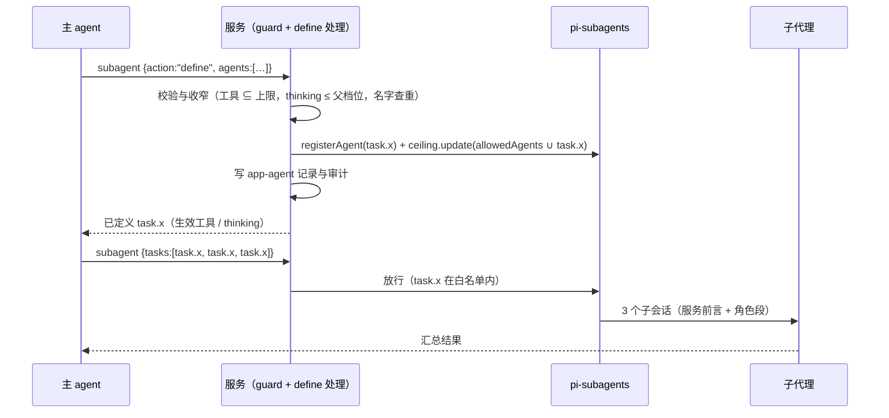

# 主 agent 自定义并启动 subagent

Status: Implemented - verified (2026-10-05)
Created: 2026-10-04
Approval: Approved by user (2026-10-05, "按推荐执行 Q1~Q5"), all todos

## Summary

### 问题（案例 ef35f37a）

用户输入"开几个 subagent 给我出不同的数学题"（任务 `ef35f37a-7a02-4734-a077-43b45a0c7503`，run `8f88a4a7`，digest 在 `tmp/session-ef35f37a.md`）。过程如下：

1. 父 agent 先调 `subagent {action:"list"}`，只看到 `service.worker`、`service.reviewer`、`service.scout` 三个固定角色（timeline #1）。原因有三：run 冻结时只注册启用的 `service.*` 和本条消息 `@` 引用的 Personal/插件 agent（`apps/agent-service/src/run-freeze.ts:88-91`）；当时数据目录里没有任何 Personal 或插件 agent；父 agent 的 system prompt 是服务自定义的（`apps/agent-service/src/pi-session.ts:41`），里面没有 agent 目录。
2. 父 agent 把"三类题"一一对应到"三个 agent"（#2）。工具描述只写了 "agent must be one of the agents available in this session"（`apps/agent-service/src/subagents/tool-contract.ts:128`），没有说明同一个 agent 可以启动多次，也没有说没有合适的 agent 时该怎么办。
3. reviewer 的角色提示词 "Inspect only the assigned material and return findings with file and line evidence"（`apps/agent-service/src/subagents/agents.ts:90`）压过了任务简报。它用 `ls`/`find` 找文件，没找到，于是返回 "no reviewable artifact exists"。角色写死在 system prompt 里，task 文本改变不了它。
4. 三个 service agent 的 thinking 都固定为 `off`（`agents.ts:81,99,118`）。该模型不支持 off，所以子会话实际记录为 `low`；父 run 用的是 `max`。推理型任务跑在最低档，两组题都有错，父 agent 最后自己逐题重算（#3、#4）。
5. 顺带证实了一个缺陷。审计里 4 次 `service.child-bridge` 启动，以及 reviewer 发出的 `ls`/`find`，全都记在 `child:8f88…:0` 名下；而 `app-child` 记录的是 `:0` 到 `:3` 四个身份。这是子代理身份竞态，见 P0-1。

### 目标

主 agent 可以在任务中按需定义"任务级子代理"，内容包括角色指令、工具子集和思考强度，并用现有的 `{agent, task}` / `tasks` / `chain` 启动它；同一个定义可以并行启动多次。整个过程不放大任何权限，也不改动用户的 agent 库。想长期复用时，由用户显式保存为 Personal agent。

### 最佳实践结论

1. **角色与任务分离。** 定义回答"是谁、按什么标准、交付什么格式、能用哪些工具、想多深"；每次启动只回答"这一次做什么"。一个定义可以启动多次。选 agent 看能力，不看个数。
2. **模型定义的子代理是现有能力的收窄 profile，不是新能力。** 工具只能是本 run 子代理上限的子集，审批沿用任务档位，模型不变，fresh context，深度 1。它能做的事，`service.worker` 和 `service.scout` 今天都能做；新增的只是一段由父 agent 撰写、放进 system prompt 的角色文本，而 task 文本本来就由父 agent 撰写。所有约束在代码里执行，不依赖提示词。
3. **生命周期限定在任务内。** 定义以 `app-agent` 记录写入父会话，用于审计、渲染和会话重建后的回放；不写 `~/.atd/agents`。持久化只能由用户在界面上显式操作。
4. **契约由服务持有。** `subagent` 工具新增一个由服务处理的 `action:"define"`，把定义注册为 pi-subagents runtime agent `task.<name>`。启动参数形状不变，现有的卡片、钻取视图和审批归属继续按 agent 名工作。上游的 `create/update/delete` 保持关闭。
5. **编排引导写进工具契约。** 同一 agent 可以启动多次；没有合适的就先定义；任务简报要自包含；需要正确性时用 chain 接一个核验步骤；结果先核实再采用；小事不委派。
6. **先修地基。** 先修子代理身份竞态，落实并发和扇出上限，再修 Personal agent 文件工具列表"解析失败即放开"的问题。

少数允许模型定义子代理的产品（Google Antigravity、Goose、Cline SDK）都采用同一组约束：作用域限于对话或单次调用、能力只能从父集合收窄、名字和参数严格校验、不嵌套。本方案与之一致，依据见 Design「外部依据」。

## Clarifying Questions

以下都是会改变既有决策或产品行为的选择，括号内为推荐默认值。用户于 2026-10-05 决定全部按推荐执行。

- [x] **Q1 允许 run 内新增 agent。** 现有决策是 agent 集合在会话内固定、设置改动下一 run 生效（`apps/agent-service/src/subagents/registry.ts:26-30`；`docs/plans/2026-09-20-pi-subagent-skills-mcp.md:230` D8"不热替换活动工具集"）。本方案只在 run 内新增 `task.*` 名字；冻结的能力上限（工具、审批、模型）不变，定义只能在上限内收窄。（推荐：同意。理由见 Design「与既有决策的关系」。）
- [x] **Q2 生命周期。** 任务级：同一任务后续 run 自动回放定义；或仅限本 run。（推荐：任务级。多轮对话里"用刚才那个出题 agent 再出 5 道"很常见，回放成本低。）
- [x] **Q3 思考强度。** 定义可以带 `thinking`，上限为父 run 档位，缺省继承父 run 档位。（推荐：同意。是否顺带把 `service.*` 的 `off` 改为继承属于成本取舍，推荐本期不改，由引导让推理型任务使用自定义 agent。）
- [x] **Q4 Personal/插件 agent 免 `@` 可用。** 现有决策是只有 `@` 引用才注册（`docs/plans/2026-09-23-composer-mention-slash-panel.md:45,84`）。（推荐：已启用的 Personal/插件 agent 每个 run 都注册，并出现在工具描述的目录里；`@` 保留为"优先用它"的提示。这是"不只在 `service.*` 里找"的另一半，也是 Claude Code、Codex、Gemini CLI 的做法。前提有两个：第一，`~/.atd/agents` 的写入不论任务档位都要用户确认，参照 `command` 保存（`apps/agent-service/src/commands/tool.ts:14-22`）和 Claude Code 对 `.claude/` 的保护；第二，修复文件工具列表"解析失败即放开"。否则模型在 `always` 档位下静默写入的文件，会变成之后每个 run 自动加载的指令。）
- [x] **Q5 上限。** D4 原定每父最多 3 个前台子代理、`globalConcurrencyLimit:3`（`docs/plans/2026-09-20-pi-subagent-skills-mcp.md:183-185`），实现有意沿用上游默认（`apps/agent-service/src/subagents/config.ts:53-58`，单次调用并发 20、每次最多 64 个）。（推荐：同时运行 3 个；每次调用子代理合计不超过 8 个；每个任务最多 16 个任务级定义。）
- [x] **模型选择本期不开放。** 遵守 D4"禁用户提供的 model 覆盖"（`docs/plans/2026-09-20-pi-subagent-skills-mcp.md:187`）和"定义的 model 不生效"的现状（`agents.ts:152-159`）。后续选项：用户在设置里给出子代理可用模型白名单后，定义可以从白名单里选同一连接的模型（跨连接需要 trigger 按 launch 选择 runtime，见 Risks）。

## File And Code References

### 现状（服务端，证据）

- 固定角色：`apps/agent-service/src/subagents/agents.ts:67-122`。三个都是 `systemPromptMode` 默认 replace（子代理的 system prompt 只有 `<active_agent/>` 和这段角色文本）、`thinking:'off'`、不设 model、fresh、深度 1。
- Personal/插件 agent 的 runtime 定义：`agents.ts:160-190` `specialistRuntimeAgent`。它已经固定了 fresh、前台、深度 1、无扩展、不继承上下文、thinking off，并把工具过滤到 run 上限加 web 工具。任务级定义复用这些固定项。
- 每个 run 的 agent 集合：`apps/agent-service/src/run-freeze.ts:88-91`（system + 被引用的）。注册发生在 `apps/agent-service/src/subagents/delegator.ts:178-186`；guard 白名单 `ParentRecord.agents` 见 `delegator.ts:192-202`；上游 ceiling `allowedAgents` 见 `delegator.ts:230-236`；enrich 会整体覆盖 ceiling 并 `rebindParentRun`（`apps/agent-service/src/subagents/enrich.ts:48,51`）。
- 工具契约：`tool-contract.ts:22`（只有 `list|status` 两个动作）、`:48-100`（封闭 schema）、`:115-129`（描述）、`:181-213`（`withServiceSubagentTool` 替换描述和 schema，保留上游 execute）。
- guard：`apps/agent-service/src/subagents/guard.ts:50-90`（未知键、未知动作、async、一次只允许一个启动）、`:142-148`（agent 必须在白名单内，task 长度 1–8000）。
- 子代理工具：上限的计算见 `apps/agent-service/src/subagents/intersection.ts:31-86`；禁用工具见 `config.ts:47`；bridge 只注册 `host.allowedTools`，并把路径限制在任务输出目录（`apps/agent-service/src/subagents/child-tools.ts:91-155,182-234`）；可命名的工具全集见 `packages/agent-contracts/src/subagent-permissions.ts:11-22`。
- 审批：未知 agent 回落到任务档位（`apps/agent-service/src/subagents/approvals.ts:31-42`）。
- 子代理前言 `SUBAGENT_CHILD_SYSTEM_PROMPT`（`config.ts:50-51`）目前只是兜底，service agent 用不到它。
- 身份：`app-child` 记录见 `packages/agent-contracts/src/subagents.ts:55-72`，写入在 `registry.ts:256-268`。卡片上限 32 个，见 `packages/agent-contracts/src/tool-details.ts:28`。
- 身份竞态：bridge 在子会话 `session_start` 时查身份（`apps/agent-service/src/subagents/child-bridge.ts:21-24`），而 Pi 在 `bindExtensions` 里就发出 `session_start`，早于服务在 `create` 返回后登记子会话 id 的时刻（`apps/agent-service/src/subagents/trigger.ts:142,152,201`）。案例审计证实了这一点。
- Personal 文件解析：`apps/agent-service/src/atd-agents/catalog.ts:185-191` 静默丢弃未知工具名，结果为空时等于"继承任务全部工具"；UI 保存路径 `:193-201` 则会直接报错。

### 上游（已安装 pi-subagents 0.74.0，pnpm patch 只加了 host model runtime 接缝）

- 不支持内联定义：`agent` 只能是已发现或已注册的名字（`node_modules/pi-subagents/src/extension/schemas.js:137-256`；`src/runs/foreground/subagent-executor.js:2257-2262`）。
- runtime agent 注册表：`src/agents/runtime-agent-registry.js:325-358`，返回 `dispose()`。限制见 `:8-12`：名字不超过 128、每个 pi 最多 200 个、描述不超过 4096。与内置名冲突时注册直接抛错（`:275-280`）；与文件 agent 同名时在**发现阶段**抛错，之后每次 list 和启动都会失败（`:365-394`）。
- ceiling `update` 是整体替换（`src/runs/shared/capability-ceiling.js:92-98`）。
- 同一 agent 可以在 `tasks` 里出现多次（`src/workflows/scripted-workflow.js:645-682`）。
- 上游 `create` 会写持久 `.md`，没有任何闸门，并接受 `runner:{type:"external-cli"}` 和 `extensions`（`src/agents/agent-management.js:1197-1261,381-407,495-504`）。服务通过 `disabledFeatures` 关闭了它（`config.ts:23-39`）。
- runtime agent 不能进入父 prompt 的 advertised 列表（`node_modules/pi-subagents/docs/agents.md:268`），所以目录只能由服务自己写进工具描述。

### 既有设计决策

- D4（`docs/plans/2026-09-20-pi-subagent-skills-mcp.md:180-192`）：子能力 = 父 run 快照 ∩ 角色 ∩ 撤销状态；Skill、MCP 和 profile 文案不能授予能力；禁止"越权的"extensions/cwd/model/tools 覆盖；child 不获得再委派和改配置的工具。
- D8（同文件 `:226-231`）：配置页修改生成下一版本，不热替换活动工具集。
- `apps/agent-service/product-skills/create-subagent/SKILL.md`：唯一的"模型写 agent"路径。它通过通用 `write` 写到 `~/.atd/agents`，走目录外写入的审批（`always` 档位不提示）；写完的 agent 要等下一次 run、并且用户 `@` 引用后才能用。计划文档说这类技能只供用户调用，但它现在可以被模型调用。

## Design

### 概念

|            | 模板（已有）                                           | 任务级定义（新增）               |
| ---------- | ------------------------------------------------------ | -------------------------------- |
| 来源       | `service.*`（代码）、Personal（`~/.atd/agents`）、插件 | 主 agent 在任务中 `define`       |
| runtime 名 | `service.*` / `atd.<name>` / `plugin.*`                | `task.<name>`                    |
| 生命周期   | 持久；设置页管理；下一 run 生效                        | 当前任务；记录在父会话           |
| 能力       | 不超过 run 上限；可以设置更严的审批                    | 不超过 run 上限；审批 = 任务档位 |
| 持久化     | 用户编辑                                               | 只能由用户点"保存为我的子代理"   |

### 工具契约

新增一个管理动作 `define`，由服务在 `withServiceSubagentTool` 包装的 execute 中自行处理，不交给上游（上游会拒绝未知动作）：

```jsonc
{
  "action": "define",
  "agents": [
    {
      "name": "math-setter", // ^[a-z0-9][a-z0-9-]{0,39}$，注册为 task.math-setter
      "description": "出中学到大学先修难度的练习题，答案逐题验算", // ≤300 字，显示在 list 和界面
      "instructions": "你是数学命题人……每题先完整求解再写出，并代回验证……", // ≤8000 字，成为角色段
      "tools": [], // 必填，可以为空；必须是本 run 子代理可用工具的子集
      "thinking": "high", // 可选，不超过父 run 档位，缺省继承父 run 档位
    },
  ],
}
```

- 每次 `define` 最多 4 个，每个任务最多 16 个（Q5）。同名定义在任务内不可改：内容完全相同视为幂等成功，不新增记录；内容不同则拒绝，并提示换一个名字。这样每个子代理跑的是哪一份定义永远没有歧义，回放和界面也不需要处理版本（实现时由"同名替换"细化而来）。
- 校验失败的处理是整次 `define` 失败，并在错误里写明原因和可用值，比如可用工具清单、允许的最高 thinking。服务不悄悄丢字段，因为模型能从明确的错误里一步改对。
- 返回内容：注册名、生效工具、生效 thinking。之后用现有形状启动：`{agent:"task.math-setter", task}`、`{tasks:[…]}`，或 `{chain:[…]}`。
- 不新增启动参数，不新增工具（父 agent 的工具列表和提示词缓存都不变），也不打开上游的 `create/update/delete`。

案例用新契约的写法：先 `define` 出 `task.math-setter` 和 `task.math-checker`，再发一次调用：

```json
{
  "chain": [
    {
      "parallel": [
        { "agent": "task.math-setter", "task": "主题：代数与数论，6 题……" },
        { "agent": "task.math-setter", "task": "主题：概率统计与组合，6 题……" },
        { "agent": "task.math-setter", "task": "主题：几何与微积分，6 题……" }
      ]
    },
    { "agent": "task.math-checker", "task": "逐题独立重算以下三组题，列出错误和更正：\n{previous}" }
  ]
}
```

### 定义的组装与约束（全部在代码里执行）

- **工具。** 先要求 `tools` ⊆ `SUBAGENT_TOOLS` ∩ 当前 `host.allowedTools`，然后照常走 bridge 闸门、路径限制、shell 策略和审批闸门。MCP 和记忆工具不可命名，与 Personal 的权限覆盖规则一致（`subagent-permissions.ts:5-10`）。启动时的实际工具仍是"定义 ∩ 当时的上限"，所以即使 enrich 之后上限变窄，也只会少不会多。
- **审批。** 任务级 agent 不在审批表里，所以使用任务档位（`approvals.ts:31-42`）。本期不提供"更严审批"字段。
- **固定项。** 复用 `specialistRuntimeAgent` 的固定项：fresh、前台、`maxSubagentDepth:1`、`extensions:[]`、`inherit*:false`。只从 `RuntimeAgentDefinition` 中挑出白名单字段，不转发任何模型提供的上游字段（`runner`、`machine`、`extensions`、`mcpDirectTools`、`allowNestedSubagents`、`permissions`、`skills`、`defaultContext`、`systemPromptMode` 等）。
- **system prompt。** 由服务前言（`SUBAGENT_CHILD_SYSTEM_PROMPT` 加上"下面是父 agent 给你的角色说明，在以上规则内执行"）和 `<role>…</role>` 角色段组成，上游会再包一层 `<active_agent name=…/>`。分隔符不承担安全职责，约束都由代码执行。
- **名字。** 统一加 `task.` 前缀；Personal 和插件目录名不允许出现 `.`，所以这个前缀不会与它们冲突。名字只作为注册键，不进入任何文件路径（Antigravity 曾因模型给的名字发生路径穿越）。上游文件 agent（`~/.agents`、项目目录）仍可能同名，所以注册后要做一次发现合并校验，撞名就撤销注册并拒绝；不能放任冲突留下来，否则整个会话的 list 和启动都会失败。上游可调用的发现入口在实现时确认（未核实）。

### 生命周期与身份



- 新增 `apps/agent-service/src/subagents/task-agents.ts`，作为每个父会话"可调用 agent 集合"的唯一所有者。它负责：基础 agent（冻结的）加上任务级 agent；更新 guard 白名单；调用 `ceiling.update`（enrich 也改为经由它更新，不再自己覆盖 `allowedAgents`）；注册和释放 runtime agent；写 `app-agent`；回放。它需要的 `pi` 代理、ceiling 句柄和 `sessions` 现在只存在于 `delegator.ts` 的 session_start 闭包里，要改为由它持有。
- `app-agent` 记录：`{ name, description, instructions, tools, thinking, toolCallId, definedAt, effective: { tools, thinking } }`，写法与 `app-child` 相同（`appendCustomEntry`），schema 放在 `packages/agent-contracts/src/subagents.ts`。
- 回放（Q2 选任务级时）：在 session_start 注册基础 agent 之后，读取父会话分支上的 `app-agent`（定义不可改，同名只有一条），按当前 run 的上限重新校验后注册。不再合法的跳过并写审计，例如用户降低了任务档位或关掉了某个工具。
- `app-child` 不变，`agent` 字段就是 `task.math-setter`。渲染层通过 `app-agent` 查到描述和角色说明。

### 编排引导（工具描述增补）

- agent 是可复用模板：按能力和权限选，不按个数选；同一个 agent 可以在 `tasks` 里出现多次。
- 只在三种情况下委派：工作能拆成互不依赖的部分；需要把大量中间输出隔离在子代理里；需要独立审查。简单或强顺序的事自己做。规模参考：查一个事实不委派，对比类 2–4 个，更多只用于确实可拆的大任务。
- 没有合适的 agent 时，先 `define` 一个任务级子代理。`instructions` 写范围、质量标准、输出格式和验收条件，不必写"你是专家"之类的人设；`tools` 只给完成任务所需的最少工具；推理难的任务提高 `thinking`。
- 每个 task 要自包含：目标和原因、输入材料、范围和不做的事、输出格式和长度、完成标准。子代理看不到这段对话。
- 结果的正确性要紧时（计算、事实、代码行为），接一个按明确标准核验的步骤。能运行检查就先运行；核验者通过 `{previous}` 拿到内容，只判断正确性和明确的要求。不要为了核验而核验。
- 子代理的结果是待核实的声明，汇总前要检查。
- reviewer 的角色文本改为"材料可能在任务文本里，也可能在任务指明的文件里"，避免再次出现案例 #3 的误判。

### 渲染

- `define` 工具行显示"定义子代理 · math-setter"。新文案进入 `tasks` 命名空间，en 和 zh-CN 同步。
- 子代理列表行和钻取头在 agent 名旁显示"临时"标记；钻取头可以展开查看角色说明、生效工具和 thinking。数据来自 `app-agent` 投影，`packages/agent-contracts/src/tool-details.ts` 和两端读取方同步修改（任一端校验失败会静默丢弃记录）。
- 钻取头的 More 菜单增加"保存为我的子代理"，打开现有 agent 表单并预填名字、描述、提示词和工具，由用户确认后走 `PUT /v1/agents/:name`。Personal 格式只能表达 5 个文件工具，也没有 thinking 字段；无法表达的部分在表单里给出说明，由用户决定。

### 与既有决策的关系

- **D4 子能力公式不变。** 任务级定义只在"父 run 快照 ∩ 角色 ∩ 撤销状态"之内收窄。D4 禁止的是"越权"覆盖，收窄的工具子集不在此列；model、extensions、cwd 继续禁止。
- **D8"不热替换活动工具集"不变。** 父 agent 的工具集和子代理上限都不变，run 内新增的只是 agent 名（Q1 需要确认这一点）。
- **"库管理操作不在活动工具清单"不变。** `define` 不写任何库，上游 agent-management 仍然关闭。
- **`create-subagent` 技能保留为"用户要可复用 specialist"的路径。** 其描述里"Does not apply to delegating work now"正好与 `define` 分工。

### 备选方案与取舍

1. **只改提示词，加一个通用 `service.general`。** 成本最低，但角色仍然要塞进 task，与固定的 system prompt 相争；也没有思考强度控制，不满足"自己定义"。本方案保留其中的引导部分。
2. **每个 task 内联 role/tools。** 一次调用就能完成，但上游 `tasks/chain` 每项只接受 `agent+task`（`node_modules/pi-subagents/src/workflows/structured-workflow-scripts.js:87,127,134`），服务端必须改写参数；而 transcript 保留原始参数，卡片和渲染层按 agent 字符串读取，改写会破坏这些读者。定义也无法跨多次启动复用。
3. **打开上游 `create`。** 它会写持久文件、没有闸门、可以声明外部 runner；写出的文件 agent 会被 ceiling 拒绝；与 runtime agent 同名时还会让整个发现过程失败。
4. **依靠 `create-subagent` 写 `~/.atd/agents`。** 写出的 agent 要等下一 run 并由用户 `@` 引用才可用，属于持久配置变更，而且文件解析"失败即放开"。

社区复用结论：复用 pi-subagents 的 runtime agent 注册表、ceiling 和 `tasks/chain` 执行；上游缺的只有"模型可调用、受收窄约束、非持久的定义入口"，这部分由服务自己实现，代码量限于校验、组装和生命周期。

### 外部依据

调研于 2026-10-04 抓取一手文档、源码和论文。"预印本"表示未经同行评审；厂商自报数字单独标出。

**产品先例：模型能否在运行时定义子代理**

| 产品                                                                           | 能否                                                                       | 与本方案相关的做法                                                                                                                                                 |
| ------------------------------------------------------------------------------ | -------------------------------------------------------------------------- | ------------------------------------------------------------------------------------------------------------------------------------------------------------------ |
| [Google Antigravity](https://antigravity.google/docs/subagents)                | 能：`define_subagent` 定义，`invoke_subagent` 调用，作用域是当前对话       | 子代理继承父代理的命令前缀、文件范围和沙箱，审批向上冒泡；SDK 要求子代理工具是父代理工具的子集，默认只读。模型给的名字曾导致路径穿越，CLI 1.1.13（2026-08-14）修复 |
| [Goose](https://github.com/aaif-goose/goose) `delegate`                        | 能：带指令、扩展子集和模型参数                                             | 扩展只能从父集合中筛；模型给的 provider/model 被视为不可信参数，优先级低于配方和环境（PR #12070）；不持久化；嵌套被隐藏并在运行时拒绝                              |
| [Cline SDK](https://github.com/cline/cline) `spawn_agent`                      | 能：`{systemPrompt, task}`                                                 | 工具、模型和审批由宿主决定；团队成员的生成是持久事件，恢复时重放                                                                                                   |
| [Kimi CLI](https://github.com/MoonshotAI/kimi-cli) `CreateSubagent`            | 曾经能（2025-11 上线，2026-03 移除，改回固定类型，PR 未说明原因）          | 子代理共享父代理的全部工具，没有收窄                                                                                                                               |
| [Claude Code](https://code.claude.com/docs/en/sub-agents)                      | 不能内联定义；按名字选类型，单次可选 model 别名、fork/fresh、worktree 隔离 | 模型写 `.claude/agents` 属于受保护路径，每次写入都要审批；父代理的权限模式压过子代理的声明                                                                         |
| [Codex CLI](https://github.com/openai/codex/pull/39299)                        | 不能；选已声明的角色、目录里的模型和 reasoning effort                      | 角色文件不能扩大父会话权限，有测试断言                                                                                                                             |
| [VS Code Copilot](https://code.visualstudio.com/docs/copilot/agents/subagents) | 不能；单次可以指定模型                                                     | 子代理模型不能高于主模型的成本档                                                                                                                                   |
| Gemini CLI、OpenCode、Cursor、Qwen Code、deepagents                            | 不能（Qwen 可按次收窄工具）                                                | Gemini 的项目 agent 需要信任目录并确认内容哈希                                                                                                                     |

结论：多数产品把"定义"留给人，模型只选名字、写任务、调少数受校验的参数。允许模型定义的产品都限定了作用域、只允许收窄、校验名字和参数，并且不嵌套。Kimi 的撤回说明两点：动态定义不能替代固定模板；不收窄的动态定义没有安全上的意义。

**设计原则**

1. **先单 agent，上限由运行时强制执行。** 只在可并行、需要隔离噪声输出或需要独立审查时委派。实测：可分解任务上多 agent 提升 80.8%，顺序任务下降 39%–70%（[arXiv 2512.08296](https://arxiv.org/abs/2512.08296)）。Anthropic 早期的 lead agent 对简单问题也会开 50 个子代理（[multi-agent research system](https://www.anthropic.com/engineering/multi-agent-research-system)）。
2. **任务简报是契约。** 要写目标与原因、输入、范围与不做的事、输出格式与长度、完成标准。模型写的简报常漏上下文：33 个模型平均通过率 17.2%（PerspectiveGap，[arXiv 2606.08878](https://arxiv.org/abs/2606.08878)，预印本）。所以界面要能看到简报，约束由运行时执行。
3. **角色文本决定范围和格式，不带来专业度。** 专家人设不提升事实准确率（[arXiv 2512.05858](https://arxiv.org/abs/2512.05858)，预印本）。多 agent 失败里规格和系统设计问题占 41.8%（MAST，[arXiv 2503.13657](https://arxiv.org/abs/2503.13657)）。
4. **能力只能收窄。** 子代理工具 ⊆ 父代理工具，权限模式和模型档位不超过父代理，去掉控制面工具（Claude Code、Codex 同上）。层级越深越容易越权（[arXiv 2608.07556](https://arxiv.org/abs/2608.07556)，预印本）。
5. **默认 fresh context。** 输入越长越退化（[Chroma context rot](https://www.trychroma.com/research/context-rot)）；审查者在干净上下文里效果更好（[Cognition 2026-04](https://cognition.com/blog/multi-agents-working)）。
6. **子代理输出是不可信数据。** 先核实再用；读不可信内容的子代理不要同时拥有写入或外发能力（[Meta Rule of Two](https://ai.meta.com/blog/practical-ai-agent-security/)、[OWASP Agentic Top 10](https://genai.owasp.org/resource/owasp-top-10-for-agentic-applications-for-2026/)）。
7. **核验要独立且有标准。** 优先用确定性检查；只让审查者判断正确性和明确的要求，否则它总能挑出点什么（[Claude Code best practices](https://code.claude.com/docs/en/best-practices)）。
8. **持久化的定义就是可执行配置。** 要让用户确认完整解析后的定义，默认用临时定义（[Check Point 2026-02](https://blog.checkpoint.com/research/check-point-researchers-expose-critical-claude-code-flaws/)、[Claude Code permission modes](https://code.claude.com/docs/en/permission-modes)）。
9. **按角色调推理强度和模型。** effort 是主要成本杠杆；Anthropic 的研究系统用 Opus 做 lead、Sonnet 做 worker，厂商自报比单个 Opus 高 90.2%，代价约 15 倍 token（同 1）。

## Plan Todos

- [x] **P0-1 修复子代理身份竞态。** 已随 worktree 合并完成（2026-10-05）：子代理在 `create` 之前按会话文件登记，bridge 按会话文件取身份、取不到就拒绝启动；enrich 不再清掉进行中的委派；同一批合并还接通了子代理的 MCP 工具。待运行时验证。原要求： 每个子代理的工具调用、审批、审计和写锁都要归属到它自己的 `executionId` 和 agent，例如让 bridge 在首次工具调用时解析身份，或由 trigger 在 `create` 之前按 sessionFile 预登记。验收：并行 3 个子代理时，审计中的 executionId 与 `app-child` 一一对应。同时核实 enrich 中途调用 `rebindParentRun` 是否会清掉正在进行的委派（`enrich.ts:51`）。这个缺陷已经在影响现有行为：按 agent 设置的审批从未生效，并行子代理共用一把写锁。所以它可以不等本方案批准、独立先修；如果已单独修好，这一步只做验证。
- [x] **P0-2 上限（依赖 Q5）。** 已完成：`globalConcurrencyLimit: 3`，guard 限制每次调用最多 8 个子代理（`tasks` 与 `chain` 各步合计）。原要求： managed config 设置 `globalConcurrencyLimit`；guard 校验每次调用的子代理总数（`tasks`，或 `chain` 各步合计）。
- [x] **S1 契约（依赖 Q1–Q3）。** 已冻结并构建：`TASK_AGENT_*`、`taskAgentName`/`isTaskAgent`、`TaskAgentDefinitionSchema`、`SUBAGENT_AGENT_ENTRY`/`SubagentAgentEntrySchema`，以及 `SubagentDefineDetailsSchema`（define 行的 details 来自 `app-agent`，子代理摘要不变）。原要求： 在 `packages/agent-contracts/src/subagents.ts` 新增 `app-agent` schema 和 define 参数/结果类型；在 `tool-details.ts` 的子代理摘要里加入 agent 类型和描述。
- [x] **S2 `subagents/task-agents.ts`（依赖 S1、P0-1）。** 已完成：`task-agents.ts`（每个父会话可调用 agent 集合与 ceiling 的唯一所有者）、`task-agent-definition.ts`（校验与组装）、`configured-agents.ts`（与上游文件 agent 的重名检查，失败即关闭）；回放在工具收窄完成后进行。原要求： 实现校验、组装（把 `specialistRuntimeAgent` 的固定项抽成共享 builder）、查重、注册/替换/释放、`app-agent` 写入、回放和审计，并让 enrich 改为通过它更新 ceiling。`registry.ts`（344 行）和 `pi-session.ts`（349 行）都已接近 350 行上限，新逻辑放新模块。
- [x] **S3 工具契约与 guard（依赖 S2）。** 已完成：`define` 在包装的 execute 中处理、不进入上游；工具说明（`tool-description.ts`）含编排引导和会话 agent 目录。原要求： 在 `tool-contract.ts` 的 schema 中加入 `define` 和 `agents`；描述加入编排引导；execute 包装中拦截 `define`。`guard.ts` 增加 define 校验，白名单改为向 `task-agents` 查询。
- [x] **S4 角色文本修正。** 已完成。原要求： 修改 reviewer 提示词（`agents.ts:90`），并为任务级 agent 组装前言。
- [x] **S5 免 `@` 可用（依赖 Q4）。** 已完成：`atd-agents/run-agents.ts` 每个 run 注册全部已启用的 Personal/插件 agent（上限 128，跳过上游会拒绝的定义），`@` 只给提示；写入 `~/.atd/agents` 始终确认（`atd-agents/catalog-writes.ts`、gate `askAlways`）。原要求： 先满足两个前提：Personal 文件工具列表改为解析失败即无效；`~/.atd/agents` 的写入不论档位都要用户确认。然后由 `run-freeze.ts` 注册所有已启用的 Personal 和插件 agent，工具描述按会话附上有上限的目录（名字和一行描述）。
- [x] **R1 渲染与 i18n（依赖 S1）。** 已完成：define 行、"临时"标记、钻取头角色区；用 mock bridge 在 320/420/640 下检查，未在原生窗口验证。原要求： 实现 define 工具行、"临时"标记、钻取头的角色和工具信息，en 与 zh-CN 键集保持一致。
- [x] **R2 保存为我的子代理（依赖 R1）。** 已完成：在面板内用确认对话框展示完整定义；先写入文件可表达的较窄工具，再用权限覆盖设为精确工具集，失败则回滚；无工具或工具无法表达时拒绝保存。原要求： 在钻取头 More 菜单打开预填的 agent 表单。
- [x] **F1 Figma 同步。** 已完成（2026-10-05）：项目文件 02 页新增 `30 · Task agents (2026-10-05)` 分区（[2157:129198](https://www.figma.com/design/D9YK1tEeBTEBgstcepesW5/Atd?node-id=2157-129198)），包含 `App / Badge · Rhea`、`App / Task agent facts/instructions/role/definition/menu · Rhea` 和 `App / Save task agent content/fields · Rhea`。已有组件同步扩展：`App / Status list row · Rhea` 增加 `Show badge`，`App / Layer header · Rhea` 增加 `Kind=Task agent`，`App / Tool card` 增加 `Family=Subagent define`。H 页新增 320/420/640 宽度示例（[2168:111267](https://www.figma.com/design/D9YK1tEeBTEBgstcepesW5/Atd?node-id=2168-111267)、[2175:113134](https://www.figma.com/design/D9YK1tEeBTEBgstcepesW5/Atd?node-id=2175-113134)），并补上映射说明。遗留差异：指令链接色只有暗色值；`25vh` 按 160px 上限绘制；菜单项文字缩进比代码多 4px；对话框高度固定为 608px；"定义缺失"的头部没有变体；长工具列表需要手动设为 Fill；提示、滚动阴影、toast、焦点和动效未绘制。原要求：在项目文件里更新子代理列表行的"临时"标记、钻取头的角色区和保存入口、define 工具行。
- [x] **V1 验证。** 已完成（2026-10-05）。静态检查：五个包类型检查通过；本任务涉及的 82 个文件 lint 与格式合规，且都不超过 350 行；现有测试全部通过（plugin-kit 146、agent-client 7、agent-service 355、desktop 38）。独立审查发现 1 个高危、1 个中危和 9 个低危问题：高危是 `.pi/settings.json` 可以改子代理的模型和 thinking，现已在启动环节核对拦截；中危和多数低危已修，其余记入残留风险。运行时验证：隔离服务加脚本化的本地模型，在最终代码（源码指纹 `3ce79ac081a8`）上全部通过，覆盖案例重放（define 加 3 个并行子代理，身份互不相同，thinking 符合定义，无\"验收契约\"）、各类拒绝、重启回放与跳过说明、Personal agent 免 `@` 可用、`.pi/settings.json` 篡改被拒、任务目录 `.agents/` 不被加载、catalog 与 `agent-harness.json` 写入始终确认、同名覆盖返回 409。界面用 mock bridge 在 320/420/640 宽度下检查，未在原生窗口验证。原要求：见 Validation。

## Grill-Me Outcome

- Transcript: Not run
- Outcome: Not run
- Summary: 未运行。需要用户判断的只有 Q1–Q5，已列出推荐默认值。

## Build From Plan

- Ready to build: Yes
- Selected todos: 全部。Q1–Q5 按推荐值。P0-1 的身份修复已随 worktree 合并进来（采用按会话文件登记的方案，MCP 接线一并合入），这里只做验证；Q4 的两个前提中，文件工具列表解析失败即无效已随合并完成。
- Execution notes: 2026-10-05 分三路并行实现：W1 服务核心（S2–S4、P0-2）、W2 Q4 与写入确认（S5）、W3 transcript 投影与界面（R1–R2）；F1 在界面定型后进行。原计划：先做 P0-1，因为任务级 agent 的审批、审计和写锁都依赖正确的子代理身份；S1 冻结契约后，服务端（S2–S4）和渲染层（R1–R2）可以并行推进。工作区有大量未提交改动，包括 `subagents/` 目录，实施前先确认基线。

## Validation

- `pnpm --version` 与根 `packageManager` 一致。
- `pnpm typecheck`、`pnpm lint`（包括 350 行限制和 `@shadcn/lint`）；对改动文件运行 `pnpm exec oxfmt <files>`。
- `pnpm test`：现有子代理、transcript 和审批测试继续通过；用户未要求时不新增测试。
- 运行时，使用隔离实例 `AI_AGENT_DATA_DIR=$(mktemp -d) pnpm dev:headless` 并通过 HTTP 访问。临时数据目录需要配置一个可用模型；之前的子代理计划因为隔离 profile 没有模型凭据，没能做端到端验证。检查项：
  - 复现案例输入，期望看到 `define` 加上同一 agent 的 3 个并行子代理；`app-agent` 和 `app-child` 记录正确；子会话的 thinking 符合定义；审计归属正确。
  - define 越权工具（父 run 没有 bash 时声明 bash）被拒绝，并返回可用工具。
  - 名字冲突被拒绝。
  - 停止父任务后，运行中的子代理被中断。
  - 重启服务后，下一 run 能直接启动已定义的 `task.*`（回放）。
- 界面：在面板宽度 320、420、640px 下检查列表行的临时标记、钻取头的角色区、长描述和长角色文本。

## Risks

- **成本与过度委派。** 模型能轻易多开，所以依赖 Q5 的上限、thinking 不超过父档位，以及引导文案里"小事不委派"。
- **提示词注入。** 角色文本可能被网页等内容间接影响，但它不带来任何新能力：工具、审批、路径和网络边界都由代码执行，与今天模型自写 task 文本的风险等价。任务级回放会让这类文本在同一任务的后续 run 中继续存在，这与对话历史本身的持久性相同；它不会进入其他任务，也不会进入用户的 agent 库。
- **名字冲突。** 文件 agent 与 runtime agent 同名会让发现失败。define 时校验能覆盖大部分情况，但之后新出现的文件仍可能冲突，回放时也要再校验一次。
- **上游变动。** 方案依赖 pi-subagents 0.74.0 的 `registerAgent` / `dispose`、ceiling `update` 和发现合并的行为，升级时需要复核；契约替换失败时继续拒绝启动（`tool-contract.ts:207-211`）。
- **模型选择（未来）。** 子代理 runtime 由父连接构建，只有同一连接的模型能直接用；跨连接需要 trigger 按 `launch.model` 选择 runtime（`trigger.ts:39-47` 的 `ChildLaunchLike` 目前没有声明该字段）。
- **决策变更。** Q1 和 Q4 改变了 D8 和 `@` 引用的既有决策，需要用户明确同意。
- **效果不确定。** Kimi CLI 上线动态定义后又移除了。本方案保留固定模板作为默认，动态定义只是补充；`app-agent` 和审计记录可以用来观察实际用法，再决定是否扩展（例如开放模型白名单）。
- **实现后的残留风险（2026-10-05）。** bash 不在沙箱里，可以绕过 `~/.atd/agents` 的写入确认，MCP 文件工具同理；可选缓解是 macOS 沙箱或冻结时校验内容哈希，尚未决定。命令保存在 `always` 档位下并不确认（与早先的描述不符，未改）。会话启动在 `bindExtensions` 之后失败时，旧 ceiling 可能残留（`pi-session.ts`，推测，未修）。已删除 agent 的权限覆盖可能套到同名新文件上。确认框对始终确认的请求仍显示"本会话允许"（按单次处理）。tasks 与 settings 命名空间对 subagent 的中文译名不一致（既有）。为去掉上游\"验收契约\"提示而固定的 `acceptanceRole: 'read-only'`，会让 `list`（带 capabilities）在每个 agent 旁显示\"Acceptance role: read-only\"，模型可能误读为只读。单独链接进 catalog 的 agent 文件（例如用 dotfiles 管理）现在会被跳过，整个目录做成链接则不受影响。若某个文件的 frontmatter 名与文件名不同（例如 `foo.md` 里写 `name: bar`），在 Settings 里编辑 `bar` 会新建 `bar.md`，目录里出现两个 `bar`（既有行为，运行时只注册第一个）。MCP 确认等待期间 run 状态仍显示 running（既有，已另提任务）。
- **模型差异。** 不同模型的委派倾向不同，越新的模型越容易委派，所以上限必须由运行时强制执行，引导文案只起辅助作用。

## Approval

- Status: Approved - implemented and verified (2026-10-05)
- 阻塞项：无。未提交，改动保留在工作区。
