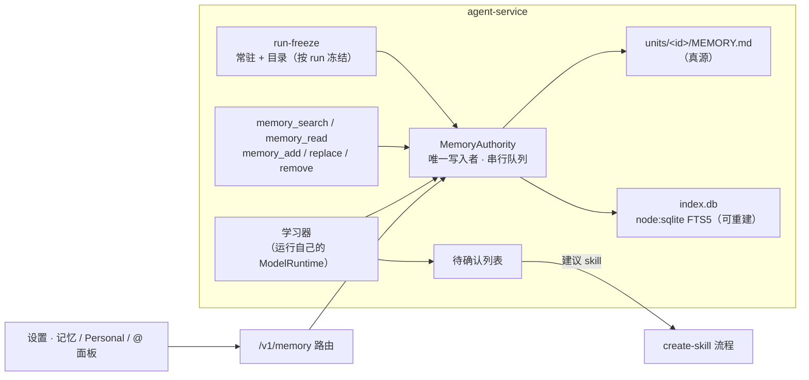

# 记忆引擎重构：skill 形状的记忆（替换 pi-hermes-memory）

Status: Implemented - 2026-10-04 完成 P0–P4、P6 与独立审查后的修复；P5、转录提示行与 Debug 应用目视验收未做（见 Plan Todos）
Created: 2026-10-04
Approval: 已授权实现 P0–P4 与 P6（2026-10-04）；不做迁移与回滚；P5 与转录提示行暂缓

## Summary

用户希望记忆功能结合 skill 架构：现在一条记忆只是一段长文本，没有 skill 那样的名称、适用条件、类型、按需加载和管理能力。用户已确认（2026-10-04）：**允许自建或采用社区方案，只要比 pi-hermes-memory 效果更好**。这条决定取代 `docs/plans/2026-09-10-general-agent-requirements.md`「记忆行为与数据边界」中「Hermes 拥有记忆、不新增第二套记忆存储、补丁只用于管理/暂停/寻址」的约束；该文档的其余记忆约束继续有效（见下方「仍然有效的约束」）。

选型结论：**在 agent-service 内自建 skill 形状的记忆引擎**，移植 pi-hermes-memory 中有价值的部分（MIT），借鉴 Letta、Codex、OpenClaw 等的公开设计，迁移完成后移除 Hermes 依赖与补丁。

### 方案对比

| 方案                                                                         | 结论           | 决定性原因                                                                                                                                                                                            |
| ---------------------------------------------------------------------------- | -------------- | ----------------------------------------------------------------------------------------------------------------------------------------------------------------------------------------------------- |
| 保留 Hermes（升级 0.9.10，加元数据层）                                       | 不作为长期方案 | 条目是 `§` 分隔、按内容哈希标识的扁平文本，学习器操作格式固定，要做成 skill 形状只能持续加大补丁；0.9.10 的 `memory_search` 默认在读路径写命中计数，与暂停学习和子运行只读冲突                        |
| pi 社区插件（约 470 个相关包，读了 162 个的元数据）                          | 无可替代       | 没有一个同时具备检索、学习、内容扫描、GUI 级管理接口和可逆的单条开关；形态最接近的 `@yandy0725/pi-memory` 只按仓库存储，崩溃后锁不回收，2.0 以来每个小版本都有破坏性变更                              |
| pi 之外的记忆库（Mem0、Mastra、Letta、LangGraph.js、Cognee、MemOS、memU 等） | 无可采用       | 都卡在硬约束上：需要 Python/Docker 旁路进程、原生模块、强制嵌入模型、云端或闭源服务、AGPL/ELv2 许可证，或只支持扁平事实                                                                               |
| 自建（本方案）                                                               | 推荐           | Node 24 内置 `node:sqlite` 的 FTS5（`trigram`、`porter`）已本地验证可用；本项目已有成熟的 skill 目录冻结、按需加载、压缩后重新附加和设置详情页；引擎本体约 10–13 人日，其余是任何替换方案都要做的集成 |

调研原文（不提交，位于 `tmp/memory-research/`）：`research-external.md`（外部做法，30 个来源）、`community-pi.md`（pi 生态）、`community-libs.md`（pi 之外的记忆库）、`research-internal.md`（内部架构梳理）、`self-build-design.md`（自建设计与工作量，含文件与行号引用）。

### 目标

1. 每条记忆是有稳定 id、名称、适用描述、类型和正文的单元，格式与 `SKILL.md` 一致，复用 skill 的解析、目录渲染、按需加载和设置页布局。
2. 三层加载：少量恒真事实常驻；其余只把名称和描述冻结进本轮目录，正文按需读取；搜索兜底长尾。
3. 记忆与 skill 分工：恒真事实和偏好进记忆；任务里学到的流程、坑和纠正进对应 skill；新的可复用流程由学习器提出 skill 建议，经用户确认后走现有 create-skill 流程。
4. 学习可控：中英文纠正信号都能触发；删除、升为常驻、建议 skill 一律进入待确认列表；来源可追溯到任务。
5. 平滑迁移：Hermes 的全部条目（含已关闭条目、创建和更新日期、纠正分类）无损导入，保留只读备份。

### 非目标

- 不引入向量库或嵌入模型（保持纯本地、无原生模块；以后可作为可选索引）。
- 不做按项目或文件夹的作用域（需求文档规定无项目概念）；数据模型预留可选字段。
- 学习器不直接写 skill。
- 不做云端用户画像，不自动导入其他应用的记忆。

### 仍然有效的约束

- 每个数据目录只有一个记忆权威，运行与设置页都是它的客户端（D7 的精神）。
- 子运行只读不学；暂停学习只停自动写入，不影响读取和手动编辑；运行快照的 `memory` 开关决定本轮是否使用记忆。
- 命令模板、附件、引用材料、skill 正文等任务材料不会被学成偏好：它们以隐藏消息进入会话，学习只读用户与助手消息；命令运行（`RunSnapshot.fromCommand`）另由 `app-invocation` 的 `source: 'command'` 标记整段排除。新学习器沿用这两条规则。
- 记忆是上下文，不是指令；写入必须经内容扫描，不保存密钥。
- 已上线的单条开关语义（关闭后 agent 检索不到、学习看不到、`@` 选不到、应用读不到，仍可编辑删除）迁移后保持不变。

### 架构



## Clarifying Questions

- [x] **Q1 能否脱离 Hermes**（2026-10-04）：用户确认允许自建或采用社区方案，效果更好即可。
- [x] **Q2 自动学习默认是否「先问再存」**（2026-10-04 按推荐）：否。用户明确表达的偏好直接保存，打「新」标记并在转录里提示「记住了 N 条」；删除、升为常驻、建议 skill 一律进待确认列表。另提供「先问再存」开关，打开后所有学习操作都进待确认列表。
- [x] **Q3 预算**（2026-10-04 按推荐）：常驻 ≤ 3,000 字符、目录 ≤ 6,000 字符，与 skill 一起先于引用材料扣减；超出时记忆收缩，不让运行失败。
- [x] **Q4 `@` 引用编辑后的语义**（2026-10-04 按推荐）：解析为记忆的最新内容（现在会提示「已更改」）；已关闭的记忆仍提示「已在记忆设置中关闭」。
- [x] **Q5 是否同时补持久测试**（2026-10-04 按推荐）：补。覆盖存储与索引、扫描器、学习解析与输入组装、工具门槛，约 +4–6 人日。
- [x] **Q6 Hermes 回滚窗口**（2026-10-04）：用户确认产品未发布、不需要向后兼容，因此不保留回滚窗口、不做迁移，本次直接移除 Hermes。
- [x] **范围调整**（2026-10-04）：接受「建议创建 skill」时由服务直接在 Personal skills 写入草稿并打开该 skill 页面，不经原生桥传递种子文本；转录中的「记住了 N 条」提示行与 P5 一起暂缓（与进行中的转录改动冲突）。

## File And Code References

### 服务（`apps/agent-service/src/`）

- `memory/authority.ts`、`memory/disabled.ts`、`memory/hermes.ts`、`memory/routes.ts`、`memory/pause.ts`：现有权威、单条开关（停用文件）、Hermes 适配与路由。新引擎保留 `MemoryAuthority` 的公开接口（`list`、`listAll`、`setEnabled`、`update`、`setPaused`、`onChanged`）。
- `skills/skill-catalog.ts`、`skills/session-catalog.ts`、`run-freeze.ts`、`skills/load-skill-tool.ts`、`skills/session-skills.ts`：目录冻结、截断、系统提示分区和按需加载的模式，记忆目录直接复用（截断逻辑抽成共享函数）。
- `harness/auto-review.ts`：服务自己的非对话模型调用方式，学习器照此调用运行的 `ModelRuntime`。
- `subagents/intersection.ts`、`compaction/prune.ts`、`references/saved.ts`、`plugins/host-plugins.ts`、`plugins/toggle.ts`、`service-fs.ts`（`protectedWriteRoots`）、`apps/capabilities/memory.ts`（只依赖 `list()`，契约不变）。

### 契约与客户端

- `packages/agent-contracts/src/memory.ts`（新增字段与路由 DTO，超长时拆出 `memory-units.ts`）、`tool-names.ts`（显式的 `MEMORY_READ_TOOLS` / `MEMORY_WRITE_TOOLS`）、`context-breakdown.ts`（新增 `memory` 类别）。
- `packages/agent-client/src/memory-client.ts`、`apps/desktop/src/client/agent/bridge.ts`。

### 渲染器与设计

- `apps/desktop/src/features/memory/*`、`features/service/plugin-memory-group.tsx`、`features/quick-panel/use-saved-groups.tsx`、`features/service/extension-skill-detail-page.tsx`（详情页复用）、转录 `tool-copy.ts`。
- Figma：`App / Memory item`（339:1153）、`App / Plugin item row · Rhea`（1590:66093）、记忆分区画面 C · 04.01–04.05（仍是旧版行结构，本次一并迁移）；同步 `docs/design-source.md`。

## 设计

### 数据模型

```
<dataDir>/agent/memory/
  units/<id>/MEMORY.md        一条记忆（frontmatter + Markdown 正文）
  units/<id>/resources/       可选附件（P5）
  index.db                    node:sqlite FTS5 缓存，可随时从文件重建
  proposals.json              待确认的学习建议
  history/<id>/               每条最近 20 个版本
  trash/<id>/                 删除的记忆，30 天后清理
  legacy-ids.json             旧内容哈希 id → 新 id
  state.json                  模式版本与迁移完成标记
  legacy/hermes-<ts>/         Hermes 原文件的只读备份
```

放在数据目录而不是 `~/.atd`：`~/.atd` 由开发版和安装版共享，会出现两个权威；数据目录已有单进程独占锁。暂停开关仍是 `<agentDir>/memory-pause.json`。

| 字段                 | 规则                                                                   | 说明                                                                     |
| -------------------- | ---------------------------------------------------------------------- | ------------------------------------------------------------------------ |
| `id`                 | UUID，等于目录名                                                       | 编辑和改名都不变                                                         |
| `name`               | `^[a-z0-9]+(-[a-z0-9]+)*$`，≤ 64，唯一                                 | 与 Agent Skills 命名规则一致，模型按名称读取                             |
| `description`        | 1–300 字符单行，写「是什么、何时适用」                                 | 目录条目，超过 250 截断（与 skill 相同）                                 |
| `type`               | `user` / `memory` / `failure`                                          | 与现有 `MemoryTarget` 一致，界面显示为用户档案 / 偏好与事实 / 纠正与经验 |
| `category`           | 可选：failure、correction、insight、preference、convention、tool-quirk | 沿用 Hermes 分类                                                         |
| `activation`         | `core` / `index` / `search`                                            | 启用时如何进入运行                                                       |
| `enabled`            | 布尔                                                                   | 已上线的单条开关                                                         |
| `source`             | `user` / `agent` / `learned` / `imported` / `app`                      | 来源，学到的不会默认为用户写的                                           |
| `origin`             | 可选 `{taskId, runId, trigger}`                                        | 真实来源任务，补上 `design-source.md` 记录的来源缺口                     |
| `reviewed`           | 仅学到的条目为 false                                                   | 「新」标记                                                               |
| `created`、`updated` | ISO 时间                                                               | 最近使用和使用次数记在 `index.db`，读取不写文件                          |

正文 Markdown ≤ 20,000 字符（现有上限）；更长的流程应当是 skill。frontmatter 用 Pi 导出的 `parseFrontmatter` 读取，写成 JSON 标量（合法 YAML，不新增依赖）。

| 状态                   | 运行                                                    | 学习器 | `@` / 应用              |
| ---------------------- | ------------------------------------------------------- | ------ | ----------------------- |
| 启用 · `core`          | 正文（≤ 600 字符，否则用描述）每轮进入 `memory_core`    | 可见   | 可用                    |
| 启用 · `index`（默认） | 名称与描述进入冻结目录，正文经 `memory_read` 或搜索获取 | 可见   | 可用                    |
| 启用 · `search`        | 只能被 `memory_search` 找到                             | 可见   | 可用                    |
| 关闭                   | 不出现；读取与搜索拒绝                                  | 不可见 | `@` 隐藏，`list()` 排除 |

`enabled` 与 `activation` 分开，重新打开时恢复原来的加载方式；停用文件和「关闭时原位、打开时排到同类末尾」的排序规则随之退役，切换开关不再移动行。乐观并发用 `revision`（文件内容的 sha256），过期保存返回 409 和现有提示语。

### 存储与权威

- **唯一写入者**：每个 agentDir 一个 `MemoryAuthority`，运行在持有 `service.lock` 的进程内；工具、学习器、路由和迁移都走它的串行队列，不需要 Hermes 的跨进程锁协调器。
- **原子写入**：文本版 `atomicWrite`（临时文件、fsync、rename）；新建先写 `units/.staging/<id>` 再改名；删除移入 `trash/`；覆盖前把旧文件存入 `history/`。
- **索引**：`units` 表 + 外部内容 FTS5（`trigram` 分词）及同步触发器；BM25 权重名称 5、描述 3、正文 1；少于 3 个字符的词走 LIKE（本地验证：`trigram` 搜不到「中文」这类两字词，LIKE 能搜到）；`usage` 表记录最近使用与次数；模式不符、打不开或损坏时删除重建。
- **外部编辑与崩溃**：文件为真。冻结、列出、搜索时（节流 1 次/秒）按 mtime 对账并重建变化的行；读不了的文件不进入运行，在 `GET /v1/memory` 的 `problems` 中列出。
- **保护**：把 `agent/memory` 加入 `protectedWriteRoots`，agent 的文件工具不能直接写记忆。
- **策略**：保留 `policyVersion`、`canRead` / `canLearn` 与 `onChanged` → `invalidate{scope:'memory'}`。

### 运行时接入

- **冻结**：`freezeRunMemory` 与 skill 一起在 `run-freeze.ts` 中执行，产出常驻文本、目录文本和名称到 id 的映射，随 `RunMaterial` 传递；运行快照关闭记忆时为空。
- **系统提示分区**：新增 `memory_policy`、`memory_core`、`memory_index` 三个分区，排在 `skill_catalog` 之后；不再用 Hermes 的强制系统提示，也就不再需要「目录必须先于 Hermes 注册」的顺序约束。
- **缓存稳定**：目录按类型、名称排序，记忆不变时逐字节相同，不破坏提供方的前缀缓存；运行中途的写入在下一轮生效（与 skill 一致）。
- **工具**：

| 工具                                                                  | 可用于         | 门槛                  | 说明                                                                                     |
| --------------------------------------------------------------------- | -------------- | --------------------- | ---------------------------------------------------------------------------------------- |
| `memory_search {query, type?, limit ≤ 20}`                            | 根运行、子运行 | 运行快照开关          | 只搜启用条目，返回名称、类型、描述与片段                                                 |
| `memory_read {name}`（仅模型调用）                                    | 根运行、子运行 | 运行快照开关          | 以「上下文」框起返回正文；关闭或已删除的拒绝                                             |
| `memory_add {type, description, body, name?, category?, activation?}` | 根运行         | 执行时检查 `canLearn` | 扫描内容；重名自动加后缀；请求 `core` 时存入目录并生成「始终加载」建议，由用户接受       |
| `memory_replace {name, description?, body?, activation?}`             | 根运行         | `canLearn`            | 按名称定位，不再用 `old_text` 子串匹配；请求 `core` 同样转为建议，常驻条目不能被移出常驻 |
| `memory_remove {name}`                                                | 根运行         | `canLearn`            | 移入回收站                                                                               |

契约显式列出读写两组工具名，子运行只拿读工具，消除 `memory_*` 前缀被当成写工具、暂停时被拦截的陷阱。

- **压缩**：分区不受压缩影响；`memory_search` 与写工具保持不被修剪；`memory_read` 结果可被修剪，不重新附加（目录仍在，可按名称重读）。
- **上下文用量**：新增 `memory` 类别，统计分区与记忆工具结果。

### 学习

- **模型调用**：按 `harness/auto-review.ts` 的方式，在运行自己的 `ModelRuntime` 上做非对话调用，不再使用 Hermes 的模型链与凭据解析。
- **触发**（只在根会话，每个任务同时最多一个，提交串行）：中英文纠正信号（移植英文信号，新增「不对、别、不要、我说过、错了」等，3 轮冷却）；每 10 轮回复或 15 次工具调用（至少 2 条用户消息之后）；压缩前；空闲或结束时（距上次复盘至少 2 条用户消息）。现有阈值对单轮、中文任务几乎不触发，上线前用真实会话校准（需用户授权读取）。
- **输入**：只取用户与助手消息的文本，单条头尾截断到 2,000 字符，总量约 24,000，近的优先；隐藏的任务材料、skill、引用、工具结果和压缩摘要按结构排除，命令运行（`source: 'command'`）与关闭记忆的运行（`memory: false`）按运行起始标记整段跳过，已召回的记忆文本也剔除；现有记忆只给启用条目的名称和描述（常驻与用户档案带正文），≤ 8,000 字符。
- **输出**：按名称的 JSON 操作 `create`、`update`、`remove`、`propose_core`、`propose_skill`，以及什么都不做。提示词包含「未来的 agent 会因此做得更好吗」的门槛、用户消息权重高于助手、拿不准就不写、写绝对日期；解析沿用 Hermes 的提取逻辑，再用 TypeBox 校验。
- **提交**：任务开始时记下的策略版本必须未变且 `canLearn` 为真；`create` / `update` 直接生效（`source: learned`、`reviewed: false`、带 `origin`），同类型近似重复改为更新；`remove`、`propose_core`、`propose_skill` 进入待确认列表，绝不自动执行；每次改写保留原版本。只改写复核时看过全文的条目的正文，没看过的只改描述；未命名的建议不会与待确认的建议重名；删除任务后不再学习该任务，进行中的复盘立即中止。
- **提示与审核**：学到的条目在设置中显示「新」，打开后清除；学习提交在会话里追加 `app-memory-update` 自定义条目，转录显示一行「记住了 N 条」（可展开、可跳转设置），不发给模型。
- **流程归 skill**：记忆策略与学习提示都声明多步流程不是记忆；学习器产出 `propose_skill {name, description, why}`；用户接受后打开现有的「用 AI 创建」会话，预置 create-skill 和建议内容（`ExtensionSession` 需要新增预置字段，跨原生桥契约）。

### 管理接口与界面

| 路由                                                          | 用途                                                                                              |
| ------------------------------------------------------------- | ------------------------------------------------------------------------------------------------- |
| `GET /v1/memory`                                              | 现有字段 + 名称、描述、分类、加载方式、来源、`origin`、`reviewed`、时间、`revision`；`problems[]` |
| `POST /v1/memory/settings`、`/enable`、`/reviewed`、`/delete` | 暂停学习与「先问再存」、单条开关、清除「新」标记、移入回收站                                      |
| `POST /v1/memory/create`                                      | 设置页「新建记忆」                                                                                |
| `POST /v1/memory/save {id, revision, …}`                      | 结构化编辑，过期返回 409                                                                          |
| `GET /v1/memory/units/:id`                                    | 详情：历史、使用情况（P5）                                                                        |
| `POST /v1/memory/proposals/accept`、`…/dismiss`               | 待确认列表（建议随 `GET /v1/memory` 返回）                                                        |
| `POST /v1/memory/restore {id, revision}`                      | 历史恢复（P5）                                                                                    |

- 设置的记忆概览与 Personal 的记忆标签按用户要求（2026-10-04）改用与扩展、应用概览统一的卡片（`ListCard` 网格）：标题为描述，其下为名称，正文预览两行，底部为类型 · 分类 · 加载方式与来源、新、已停用徽标，右上角为开关和更多；Personal 的记忆标签同样使用这组卡片；搜索覆盖名称、描述和正文。
- 详情页复用 skill 详情页的 `ExtensionPage` 与 `ExtensionDetailFields`：类型、分类、加载方式、来源、学习自哪个任务（可跳转）、时间。
- 编辑页在正文旁增加名称、描述、类型和加载方式（Select）。
- 新增「建议」分组，提供接受与忽略；Personal 标签与 `@` 面板复用同一行组件。
- i18n 约 45 个 `memory` 键，加上转录行与上下文用量类别，中英文同步；`create-memory` 产品技能更新为名称、描述和类型参数。
- Figma：更新 339:1153 与 1590:66093，把记忆分区画面迁移到现行行结构，新增详情、编辑与建议画面，同步 `docs/design-source.md`。

### 迁移与回滚

用户确认产品未发布、不需要向后兼容（2026-10-04），因此不做迁移、旧 id 映射和回滚窗口：

- 新引擎从空的 `<agentDir>/memory/` 开始；`<agentDir>/pi-hermes-memory/`、`memory-pause.json`、`memory-disabled.json` 保留在磁盘上不删除，只是不再读取。
- 本次直接移除 `pi-hermes-memory` 依赖、`pnpm-workspace.yaml` 中的补丁与覆盖项、补丁文件和全部 Hermes 适配代码（`memory/hermes.ts`、`memory/disabled.ts`、`memory/pause.ts`、`memory/proxy.ts`、`memory/root-turn.ts` 及 `task-runner.ts` 的写入范围包装）；Personal 条目键改为 `memory`；锁文件变更在范围内。
- 旧会话、草稿里的 `@` 记忆引用按「已更改或已删除」处理。

### 安全

- 移植 Hermes 的内容扫描器（11 类注入威胁、20 类密钥、不可见 Unicode），补充中文注入短语；所有写入都扫描，设置页编辑也不例外；在服务之外写入的单元文件读取时同样扫描，被拦下的列入 `problems`、不进入运行。
- `memory_policy` 说明记忆是参考上下文，当前请求优先；常驻层只能由用户设置或经待确认列表升级。
- 来源分级（用户 / agent / 学到的 / 导入 / 应用），学到的条目不会被当成用户亲口所说；学习输入剔除已召回的记忆和隐藏材料，避免自我强化。
- `agent/memory` 是受保护写入根；在此之前，现有 Hermes 文件的同类缺口由独立任务处理。

### 借鉴来源

| 借鉴内容                                                                               | 来源                                               | 用在                                 |
| -------------------------------------------------------------------------------------- | -------------------------------------------------- | ------------------------------------ |
| 只含 `name` + `description` 的单文件、常驻与延迟分层、字段校验与预算                   | Letta MemFS v2                                     | 数据模型                             |
| 记忆与 skill 的路由，update / extend / deprecate / split / create / none，拿不准就不写 | Letta reflection 提示词                            | 学习提示                             |
| 「未来的 agent 会因此做得更好吗」门槛，用户消息权重高于助手                            | OpenAI Codex memories                              | 学习提示                             |
| 用户编辑优先、只删除仅由已删证据支撑的记忆                                             | Codex consolidation                                | P5 整合                              |
| 来源分级，学习输入剔除召回内容，输出操作而非整段改写                                   | OpenClaw memory-core                               | 学习与安全                           |
| Markdown 为真、索引可重建、按内容哈希对账                                              | EverOS                                             | 存储                                 |
| 14 天陈旧、30 天归档、永不自动删除                                                     | Hermes Agent Curator                               | P5 生命周期                          |
| 内容扫描器、操作解析、FTS 结构                                                         | pi-hermes-memory 0.9.9（MIT，© 2025 Chandra Teja） | 移植，文件头注明出处并加入第三方声明 |
| 候选 → 批准 → 取代，追加式历史                                                         | `@kvidzibo/pi-mem`                                 | 待确认列表与历史                     |
| 冻结目录，按描述选择                                                                   | `@yandy0725/pi-memory`                             | 运行时                               |
| 子运行不学习，生成与使用分开                                                           | pi-codex-memory、Codex                             | 策略                                 |

## Plan Todos

实现采用「先并行新建、最后一次切换」：新模块在切换前不被引用，现有 Hermes 记忆继续工作；切换时一次性改接线并移除 Hermes，任何时候只运行一个引擎。**不升级到 0.9.10**。

- [x] **P0 验证原型（约 1 人日）**：验证 FTS5（`trigram` 与 LIKE 回退，运行时不可用时降级为 LIKE）；frontmatter 往返。
- [x] **P1 存储与权威（约 6–8 人日）**：单元存储、索引、扫描器、设置与待确认列表、新路由；`list()` 契约不变，保证应用、Personal 与 `@` 可用；`agent/` 已是受保护写入根。
- [x] **P2 运行时（约 5–6 人日）**：冻结、系统提示分区、预算、工具与读写名单、子运行只读、转录文案、上下文用量类别。
- [x] **P3 学习（约 6–8 人日）**：基于 `ModelRuntime` 的学习器、中英文触发、解析与提交、待确认列表；转录提示行（`app-memory-update`）暂缓，避免与并行的原生桥改动冲突。
- [x] **P4 管理接口与界面（约 7–9 人日）**：契约与路由，设置列表、详情、编辑、建议，skill 建议交接，i18n，Figma 与 `design-source.md` 同步。
- [ ] **P5 可选增强（约 5–7 人日）**：暂缓。历史恢复、使用统计与陈旧提示、模型辅助命名、重复建议、附件、回答中标注用到的记忆。
- [x] **P6 移除 Hermes（约 1–2 人日）**：依赖、补丁、工作区配置与适配代码，更新文档。
- [ ] **验证（约 3–4 人日）**：静态检查、服务与 Vitest 测试、隔离服务冒烟和独立代码审查已完成，审查发现均已修复；Debug 应用目视验收（与正在运行的 Debug 应用冲突，无法另开实例）与 Release 包离线验证尚未进行。

合计约 31–40 人日（含 P5 约 36–47 人日），不含持久测试（Q5）。

## Validation

- 隔离服务实例（临时数据目录、系统分配端口）冒烟：暂停学习时写工具被拒、读取正常；子运行只有读工具；关闭的条目不出现在分区、搜索、读取和 `list()` 中。不做迁移，旧 Hermes 记忆不导入。
- 记忆不变时连续两轮的系统提示逐字节相同（缓存稳定）。
- 学习：中英文纠正各触发一次；`remove`、`propose_core`、`propose_skill` 只进入待确认列表；命令运行的材料不进入学习输入。
- 设置页、Personal 标签与 `@` 面板在 Debug 应用中按 Visual Acceptance 验收（窄、默认、宽与短高度，长标题，关闭行，待确认分组）。
- Release 包离线运行，确认 `node:sqlite` 与 FTS5 可用。
- 静态检查：`pnpm typecheck`、`pnpm lint`、相关服务与 Vitest 测试。

## Risks

- **学习质量回退**：没有评测集和使用统计。缓解：移植 Hermes 解析器；P3 用一组对话样例比对新旧学习器结果（是否沉淀为持久测试见 Q5）。
- **不迁移**：产品未发布，按用户决定不导入 Hermes 记忆；旧文件留在磁盘上，旧 `@` 引用按已删除处理。
- **维护成本**：约 4,000 行代码，外加 Figma 与 i18n。部分抵消：Hermes 本就固定在 0.9.9 并打了补丁，并不消费上游更新。
- **其他**：`node:sqlite` 在 Node 24 仍标记为实验特性（Hermes 补丁已在使用）；常驻与目录每轮最多约 9,000 字符；常驻注入提高了记忆的权重（因此需要框定、扫描和用户确认）；与用户进行中的 apps 与客户端改动有重叠，实施时需协调。

## Approval

- [x] 方向：允许脱离 Hermes（用户，2026-10-04）。
- [x] 本计划与 Q2–Q6 的答复（2026-10-04，按推荐）。
- [x] P0–P4 与 P6 的实现授权（2026-10-04）；P5 暂缓。
