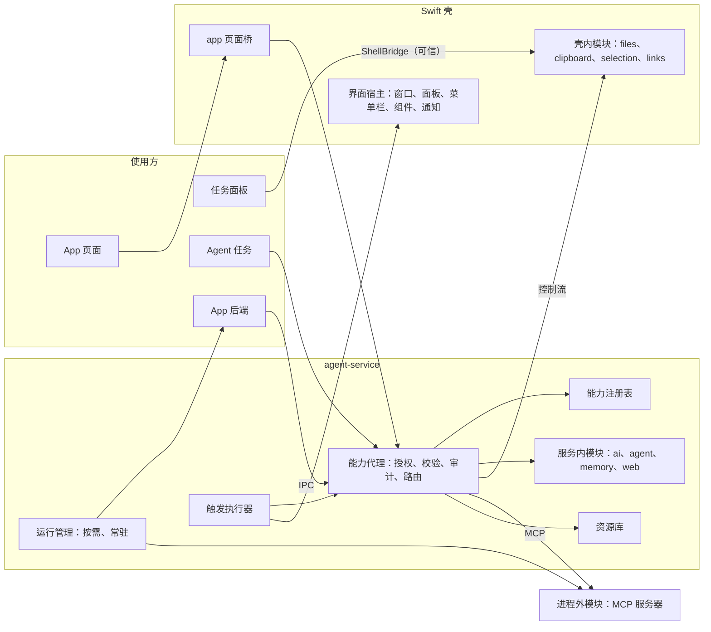

# App 本机能力基建：统一能力层

Status: Draft - awaiting approval
Created: 2026-10-06
Approval: 已授权规划（2026-10-06「写成计划吧」）；实现尚未授权

## Summary

起因是会话 b4e86ec1（`/skill:create-app 各个软件的音量控制器`）。Agent 正确判断出 app 沙箱碰不到本机，但手里没有真实可走的路，只能给出三个模拟或间接的选项；任务在提问上等了 1121.8 s 后被停止。之后用内存监控器、文件预览器、剪贴板三类需求复查，结论一致：核心价值在「操作这台电脑」的 app，今天都做不出来，而且每补一种需求都要同时改契约、服务、壳、SDK 和技能文档。

根因在基建：本机能力按使用方各自拥有。任务面板、agent 任务、app 页面、app 后端各有自己的分发面和清单，各自实现、各自授权、各自持久化；同一个操作（选文件、存文件、写剪贴板）被实现了两到三遍。唯一开放的出口 MCP 对 app 默认不可用。app 的运行方式、界面和入口也写死在常量和单一窗口里。

本计划建一个统一能力层：

- 一张注册表、一份模块契约、一个能力代理，按使用方套用授权策略。
- 模块可以在服务内、壳内或进程外（MCP 服务器），挂在同一份契约下；加模块不改平台。
- 大数据和二进制统一按资源引用传递。
- 运行方式（按需、常驻）、界面（窗口、浮动面板、菜单栏、组件、通知）和触发（热键、定时、模块事件、打开文件）由 app 在清单里声明，壳和服务统一承载。
- 授权按敏感度分级。
- create-app 技能从注册表发现能力；缺能力时走通用的「提供模块」流程。

音量控制器、内存监控器、文件预览器、剪贴板只作验收用例，平台里不出现针对它们的代码。

用户已确认（2026-10-06）：

1. 修复针对基建，不做案例特修。
2. app 可以后台常驻。
3. 采用统一能力层的方向，写成本计划。

沿用的既有决定：

- 能力经代理和授权门提供，不给生成的代码裸系统权限（`docs/plans/2026-10-03-create-app.md:43`）。
- 后端沙箱不变：Node 权限模型加 Seatbelt，禁止子进程、loopback 与监听（同上 :146-147、:300-310）。
- 桥与 relay 的安全不变量（`AGENTS.md:107-108`；`docs/plans/2026-09-29-macos-native-frontend.md:376-383`；create-app 计划 :370-385）。
- 进程外服务器只有用户能批准启动（`apps/agent-service/src/mcp/launch-approvals.ts:28-35`）。
- 只做同意与撤销，不设用量上限（create-app 计划 :657）。

## 现状

### 起因的证据

- 任务 `b4e86ec1-06b3-41a4-885c-5aad3770daa1`，运行 `29188cd4-2ee1-47d9-89da-f9a9c62ecafb`，数据目录 `~/Library/Application Support/AgentService Dev`。#2 的 `ask_user` 给出四个选项，推荐项是模拟音频引擎；1121.8 s 后任务被停止。
- 技能写明后端没有子进程、监听端口和本机服务访问，超出部分只能交给 `ctx.agent.run`（`apps/agent-service/product-skills/create-app/SKILL.md:74`）。

### 分发面与清单

| 分发面                                                                                                                                                           | 使用方                 | 清单                                                                                                                                                                                 | 校验                                                                          | 授权                                                                                               | 等待与持久化                                                                                                                   |
| ---------------------------------------------------------------------------------------------------------------------------------------------------------------- | ---------------------- | ------------------------------------------------------------------------------------------------------------------------------------------------------------------------------------ | ----------------------------------------------------------------------------- | -------------------------------------------------------------------------------------------------- | ------------------------------------------------------------------------------------------------------------------------------ |
| `ShellBridge`（`apps/macos/Sources/AIShell/App/ShellBridge.swift:65-187`）                                                                                       | 任务面板               | `NativeCalls`，38 个调用（`apps/desktop/src/native-bridge/calls.ts:121-323`），生成 Swift                                                                                            | 生成的类型                                                                    | 可信                                                                                               | 无                                                                                                                             |
| `UserAppBridge`（`apps/macos/Sources/AIShell/UserApps/UserAppBridge.swift:84-108`）                                                                              | app 页面               | `UserAppCalls`，4 个调用（`apps/desktop/src/native-bridge/user-app-contract.ts:83-129`），生成 Swift                                                                                 | 生成的类型                                                                    | 写剪贴板不询问；链接先确认；文件靠系统面板                                                         | 无                                                                                                                             |
| `ShellCapabilities` 与 `CapabilityRegistry`（`apps/macos/Sources/AIShell/Capabilities/ShellCapabilities.swift:23-98`；`apps/agent-service/src/capabilities.ts`） | agent 任务（经控制流） | `DesktopCapabilitySchema` 5 项，`input: unknown`（`packages/agent-contracts/src/confirms.ts:161-203`）；Swift 枚举手写（`apps/macos/Sources/AICore/Stream/ControlFrame.swift:3-40`） | 只在 Swift（`apps/macos/Sources/AICore/Capabilities/CapabilityInputs.swift`） | `desktop` 工具不走任务授权门（`apps/agent-service/src/desktop-tool.ts:23-66`）；读操作要求面板可见 | 任务账本，10 分钟；结果不绑定连接，请求广播给所有连接（`capabilities.ts:132-159`；`apps/agent-service/src/stream.ts:161-166`） |
| `CapabilityBroker`（`apps/agent-service/src/apps/capabilities/broker.ts:73-124`）                                                                                | app 后端               | `APP_CAPABILITY_OPS`，10 个操作（`packages/agent-contracts/src/app-capability-ops.ts:209-251`）；授权类 `APP_CAPABILITIES`（`packages/agent-contracts/src/app-identity.ts:41-67`）   | 输入、输出校验；流式片段不校验（`broker.ts:49-65`）                           | 按类同意（`apps/agent-service/src/apps/consents.ts:11-90`）                                        | 内存，5 分钟                                                                                                                   |

MCP 是唯一开放的出口，但对 app 默认不可用：

- 新服务器默认 `approveTools: true`（`apps/agent-service/src/mcp/server-edits.ts:231-247`），也没有修改它的入口（`packages/agent-contracts/src/mcp-servers.ts:126-139`；`apps/agent-service/src/configure-mcp-tool.ts:97-107`）。
- app 调用需要审批的工具时直接被拒（`apps/agent-service/src/apps/capabilities/mcp.ts:57-63`）。
- 插件提供的服务器对 app 不可见（`capabilities/mcp.ts:24-27`）；一次 `mcp` 同意覆盖整个目录。

### 由此产生的问题

- 同一操作多份实现，限制和返回各不相同：
  - 选文件三份。任务面板返回 `FileRef[]`，文本 1 MiB、图片 8 MiB（`apps/macos/Sources/AIShell/Capabilities/ShellResources.swift:66-73`）；agent 返回 `{resourceId,mime}`，第一个失败就整体失败（`ShellCapabilities.swift:35-52`）；app 返回 base64 字节，每个 8 MiB（`UserAppBridge.swift:141-156`）。
  - 存文件三份（共用保存面板与隔离标记，`ShellCapabilities.swift:185-191`）；写剪贴板三份（`apps/macos/Sources/AIShell/App/ShellBridge.swift:115-125`、`ShellCapabilities.swift:83-98`、`UserAppBridge.swift:94-97`）；打开链接两份（任务面板不确认、8192 字符；app 先确认、2048 字符）。
  - 截屏时禁止弹对话框的保护只在 `ShellBridge` 里（`ShellBridge.swift:55-64`）。
- 授权模型各不相同：任务走授权门（`apps/agent-service/src/harness/gate.ts:61-155`），`desktop` 工具绕过它；app 按类同意，后来加进该类的操作被旧授权默默覆盖；撤销不影响已在运行的调用。
- 等待与过期各不相同：app 同意在内存里等 5 分钟，desktop 请求在账本里 10 分钟，任务确认在账本里 30 分钟（`apps/agent-service/src/confirms.ts:20-26`）。
- 审计不统一：app 代理不写审计，desktop 只记请求。
- 大小与超时：IPC 单条 4 MiB（`packages/agent-contracts/src/apps-ipc.ts:30`）；超限的回复被静默丢弃，`capCall` 也没有超时，调用会挂住（`apps/agent-service/src/apps/backend-process.ts:185-191`；`packages/app-kit/runtime/ipc.mjs:95-103`）。
- 「capability」一词有四种含义：desktop 通道、app 授权类、MCP 工具 id（`packages/agent-contracts/src/mcp.ts:329-340`）、MCP 协议能力。
- 运行方式写死：
  - 只懒启动；最后一次调用后 5 分钟停止，只为渲染组件而启动的 60 s 停止（`apps/agent-service/src/apps/backend-manager.ts:15-17,286-298`）。
  - 崩溃后从不重启（`backend-manager.ts:266-282`），与 create-app 计划 :316 的「退避重启」不符。
  - 服务重启后不拉起；只订阅事件的窗口不算活动（`apps/agent-service/src/apps/runtime-routes.ts:100-128`）。
- 界面与入口写死：
  - 每个 app 一个标准窗口（`apps/macos/Sources/AIShell/UserApps/UserAppWindows.swift:7`）。
  - 没有系统通知、没有每 app 的菜单栏项、没有调度器。
  - 服务不能主动给后端发消息（`apps-ipc.ts:110-144`）。
  - 交给 Atd 的文件只能进面板输入框（`ShellResources.swift:107-137`）。
- 组件刷新是全量的：每次刷新，壳都拉取全部快照、重写全部文件并刷新 WidgetKit（`apps/macos/Sources/AIShell/Widgets/WidgetSyncController.swift:88-128`）；桌面固定组件与 WidgetKit 共用 15 分钟下限（`packages/agent-contracts/src/widgets.ts:23`）。
- 测试覆盖：服务端没有覆盖 app 代理、同意、desktop 注册表、后端 IPC 的测试；Swift 测试没有覆盖 `UserApp*`。

### 已有、可复用的部件

- 操作表与编译校验：`CapabilityOp`（`app-capability-ops.ts:209-215`）、`parse`（`packages/agent-contracts/src/validation.ts:5-9`）。
- IPC 的请求、分块、结果、取消帧与大小上限（`backend-process.ts:207-305`）；`createStream`。
- 同意等待的去重与超时（`consents.ts`）；desktop 请求的租约、账本持久化、修订号匹配、TTL、`cancelRun`、`recover`（`capabilities.ts`）；`ConfirmStore`、授权门与 `AuditWriter`（`apps/agent-service/src/audit.ts`）。
- HTTP 边界已按使用方分开：`SHELL_ROUTE`、`RENDERER_ROUTE`（`apps/agent-service/src/relay-routes.ts:19-20`）。
- 资源：
  - `ResourceRef`（`packages/agent-contracts/src/resources.ts:5-16`）与 `ResourceStore`（`apps/agent-service/src/resources.ts:8,30-59`）。
  - 导入路由 `POST /v1/resources/import`（`apps/agent-service/src/file-routes.ts:68`）。
  - `AttachmentImporter` 与它接住的入口：Finder 服务、拖到 Dock、`open -a`、拖入与粘贴（`ShellResources.swift:7-26,107-137`；`apps/macos/project.yml:153-165`）。
  - relay 已透传 `Range`（`apps/macos/Sources/AICore/Relay/RelayHeaders.swift:16,29-32`）。
- 界面与触发：
  - 热键解析、规划与注册（`apps/macos/Sources/AICore/Hotkeys/Accelerator.swift:42-56`、`HotKeyPlan.swift:71-113`；`apps/macos/Sources/AIShell/Hotkeys/HotKeyRegistrar.swift:20-42`），冲突命名空间（`packages/agent-contracts/src/shortcuts.ts:151-165`）。
  - 承载网页的非激活面板（`apps/macos/Sources/AIShell/Windows/PanelWindowController.swift:4-54`）；app 页面可以嵌入任意窗口（`apps/macos/Sources/AIShell/UserApps/UserAppWindowController.swift:56-58`）。
  - 状态栏项（`apps/macos/Sources/AIShell/App/StatusItemController.swift:13-82`）、登录启动（`AppPresence.swift:20-65`）、桌面固定组件（`apps/macos/Sources/AIShell/DesktopPins/`）。
- MCP：pi-mcp 的通用通知监听、资源读取与通用 `request`（`apps/agent-service/node_modules/@earendil-works/pi-mcp/dist/client.d.ts:46-63`）；二进制内容转资源（`apps/agent-service/src/mcp/mapping.ts:33-124`、`artifacts.ts:16-45`）。

## 设计

### 原则

1. 一个操作只有一个实现、一份契约、一条授权路径；不同使用方只体现为策略。
2. 平台不认识具体案例：平台只提供契约、代理、资源、运行方式、界面和触发；领域能力以模块加入，加模块不改平台。
3. 默认拒绝：未注册、未声明、未授权的调用一律拒绝；所有输入输出在边界校验。
4. 生成的代码不拿裸系统权限，后端沙箱不变。
5. 先迁移、后扩展：先把现有分发面原样搬进统一层，行为不变，再加新能力。

### 总体结构

### 核心模型

- **使用方**：`renderer`（任务面板，可信）、`task`（agent 任务）、`app-page`、`app-backend`。身份由边界给出，不由请求自报：任务来自运行绑定，app 页面来自窗口登记（`UserAppBridge.swift:26-34`），app 后端来自进程映射（`backend-manager.ts:228-241`）。
- **模块**：`id`（命名空间，如 `files`、`clipboard`）、`host`（`service` | `shell` | `external`）、`ops`、`events`、允许的使用方，以及可用状态（壳是否连上、进程外服务器是否已批准并运行）。
- **操作**：沿用 `CapabilityOp` 的 `{ input, output, chunk? }`，并增加：
  - `tier`：敏感度，决定授权方式。
  - `effect`：`read` | `write` | `act`。
  - `ui`：需要附着到发起窗口的操作（系统面板、确认）；宿主统一处理单飞（`ShellCapabilities.swift:193-195`）和截屏保护。
  - `limits`：结果大小与超时；超限返回 `payload_too_large`，不再静默丢弃。
- **事件**：`{ data, tier }`，由使用方订阅。
- **资源引用**：泛化 `ResourceRef` 与 `FileRef`，见「资源引用」。
- **敏感度分级**：

| tier        | 含义                                               | app 页面与后端                           | agent 任务         | 任务面板 |
| ----------- | -------------------------------------------------- | ---------------------------------------- | ------------------ | -------- |
| `open`      | 不涉及用户数据或系统状态                           | 不询问                                   | 不审批             | 可信     |
| `grant`     | 一次同意即可                                       | 每 app 每模块首次询问，可撤销            | 按任务层级走授权门 | 可信     |
| `gesture`   | 每次由用户动作完成，如选文件、存文件、确认打开链接 | 动作即同意                               | 动作即同意         | 可信     |
| `sensitive` | 持续读取个人数据，或代替用户操作                   | 明确同意、可见指示、可撤销、平台强制过滤 | 每次确认           | 可信     |

- **授权粒度**：app 授权从按类改为按模块；模块新增了更高 tier 的操作时重新询问；撤销立即终止该模块正在运行的调用和订阅。

### 能力代理

- 服务内单入口：`invoke(consumer, op, input, signal)` 与 `subscribe(consumer, event)`。
- 一次调用依次经过：查注册表 → 检查使用方 → 授权（任务走 `createGate`，app 查授权记录与 tier）→ 校验输入 → 路由到宿主 → 校验输出与片段、执行大小与超时 → 用 `AuditWriter` 写审计 → 流式返回与取消。
- 任务面板是可信使用方：调用壳内模块时直接经 `ShellBridge` 进入同一个模块实现，不绕经服务；其余使用方一律经代理。
- 等待用户的请求（app 同意、任务确认、需要窗口的操作）共用一套持久化与过期规则。
- 无窗口时：常驻 app 在后台请求未授权的能力，立即返回 `capability_denied`，并用通知或菜单栏提示用户打开 app 去授权；不再无声等待 5 分钟（`consents.ts:11`；`broker.ts:86-90`）。
- 错误码统一：`capability_unavailable`（未安装、未批准、壳未连接、进程外未运行，附补救动作）、`capability_denied`、`capability_gone`、`payload_too_large`、`cancelled`；沿用 `AppFailure` 的状态映射（`apps/agent-service/src/server.ts:128-134`）。

### 模块宿主

- **服务内**：`ai`、`agent`、`memory`、`web`，仍调用现有模块入口（create-app 计划 :175）。`memory.write` 目前返回 501，迁移时在注册表里标为不可用，SDK 与文案不再列出。
- **壳内**（Swift，随 Atd 发布）：
  - 壳在控制流连上时声明它承载的模块与操作描述，取代 `register(DesktopCapability.allCases)`（`apps/macos/Sources/AIRelay/ControlStreamClient.swift:129-141`）。描述与 Swift 类型由现有生成链产出，不再手写枚举。
  - 请求带来源上下文：任务，或 app 与窗口。结果绑定到声明该模块的连接，落实 `docs/plans/2026-09-20-pi-subagent-skills-mcp.md:167` 的要求。取消要送达壳。
  - 第一批模块由现有操作合并而来：`files`（选、存、导入为资源）、`clipboard`（读、写）、`selection`（读）、`links`（打开）。「读需要面板可见」成为 `clipboard`、`selection` 对 `task` 使用方的策略。
- **进程外**（MCP 服务器）：
  - 每个启用的服务器（含插件提供的）是一个模块：工具是操作（含 `outputSchema`），通知是事件（含 `resources/subscribe`），二进制与资源内容是资源引用。
  - tier 来自服务器策略：`approveTools` 命中的工具对任务仍逐次审批；对 app 改为按 app、按操作授权，取代「需审批就拒绝」。
  - 服务器可以设为常驻，不被空闲关闭。
  - agent 编写的模块放在受保护目录，启动批准绑定内容哈希。今天的批准只绑定命令行（`apps/agent-service/src/mcp/launch-fingerprint.ts:86-100`），批准后脚本可被静默修改。
  - `ctx.mcp.listTools` 与 `ctx.mcp.callTool` 保留为兼容别名。

### 资源引用

- `ResourceStore` 推广为所有使用方共用的资源库：
  - 作用域是任务或 app；导入 id 不再是无作用域的持有者凭证（`apps/agent-service/src/resources/import.ts:6-9`）。
  - 随任务或 app 删除而清理；今天没有任何删除或回收路径。
  - 上限按来源与类型设定，而不是一律 8 MiB。
- app 页面从自己的源读取：
  - 壳的 app 请求门新增资源目标（`apps/macos/Sources/AICore/UserApps/UserAppRequestGate.swift:98-134`）。
  - 服务新增 `/v1/apps/:appId/resources/:id`，暴露为 `SHELL_ROUTE`，appId 取自窗口登记（main token 不携带 app 身份）。
  - 两端都支持 Range。今天 relay 透传 `Range`，但服务与 app 处理器都不支持，文件整读并只回 200（`apps/macos/Sources/AIRelay/UserAppSchemeHandler.swift:77-91`）。
  - 媒体因此能从 app 自己的源加载，CSP 不需要为媒体放开 `blob:`。
- app 后端经 `ctx.resources` 流式读写。
- 现有入口（Finder 服务、拖到 Dock、`open -a`、拖入与粘贴）产出资源引用，可以路由给 app（见「触发」）。app 窗口的拖入也走 `AttachmentImporter`；今天 `UserAppWebView` 没有拖入处理，WebKit 会把文件直接交给页面。
- 兼容：SDK 打包在每个已构建的 app 里（`packages/app-kit/src/contracts.ts:5-7`），已发布的版本和回退会继续调用今天的四个页面桥方法。这些方法保留，内部改走新模块，`files.pick` 仍返回不超过 8 MiB 的字节。

### 运行方式

| 时机               | 按需（默认）                                                     | 常驻（需授权）                         |
| ------------------ | ---------------------------------------------------------------- | -------------------------------------- |
| 启动               | 第一次调用、渲染组件、触发                                       | 服务启动时、授权当下                   |
| 存活               | 有使用方连着（调用中、渲染中、窗口订阅事件）时存活，之后有宽限期 | 一直运行                               |
| 崩溃               | 下次需要时启动                                                   | 退避重启；熔断后标为「出错停止」并提示 |
| 新版本、回退       | 停止，下次需要时启动新版本                                       | 立即重启到新版本                       |
| 服务重启           | 不拉起                                                           | 拉起                                   |
| 撤销、删除、清数据 | 停止                                                             | 停止                                   |
| Atd 退出           | 结束，`onStop` 至多 5 s（`backend-process.ts:17,194-200`）       | 同左                                   |

- 常驻本身是一项 `grant` 授权，在 app 窗口打开时询问；后台要用的其他能力也在这时一并授权。
- 可见与控制：菜单栏菜单列出后台运行的 app 及其状态，可以逐个停止或撤销；「我的应用」显示状态与资源占用（服务定期读取子进程的内存与 CPU）。
- 资源：常驻后端以低优先级运行。一个最小后端（Node 24，加载 `node:sqlite`，同一套沙箱）实测约 45 MiB。常驻超过 5 个时提醒，数量可调。
- 进程外模块同样分按需与常驻；按需沿用 MCP 连接的空闲关闭（`apps/agent-service/src/mcp/constants.ts:16`）。

### 界面

- 清单新增 `surfaces`，`window` 的语义不变：
  - `panel`：不抢焦点的浮动面板，承载 app 页面。复用 `UserAppHost.container`，面板做法沿用 `PanelWindowController`，包括用透明度代替 `orderOut`，避免 WebKit 计时器被节流。
  - `menuBar`：每个 app 一个状态栏项，显示后端发布的短文本与 SF Symbol，点击打开指定界面；用户可以在设置里隐藏。
  - `widget`：沿用 WidgetKit 与桌面固定组件。
  - `notification`：壳新增系统通知（UserNotifications），点击打开 app 的指定路由。
- 实时数据通道：服务按 app、按界面推送数据帧，用于桌面固定组件与菜单栏项，在这两处取代「无数据的 `invalidate{scope:'widgets'}` 加全量拉取」（`packages/agent-contracts/src/workspace.ts:169-172`）。WidgetKit 时间线仍然合并刷新，间隔不短于声明的 `refreshMinutes`。

### 触发

- 清单新增 `triggers`；动作是「打开某个界面（可带路由）」或「调用某个后端函数」：
  - `hotkey`：清单给建议组合键，用户可改。冲突检查并入现有命名空间；热键集合仍由面板页面统一下发（`apps/desktop/src/native-host/native-shortcuts.ts:61-90`），按下后交给服务的触发执行器。
  - `schedule`：服务新增调度器；今天只有组件的 60 s 扫描（`apps/agent-service/src/apps/widgets/publisher.ts:27,109`）。
  - `event`：订阅模块事件，事件到达时调用后端函数；需要新增服务到后端的事件消息。
  - `fileOpen`：交给 Atd 的文件可以选择交给某个 app，以资源引用送达。不为单个 app 注册文档类型；每个 app 独立 `.app` 仍是非目标。

### Agent 侧

- `app` 工具新增 `capabilities` 操作（今天只有 scaffold、build、diagnostics、call、list，`apps/agent-service/src/apps/tool.ts:28-92`），内容从注册表生成：模块、操作 schema、事件、tier、可用状态、缺失时的补救方式。
- create-app 技能：
  - 删除枚举能力与限制的段落：`SKILL.md` 第 20、27、31、43、60、69–75 行；`references/sdk.md` 第 18–25、38–62 行；`references/starter.md` 第 7、34、38–42 行；`references/example.md` 第 21、40–41 行。改为先用 `capabilities` 查询。
  - 按意图选择运行方式、界面与触发；不写任何「某类 app 怎么做」的条款，内容用英文（`~/.claude/CLAUDE.md` 的技能规则）。
  - 描述压到 250 字符以内：提示目录会截断（`apps/agent-service/src/prompt-catalog.ts:9,83-89`），现在是 726 字符。
- 通用的「提供模块」流程：
  1. 向用户说明缺什么能力。
  2. 用户同意后，在普通受控任务里编写进程外模块并写入受保护的模块目录，或安装现成模块。
  3. 用 `configure_mcp` 注册，用户在原生对话框里批准启动（`apps/macos/Sources/AICore/Service/McpApprovalDialog.swift:33-67`）。
  4. 回到 create-app，在清单里声明并使用。
- 现有 create-mcp 技能只配置、不编写（`apps/agent-service/product-skills/create-mcp/SKILL.md:3`）；编写模块归上面的流程。

### 产品流程与界面

| 入口               | 主要动作                                                       | 结果与错误                                         |
| ------------------ | -------------------------------------------------------------- | -------------------------------------------------- |
| app 首次请求某模块 | 同意弹窗：按 tier 区分措辞，显示 app、模块、操作与清单里的用途 | 允许或拒绝；`sensitive` 另外说明持续访问与指示方式 |
| app 申请常驻       | 同意弹窗，同时列出后台要用的能力                               | 允许后立即在后台启动                               |
| 设置中的 app 页    | 按模块查看与撤销授权；切换运行方式；隐藏菜单栏项               | 撤销立即生效                                       |
| 菜单栏菜单         | 「后台运行」段：状态、停止、撤销                               | 出错停止时显示原因                                 |
| 我的应用           | 查看状态与资源占用                                             | 出错时显示原因与重试                               |
| 模块不可用         | 显示补救动作：安装、批准、启动                                 | `capability_unavailable`                           |

- Figma：同意弹窗的分级、设置中的 app 授权页、菜单栏「后台运行」段、我的应用状态，在项目文件 `project` 同步（`AGENTS.md` 的默认同步规则）。
- 文案：en 与 zh-CN（`apps/desktop/src/i18n/locales/{en,zh-CN}/apps.json` 等）；菜单栏、通知、原生对话框的文案进 Swift String Catalog。

### 复用决定

- 进程外模块用 MCP：授权、启动批准、连接池与审计都已存在，生态也现成；不另起插件协议。
- schema 沿用 TypeBox 与现有编译校验；桥与控制流的类型沿用现有生成链（`apps/desktop/scripts/export-bridge-schema.mjs` → `apps/macos/scripts/generate-bridge-types.mjs`）。
- 界面与触发复用壳内现有部件；系统通知用平台的 UserNotifications。
- 不引入新依赖；MCP 资源订阅用 pi-mcp 的通用 `request`。

### 验收用例（不在平台里实现）

| 用例       | 用到的基建                 | 需要的模块                      |
| ---------- | -------------------------- | ------------------------------- |
| 音量控制器 | 常驻、菜单栏或组件         | 音频（进程外）                  |
| 内存监控器 | 常驻、实时数据通道、通知   | 系统指标（只读，`grant`）       |
| 文件预览器 | 资源引用、`fileOpen`、面板 | 预览（壳内，Quick Look，`ui`）  |
| 剪贴板     | 常驻、`hotkey`、面板       | 剪贴板事件与粘贴（`sensitive`） |

每个用例只写清单与模块。如果某个用例需要改平台，说明契约有缺口，回到基建去修。四个领域模块本身是后续工作，不在本计划内；剪贴板模块要等策略决定。

### 非目标

- 每个 app 独立 `.app`，或为单个 app 注册文档类型（沿用 create-app 计划）。
- 放开后端沙箱，或允许生成的代码带原生代码。
- 模块商店与审核。
- 用量上限。
- 实现四个用例的领域模块。

## Clarifying Questions

- [x] 修复范围？→ 基建，不做案例特修（用户，2026-10-06）。
- [x] app 能否后台常驻？→ 可以（用户，2026-10-06）。
- [x] 是否按统一能力层写成计划？→ 是（用户，2026-10-06）。
- [x] 生成的代码能否拿裸系统权限？→ 不能（沿用 create-app 计划 :43）。
- [ ] 迁移前是否补测试？服务端没有覆盖 app 代理、同意、desktop 注册表、后端 IPC 的测试，Swift 测试没有覆盖 `UserApp*`；按仓库规则不擅自加测试。默认：跑现有测试，再用隔离实例手动验证。要补测试请明确。
- [ ] 剪贴板这类 `sensitive` 持续读取是否向 app 开放？这是剪贴板模块的策略，不影响平台。默认：决定之前不提供该模块。
- [ ] `fileOpen` 的范围？默认：经 Atd 现有入口加「选择 app」；不为单个 app 注册文档类型。
- [ ] 进程外模块的信任？默认：与今天的 MCP 服务器相同（用户批准启动，不沙箱），再加内容哈希绑定；是否加 Seatbelt 以后再定。
- [ ] 签名身份？壳内需要系统隐私授权的模块，在 ad hoc 签名下每次更新都会丢授权。不阻塞本计划，但阻塞这类模块可用。
- [ ] 菜单栏？默认每个 app 一个状态栏项，可以隐藏。
- [ ] 常驻上限？默认超过 5 个时提醒。

## File And Code References

契约（`packages/agent-contracts/src/`）

- `app-capability-ops.ts:209-251`：`CapabilityOp` 与 `APP_CAPABILITY_OPS`，统一契约的起点。
- `app-identity.ts:41-67`、`app-manifest.ts:92-114`、`apps.ts:67-87,102,120,166-181`：授权类、清单（`additionalProperties: false`）、授权与同意摘要。
- `apps-ipc.ts:30,37-67,110-144`：IPC 上限、每个操作一个联合分支、父进程到子进程没有主动消息。
- `confirms.ts:23-40,147-203`：任务授权范围与层级、`DesktopCapabilitySchema`、`CapabilityRequestSchema`。
- `resources.ts:5-16`、`task.ts:51`：`ResourceRef` 与手写的 `FileRef`。
- `mcp.ts:89-109,329-340`、`mcp-servers.ts:126-139`：服务器配置、能力 id、可修改的字段。
- `shortcuts.ts:10-17,151-165`、`widgets.ts:23`、`workspace.ts:169-172`、`validation.ts:5-9`、`http.ts:177-190`。

服务（`apps/agent-service/src/`）

- `apps/agent-service/src/apps/capabilities/broker.ts:26-124`：现有 app 代理的校验、授权与分发。
- `apps/agent-service/src/apps/capabilities/{ai,agent,memory,mcp,web}.ts`：服务内模块的实现入口；`mcp.ts:24-27,57-86`。
- `apps/agent-service/src/apps/consents.ts:11-90`、`apps/agent-service/src/apps/routes.ts:99-107`、`apps/agent-service/src/apps/service.ts:69-77,142-157,165-183,205-210`。
- `apps/agent-service/src/apps/backend-manager.ts:15-17,49,71-90,147-150,179-311`、`apps/agent-service/src/apps/backend-process.ts:17,185-200,207-305`、`apps/agent-service/src/apps/runtime-routes.ts:72,100-128`、`apps/agent-service/src/apps/lifecycle.ts:53-66,127-159`、`apps/agent-service/src/apps/records.ts:28-64`、`apps/agent-service/src/apps/publish.ts:258-272`。
- `apps/agent-service/src/apps/widgets/publisher.ts:27,88-157,233-310`。
- `apps/agent-service/src/apps/tool.ts:28-92,174-187`：`app` 工具。
- `capabilities.ts:27-202,241-296`、`desktop-tool.ts:23-66`、`stream.ts:161-258`：desktop 通道。
- `harness/gate.ts:61-155`、`confirms.ts:20-26`、`audit.ts`、`server.ts:128-134`、`relay-routes.ts:19-62`。
- `resources.ts:8,30-98`、`resources/import.ts:6-9`、`resources/routes.ts:22-38`、`file-routes.ts:55-68`、`folders/`。
- `mcp/server-edits.ts:231-247`、`mcp/connect.ts:60-82,266-286`、`mcp/pool.ts:179-183,246-252,288-300`、`mcp/pooled-connection.ts:78-102,127-129`、`mcp/launch-fingerprint.ts:29-35,86-100`、`mcp/launch-approvals.ts:28-35,237-241`、`mcp/mapping.ts:33-153`、`mcp/artifacts.ts:16-45`、`mcp/facade.ts:211-269`、`mcp/authority.ts:79-86,310-324`。
- `configure-mcp-tool.ts:97-153`、`prompt-catalog.ts:9,83-89`、`builtins/manifest.ts:9-14,48-57`。

app-kit（`packages/app-kit/`）

- `src/contracts.ts:5-7,55-72`：SDK 打包进每个 app；手写的 `UserAppCalls`。
- `src/sdk/server/types.ts:65-104`、`runtime/context.mjs:137-157`、`runtime/ipc.mjs:95-127`、`runtime/bootstrap.mjs:127-173`。
- `src/sdk/client/native.ts:62-91`、`src/sdk/client/events.ts:14-30`。
- `src/node/seatbelt.ts:62-106`：后端沙箱，保持不变。

壳（`apps/macos/`）

- `Sources/AIRelay/ControlStreamClient.swift:7-11,129-141`、`Sources/AICore/Stream/ControlFrame.swift:3-40`、`Sources/AICore/Capabilities/CapabilityInputs.swift`。
- `Sources/AIShell/Capabilities/ShellCapabilities.swift:23-98,135-195`、`ShellResources.swift:7-197`。
- `Sources/AIShell/App/ShellBridge.swift:35-187`、`Sources/AIShell/UserApps/UserAppBridge.swift:26-204`、`UserAppHost.swift:22-41,175-177,250-261`、`UserAppWindows.swift:7,53-147`、`UserAppWindowController.swift:23-111`。
- `Sources/AICore/UserApps/UserAppRequestGate.swift:14-26,98-134`、`UserAppContentPolicy.swift:16-49`、`UserAppOrigin.swift:24-60`、`Sources/AIRelay/UserAppSchemeHandler.swift:60-125`、`Sources/AICore/Relay/RelayHeaders.swift:16-80`。
- `Sources/AIShell/Widgets/WidgetSyncController.swift:9-128`、`Sources/AIShell/DesktopPins/`。
- `Sources/AICore/Hotkeys/`、`Sources/AIShell/Hotkeys/`、`Sources/AIShell/Windows/PanelWindowController.swift:4-170`、`Sources/AIShell/App/StatusItemController.swift:13-82`、`AppMenus.swift:33-62`、`AppPresence.swift:20-65`、`FinderService.swift:13-26`、`ShellApplication.swift:45-88`。
- `Sources/AICore/Service/McpApprovalDialog.swift:33-67`、`McpApprovalGate.swift:61-83`。
- `project.yml:153-165`：Finder 服务与文档类型。

渲染器（`apps/desktop/`）

- `src/native-bridge/calls.ts:121-323`、`contract.ts:47-321`、`user-app-contract.ts:48-129`、`scripts/export-bridge-schema.mjs:32-103`；`apps/macos/scripts/generate-bridge-types.mjs:33-190`、`bridge-emitter.mjs:134-259`。
- `src/native-host/native-shortcuts.ts:61-90`、`native-apps.ts:53-137`。
- `src/features/apps/app-grants.tsx`、`src/i18n/locales/{en,zh-CN}/apps.json:55-86`、`src/components/composer.tsx:57`。

技能

- `apps/agent-service/product-skills/create-app/SKILL.md` 与 `references/{sdk,starter,example}.md`（行号见「Agent 侧」）。
- `apps/agent-service/product-skills/create-mcp/SKILL.md:3`。

文档

- `docs/plans/2026-10-03-create-app.md:22,43,143,146-147,175,300-317,370-385,392-451,657`。
- `docs/plans/2026-09-29-macos-native-frontend.md:231,254-292,376-383`。
- `docs/plans/2026-09-20-pi-subagent-skills-mcp.md:167,206-230`。
- `docs/plans/2026-09-28-plugin-grouped-extensions-settings.md:35,37,549`。

## Plan Todos

### 第一批：契约与行为不变的迁移

- [ ] **T1 能力层契约**（`packages/agent-contracts/src/`，按职责拆成多个文件，均不超过 350 行）：模块描述；操作（`CapabilityOp` 加 `tier`、`effect`、`ui`、`limits`）；事件；使用方；tier；资源引用（合并 `ResourceRef` 与 `FileRef`）；运行方式；`surfaces` 与 `triggers` 的清单 schema；统一错误码；统一「capability」一词的含义。依赖：无。
- [ ] **T2 注册表与能力代理**（服务）：单入口 `invoke`、`subscribe`；授权（任务走 `createGate`，app 查授权与 tier）；输入、输出与片段校验；大小与超时（修复超限静默丢弃与 `capCall` 挂住）；`AuditWriter` 审计；取消。把 `ai`、`agent`、`memory`、`web`、`mcp` 迁成服务内模块，行为不变（`memory.write` 标为不可用）。依赖 T1。
- [ ] **T3 授权记录与等待请求**：app 授权从按类迁到按模块，旧授权一一映射；app 同意、任务确认、需要窗口的请求共用一套持久化与过期；撤销立即终止运行中的调用和订阅。依赖 T2。
- [ ] **T4 壳内模块宿主**：控制流注册改为模块描述，Swift 类型由生成链产出并删除手写枚举；请求带来源上下文；结果绑定声明它的连接；取消送达壳；`desktop` 工具改走代理与任务授权门；desktop 的五项能力迁成 `files`、`clipboard`、`selection` 模块，「读需要面板可见」成为对 `task` 的策略。依赖 T1、T2。
- [ ] **T5 资源引用**：资源库按任务或 app 划分作用域，随删除清理，上限按来源与类型设定；新增 `/v1/apps/:appId/resources/:id`（`SHELL_ROUTE`）与 app 请求门的资源目标，两端支持 Range；后端 `ctx.resources`；任务面板与 agent 的选文件返回同一种引用。依赖 T1、T2。
- [ ] **T6 页面桥统一**：app 页面的能力调用改为通用 `capability.invoke` 与 `capability.subscribe`，经壳转给代理；选文件、存文件、写剪贴板、打开链接各合并为模块里的一个实现，截屏保护与单飞由宿主统一处理；旧的四个页面桥方法保留，内部改走新模块；app 窗口的拖入走 `AttachmentImporter`。依赖 T4、T5。

### 第二批：运行方式、界面、触发

- [ ] **T7 运行方式**：`backend-manager` 由常量改为策略；按需后端在有使用方连着时存活（含事件订阅），之后有宽限期；常驻的启动点（服务启动、授权当下）、退避重启与熔断、新版本立即重启、撤销/删除/清数据即停；无窗口时的同意改为立即拒绝并提示；后台列表与资源占用；软上限；进程外模块常驻（MCP 连接不空闲关闭）。依赖 T2、T3。
- [ ] **T8 界面**：清单 `surfaces`（`panel`、`menuBar`、`notification`）；壳实现承载 app 页面的面板、每 app 的状态栏项与系统通知；实时数据通道用于桌面固定组件与菜单栏项；WidgetKit 合并刷新。依赖 T1、T7。
- [ ] **T9 触发**：清单 `triggers`（`hotkey`、`schedule`、`event`、`fileOpen`）；服务的触发执行器与调度器；服务到后端的事件消息；热键并入现有冲突命名空间与面板下发；Atd 入口收到的文件可以交给 app。依赖 T5、T7、T8。

### 第三批：进程外模块与 agent 侧

- [ ] **T10 MCP 服务器即模块**：工具转操作（含 `outputSchema`）；通知转事件（含 `resources/subscribe`）；二进制与资源转引用；app 按 app、按操作授权，取代「需审批就拒绝」；插件服务器可供 app 使用；常驻；agent 编写的模块放受保护目录并按内容哈希批准。动手前先按职责拆分已到 350 行的 MCP 文件。依赖 T2、T5、T7。
- [ ] **T11 `app` 工具的 `capabilities` 操作**：从注册表生成模块、操作 schema、事件、tier、可用状态与补救方式。依赖 T2，之后各批逐步补充。
- [ ] **T12 create-app 技能**：删除枚举能力与限制的段落，改为先查 `capabilities`；按意图选择运行方式、界面与触发；加入通用的「提供模块」流程，并与 create-mcp 分工；描述不超过 250 字符；英文，不写案例条款。依赖 T10、T11。

### 第四批：界面、文档与验收

- [ ] **T13 产品界面**：按 tier 分级的同意弹窗、设置中的 app 授权页、菜单栏「后台运行」段、我的应用状态与占用、错误态与补救动作；Figma 同步；en 与 zh-CN 文案，以及 Swift String Catalog。依赖 T3、T7、T8。
- [ ] **T14 文档**：在 create-app 计划里加一节修订：运行方式取代 :312-317 的空闲停止与不拉起规则，按模块授权取代 :143 的按类同意，并标注 :314、:316 与代码不符的旧描述；按需更新 `AGENTS.md` 中涉及能力与运行方式的描述。依赖 T3、T7。
- [ ] **T15 验收**：把四个用例各写成「清单 + 模块」的草案，确认只需新增模块；用迁移后的 `files`（壳内）和一个最小 MCP 服务器（进程外）跑通调用、事件、资源引用、常驻、界面与触发。依赖 T1–T13。

## Grill-Me Outcome

- Transcript: Not run
- Outcome: Not run
- Summary: 未运行访谈。三项产品决定由用户在对话中确认（见 Clarifying Questions），其余开放问题都已给出默认值。

## Build From Plan

- Ready to build: No。等待实现授权；开放问题都有默认值，不阻塞 T1–T6。
- Selected todos: 尚未选择。建议第一批 T1–T6（行为不变的迁移），第二批 T7–T9，第三批 T10–T12，最后 T13–T15。
- Execution notes:
  - 每批单独提 PR，目标 `main`；行为不变的迁移不夹带新能力。
  - 另一个进行中的任务正在改渲染器桥契约、`ShellBridge`、`ShellCapabilities` 与生成的 `Bridge*.swift`（mini panel）。T4–T6 动手前，先确认它已合入或与之协调。
  - `apps/agent-service/src/mcp/authority.ts`（350 行）、`mcp/pool.ts`（349 行）、`packages/agent-contracts/src/mcp.ts`（340 行）、`mcp/facade.ts`（337 行）已到上限，改动前先按职责拆分。
  - 旧的页面桥方法与 `ctx.mcp` 保留给已构建的 app。
  - `.claude/worktrees/` 下有仓库副本，全仓搜索时要排除。
  - 改清单 schema 时同步更新 create-app 技能与 sdk 参考，避免技能说法与运行时不一致。

## Validation

- 每批都跑：确认 `pnpm --version` 与根 `packageManager` 一致；`pnpm typecheck`；`pnpm lint`（含 350 行限制与 SwiftLint）；`pnpm test`（Vitest、服务 Node 测试、Swift Testing）；`pnpm check:swift`（含 `codegen:check`）；只对本任务的文件跑 `pnpm exec oxfmt` 与 `swift format`。
- 行为不变的迁移（T1–T6）：先确认 Vite 端口空闲，再用隔离实例 `AI_AGENT_DATA_DIR=$(mktemp -d) pnpm dev` 逐项走一遍：
  - app 后端调用 ai、agent、web、mcp（含流式与取消），以及同意与撤销；
  - agent 的选文件、存文件、读写剪贴板、读选中内容（面板可见与不可见各一次）；
  - app 页面的写剪贴板、打开链接、选文件、存文件；用迁移前构建的 app 确认旧桥方法仍然可用；
  - 任务面板的附件导入、Finder 服务、拖到 Dock。
- 运行方式、界面、触发（T7–T9）：在隔离的 Debug app 里确认常驻 app 随服务重启恢复、崩溃退避与熔断、撤销即停、后台列表；检查面板、菜单栏项、通知与热键冲突；原生窗口按 `AGENTS.md`「Visual Acceptance」在真实合成的窗口上检查（聚焦与失焦、对比背景）。
- 进程外模块（T10）：用一个最小 MCP 服务器验证按 app 授权、常驻、通知转事件、二进制转资源，以及改代码后需要重新批准。
- 产品界面（T13）：按「Visual Acceptance」检查，并记录 Figma 同步的范围。
- 验收（T15）：四个用例都只需要清单与模块。

## Risks

- 范围大，横跨三层：分批推进，先做行为不变的迁移；每批都可以单独发布和回退。
- 单一代理成为所有能力的唯一策略点，出错会影响所有使用方：默认拒绝、边界校验，并保留桥与 relay 的不变量。
- 现有测试覆盖薄：迁移的正确性主要靠隔离实例手动验证（见开放问题）。
- 兼容：已构建的 app 内含旧 SDK，旧桥方法与 `ctx.mcp` 必须保留；回退到的旧版本也一样。
- 页面调用壳内能力要多一跳（页面 → 壳 → 服务 → 壳）：本机延迟预计可以接受，需要实测。
- 常驻成本：每个常驻后端至少约 45 MiB；靠可见、提醒与低优先级控制。
- 系统隐私授权：在 ad hoc 签名下，壳内需要授权的模块每次更新都会丢授权。
- 进程外模块不沙箱，与今天的 MCP 服务器相同；在内容哈希绑定落地之前，agent 编写的脚本在批准后仍可被修改。
- WidgetKit 有刷新预算，所以实时通道只用于桌面固定组件与菜单栏项。
- 剪贴板模块：macOS 的剪贴板访问提示目前仍是开发者预览，以后可能默认开启。
- Seatbelt 已被标为弃用（create-app 计划中的既有风险）。
- 尚未验证：ad hoc 签名的 LSUIElement 构建能否获得通知授权；服务重启后页面的 `EventSource` 能否恢复（SDK 没有重连，`packages/app-kit/src/sdk/client/events.ts:14-30`）；睡眠唤醒对服务计时器的影响；WebKit 对自定义 scheme 的媒体在没有 206 响应时的表现。

## Approval

- Status: Draft - awaiting approval
- 授权范围：仅规划（2026-10-06）。实现需要用户另行授权，可以选择全部或部分条目。
