# 自动化：定时、文件夹与联动触发

Status: Implemented - T0–T6 完成；原生窗口与通知的实机目视验收未做（见 Risks）
Created: 2026-10-06
Approval: 用户 2026-10-06 要求「结合项目依赖以及社区最佳实践，为项目添加自动化功能（包含定时任务，但不仅仅是定时任务），需要调研并分析」，按 `AGENTS.md`「Task Execution」直接交付实现；本文记录调研、取舍与实施。

## Summary

自动化是「无需有人在面板里输入就会开始的 Agent 工作」。首版把一条自动化定义为四部分：

- **触发**：什么时候开始。三类：时间（一次、每 N 分钟、每天、每周、每月、自定义 cron）、文件夹变化（授权文件夹里新增或修改了匹配的文件）、联动（另一条自动化以指定结果结束）。每条自动化都能「立即运行」。
- **动作**：做什么。一段为自动化写的提示词，或一条已保存的命令加上绑定的参数值。
- **运行策略**：无人在场时能做什么。权限档、工具、模型、记忆、可读文件夹、最长运行时间、错过时段怎么办。
- **结果投递**：怎么让人知道。系统通知、运行记录里的未读结果、任务历史里的来源标记。

每次触发都新建一个任务，走与手动运行相同的受理路径（`RunnerManager.submit`，命令走服务端的 `launchCommand`），沿用幂等、排队与策略，符合需求文档 C10「新增触发方式转换为同一 InvocationDraft/CommandInvocation」（[general-agent-requirements](./2026-09-10-general-agent-requirements.md)）。这类运行是「无人值守」的：会触发确认的操作立即拒绝，而不是等 30 分钟。

### 调研结论：社区实践

调研覆盖 Codex/ChatGPT 定时任务、Claude Code 桌面定时任务与 Routines、Cowork、Cursor Automations、OpenClaw、Hermes Agent、Manus、Gemini、Perplexity、Raycast，以及 Apple 快捷指令、Folder Actions、Hazel、Home Assistant、n8n、Zapier、GitHub Actions。对 Atd 有约束力的结论：

1. **本地调度只在 app 运行、Mac 醒着时工作。** Claude 桌面定时任务与 Raycast 都在启动或唤醒后把错过的时段合并成一次补跑（[Claude desktop](https://code.claude.com/docs/en/desktop-scheduled-tasks)、[Raycast](https://manual.raycast.com/ai/automations)）。
2. **事件触发在 AI 产品里几乎都在云端**（GitHub、Slack、Gmail、Webhook），2026-10-06 起 Cowork 的新任务也迁到云端且不能绑定本机文件夹（[Cowork](https://support.claude.com/en/articles/13854387-schedule-recurring-tasks-in-claude-cowork)）。本机文件夹、本机工具与 MCP 是 Atd 能做而云端做不到的；本机文件夹触发的先例只有快捷指令（macOS 26 有 15 种 Mac 触发器）、Folder Actions 与 Hazel。
3. **「需要批准但没人在」有三种做法**：在收窄的权限里自动运行、暂停等人、直接拒绝并给出明确结果。暂停等人的故障报告最多（运行挂起占住名额、整夜漏跑），见 [claude-code#99529](https://github.com/anthropics/claude-code/issues/99529)、[#91387](https://github.com/anthropics/claude-code/issues/91387)。
4. **最常见的故障是「静默不执行」**：计划向前走了，却没有运行或没有记录，界面看起来一切正常（[codex#17893](https://github.com/openai/codex/issues/17893)、[claude-code#93015](https://github.com/anthropics/claude-code/issues/93015)）。成熟的调度器用执行台账、逾期检测、运行前预检、每次故障只提醒一次、连续失败后自动停用来应对（[Hermes cron](https://github.com/NousResearch/hermes-agent/blob/main/website/docs/user-guide/features/cron.md)、[OpenClaw](https://github.com/openclaw/openclaw/blob/main/docs/automation/cron-jobs/how-it-works.md)）。
5. **成本失控来自同一线程反复重发长上下文，以及额度用完后还在触发**；有用户的 Agent 自己建了 10 分钟一次的心跳，一天耗掉一个月的额度（[codex#45070](https://github.com/openai/codex/issues/45070)）。对策是每次新任务、只带上次结果、按自动化固定模型、禁止自动化管理自动化。
6. **创建方式趋同**：在对话里用自然语言描述 → 用平常话确认并显示接下来几次运行时间 → 立刻试跑一次；设置里另有表单与预设，cron 藏在「自定义」里（[OpenClaw](https://github.com/openclaw/openclaw/blob/main/docs/automation/cron-jobs/how-it-works.md)、[Raycast](https://manual.raycast.com/ai/automations)）。
7. **行业从隐式主动转向显式、可控的计划**：OpenAI 用定时任务取代了 Pulse，OpenClaw 去掉了推断出的跟进。首版不做环境心跳。

### 调研结论：项目依赖

| 能力              | 来源                                                                            | 结论                                                                                                                                                                                           |
| ----------------- | ------------------------------------------------------------------------------- | ---------------------------------------------------------------------------------------------------------------------------------------------------------------------------------------------- |
| 受理与幂等        | `RunnerManager.submit`（`operationId` 去重）                                    | 直接复用；新增仅服务内可设的 `InternalSubmitOptions`（来源、权限档、标题、触发器），HTTP 无法伪造                                                                                              |
| 定时              | `pi-subagents` 0.74.0 的 `scheduledRuns`                                        | 不能复用：计时器挂在任务的会话里，只跑异步工作流脚本，无 cron 与时区，会话空闲 10 分钟即消失，服务还用五种方式禁用了它。借鉴其语义：补跑 none/latest、重叠跳过、带过期回收的占用、有上限的历史 |
| 计算发生时间      | 新依赖 `croner`                                                                 | MIT、零依赖，支持 IANA 时区与夏令时、一次性时间；只用来算下一次发生时间，计时、持久化、补跑与重叠由引擎负责                                                                                    |
| 文件变化          | `crates/file-index`（FSEvents，持久化 `lastEventId`，重启后补回关闭期间的变化） | 最适合的长期底座，但 napi 层没有变化事件 API，且只索引可附加的扩展名；首版用有上限的轮询快照（同样能发现关闭期间的变化），后续再把变化事件接到 Rust 索引                                       |
| 文件监听          | Node `fs.watch` 递归                                                            | 不用：macOS 上关闭监听器可能阻塞事件循环，pi-subagents 因此在 darwin 改为轮询（[pi-subagents#1220](https://github.com/nicobailon/pi-subagents/pull/1220)）                                     |
| 事件来源          | `pi-mcp` 的 `onNotification` / `resources/subscribe`                            | 可行但需连接租约与重订阅，支持订阅的服务器少；放到后续阶段                                                                                                                                     |
| 运行监督          | 事件日志 `run.status`、`manager.cancel`、`manager.snapshot`、审计 JSONL         | 直接复用；用户 app 的 `ctx.agent.run` 已是服务内启动并监督的先例                                                                                                                               |
| 计时模式          | 组件发布器的 60 s `unref` 墙钟巡检                                              | 沿用同一模式：单个粗粒度巡检比对持久化的到期时间，不为每条自动化挂长计时器                                                                                                                     |
| 通知              | 无（壳里没有 UserNotifications）                                                | 新增；沿用组件的「invalidate → 壳拉取仅壳路由」先例                                                                                                                                            |
| 运行在 app 关闭时 | Release 服务随 app 退出                                                         | 不支持；「登录时打开」已有开关，可减少错过                                                                                                                                                     |

### 调研结论：工程实现

- **调度库**：比较了 croner、cron-parser、node-cron、cron、node-schedule、toad-scheduler、bree 与 rrule。自带计时的几个库都没有补跑与持久化，node-cron 的 README 也把持久需求交给需要外部服务的 BullMQ、Agenda 等。croner 10.0.1 零依赖，支持 `L`/`W`/`#`、`nextRuns`/`previousRuns` 与基于 Intl 的时区，只当求值器使用。它有三处已知问题：
  - `?` 会变成每天触发（[croner#392](https://github.com/Hexagon/croner/issues/392)），所以直接拒绝；
  - 夏令时跳过的时刻实际是顺延，而不是 README 说的跳过，用金样测试固定这一行为；
  - 它自带的计时循环在时钟回拨时空转（[croner#399](https://github.com/Hexagon/croner/issues/399)），所以不使用。

  cron-parser 5.10.1 作为备选。

- **睡眠与计时**：libuv 从 1.38.1 起的时钟计入睡眠时间（[darwin.c](https://github.com/libuv/libuv/blob/v1.x/src/unix/darwin.c)），但 kqueue 的等待基于不计睡眠的 `mach_absolute_time`，所以一个长计时器会晚到大约睡眠那么久。因此采用不超过 30 s 的巡检加墙钟比对。这一结论来自源码推导，本机没有实测。
- **错过策略**：参考了 Quartz 的 misfire、Kubernetes CronJob 的 `startingDeadlineSeconds` 与 `concurrencyPolicy`、systemd 的 `Persistent=`、anacron，以及 launchd 睡眠期间的合并。选定三条：跳过或只补最近一次；有运行在跑时新发生的一律跳过；提交前先持久化回执。
- **文件监听**：
  - Node 的 `fs.watch` 在 macOS 上不可靠，基于它的 chokidar 4/5 也一样（[libuv#5296](https://github.com/libuv/libuv/pull/5296)、[node#52601](https://github.com/nodejs/node/issues/52601)）。
  - `@parcel/watcher` 2.6.0 能回放 FSEvents 历史，但不保存卷 UUID，且有未解决的问题（[watcher#268](https://github.com/parcel-bundler/watcher/issues/268)、[watcher#269](https://github.com/parcel-bundler/watcher/issues/269)）。
  - 仓库自带的 Rust FSEvents 封装正确保存了事件 id 与卷 UUID。

  首版用轮询快照，本机扫描 1 万个文件耗时 35–48 ms；快照记录大小、修改时间、`ctime` 与 inode，文件名统一做 NFC 归一化。第二阶段迁到 Rust 索引的变化事件。

- **时区**：服务进程的时区在启动时就固定了，所以新计划的默认时区由界面取当前系统时区，服务用 `Intl.DateTimeFormat` 校验。
- **自然语言建计划**：由模型产出受 schema 校验的结构，服务预览接下来几次运行时间；不引入 chrono-node。

### 目标

- 时间、文件夹、联动三类触发与立即运行，动作为提示词或已保存命令。
- 无人值守运行有明确、保守的行为，不会卡住、不会静默失败、不会把触发数据当成用户的话。
- 结果可见：系统通知、未读的运行记录、任务历史的来源标记；故障与需要处理的运行一定通知。
- 设置里可完整管理；Agent 能在对话里创建，每次修改都由用户确认。
- 调度器成为服务里唯一的触发与定时所有者，供后续 app 清单的 `triggers` 复用（能力层计划 `2026-10-06-app-capability-layer.md` 的 T9；该计划仍是草案，尚未提交到仓库）。

### 非目标

- app 退出后继续运行、云端运行、Webhook、URL scheme、命令行触发、快捷指令（App Intents）动作、MCP 通知触发、带状态的条件判断、活跃时段、运行期间阻止睡眠、同一线程连续运行、面板里的专门收件箱视图。见「后续阶段」。

### 架构

```mermaid
flowchart LR
  subgraph Sources["触发来源（服务内）"]
    T["墙钟巡检 30 s<br/>schedule：croner 计算发生时间"]
    F["文件夹轮询快照<br/>folder"]
    C["运行结束事件<br/>automation（联动）"]
    M["立即运行 / automation 工具"]
  end
  Sources --> D["调度：预检、单飞、全局上限 2、每小时 12 次、持久化回执"]
  D -->|提示词| S["RunnerManager.submit + InternalSubmitOptions"]
  D -->|命令| L["launchCommand（唯一的命令启动路径）"]
  L --> S
  S --> R["TaskRunner：RunSnapshot.trigger → 无人值守策略"]
  R --> V["监督：run.status、超时取消、最终回答、审计里的拒绝计数"]
  V --> H["运行记录 / 通知队列 / 联动事件"]
  H -->|invalidate automations| UI["设置 › 自动化、任务历史"]
  H -->|仅壳路由拉取| N["壳：系统通知 → task.open"]
```

## 设计

### 数据模型（`packages/agent-contracts/src/`）

- `automations.ts`：`Automation`（`id`、`revision`、`name`、`enabled`、`trigger`、`action`、`policy`、`delivery`、`createdBy`、时间戳）、`AutomationRun`（来源、计划时间与实际时间、是否迟到、结果、原因代码、任务与运行 id、摘要、拒绝次数、触发文件、已读时间）、`AutomationStatus`（下次运行、最近一次、未读数、是否在跑、停用原因、当前问题）与全部请求、响应。
- `automation-triggers.ts`：时间预设与 `cron`、时区、文件夹触发（已登记文件夹 id、事件、文件名通配、是否含子文件夹）、联动触发（目标自动化与结果），以及无法保存或预览的原因代码。
- `automation-notices.ts`：通知队列的条目与仅壳路由。
- `run-trigger.ts`：冻结在运行快照上的 `RunTrigger`；`TaskOrigin` 增加 `{ kind: 'automation', automationId }`；失效作用域增加 `automations`；授权范围增加 `{ tool: 'automation' }`。
- 原因代码与问题代码都是枚举，由界面与壳按语言措辞；运行时数据（自动化名称、模型输出、错误详情）不翻译。

### 存储与权威

- `<dataDir>/automations/`：`automations.json`（定义与全局暂停）、`state.json`（游标、连续失败、停用原因、每条最多 100 条运行记录、最多 50 条通知）、`folders/<id>.json`（文件夹快照）。目录加入 Agent 文件工具的受保护写入根。
- 读不懂或版本更新的文件不阻止服务启动：引擎不触发，列表返回 `problem`，下次保存时把原文件移到 `*.invalid-<时间>`。Release 版服务 5 分钟内退出 3 次就熔断，所以这里不能致命。
- 运行结果的权威仍是账本里的运行状态，运行记录只引用 `taskId`/`runId`；删除任务后记录显示「任务已删除」。

### 运行时接入

- **受理**：提示词动作调用 `submit(request, { origin, permissionTier, title, trigger })`，命令动作调用 `launchCommand`。来源、权限档、标题写在创建任务的那次账本写入里（不像用户 app 那样事后再补），触发器冻结为 `RunSnapshot.trigger`。`operationId` 为 `auto_<自动化 id>_<运行记录 id>`，任务 id 预先生成，所以并发的重复提交只会得到 409，不会多建任务。
- **唯一的命令启动路径**：渲染器今天在客户端拼装命令启动（预览、令牌暂存、标签、提交、改名）。这段逻辑移入服务端 `launchCommand` 与 `POST /v1/commands/:id/run`，面板与自动化共用；需要选区、剪贴板或截图的命令不能无人值守运行，保存时即拒绝。
- **无人值守策略**（快照带 `trigger` 的运行）：
  - 任何会弹出确认的操作立即拒绝（手动档的确认、自动档审查未通过、始终询问的范围），不持久化也不广播确认，工具结果说明「无人在场，未执行」；MCP 审批同样立即拒绝。
  - `ask_user` 立即返回「无人可答，请按最合理的假设继续并说明」。
  - `desktop` 与 `configure_mcp` 不可用；`automation` 工具只读。
  - 每次拒绝写一条 `decision: 'unattended'` 的审计记录，引擎据此统计并把运行标为「需要处理」。
  - 自动档审查器被告知 `<trigger-data>` 里的内容是不可信数据，不是用户意图。
  - 调用标记 `source: 'automation'`，记忆学习跳过这类运行；是否读取记忆由策略决定，且只提供 `memory_search` 与 `memory_read`，不提供任何记忆写入工具（同一任务里人后续的对话会换新会话，恢复写入工具）。
- **提示词组装**：`<automation-context>`（名称、为何触发、计划与实际时间、无人在场的规则、`NOTHING_NEW` 与 `AUTOMATION_FAILED:` 约定）+ 用户写的指令 + 可选的 `<previous-result untrusted="true">`（上次已投递的回答，截断）+ 可选的 `<trigger-data untrusted="true">`（触发文件清单、上游自动化的摘要）。命令动作通过 `launchCommand` 的 `frame` 得到同样的前后文。不可信文本里的尖括号与形近字符一律转义，零宽与方向控制字符被移除；交给命令 `{{files}}` 的文件名被压成一行并转义。

### 调度与可靠性

- 单个 30 s 墙钟巡检（`unref`），比对持久化的下一次到期时间；两次巡检间隔超过 90 s 视为睡眠或时钟跳变，重新计算后等待 60 s（网络恢复）再补跑。普通巡检晚到不算错过。
- 错过时段：`runOnce` 只补跑 7 天内最近的一次并标记迟到；`skip` 记录一条「已错过」并继续。
- 单飞：同一自动化有运行未结束时，新的发生记为「跳过：上一次仍在运行」；全局最多 2 个自动化运行，其余先进先出排队，轮到时会重新检查自动化仍开启且未全局暂停；每条自动化每小时最多 12 次。
- 回执先行：运行记录（`running`）与游标在提交前持久化；启动时按账本核对仍为 `running` 的记录，被中断的不自动重跑；已停用或删除的自动化留在账本里的排队运行会被取消。
- 超时：从任务运行真正开始计时，超过最长运行时间调用 `manager.cancel`，记为超时（计入失败）。
- 失败策略：预检（模型、命令、文件夹）失败不建任务；连续 3 次失败自动停用并通知一次；一次性计划运行后自动关闭。

### 文件夹触发

- 只能选择已登记的文件夹（登记仅限壳，界面用原生选择器），模型无法指定要监听的路径。
- 按文件名通配匹配，忽略隐藏文件与下载中的临时文件；可含子文件夹（最多 4 层、1 万个文件）。
- 保存、开启、修改触发器或解除全局暂停时，立即扫描一次作为基线，之后新增的文件都会触发。
- 轮询快照（路径 → 大小、修改时间与 inode）持久化，关闭期间的变化在下次启动时发现，并按错过时段策略处理；只改元数据（如扩展属性）不算变化。文件在连续两次扫描中都没变才触发，每次最多交给运行 20 个文件（命令的 `{{files}}` 最多 10 个）。
- 扫描不在巡检路径上，每次读取 15 s 超时，超时的文件夹标为不可用，不会拖住其他自动化或退出。
- 命令无法接收的文件（如 PDF）以路径形式放进 `<trigger-data>`；一个都无法附加时记为跳过（`unsupportedFiles`），不重试，也不计入失败。
- 自动化自己运行期间的变化先挂起，运行结束后再触发；本次运行通过写入、编辑工具写的路径（取自审计记录）不会再触发自己，其余可能的循环由每小时上限兜底。

### 联动触发

- 目标自动化以所选结果（有结果、无新内容、需要处理、失败）结束后触发；不能指向自己，保存时检查环，运行时链深不超过 3。
- 上游的摘要作为 `<trigger-data>` 传给下游，便于把「读取不可信内容」与「执行写操作」拆给权限不同的两条自动化。

### 结果与通知

- 结果：有结果、无新内容（静默，记为已读）、需要处理、失败、超时、已停止、被中断、跳过（含原因）。
- 通知：有结果（`always`，或 `whenNew` 且不是「无新内容」）、需要处理、失败与超时、被自动停用。服务把通知放进队列并发出 `automations` 失效；壳拉取仅壳路由、用自己的 String Catalog 措辞后发系统通知，再确认已发，所以多窗口也只通知一次。点击通知显示面板并通过 `task.open` 打开对应任务。
- 未读：运行记录与设置页显示未读；在面板或运行列表打开任务即标为已读。

### Agent 工具

- `automation`：列出、查看、预览、创建、修改、删除、启用、停用、运行。修改与运行都以 `askAlways` 请求用户确认，确认内容用平常话写出触发方式、接下来 3 次运行时间、动作、权限、工具与通知方式。无人值守运行中只能读，防止自动化创建自动化。

### 管理界面

- 设置新增「自动化」页（位于「命令」之后，图标 `Zap`），沿用命令页的行结构：运行、开关、更多；顶部有全局暂停。编辑页包含触发、动作、运行策略、结果投递与预览；运行记录页列出每次运行的结果、原因与任务入口，任务已删除时显示「任务已删除」。
- 新建自动化默认权限档为「自动」、工具为读与文件编辑；默认时区取界面所在 Mac 的当前时区。已结束的一次性自动化重新开启时，直接打开编辑页提示选择新时间。
- 命令行的「更多」菜单增加「自动化…」，用该命令预填编辑页。
- 任务历史显示自动化来源标记，并可按来源分组。

### 安全

- 触发不等于同意：无人值守运行不弹确认，超出权限的操作直接拒绝；默认权限档为「自动」，默认工具为读与文件编辑，不含终端。
- 触发数据（文件名、上游输出）始终作为不可信数据包裹，不进入审查器的用户意图，也不进入记忆学习。
- 只有用户确认过的定义会运行；Agent 的每次修改都要确认；自动化运行不能管理自动化。
- 自动化定义存放在受保护目录，Agent 的文件工具写不进去。

## Plan Todos

- [x] **T0 契约基线**：上述契约、`InternalSubmitOptions`、`task.open` 桥事件与被穷举检查牵出的改动。
- [x] **T1 运行管线**：无人值守策略、审计记录、记忆学习跳过、`launchCommand` 与 `POST /v1/commands/:id/run`、渲染器改用服务端命令启动。
- [x] **T2 自动化子系统**：存储、校验、巡检与补跑、文件夹轮询、联动、调度与监督、通知队列、路由、失效、启动与停止、`automation` 工具。
- [x] **T3 渲染器**：客户端与数据层、设置页（列表、编辑、运行记录、全局暂停）、任务历史来源标记与分组、`task.open` 页面侧、中英文案。
- [x] **T4 原生壳**：失效处理、拉取与确认通知、UserNotifications、点击打开任务、String Catalog、桥类型生成。
- [x] **T5 Figma 同步**：设置导航、列表、编辑页、运行记录、来源标记与各状态。组件区 32 · Automations (Figma `project/2336:138721`)，画面区 AU · 自动化 (Figma `project/2365:119978`)（40 个帧，含 320–1280 px 与短高度），映射与已知差异见 [design-source](../design-source.md) 的「2026-10-06 自动化」。
- [x] **T6 集成验证**：隔离服务的端到端检查、两轮独立审查与修复、类型检查、lint、测试与原生构建。

## 实施记录

实施中相对初稿的决定（均已落到代码与契约）：

- **命令动作的模型**：自动化里选了模型就以它为准，与面板临时选择模型的行为一致；没选时用命令的固定模型，再没有就用默认连接。工具始终用命令自己的。
- **文件夹名称**：`AutomationStatus.folders` 列出自动化引用的文件夹名（只有 basename），界面据此显示，已不再登记的显示为不可用。
- **命令的前后文**：`LaunchCommandRequest.frame` 让命令动作也得到无人值守说明、上次结果与触发数据。
- **自写排除**：无人值守运行里写入、编辑成功会记一条 `decision: 'wrote'` 审计，运行结束时这些文件直接并入基线；终态写入前先刷写审计。
- **跳过原因**：新增 `unsupportedFiles`。
- **默认权限档**：新建自动化默认「自动」。「手动」在无人值守时会拒绝包括网页搜索在内的所有受控操作。
- **文件夹基线**：改为保存时立即建立。端到端检查发现，在下一次巡检时才建立会漏掉保存后立刻放进来的文件。

两轮独立审查：

- **服务端**：发现 1 个高危问题（无人值守运行可以写入记忆）、5 个中等问题、12 个低等问题。
- **客户端与原生**：没有高危问题，发现 2 个中等问题、9 个低等问题。

两轮发现均已修复，并补了对应测试。没有采纳的三项及原因：

- **记忆引擎内的第二道防护**：工具绑定层已经移除写入工具。
- **保存时检查文件模式能否附加**：运行时已按 `unsupportedFiles` 跳过。
- **卡死的网络卷的进程级隔离**：目前最多占用 2 个文件系统线程。

## 默认自动化：空闲时整理记忆（2026-10-06 增补）

用户要求「基于自动化功能，制作一项默认的自动化：每日的空闲时间中能有一次整理项目记忆」，并确认（2026-10-06）：

- **空闲 = Mac 空闲且 Atd 空闲**：新增触发 `idle`（`idleMinutes` 5–120、`timezone`），每个自然日最多一次。条件是 Mac 在 `idleMinutes` 内没有键盘、鼠标或触控板输入，并且没有人发起的任务在运行。壳每 60 s、连接时与唤醒时通过仅壳路由 `POST /v1/system-activity` 报告空闲秒数（`CGEventSource`，无需授权）；超过 180 s 的报告视为未知，从不算空闲。不补跑：某天一直没空闲就没有运行。默认自动化要求空闲 **2 小时**（用户 2026-10-06 修正，原为 15 分钟），新建的空闲触发默认 15 分钟。
- **由记忆引擎整理，而不是 Agent 任务**：新增动作 `consolidateMemory`，不建任务（运行记录无 `taskId`，结束即记为已读），忽略权限档、工具、记忆开关与文件夹。整理器（`apps/agent-service/src/memory/consolidation/`）读取启用的条目，合并重复、改写被更新条目推翻的内容，并保留历史与「新」标记；**删除一律进入待确认的建议**。由人或应用写的条目只得到修改建议。暂停学习时跳过（`memoryPaused`），「先问再存」时全部转为建议。记忆为空、不足两条，或内容自上次整理后没变时，不调用模型。自动化任务运行仍然只能读记忆（`run-binding.ts` 的不变量不变）。
- **默认项**：每个数据目录首次启动时写入一次（`automations/defaults.ts`，标记文件 `automations/defaults.json`，固定 id `default-memory-consolidation`）。它和入门命令一样属于用户，可以修改、停用和删除，删除后不会恢复。名称按已存的语言取「整理记忆」或「Consolidate memory」。
- 通知点击：没有任务的运行会打开设置 › 自动化。

## Validation

已运行并通过（隔离的 worktree，未接触用户正在运行的 `pnpm dev` 与 Atd Dev.app）：

- 契约与客户端：`@atd/agent-contracts` 类型检查与 lint；`@atd/agent-client` 构建与测试 7/7。
- 服务：类型检查与 lint；完整测试 416/416，其中自动化相关 50 个左右。
- 渲染器：lint（含桥 schema 检查）、类型检查、Vitest 77/77。
- 原生壳与 Rust：`pnpm check:macos` 全部通过（代码生成检查、swift-format、SwiftLint、Swift Testing 322 个、Debug 构建；Rust 行数、`cargo fmt`、`clippy -D warnings` 与 `cargo test`）。
- 完整门禁 `pnpm check`：格式检查与 25 个 turbo 任务中的 24 个一次通过；服务测试那一项因既有的 `mcp-catalog.test.ts` 清理竞态（高负载下删除临时目录时插件宿主仍在写入）失败一次，与本次改动无关，单独连跑 10 次通过，全套重跑 416/416。
- 端到端：临时数据目录与临时 `AI_ATD_HOME`、系统分配端口、本地假 OpenAI 兼容模型，经真实 HTTP 路由检查 8 个场景，全部通过：
  - 预览，并拒绝含 `?` 的 cron 与过密计划；
  - 立即运行得到结果，任务的来源、标题、权限档与触发器都正确；
  - `NOTHING_NEW` 静默；
  - 无人值守时终端命令被立即拒绝，运行标为「需要处理」，不留下待确认项；
  - 文件夹新增文件约 58 s 后触发，不匹配的文件被忽略；
  - 联动触发与环检测；
  - 通知的拉取、确认，以及按任务标记已读。
- 页面目视：在浏览器里用测试桥渲染设置窗口，检查中英文的列表、编辑页与运行记录，以及 1000、760、480、320 px 下的布局。这不能代表原生玻璃与窗口合成的效果。

## Risks

- **只在 Atd 运行且 Mac 醒着时触发。** 错过的时段只补跑一次；「登录时打开」可以减少错过。
- **未实测的平台行为**：
  - ad hoc 签名下的通知授权；
  - 长时间睡眠后第一次巡检的延迟；
  - App Nap 是否会节流作为子进程运行的服务；
  - 受隐私保护（TCC）的文件夹能否轮询。

  调研给出了对应的验证方法：用睡眠前后的计时日志、子进程巡检抖动与 `pmset -g assertions` 对比、在未授权的受保护文件夹上试扫。

- **文件夹轮询的延迟与开销**：延迟约 30–60 s，靠深度与文件数上限控制开销；不可达的网络卷最多占用 2 个文件系统线程，直到系统放弃。
- **界面依赖校验消息的格式**：渲染器从 `Invalid automation (<code>)` 读取问题代码来显示本地化文案，服务端在 `checks.ts` 注明了这一依赖。
- **原生实机未验收**：通知授权与投递、点击打开任务（包括冷启动）、设置窗口在原生玻璃上的合成效果，都需要在隔离的 Debug app 里手动检查；Release 服务包也没有实际打包验证。
- **无人值守的拒绝可能让结果不完整。** 运行会标为「需要处理」，用户可以打开任务继续交互。
- **既有缺陷（E1a 推断，待运行时确认）**：服务重启时保留下来的 `awaiting_*` 运行没有等待者，可能一直处于活动状态，阻止新的提交与删除。自动化运行不会进入等待，所以不受影响；此问题单独跟进。

## 后续阶段

- **第二阶段**：
  - 快捷指令 App Intents 动作（让 macOS 的系统触发器驱动 Atd）。
  - 带持久状态的条件检查。
  - 任务完成或失败触发。
  - 文件夹触发改用 Rust 索引的 FSEvents 变化事件。
  - 活跃时段。
  - 运行期间阻止空闲睡眠。
  - app 清单 `triggers` 接入本调度器。
- **第三阶段**：
  - URL scheme 或命令行触发。
  - 仅本机、带令牌的 Webhook。
  - 通过 MCP 轮询接入 SaaS 事件。
  - 用 LaunchAgent 在 app 关闭后运行。
  - 模板库。

## Approval

实现按用户本次请求授权。默认值（拒绝而不等待、每次新任务、全局上限 2、补跑窗口 7 天、最短间隔 15 分钟、每条 100 条运行记录、文件夹触发进入首版）由调研选定，用户可以直接要求修改。
